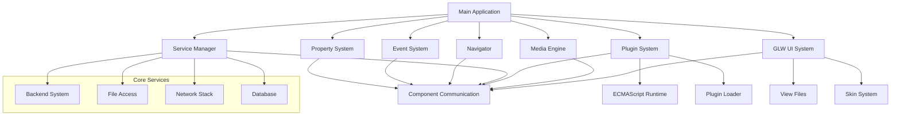
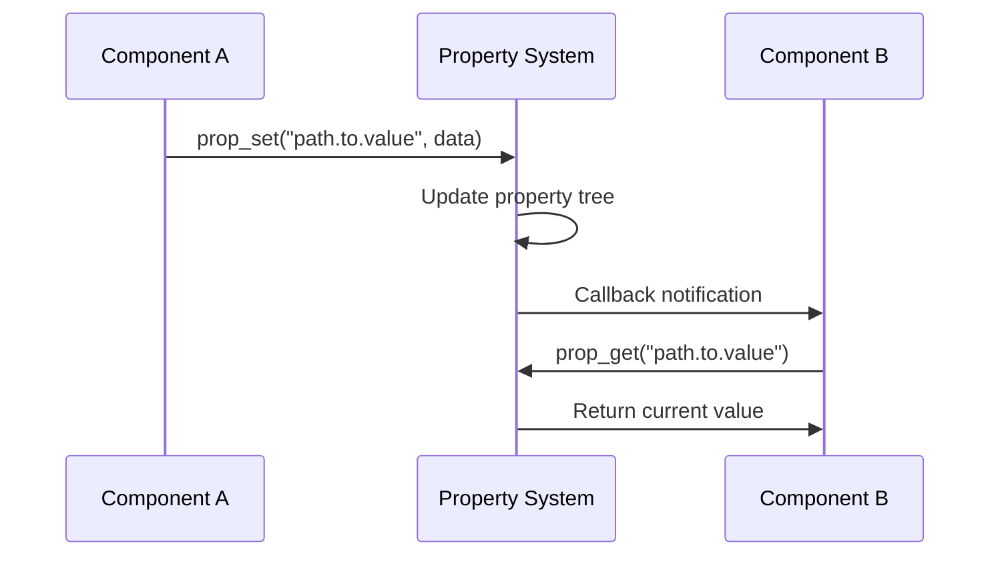
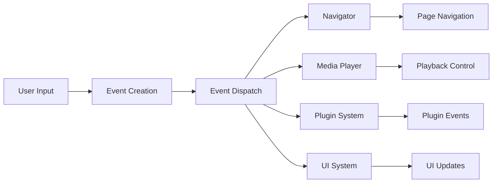
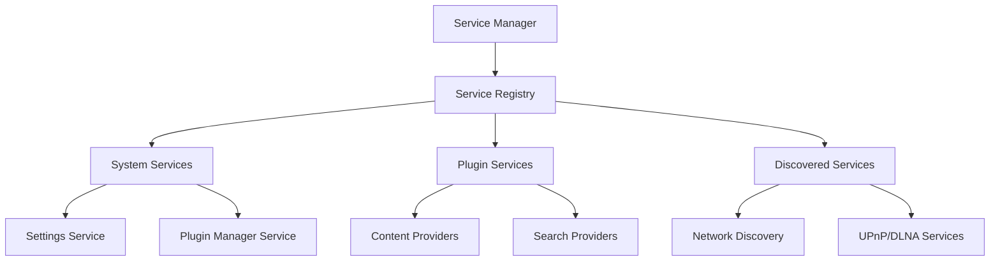
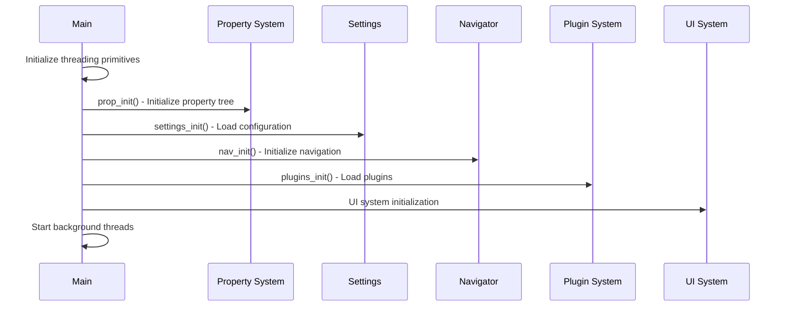
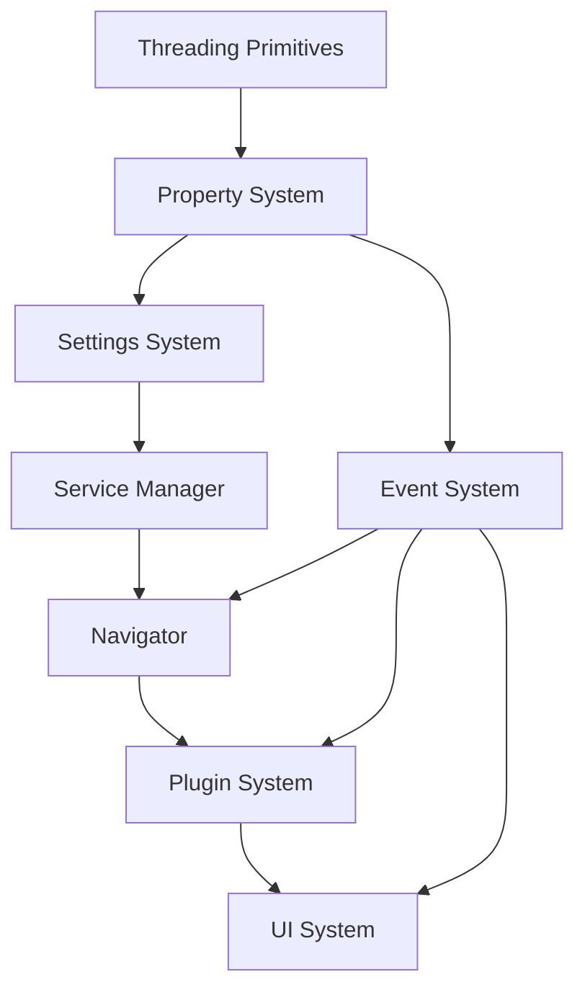
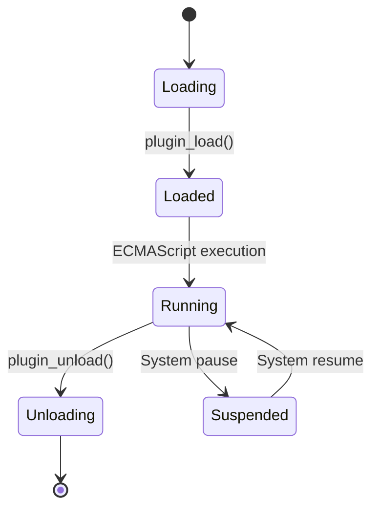
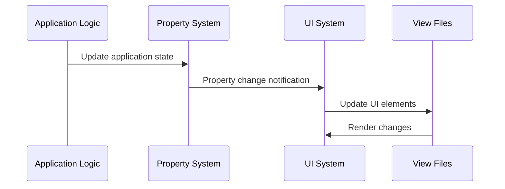
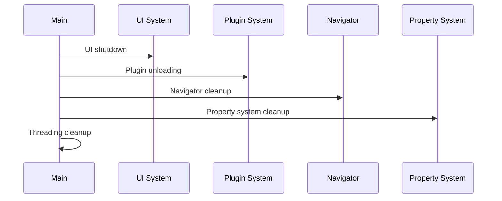

# Component Interaction and Architecture

## Overview

Movian's architecture is built around a modular component system where different subsystems communicate through well-defined interfaces. The core architecture follows a layered approach with clear separation of concerns between the native C/C++ core, the JavaScript plugin runtime, and the UI rendering system.

## Core Component Architecture



## Component Interaction Patterns

### 1. Property-Based Communication

The property system (`src/prop/prop.h`) serves as the primary communication mechanism between components:

**Key Features:**
- **Hierarchical Structure**: Properties form a tree structure with global root
- **Subscription Model**: Components can subscribe to property changes
- **Thread-Safe**: All property operations are thread-safe with mutex protection
- **Event-Driven**: Property changes trigger callbacks in subscribed components

**Communication Flow:**


**Example Usage:**
```c
// Component A sets a property
prop_set(nav->nav_prop_curpage, "url", PROP_SET_STRING, url);

// Component B subscribes to changes
prop_subscribe(0,
    PROP_TAG_CALLBACK_STRING, url_changed_callback, opaque,
    PROP_TAG_ROOT, nav->nav_prop_curpage,
    PROP_TAG_NAME("url"),
    NULL);
```

### 2. Event-Driven Architecture

The event system (`src/event.h`) handles user interactions and system events:

**Event Types:**
- **User Actions**: Navigation, playback control, UI interaction
- **System Events**: URL opening, page navigation, media events
- **Internal Events**: Component lifecycle, state changes

**Event Flow:**


### 3. Service Registration System

The service manager (`src/service.c`) provides a registry for content providers and system services:

**Service Architecture:**


## Component Lifecycle Management

### 1. Application Startup Sequence

The main initialization follows a structured sequence in `main_init()`:



**Initialization Groups:**
- **INIT_GROUP_NET**: Network subsystem initialization
- **INIT_GROUP_GRAPHICS**: Graphics and UI initialization  
- **INIT_GROUP_IPC**: Inter-process communication
- **INIT_GROUP_API**: External API initialization

### 2. Component Dependencies

Components have clear dependency relationships:



## Inter-Component Communication Mechanisms

### 1. Navigator Component

The navigator (`src/navigator.c`) manages page lifecycle and navigation:

**Key Responsibilities:**
- Page creation and destruction
- Navigation history management
- URL routing and backend selection
- Bookmark management

**Communication Interfaces:**
```c
// Event-based navigation
static void nav_eventsink(void *opaque, event_t *e) {
    navigator_t *nav = opaque;
    if(event_is_action(e, ACTION_NAV_BACK)) {
        nav_back(nav);
    } else if(event_is_type(e, EVENT_OPENURL)) {
        // Handle URL opening
    }
}

// Property-based state updates
prop_set(nav->nav_prop_can_go_back, PROP_SET_INT, can_go_back);
```

### 2. Plugin System Integration

The plugin system (`src/plugins.c`) provides runtime extensibility:

**Plugin Communication:**
- **JavaScript API**: ECMAScript runtime for plugin execution
- **Property Binding**: Plugins can read/write properties
- **Event Handling**: Plugins receive and generate events
- **Service Registration**: Plugins can register as content providers

**Plugin Lifecycle:**


### 3. UI System Communication

The GLW UI system communicates through:

**View File Processing:**
- View files define UI structure and behavior
- Property bindings connect UI to application state
- Event handlers process user interactions

**UI Update Flow:**


## Memory Management and Resource Cleanup

### 1. Reference Counting

Components use reference counting for memory management:

```c
// Property reference management
prop_t *p = prop_ref_inc(property);  // Increment reference
// ... use property ...
prop_ref_dec(p);  // Decrement reference, cleanup if zero
```

### 2. Subscription Management

Property subscriptions are automatically cleaned up:

```c
// Subscription with automatic cleanup
prop_sub_t *sub = prop_subscribe(PROP_SUB_TRACK_DESTROY,
    PROP_TAG_CALLBACK, callback_func, opaque,
    PROP_TAG_ROOT, property,
    NULL);
// Subscription automatically cleaned up when property is destroyed
```

### 3. Component Shutdown

Shutdown follows reverse initialization order:



## Error Handling and Recovery

### 1. Component Isolation

Components are designed to fail gracefully:
- Plugin failures don't crash the main application
- UI errors are contained within view rendering
- Network failures are handled at the service level

### 2. State Recovery

The property system enables state recovery:
- Component state is stored in properties
- Failed components can be restarted with preserved state
- Settings and preferences persist across restarts

## Performance Considerations

### 1. Asynchronous Operations

Long-running operations use background threads:
- Plugin loading and execution
- Network operations
- File system access
- Media processing

### 2. Event Batching

The property system batches updates for efficiency:
- Multiple property changes are combined
- UI updates are coalesced to reduce rendering overhead
- Event processing is prioritized by importance

## Component Extension Points

### 1. Backend System

New content sources can be added through the backend interface:

```c
static backend_t my_backend = {
    .be_canhandle = my_canhandle,
    .be_open = my_open_url,
    .be_search = my_search,
};

BE_REGISTER(my_backend);
```

### 2. Service Providers

Components can register as service providers:

```c
service_t *service = service_create(
    "service_id",
    "Service Title", 
    "service://url",
    "service_type",
    "icon_url",
    probe_enabled,
    enabled,
    SVC_ORIGIN_SYSTEM
);
```

This architecture provides a flexible, extensible foundation that allows Movian to support diverse content sources, UI customizations, and platform-specific features while maintaining system stability and performance.