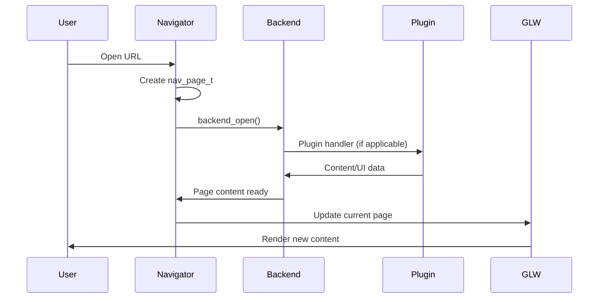
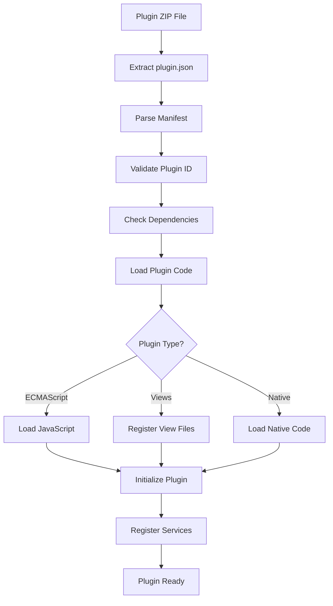

# Application [Lifecycle](../reference/glossary.md#lifecycle) and Startup Flow

## Overview

Movian follows a carefully orchestrated startup sequence that initializes [components](../reference/glossary.md#component) in dependency order, loads plugins, and prepares the user interface. This document details the complete application [lifecycle](../reference/glossary.md#lifecycle) from startup to shutdown.

## Startup Sequence

### Phase 1: Core Initialization (`main_init()`)

```mermaid
graph TD
    A[Application Start] --> B[Parse Command Line]
    B --> C[Initialize Global Config]
    C --> D[Unicode & Property System]
    D --> E[Callout Framework]
    E --> F[Network Layer Early Init]
    F --> G[Logging System]
    G --> H[Settings System]
    H --> I[Notifications]
    I --> J[Create Cache/Persistent Paths]
    J --> K[Database Init]
    K --> L[Blob Cache]
    L --> M[Metadata System]
    M --> N[Keyring]
    N --> O[LibAV Init]
    O --> P[Graphics Init Group]
    P --> Q[GLW Settings]
    Q --> R[Media Subsystem]
    R --> S[Service Registry]
    S --> T[Backend Handlers]
    T --> U[Navigator Init]
    U --> V[Audio System]
    V --> W[Plugin Manager]
    W --> X[Device ID Generation]
    X --> Y[Software Update Thread]
    Y --> Z[I18N System]
    Z --> AA[Video Settings]
    AA --> BB[IPC Init Group]
    BB --> CC[Service Discovery]
    CC --> DD[API Init Group]
    DD --> EE[Async I/O Start]
    EE --> FF[Run Control]
```



#### Detailed Initialization Steps

**1. Basic Setup** (`main.c:main_init()` lines 380-400)
```c
// Initialize mutexes and global state
hts_mutex_init(&gconf.state_mutex);
hts_cond_init(&gconf.state_cond, &gconf.state_mutex);
gconf.exit_code = 1;

// Unicode and text processing
unicode_init();

// Property tree - core data model
prop_init();
init_global_info();
```

**2. Network and Logging** (lines 400-420)
```c
// Callout framework for delayed execution
callout_init();

// Early network initialization
asyncio_init_early();
init_group(INIT_GROUP_NET);

// Logging system
trace_init();
prop_init_late();
```

**3. Core Services** (lines 420-460)
```c
// Settings management
settings_init();

// Notification system
notifications_init();

// Create required directories
if(gconf.cache_path != NULL &&
   fa_makedirs(gconf.cache_path, errbuf, sizeof(errbuf))) {
  // Handle cache path creation failure
}

// Database initialization
#if ENABLE_SQLITE
db_init();
#endif

// Blob cache for efficient data storage
blobcache_init();
```

**4. Media and Plugin Systems** (lines 460-520)
```c
// Metadata handling
#if ENABLE_METADATA
metadata_init();
metadb_init();
decoration_init();
#endif

// Subtitle system
subtitles_init();

// Security keyring
keyring_init();

// LibAV codec library
#if ENABLE_LIBAV
av_lockmgr_register(fflockmgr);
av_log_set_callback(fflog);
av_register_all();
#endif

// Graphics initialization group
init_group(INIT_GROUP_GRAPHICS);

// GLW UI settings
#if ENABLE_GLW
glw_settings_init();
#endif

// Media subsystem
media_init();

// Service handling
service_init();

// Backend content handlers
backend_init();

// Navigator for page management
nav_init();

// Audio subsystem
audio_init();

// Plugin manager
#if ENABLE_PLUGINS
plugins_init(gconf.devplugins);
#endif
```

### Phase 2: Background Services

**Software Update Thread** (`main.c:swthread()` lines 150-220)
```c
static void *swthread(void *aux)
{
#if ENABLE_PLUGINS
  // Initialize plugin system phase 2
  plugins_init2();
#endif

  // Upgrade system initialization
  upgrade_init();
  usage_start();

  if(!gconf.disable_upgrades) {
    // Plugin repository updates (with retries)
#if ENABLE_PLUGINS
    for(int i = 0; i < 10; i++) {
      if(!plugins_upgrade_check())
        break;
      navigator_can_start(); // Signal navigator ready
      sleep(i + 1);
    }
#endif

    // Application upgrade checks
    for(int i = 0; i < 10; i++) {
      if(!upgrade_refresh())
        break;
      sleep(i + 1);
    }
  } else {
    navigator_can_start();
  }

  // Load site news and updates
  load_site_news();

  // Continuous update loop (12-hour intervals)
  // ... periodic update logic
}
```

### Phase 3: Plugin Loading (`plugins.c`)

**Plugin Discovery** (`plugins_init()` lines 1200-1250)
```c
void plugins_init(char **devplugs)
{
  // Initialize plugin view settings
  plugins_view_settings_init();
  
  hts_mutex_init(&plugin_mutex);
  plugins_setup_root_props();

  // Load development plugins if specified
  if(devplugs != NULL) {
    for(; (path = *devplugs) != NULL; devplugs++) {
      if(plugin_load(path, errbuf, sizeof(errbuf),
                     PLUGIN_LOAD_FORCE | PLUGIN_LOAD_DEBUG)) {
        TRACE(TRACE_ERROR, "plugins", "Unable to load dev plugin: %s", path);
      }
    }
  }
}
```

**Installed Plugin Loading** (`plugins_init2()` lines 1180-1190)
```c
void plugins_init2(void)
{
  hts_mutex_lock(&plugin_mutex);
  plugin_load_installed(); // Load from installedplugins/ directory
  hts_mutex_unlock(&plugin_mutex);
}
```

### Phase 4: Navigation System (`navigator.c`)

**Navigator Initialization** (`nav_init()` lines 320-340)
```c
void nav_init(void)
{
#if ENABLE_BOOKMARKS
  bookmarks_init();
#endif
  
  prop_t *navs = prop_create(prop_get_global(), "navigators");
  all_navigators = prop_create(navs, "nodes");
  prop_linkselected_create(all_navigators, navs, "current", NULL);
}
```

**Navigator Creation** (`nav_create()` lines 240-320)
```c
static navigator_t *nav_create(void)
{
  navigator_t *nav = calloc(1, sizeof(navigator_t));
  
  // Initialize page queues
  TAILQ_INIT(&nav->nav_pages);
  TAILQ_INIT(&nav->nav_history);

  // Create property structure
  nav->nav_prop_root = prop_create(all_navigators, NULL);
  nav->nav_prop_pages = prop_create(nav->nav_prop_root, "pages");
  nav->nav_prop_curpage = prop_create(nav->nav_prop_root, "currentpage");
  
  // Set up event handling
  nav->nav_eventsink = prop_subscribe(0,
    PROP_TAG_CALLBACK_EVENT, nav_eventsink, nav,
    PROP_TAG_MUTEX, &nav_mutex,
    PROP_TAG_ROOT, eventsink, NULL);

  // Open home page
  nav_open0(nav, NAV_HOME, NULL, NULL, NULL, NULL, NULL);
  
  return nav;
}
```

## Runtime Operation

### Page Navigation Flow



### Service Registration Flow

```mermaid
sequenceDiagram
    participant Service
    participant Registry
    participant Properties
    participant Settings
    
    Service->>Registry: service_create()
    Registry->>Properties: Create service properties
    Registry->>Settings: Register settings (if managed)
    Registry->>Registry: Add to service list
    Registry->>Properties: Update global service tree
```

### Plugin Loading Process



## Shutdown Sequence

### Graceful Shutdown (`app_shutdown()`)

```mermaid
graph TD
    A[Shutdown Request] --> B[Set Exit Code]
    B --> C[Start Shutdown Thread]
    C --> D[Send ACTION_STOP Event]
    D --> E[Flush Caches]
    E --> F[Call arch_stop_req()]
    F --> G{Arch Response?}
    G -->|PROGRESSING| H[Wait for Completion]
    G -->|NOT_HANDLED| I[Continue Shutdown]
    G -->|CALLER_MUST_HANDLE| J[Call main_fini()]
    H --> K[Monitor Progress]
    I --> J
    J --> L[arch_exit()]
```

### Component Finalization (`main_fini()`)

**Shutdown Order** (`main.c:main_fini()` lines 680-720)
```c
void main_fini(void)
{
  // Early shutdown hooks
  shutdown_hook_run(1);
  
  // Destroy popup system
  prop_destroy_by_name(prop_get_global(), "popups");
  
  // Finalize initialization groups in reverse order
  fini_group(INIT_GROUP_API);
  fini_group(INIT_GROUP_IPC);
  
  // Shutdown major subsystems
#if ENABLE_PLAYQUEUE
  playqueue_fini();
#endif
  audio_fini();
  nav_fini();
  backend_fini();
  
  // Late shutdown hooks
  shutdown_hook_run(0);
  
  // Final cleanup
  blobcache_fini();
#if ENABLE_METADATA
  metadb_fini();
#endif
  kvstore_fini();
  notifications_fini();
  htsmsg_store_flush();
  
  trace_fini();
}
```

## Initialization Groups

Movian uses initialization groups to manage component dependencies:

### INIT_GROUP_NET (Network Layer)
- Basic networking setup
- Socket initialization
- Protocol handlers

### INIT_GROUP_GRAPHICS (Graphics System)
- O[navigator](../reference/glossary.md#navigator)text setup
- GLW initialization
- Platform-specific graphics

### INIT_GROUP_IPC (Inter-Process Communication)
- D-Bus integration (Linux)
- Platform messaging systems
- External API interfaces

### INIT_GROUP_API (External APIs)
- Web services integration
- Third-party API clients
- Remote service connections

## Error Handling and Recovery

### Startup Failures
- **Critical Errors**: Immediate exit with error code
- **Non-Critical Errors**: Continue with reduced functionality
- **Resource Failures**: Fallback to alternative paths
- **Plugin Errors**: Skip problematic plugins, continue startup

### Runtime Error Recovery
- **Service Failures**: Automatic service restart
- **Plugin Crashes**: Plugin isolation and recovery
- **Network Issues**: Retry mechanisms and offline mode
- **Memory Issues**: Garbage collection and cache cleanup

## Performance Considerations

### Startup Optimization
- **Lazy Loading**: Defer non-critical initialization
- **Parallel Initialization**: Independent components start concurrently
- **Cache Warming**: Pre-load frequently used resources
- **Plugin Prioritization**: Load essential plugins first

### Memory Management
- **Reference Counting**: Property system memory tracking
- **Pool Allocation**: Efficient memory allocation patterns
- **Cache Limits**: Bounded cache sizes with LRU eviction
- **Plugin Isolation**: Separate memory spaces for plugins

This lifecycle ensures reliable startup, stable operation, and clean shutdown while maintaining the flexibility to handle various error conditions and platform-specific requirements.[lifecycle](../reference/glossary.md#lifecycle)[Property system](../reference/glossary.md#property-system)[Reference Counting](../reference/glossary.md#reference-counting)[components](../reference/glossary.md#component)[API](../reference/glossary.md#api-application-programming-interface)[APIs](../reference/glossary.md#api-application-programming-interface)[API](../reference/glossary.md#api-application-programming-interface)[GLW](../reference/glossary.md#glw-opengl-widget)[OpenGL](../reference/glossary.md#opengl)[component](../reference/glossary.md#component)[initialization groups](../reference/glossary.md#initialization-group)[Initialization Groups](../reference/glossary.md#initialization-group)