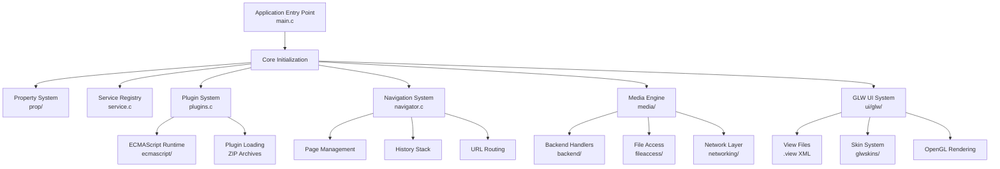
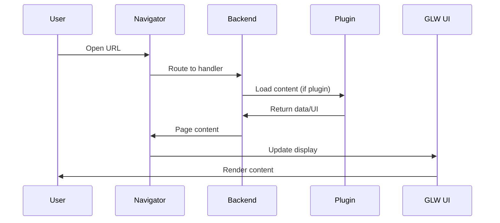
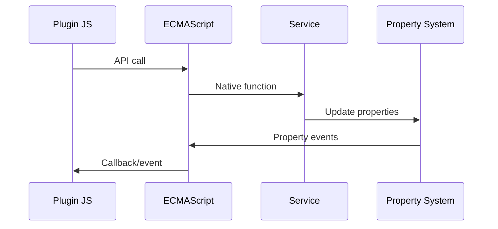

# System Architecture Overview

## Introduction

Movian is a cross-platform media player built with a modular architecture that separates core functionality, [plugin system](../reference/glossary.md#plugin-system), and user interface rendering. The application is primarily written in C/C++ with JavaScript plugin support and a custom [OpenGL](../reference/glossary.md#opengl)-based [UI system](../reference/glossary.md#ui-system) called [GLW](../reference/glossary.md#glw-opengl-widget) ([OpenGL](../reference/glossary.md#opengl) [Widget](../reference/glossary.md#widget)).

## High-Level Architecture

## Core Components

### 1. Application Foundation

**Main Entry Point** (`src/main.c`)
- Application startup and shutdown coordination
- Command-line argument parsing
- Global configuration management
- Initialization group orchestration

**Property System** (`src/prop/`)
- Hierarchical data model for application state
- Event-driven property updates
- Data binding between components
- Thread-safe property access

### 2. Service Architecture

**Service Registry** (`src/service.c`)
- Central registry for all application services
- Service discovery and management
- Status tracking and health monitoring
- Integration with settings system

**Navigation System** (`src/navigator.c`)
- Page lifecycle management
- History stack and navigation flow
- URL routing and backend integration
- Bookmark management

### 3. Plugin System

**Plugin Manager** (`src/plugins.c`)
- Plugin discovery and loading from ZIP archives
- Repository management and updates
- Dependency resolution and version checking
- Auto-installation based on content detection

**ECMAScript Runtime** (`src/ecmascript/`)
- JavaScript execution environment for plugins
- Native API bindings (HTTP, storage, UI)
- Security sandboxing and access control
- Plugin lifecycle management

### 4. User Interface

**GLW Rendering Engine** (`src/ui/glw/`)
- Custom OpenGL-based widget system
- View file parsing and compilation
- Layout engine and event handling
- Animation an[navigator](../reference/glossary.md#navigator)ion system

**Skin System** (`glwskins/`)
- Theme and appearance management
- View file inheritance and preprocessing
- Device-specific adaptations
- Runtime skin switching

### 5. Media Engine

**Backend System** (`src/backend/`)
- Pluggable content handlers
- Protocol and format support
- Content metadata extraction
- Streaming and local file access

## Component Interactions

### Startup Sequence
1. **Initialization Groups**: Components are initialized in dependency order
2. **Property Tree Setup**: Global property hierarchy established
3. **Service Registration**: Core services register with the service manager
4. **[glw](../reference/glossary.md#glw-opengl-widget)gin Loading**: Installed plugins are discovered and loaded
5. **UI Initialization**: GLW system starts and loads default skin
6. **Navigation Ready**: Navigator becomes available for page requests

### Runtime Communication
- **Property Events**: Components communicate through property changes
- **Service Calls**: Direct service-to-service communication
- **Plugin APIs**: JavaScript plugins access native functionality
- **UI Events**: User interactions flow through GLW event system

### Plugin Integration
- **Manifest Processing**: `plugin.json` defines plugin capabilities
- **Code Loading**: JavaScript or native code execution
- **API Access**: Controlled access to system functionality
- **UI Extensions**: Custom view files and interface elements

## Threading Model

### Main Thread
- UI rendering and event processing
- Property system updates
- Plugin JavaScript execution
- Navigation and page management

### Background Threads
- Network operations and HTTP requests
- File I/O and media processing
- Plugin repository updates
- Service discovery and monitoring

### Thread Safety
- Mutex protection for shared data structures
- Property system provides thread-safe access
- Plugin APIs handle cross-thread communication
- Event queuing for UI updates

## Data Flow

### Content Loading

### Plugin Communication

## Security Model

### Plugin Sandboxing
- **File Access Control**: Restricted filesystem access
- **Network Permissions**: Controlled HTTP/HTTPS access
- **API Limitations**: Selective native function exposure
- **Resource Limits**: Memory and execution constraints

### Content Security
- **URL Validation**: Safe URL handling and parsing
- **Input Sanitization**: Protection against malicious content
- **Certificate Validation**: HTTPS certificate checking
- **Content Type Verification**: MIME type validation

## Configuration Management

### Settings Hierarchy
1. **Default Values**: Built-in application defaults
2. **System Settings**: Platform-specific configurations
3. **User Preferences**: User-customizable settings
4. **Plugin Settings**: Plugin-specific configurations

### Storage Locations
- **Persistent Path**: User data and settings
- **Cache Path**: Temporary files and cached content
- **Plugin Storage**: Per-plugin data directories
- **System Resources**: Read-only application resources

## Platform Abstraction

### Architecture Layer (`src/arch/`)
- Platform-specific implementations
- Threading primitives and synchronization
- File system access patterns
- Network stack integration

### Build System
- **Configure Scripts**: Platform detection and setup
- **Makefile**: Cross-platform build orchestration
- **Dependencies**: External library management
- **Packaging**: Platform-specific distribution formats

## Performance Considerations

### Memory Management
- **Reference Counting**: Property system memory management
- **Pool Allocation**: Efficient memory allocation patterns
- **Cache Management**: Intelligent caching strategies
- **Garbage Collection**: Cleanup of unused resources

### Rendering Optimization
- **GPU Acceleration**: OpenGL-based rendering pipeline
- **Texture Management**: Efficient texture loading and caching
- **Layout Caching**: Pre-computed layout information
- **Animation Optimization**: Smooth transitions and effects

This architecture provides a solid foundation for media playback while maintaining extensibility through plugins and customization through the skin system. The modular design allows for platform-specific optimizations while keeping the core functionality consistent across all supported platforms.[skin system](../reference/glossary.md#skin-system)[OpenGL](../reference/glossary.md#opengl)[Property system](../reference/glossary.md#property-system)[Reference Counting](../reference/glossary.md#reference-counting)