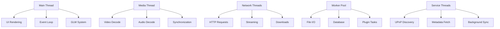

# Threading Model

This document describes Movian's threading architecture, synchronization primitives, and best practices for writing thread-safe code.

## Overview

Movian uses a multi-threaded architecture to handle concurrent operations efficiently:

- **Main Thread**: UI rendering, event processing, and coordination
- **Worker Threads**: Media decoding, network I/O, and background tasks
- **Service Threads**: Plugin execution, database operations, and file I/O

Understanding the threading model is essential for:
- Writing thread-safe plugins
- Contributing to core functionality
- Debugging concurrency issues
- Optimizing performance

## Thread Architecture

### Thread Types



### Main Thread

**Responsibilities**:
- OpenGL rendering and UI updates
- Event processing and dispatch
- Property system updates
- Plugin lifecycle management
- User input handling

**Characteristics**:
- Single-threaded for UI consistency
- Event-driven architecture
- Must not block for long operations
- Runs at display refresh rate (typically 60 Hz)

**Source Reference**: `src/main.c`, `src/ui/glw/glw.c`

### Media Threads

**Video Decode Thread**:
```c
// Dedicated thread for video decoding
static void *video_decoder_thread(void *arg) {
    media_pipe_t *mp = arg;
    
    while (mp->mp_video_decoder_running) {
        media_buf_t *mb = get_next_video_packet(mp);
        if (mb == NULL) {
            continue;
        }
        
        // Decode video frame
        decode_video_frame(mp, mb);
        
        // Queue decoded frame for display
        queue_video_frame(mp, mb);
    }
    
    return NULL;
}
```

**Audio Decode Thread**:
```c
// Dedicated thread for audio decoding
static void *audio_decoder_thread(void *arg) {
    media_pipe_t *mp = arg;
    
    while (mp->mp_audio_decoder_running) {
        media_buf_t *mb = get_next_audio_packet(mp);
        if (mb == NULL) {
            continue;
        }
        
        // Decode audio samples
        decode_audio_samples(mp, mb);
        
        // Queue decoded audio for playback
        queue_audio_samples(mp, mb);
    }
    
    return NULL;
}
```

**Source Reference**: `src/media/media_pipe.c`

### Network Threads

**HTTP Request Thread Pool**:
```c
typedef struct http_thread_pool {
    hts_thread_t *threads;
    int num_threads;
    hts_mutex_t mutex;
    hts_cond_t cond;
    TAILQ_HEAD(, http_request) pending_requests;
} http_thread_pool_t;

// Worker thread processes HTTP requests
static void *http_worker_thread(void *arg) {
    http_thread_pool_t *pool = arg;
    
    while (1) {
        hts_mutex_lock(&pool->mutex);
        
        // Wait for request
        while (TAILQ_EMPTY(&pool->pending_requests)) {
            hts_cond_wait(&pool->cond, &pool->mutex);
        }
        
        // Get request
        http_request_t *req = TAILQ_FIRST(&pool->pending_requests);
        TAILQ_REMOVE(&pool->pending_requests, req, link);
        
        hts_mutex_unlock(&pool->mutex);
        
        // Process request (outside lock)
        process_http_request(req);
    }
    
    return NULL;
}
```

**Source Reference**: `src/networking/http_client.c`

### Worker Thread Pool

**Generic Task Queue**:
```c
typedef struct task_queue {
    hts_mutex_t mutex;
    hts_cond_t cond;
    TAILQ_HEAD(, task) tasks;
    int num_workers;
    int shutdown;
} task_queue_t;

// Submit task to worker pool
void task_queue_submit(task_queue_t *tq, void (*func)(void *), void *arg) {
    task_t *task = mymalloc(sizeof(task_t));
    task->func = func;
    task->arg = arg;
    
    hts_mutex_lock(&tq->mutex);
    TAILQ_INSERT_TAIL(&tq->tasks, task, link);
    hts_cond_signal(&tq->cond);
    hts_mutex_unlock(&tq->mutex);
}

// Worker thread processes tasks
static void *worker_thread(void *arg) {
    task_queue_t *tq = arg;
    
    while (1) {
        hts_mutex_lock(&tq->mutex);
        
        while (TAILQ_EMPTY(&tq->tasks) && !tq->shutdown) {
            hts_cond_wait(&tq->cond, &tq->mutex);
        }
        
        if (tq->shutdown) {
            hts_mutex_unlock(&tq->mutex);
            break;
        }
        
        task_t *task = TAILQ_FIRST(&tq->tasks);
        TAILQ_REMOVE(&tq->tasks, task, link);
        
        hts_mutex_unlock(&tq->mutex);
        
        // Execute task
        task->func(task->arg);
        myfree(task);
    }
    
    return NULL;
}
```

**Source Reference**: `src/task.c`

## Synchronization Primitives

### Mutexes

**Basic Mutex Operations**:
```c
#include "arch/threads.h"

// Declare mutex
hts_mutex_t mutex;

// Initialize mutex
hts_mutex_init(&mutex);

// Lock mutex
hts_mutex_lock(&mutex);

// Critical section
// ...

// Unlock mutex
hts_mutex_unlock(&mutex);

// Destroy mutex
hts_mutex_destroy(&mutex);
```

**Recursive Mutex**:
```c
// Mutex that can be locked multiple times by same thread
hts_mutex_t recursive_mutex;
hts_mutex_init_recursive(&recursive_mutex);

// Can lock multiple times
hts_mutex_lock(&recursive_mutex);
hts_mutex_lock(&recursive_mutex);  // OK, same thread

// Must unlock same number of times
hts_mutex_unlock(&recursive_mutex);
hts_mutex_unlock(&recursive_mutex);
```

**Source Reference**: `src/arch/threads.h`, `src/arch/posix/posix_threads.c`

### Condition Variables

**Wait/Signal Pattern**:
```c
hts_mutex_t mutex;
hts_cond_t cond;
int ready = 0;

// Initialize
hts_mutex_init(&mutex);
hts_cond_init(&cond);

// Waiting thread
hts_mutex_lock(&mutex);
while (!ready) {
    hts_cond_wait(&cond, &mutex);  // Atomically unlocks and waits
}
// ready is now true
hts_mutex_unlock(&mutex);

// Signaling thread
hts_mutex_lock(&mutex);
ready = 1;
hts_cond_signal(&cond);  // Wake one waiter
// or: hts_cond_broadcast(&cond);  // Wake all waiters
hts_mutex_unlock(&mutex);
```

**Timed Wait**:
```c
// Wait with timeout
int timeout_ms = 1000;
int result = hts_cond_wait_timeout(&cond, &mutex, timeout_ms);
if (result == ETIMEDOUT) {
    // Timeout occurred
}
```

**Source Reference**: `src/arch/threads.h`

### Atomic Operations

**Atomic Integer Operations**:
```c
#include "arch/atomic.h"

// Declare atomic variable
atomic_t counter;

// Initialize
atomic_set(&counter, 0);

// Atomic increment (returns new value)
int new_val = atomic_inc(&counter);

// Atomic decrement (returns new value)
int new_val = atomic_dec(&counter);

// Atomic add
atomic_add(&counter, 5);

// Atomic compare-and-swap
int old_val = 10;
int new_val = 20;
if (atomic_cas(&counter, old_val, new_val)) {
    // Successfully swapped
}

// Atomic read
int value = atomic_get(&counter);
```

**Atomic Pointer Operations**:
```c
// Atomic pointer swap
void *old_ptr = atomic_ptr_cas(&ptr_var, old_value, new_value);
```

**Source Reference**: `src/arch/atomic.h`

### Read-Write Locks

**RW Lock Operations**:
```c
hts_rwlock_t rwlock;

// Initialize
hts_rwlock_init(&rwlock);

// Read lock (multiple readers allowed)
hts_rwlock_rdlock(&rwlock);
// Read data...
hts_rwlock_unlock(&rwlock);

// Write lock (exclusive access)
hts_rwlock_wrlock(&rwlock);
// Modify data...
hts_rwlock_unlock(&rwlock);

// Destroy
hts_rwlock_destroy(&rwlock);
```

**Source Reference**: `src/arch/threads.h`

## Thread-Safe Data Structures

### Property System

The property system is thread-safe and uses internal locking:

```c
// Properties can be accessed from any thread
prop_t *prop = prop_create_root(NULL);

// Set value from any thread
prop_set_string(prop, "value");

// Subscribe from any thread
prop_subscribe(0, PROP_TAG_CALLBACK, callback_func, arg,
               PROP_TAG_ROOT, prop,
               NULL);
```

**Internal Locking**:
- All property operations are internally synchronized
- Callbacks are dispatched on the main thread
- No external locking required for basic operations

**Source Reference**: `src/prop/prop.c`

### Event Queue

Events are thread-safe and can be dispatched from any thread:

```c
// Create event (any thread)
event_t *e = event_create_action(ACTION_ACTIVATE);

// Dispatch to main thread
event_dispatch(e);

// Event will be processed on main thread
```

**Source Reference**: `src/event.c`

### Media Buffers

Media buffers use reference counting with atomic operations:

```c
// Allocate buffer (any thread)
media_buf_t *mb = media_buf_alloc();

// Share buffer (atomic ref count)
media_buf_ref_inc(mb);

// Release buffer (atomic ref count)
media_buf_ref_dec(mb);  // Freed when refcount reaches 0
```

**Source Reference**: `src/media/media_buf.c`

## Thread Communication Patterns

### Message Passing

**Async Task Pattern**:
```c
typedef struct async_task {
    void (*func)(void *arg);
    void *arg;
    void (*completion)(void *result, void *opaque);
    void *opaque;
} async_task_t;

// Submit task to worker thread
void async_execute(void (*func)(void *), void *arg,
                   void (*completion)(void *, void *), void *opaque) {
    async_task_t *task = mymalloc(sizeof(async_task_t));
    task->func = func;
    task->arg = arg;
    task->completion = completion;
    task->opaque = opaque;
    
    task_queue_submit(worker_queue, async_task_runner, task);
}

// Worker thread executes task
static void async_task_runner(void *arg) {
    async_task_t *task = arg;
    
    // Execute task
    task->func(task->arg);
    
    // Dispatch completion to main thread
    if (task->completion) {
        dispatch_to_main_thread(task->completion, task->arg, task->opaque);
    }
    
    myfree(task);
}
```

### Producer-Consumer

**Queue Pattern**:
```c
typedef struct producer_consumer_queue {
    hts_mutex_t mutex;
    hts_cond_t cond;
    TAILQ_HEAD(, item) items;
    int max_size;
    int shutdown;
} pc_queue_t;

// Producer adds item
void pc_queue_put(pc_queue_t *q, item_t *item) {
    hts_mutex_lock(&q->mutex);
    
    // Wait if queue is full
    while (queue_size(q) >= q->max_size && !q->shutdown) {
        hts_cond_wait(&q->cond, &q->mutex);
    }
    
    if (!q->shutdown) {
        TAILQ_INSERT_TAIL(&q->items, item, link);
        hts_cond_signal(&q->cond);  // Wake consumer
    }
    
    hts_mutex_unlock(&q->mutex);
}

// Consumer gets item
item_t *pc_queue_get(pc_queue_t *q) {
    hts_mutex_lock(&q->mutex);
    
    // Wait for item
    while (TAILQ_EMPTY(&q->items) && !q->shutdown) {
        hts_cond_wait(&q->cond, &q->mutex);
    }
    
    item_t *item = NULL;
    if (!TAILQ_EMPTY(&q->items)) {
        item = TAILQ_FIRST(&q->items);
        TAILQ_REMOVE(&q->items, item, link);
        hts_cond_signal(&q->cond);  // Wake producer
    }
    
    hts_mutex_unlock(&q->mutex);
    return item;
}
```

### Callback Dispatch

**Main Thread Callback**:
```c
// Schedule callback on main thread
void dispatch_to_main_thread(void (*callback)(void *), void *arg) {
    callback_task_t *task = mymalloc(sizeof(callback_task_t));
    task->callback = callback;
    task->arg = arg;
    
    hts_mutex_lock(&main_thread_queue_mutex);
    TAILQ_INSERT_TAIL(&main_thread_queue, task, link);
    hts_mutex_unlock(&main_thread_queue_mutex);
    
    // Wake main thread event loop
    wake_main_thread();
}

// Main thread processes callbacks
void process_main_thread_callbacks(void) {
    hts_mutex_lock(&main_thread_queue_mutex);
    
    while (!TAILQ_EMPTY(&main_thread_queue)) {
        callback_task_t *task = TAILQ_FIRST(&main_thread_queue);
        TAILQ_REMOVE(&main_thread_queue, task, link);
        hts_mutex_unlock(&main_thread_queue_mutex);
        
        // Execute callback
        task->callback(task->arg);
        myfree(task);
        
        hts_mutex_lock(&main_thread_queue_mutex);
    }
    
    hts_mutex_unlock(&main_thread_queue_mutex);
}
```

## Plugin Threading

### ECMAScript Thread Safety

**Plugin Execution Context**:
- Each plugin runs in its own ECMAScript context
- Contexts are not thread-safe
- All plugin code executes on dedicated plugin threads
- Never call plugin code from multiple threads

**Safe Plugin Patterns**:
```javascript
// Plugin code runs on plugin thread
exports.start = function(page) {
    // This runs on plugin thread
    
    // HTTP requests spawn worker threads internally
    var response = http.request('https://api.example.com/data');
    
    // Property updates are thread-safe
    page.metadata.title = "New Title";
    
    // Event dispatch is thread-safe
    page.appendItem('video', 'Video Title', {url: 'http://...'});
};
```

**Unsafe Patterns**:
```javascript
// WRONG: Don't share mutable state between callbacks
var shared_state = {};

exports.start = function(page) {
    // Callback 1
    http.request('url1', function(response) {
        shared_state.data1 = response;  // Race condition!
    });
    
    // Callback 2
    http.request('url2', function(response) {
        shared_state.data2 = response;  // Race condition!
    });
};
```

**Source Reference**: `src/ecmascript/ecmascript.c`

### Plugin Best Practices

✅ **Use property system for shared state**
```javascript
// Properties are thread-safe
page.metadata.loading = true;
http.request(url, function(response) {
    page.metadata.loading = false;
    page.metadata.data = response;
});
```

✅ **Use callbacks for async operations**
```javascript
// Callbacks are serialized on plugin thread
http.request(url, function(response) {
    // Safe to access plugin state here
    processResponse(response);
});
```

❌ **Don't use global mutable state**
```javascript
// WRONG: Global state is not thread-safe
var global_cache = {};

function fetchData(id) {
    if (global_cache[id]) {
        return global_cache[id];  // Race condition!
    }
    // ...
}
```

## Deadlock Prevention

### Lock Ordering

**Establish Global Lock Order**:
```c
// Always acquire locks in this order:
// 1. Global locks
// 2. Subsystem locks
// 3. Object locks

// CORRECT: Consistent order
hts_mutex_lock(&global_lock);
hts_mutex_lock(&subsystem_lock);
// Critical section
hts_mutex_unlock(&subsystem_lock);
hts_mutex_unlock(&global_lock);

// WRONG: Inconsistent order causes deadlock
// Thread 1:
hts_mutex_lock(&lock_a);
hts_mutex_lock(&lock_b);  // Deadlock if thread 2 has lock_b

// Thread 2:
hts_mutex_lock(&lock_b);
hts_mutex_lock(&lock_a);  // Deadlock if thread 1 has lock_a
```

### Try-Lock Pattern

**Avoid Deadlock with Try-Lock**:
```c
// Try to acquire lock, back off if unavailable
int acquire_locks(hts_mutex_t *lock1, hts_mutex_t *lock2) {
    hts_mutex_lock(lock1);
    
    if (hts_mutex_trylock(lock2) != 0) {
        // Couldn't get lock2, release lock1 and retry
        hts_mutex_unlock(lock1);
        usleep(1000);  // Back off
        return 0;  // Retry
    }
    
    // Got both locks
    return 1;
}
```

### Lock-Free Alternatives

**Use Atomic Operations**:
```c
// Instead of:
hts_mutex_lock(&mutex);
counter++;
hts_mutex_unlock(&mutex);

// Use atomic:
atomic_inc(&counter);
```

**Use Lock-Free Queues**:
```c
// Lock-free single-producer single-consumer queue
typedef struct lockfree_queue {
    atomic_t read_pos;
    atomic_t write_pos;
    void **items;
    int capacity;
} lockfree_queue_t;
```

## Performance Considerations

### Lock Contention

**Minimize Lock Hold Time**:
```c
// GOOD: Short critical section
hts_mutex_lock(&mutex);
int value = shared_data;
hts_mutex_unlock(&mutex);
process_value(value);  // Outside lock

// BAD: Long critical section
hts_mutex_lock(&mutex);
int value = shared_data;
process_value(value);  // Inside lock - blocks other threads
hts_mutex_unlock(&mutex);
```

**Use Fine-Grained Locking**:
```c
// Instead of one global lock:
hts_mutex_t global_lock;

// Use per-object locks:
typedef struct object {
    hts_mutex_t lock;
    // Object data
} object_t;
```

### Thread Pool Sizing

**Optimal Thread Count**:
```c
// CPU-bound tasks: num_threads = num_cores
int num_threads = sysconf(_SC_NPROCESSORS_ONLN);

// I/O-bound tasks: num_threads = 2 * num_cores
int num_threads = 2 * sysconf(_SC_NPROCESSORS_ONLN);

// Create thread pool
for (int i = 0; i < num_threads; i++) {
    hts_thread_create(&threads[i], worker_thread, pool);
}
```

### Cache Line Alignment

**Avoid False Sharing**:
```c
// BAD: False sharing between threads
struct {
    int counter1;  // Thread 1 updates
    int counter2;  // Thread 2 updates
} shared_data;

// GOOD: Separate cache lines
struct {
    int counter1;
    char padding1[64 - sizeof(int)];
    int counter2;
    char padding2[64 - sizeof(int)];
} shared_data;
```

## Debugging

### Thread Debugging Tools

**GDB Thread Commands**:
```bash
# List all threads
(gdb) info threads

# Switch to thread
(gdb) thread 2

# Show thread backtrace
(gdb) thread apply all bt

# Break on thread creation
(gdb) catch syscall clone
```

**Helgrind (Valgrind)**:
```bash
# Detect race conditions
valgrind --tool=helgrind ./movian

# Detect deadlocks
valgrind --tool=drd ./movian
```

**Thread Sanitizer (TSan)**:
```bash
# Compile with TSan
./configure --enable-tsan
make

# Run with TSan
./movian
```

### Common Issues

**Race Condition Detection**:
```c
// Add assertions to detect races
#ifdef DEBUG
#define ASSERT_LOCKED(mutex) \
    assert(hts_mutex_is_locked(mutex))
#else
#define ASSERT_LOCKED(mutex)
#endif

void modify_shared_data(void) {
    ASSERT_LOCKED(&data_mutex);
    // Modify data
}
```

**Deadlock Detection**:
```c
// Enable deadlock detection in debug builds
#ifdef DEBUG
void hts_mutex_lock_debug(hts_mutex_t *mutex, const char *file, int line) {
    if (!hts_mutex_trylock_timeout(mutex, 5000)) {
        fprintf(stderr, "Potential deadlock at %s:%d\n", file, line);
        abort();
    }
}
#define hts_mutex_lock(m) hts_mutex_lock_debug(m, __FILE__, __LINE__)
#endif
```

## See Also

- [Memory Management](memory.md) - Memory allocation and ownership
- [Architecture Overview](overview.md) - System architecture
- [Component Interaction](components.md) - Component communication
- [Plugin Best Practices](../plugins/best-practices.md) - Thread-safe plugin patterns
