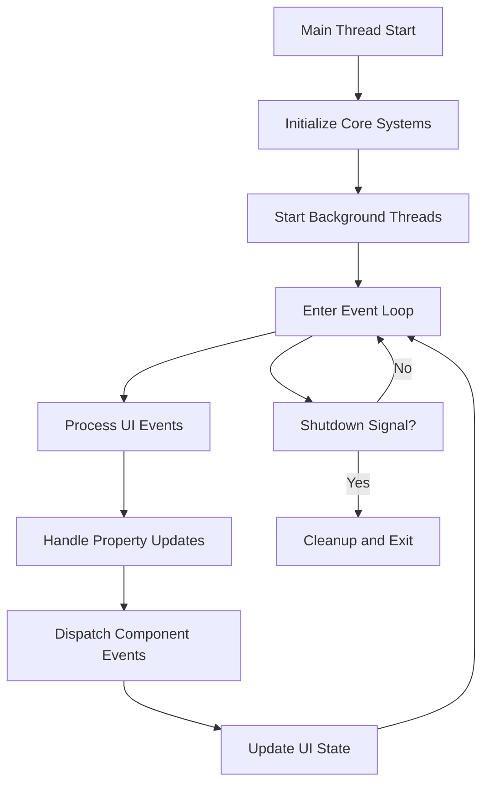
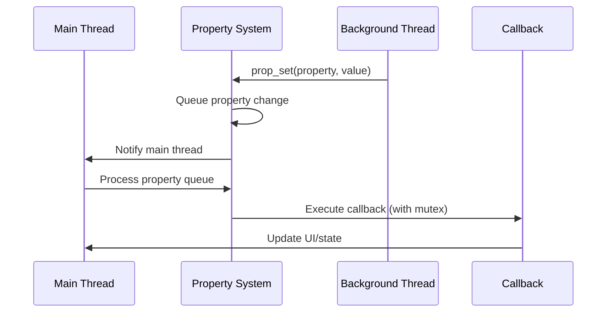
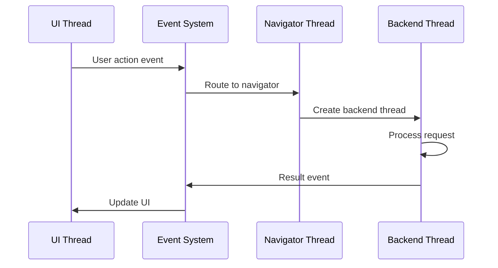

# Threading Model and Concurrency

## Overview

Movian employs a multi-threaded architecture designed for responsive user interfaces and efficient media processing. The threading model is built on platform-specific threading primitives (POSIX threads on Unix-like systems) with a consistent abstraction layer that provides thread-safe communication between components.

## Threading Architecture

### Core Threading Primitives

Movian's threading system is abstracted through platform-specific implementations:

**Threading Abstraction Layer:**
```c
// From src/arch/posix/posix_threads.h
typedef pthread_mutex_t hts_mutex_t;
typedef pthread_cond_t hts_cond_t;
typedef pthread_t hts_thread_t;

// Thread creation with priority support
void hts_thread_create_detached(const char *name, 
                               void *(*func)(void *), 
                               void *arg, int priority);
```

**Thread Priorities:**
```c
#define THREAD_PRIO_AUDIO         -10  // Highest priority
#define THREAD_PRIO_VIDEO         -5   // High priority
#define THREAD_PRIO_DEMUXER        3   // Above normal
#define THREAD_PRIO_UI_WORKER_HIGH 5   // UI responsiveness
#define THREAD_PRIO_UI_WORKER_MED  8   // Medium UI tasks
#define THREAD_PRIO_FILESYSTEM     10  // File operations
#define THREAD_PRIO_MODEL          12  // Data model updates
#define THREAD_PRIO_METADATA       13  // Metadata processing
#define THREAD_PRIO_UI_WORKER_LOW  14  // Low priority UI
#define THREAD_PRIO_METADATA_BG    15  // Background metadata
#define THREAD_PRIO_BGTASK         19  // Lowest priority
```

## Main Thread Architecture

### 1. Main Thread Responsibilities

The main thread handles:
- **UI Event Processing**: User input and interface updates
- **Property System Coordination**: Central property tree management
- **Component Lifecycle**: Initialization and shutdown coordination
- **Event Dispatch**: Routing events between components

### 2. Main Thread Event Loop



## Background Thread Categories

### 1. System Threads

**Software Installation Thread (`swthread`):**
```c
// From src/main.c
static void *swthread(void *aux) {
    plugins_init2();           // Initialize plugins
    upgrade_init();            // Check for upgrades
    usage_start();             // Start usage tracking
    
    // Periodic upgrade checks
    while(!gconf.disable_upgrades) {
        plugins_upgrade_check();
        upgrade_refresh();
        load_site_news();
        // Sleep for 12 hours between checks
        hts_cond_wait_timeout(&gconf.state_cond, &gconf.state_mutex, 
                             12 * 3600 * 1000);
    }
    return NULL;
}
```

**Service Probe Thread:**
```c
// From src/service.c
static void *service_probe_loop(void *aux) {
    while(1) {
        // Find services that need probing
        LIST_FOREACH(s, &services, s_link) {
            if(s->s_need_probe) break;
        }
        
        if(s == NULL) {
            hts_cond_wait(&service_cond, &service_mutex);
            continue;
        }
        
        // Probe service (can take time, so unlock mutex)
        hts_mutex_unlock(&service_mutex);
        st = backend_probe(url, txt, sizeof(txt), 0);
        hts_mutex_lock(&service_mutex);
        
        // Update service status
        prop_set_string(s->s_prop_status, val2str(st, status_tab));
    }
}
```

### 2. Media Processing Threads

**Navigation Backend Threads:**
```c
// From src/navigator.c
static void *nav_open_thread(void *aux) {
    nav_open_backend_aux_t *noba = aux;
    
    // Backend opening can be slow (network, file I/O)
    if(backend_open(noba->p, noba->url, 0))
        nav_open_errorf(noba->p, _("No handler for URL"));
    
    // Cleanup
    free(noba->url);
    prop_ref_dec(noba->p);
    free(noba);
    return NULL;
}

// Thread creation for page opening
hts_thread_create_detached("navopen", nav_open_thread, noba, 
                          THREAD_PRIO_MODEL);
```

### 3. Plugin Execution Threads

Plugins run in their own execution contexts:
- **ECMAScript Runtime**: JavaScript plugins execute in isolated contexts
- **Plugin Loading**: Plugin installation and loading happens in background threads
- **Plugin Communication**: Thread-safe property and event interfaces

## Synchronization Mechanisms

### 1. Mutex-Based Synchronization

**Global Mutexes:**
```c
// Navigator synchronization
static HTS_MUTEX_DECL(nav_mutex);

// Plugin system synchronization  
static HTS_MUTEX_DECL(plugin_mutex);
static HTS_MUTEX_DECL(autoplugin_mutex);

// Service system synchronization
hts_mutex_t service_mutex;
```

**Mutex Usage Patterns:**
```c
// Standard lock/unlock pattern
hts_mutex_lock(&nav_mutex);
// ... critical section ...
hts_mutex_unlock(&nav_mutex);

// Property operations with mutex
prop_subscribe(0,
    PROP_TAG_CALLBACK, callback_func, opaque,
    PROP_TAG_MUTEX, &nav_mutex,  // Specify mutex for thread safety
    PROP_TAG_ROOT, property,
    NULL);
```

### 2. Condition Variables

**State Coordination:**
```c
// Global state coordination
hts_mutex_t gconf.state_mutex;
hts_cond_t gconf.state_cond;

// Wait for navigator to be ready
hts_mutex_lock(&gconf.state_mutex);
while(gconf.navigator_can_start == 0)
    hts_cond_wait(&gconf.state_cond, &gconf.state_mutex);
hts_mutex_unlock(&gconf.state_mutex);

// Signal navigator ready
hts_mutex_lock(&gconf.state_mutex);
gconf.navigator_can_start = 1;
hts_cond_broadcast(&gconf.state_cond);
hts_mutex_unlock(&gconf.state_mutex);
```

### 3. Property System Thread Safety

The property system provides thread-safe communication:

**Property Couriers:**
```c
// Thread-specific property courier
prop_courier_t *prop_courier_create_thread(hts_mutex_t *entrymutex,
                                          const char *name,
                                          int flags);

// Passive courier for main thread
prop_courier_t *prop_courier_create_passive(void);

// Waitable courier for background threads
prop_courier_t *prop_courier_create_waitable(void);
```

**Thread-Safe Property Operations:**
```c
// Property updates are automatically thread-safe
prop_set(property, "value", PROP_SET_STRING, "new_value");

// Subscriptions specify mutex for callback execution
prop_subscribe(0,
    PROP_TAG_CALLBACK, my_callback, opaque,
    PROP_TAG_MUTEX, &my_mutex,  // Callback runs with this mutex held
    PROP_TAG_ROOT, property,
    NULL);
```

## Thread Communication Patterns

### 1. Property-Based Communication



### 2. Event-Based Communication



### 3. Asynchronous Operations

**Background Task Pattern:**
```c
// Create background task
typedef struct background_task {
    char *url;
    prop_t *result_prop;
} background_task_t;

static void *background_worker(void *aux) {
    background_task_t *task = aux;
    
    // Perform long-running operation
    result = process_url(task->url);
    
    // Update result property (thread-safe)
    prop_set(task->result_prop, "result", PROP_SET_STRING, result);
    
    // Cleanup
    free(task->url);
    prop_ref_dec(task->result_prop);
    free(task);
    return NULL;
}

// Start background task
background_task_t *task = malloc(sizeof(background_task_t));
task->url = strdup(url);
task->result_prop = prop_ref_inc(result_property);

hts_thread_create_detached("worker", background_worker, task, 
                          THREAD_PRIO_BGTASK);
```

## Memory Management in Multi-threaded Context

### 1. Reference Counting

**Thread-Safe Reference Counting:**
```c
// Atomic reference counting for properties
prop_t *prop_ref_inc(prop_t *p);  // Atomic increment
void prop_ref_dec(prop_t *p);     // Atomic decrement, cleanup if zero

// Usage in multi-threaded context
prop_t *p = prop_ref_inc(shared_property);  // Safe to pass to other thread
// ... pass to background thread ...
// Background thread calls prop_ref_dec(p) when done
```

### 2. Resource Cleanup

**Subscription Cleanup:**
```c
// Subscriptions are automatically cleaned up
prop_sub_t *sub = prop_subscribe(PROP_SUB_TRACK_DESTROY,
    PROP_TAG_CALLBACK, callback, opaque,
    PROP_TAG_ROOT, property,
    NULL);

// When property is destroyed, subscription is automatically removed
// No manual cleanup needed in most cases
```

**Thread-Safe Cleanup:**
```c
// Navigator cleanup with proper synchronization
void nav_fini(void) {
    hts_mutex_lock(&nav_mutex);
    navigator_t *nav;
    LIST_FOREACH(nav, &navigators, nav_link) {
        nav_close_all(nav, 1);  // Close all pages
    }
    hts_mutex_unlock(&nav_mutex);
}
```

## Deadlock Prevention

### 1. Lock Ordering

Movian follows consistent lock ordering to prevent deadlocks:

1. **Global State Mutex** (`gconf.state_mutex`)
2. **Component-Specific Mutexes** (`nav_mutex`, `plugin_mutex`, etc.)
3. **Property System Mutexes** (internal property locks)

### 2. Lock-Free Operations

Where possible, atomic operations are used instead of locks:

```c
// Atomic reference counting
atomic_t refcount;
atomic_add_and_fetch(&refcount, 1);  // Increment
if(atomic_add_and_fetch(&refcount, -1) == 0) {
    // Last reference, cleanup
}
```

### 3. Timeout-Based Locking

Critical sections use timeouts to prevent indefinite blocking:

```c
// Timeout-based condition wait
int timeout = hts_cond_wait_timeout(&gconf.state_cond, 
                                   &gconf.state_mutex,
                                   12 * 3600 * 1000);  // 12 hour timeout
if(timeout) {
    // Handle timeout condition
}
```

## Performance Considerations

### 1. Thread Pool Management

- **Limited Thread Creation**: Threads are created for specific purposes, not on-demand
- **Priority-Based Scheduling**: Critical threads (audio/video) get higher priorities
- **Resource Limits**: Background threads use lower priorities to avoid UI blocking

### 2. Lock Contention Minimization

- **Fine-Grained Locking**: Component-specific mutexes reduce contention
- **Short Critical Sections**: Locks are held for minimal time
- **Asynchronous Processing**: Long operations moved to background threads

### 3. Cache-Friendly Design

- **Property Batching**: Multiple property updates are batched for efficiency
- **Event Coalescing**: Similar events are combined to reduce processing overhead
- **Memory Locality**: Related data structures are kept together

## Debugging and Monitoring

### 1. Thread Naming

All threads are created with descriptive names for debugging:

```c
hts_thread_create_detached("swinst", swthread, NULL, THREAD_PRIO_BGTASK);
hts_thread_create_detached("navopen", nav_open_thread, noba, THREAD_PRIO_MODEL);
hts_thread_create_detached("service probe", service_probe_loop, NULL, THREAD_PRIO_BGTASK);
```

### 2. Mutex Debugging

Debug builds include mutex assertion checking:

```c
#define hts_mutex_assert(l) hts_mutex_assert0(l, __FILE__, __LINE__)

static inline void hts_mutex_assert0(pthread_mutex_t *l, const char *file, int line) {
    if(pthread_mutex_trylock(l) == EBUSY)
        return;  // Mutex is held, assertion passes
    
    fprintf(stderr, "Mutex not held at %s:%d\n", file, line);
    abort();
}
```

### 3. Property System Tracing

The property system includes tracing capabilities for debugging:

```c
#ifdef PROP_DEBUG
extern int prop_trace;
void prop_track_sub(prop_sub_t *s);
void prop_print_trace(prop_t *p);
#endif
```

This threading model provides Movian with responsive user interfaces, efficient media processing, and robust plugin execution while maintaining system stability through careful synchronization and resource management.