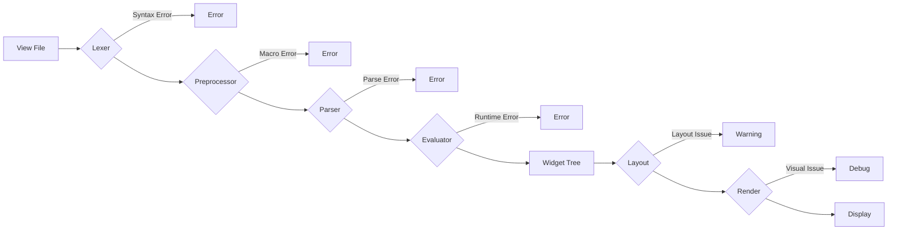

# Debugging View Files

**Status**: 🟢 Complete guide based on source analysis  
**Last Updated**: 2024-11-06  
**Movian Version**: 4.8+

## Overview

Debugging GLW view files can be challenging due to their dynamic nature and the complexity of the rendering pipeline. This guide provides practical techniques and tools for identifying and resolving issues in view file development.

## Understanding the View File Pipeline

Before debugging, it's essential to understand where issues can occur:



**Error Categories**:
1. **Syntax Errors** - Lexer/Parser stage (file won't load)
2. **Macro Errors** - Preprocessor stage (expansion fails)
3. **Runtime Errors** - Evaluation stage (expressions fail)
4. **Layout Issues** - Layout stage (positioning problems)
5. **Visual Issues** - Render stage (appearance problems)

## Common Error Types

### 1. Syntax Errors

**Symptoms**: View file fails to load, error message in log

**Common Causes**:

#### Unmatched Braces
```javascript
// ❌ Wrong - missing closing brace
widget(container_x, {
  widget(label, {
    caption: "Hello";
  });
// Missing }
```

```javascript
// ✅ Correct
widget(container_x, {
  widget(label, {
    caption: "Hello";
  });
});
```

#### Unterminated Strings
```javascript
// ❌ Wrong - missing closing quote
widget(label, {
  caption: "Hello World;
});
```

```javascript
// ✅ Correct
widget(label, {
  caption: "Hello World";
});
```

#### Invalid Operators
```javascript
// ❌ Wrong - @ is not a valid operator
width: 100 @ 50;
```

```javascript
// ✅ Correct
width: 100 + 50;
```

#### Missing Semicolons
```javascript
// ❌ Wrong - missing semicolon
widget(container_x, {
  width: 100
  height: 50;
});
```

```javascript
// ✅ Correct
widget(container_x, {
  width: 100;
  height: 50;
});
```

**Debugging Technique**:
1. Check the error message for file name and line number
2. Look for unmatched braces, quotes, or parentheses
3. Use a text editor with syntax highlighting
4. Comment out sections to isolate the problem

### 2. Preprocessor Errors

**Symptoms**: Macro expansion fails, file inclusion errors

**Common Causes**:

#### Undefined Macro
```javascript
// ❌ Wrong - macro not defined
MyButton("Click Me");
```

```javascript
// ✅ Correct - define before use
#define MyButton(label) {
  widget(container_x, {
    widget(label, {
      caption: $label;
    });
  });
}

MyButton("Click Me");
```

#### Circular Includes
```javascript
// file1.view
#include "file2.view"

// file2.view
#include "file1.view"  // ❌ Circular dependency
```

```javascript
// ✅ Correct - use #import to prevent multiple inclusion
// file1.view
#import "common.view"

// file2.view
#import "common.view"  // Only loaded once
```

#### Macro Argument Mismatch
```javascript
#define Button(label, width) {
  widget(container_x, {
    width: $width;
    widget(label, { caption: $label; });
  });
}

// ❌ Wrong - missing width argument
Button("Click");
```

```javascript
// ✅ Correct - provide all arguments or use defaults
#define Button(label, width=100) {
  widget(container_x, {
    width: $width;
    widget(label, { caption: $label; });
  });
}

Button("Click");  // Uses default width
Button("Click", 200);  // Custom width
```

**Debugging Technique**:
1. Check that all macros are defined before use
2. Verify macro arguments match the definition
3. Use #import instead of #include for shared definitions
4. Add debug output to macro bodies

### 3. Property Reference Errors

**Symptoms**: Widget displays wrong data or nothing at all

**Common Causes**:

#### Undefined Property
```javascript
// ❌ Wrong - property doesn't exist
widget(label, {
  caption: $page.model.nonexistent;
});
```

```javascript
// ✅ Correct - use null coalescing for fallback
widget(label, {
  caption: $page.model.title ?? "Untitled";
});
```

#### Wrong Property Path
```javascript
// ❌ Wrong - incorrect path
widget(label, {
  caption: $item.title;  // Should be $self.title in cloner
});
```

```javascript
// ✅ Correct - use $self in cloner context
cloner($page.model.items, container_x, {
  widget(label, {
    caption: $self.title;
  });
});
```

#### Scope Issues
```javascript
// ❌ Wrong - $self not available outside cloner
widget(label, {
  caption: $self.title;
});
```

```javascript
// ✅ Correct - use appropriate scope
widget(label, {
  caption: $page.model.title;
});
```

**Debugging Technique**:
1. Use debug assignment operator `_=_` to log property values
2. Add fallback values with `??` operator
3. Check property availability in current scope
4. Verify property path with console logging

### 4. Expression Errors

**Symptoms**: Unexpected values, type errors, evaluation failures

**Common Causes**:

#### Type Mismatch
```javascript
// ❌ Wrong - comparing string to number
alpha: $count == "0" ? 0.5 : 1.0;
```

```javascript
// ✅ Correct - consistent types
alpha: $count == 0 ? 0.5 : 1.0;
```

#### Division by Zero
```javascript
// ❌ Wrong - potential division by zero
width: 100 / $count;
```

```javascript
// ✅ Correct - guard against zero
width: $count > 0 ? 100 / $count : 100;
```

#### Operator Precedence
```javascript
// ❌ Wrong - unexpected precedence
alpha: $enabled && $visible ? 1.0 : 0.3;
// Parsed as: $enabled && ($visible ? 1.0 : 0.3)
```

```javascript
// ✅ Correct - use parentheses for clarity
alpha: ($enabled && $visible) ? 1.0 : 0.3;
```

**Debugging Technique**:
1. Break complex expressions into simpler parts
2. Use parentheses to control precedence
3. Add intermediate variables for debugging
4. Test expressions with known values

### 5. Layout Issues

**Symptoms**: Widgets not positioned correctly, overlapping, or invisible

**Common Causes**:

#### Missing Size Constraints
```javascript
// ❌ Wrong - no size specified
widget(container_x, {
  widget(label, {
    caption: "Text";
  });
});
```

```javascript
// ✅ Correct - specify size or weight
widget(container_x, {
  height: 50;
  widget(label, {
    caption: "Text";
  });
});
```

#### Conflicting Constraints
```javascript
// ❌ Wrong - conflicting width constraints
widget(container_x, {
  width: 100;
  weight: 1.0;  // Conflicts with fixed width
});
```

```javascript
// ✅ Correct - use one constraint type
widget(container_x, {
  weight: 1.0;  // Flexible width
});
```

#### Z-Order Issues
```javascript
// ❌ Wrong - background renders on top
widget(container_z, {
  widget(label, { caption: "Text"; });
  widget(quad, { color: "#000000"; });  // Covers text
});
```

```javascript
// ✅ Correct - background first
widget(container_z, {
  widget(quad, { color: "#000000"; });
  widget(label, { caption: "Text"; });
});
```

**Debugging Technique**:
1. Add visible backgrounds to containers (colored quads)
2. Check widget hierarchy and nesting
3. Verify size constraints are appropriate
4. Use fixed sizes during debugging, then make flexible

### 6. Focus and Navigation Issues

**Symptoms**: Can't navigate to widgets, focus indicators missing

**Common Causes**:

#### Missing Focusable Attribute
```javascript
// ❌ Wrong - not focusable
widget(container_x, {
  widget(label, { caption: "Button"; });
  onEvent(activate, navOpen("url"));
});
```

```javascript
// ✅ Correct - mark as focusable
widget(container_x, {
  focusable: true;
  widget(label, { caption: "Button"; });
  onEvent(activate, navOpen("url"));
});
```

#### No Focus Indicator
```javascript
// ❌ Wrong - no visual feedback
widget(container_x, {
  focusable: true;
  widget(label, { caption: "Button"; });
});
```

```javascript
// ✅ Correct - add focus indicator
widget(container_z, {
  focusable: true;
  
  widget(quad, {
    color: "#444444";
    alpha: 0.6 + 0.4 * iir(isNavFocused(), 4, true);
  });
  
  widget(label, { caption: "Button"; });
  
  widget(border, {
    border: 0.1em;
    color: "#FFFFFF";
    alpha: isNavFocused();
  });
});
```

**Debugging Technique**:
1. Add visible focus indicators during development
2. Test navigation with keyboard/remote
3. Check focusable attribute on interactive widgets
4. Verify focus path with debug logging

## Debugging Tools and Techniques

### 1. Debug Assignment Operator

Use the `_=_` operator to log property changes:

```javascript
widget(label, {
  caption _=_ $page.model.title;  // Logs value changes
});
```

**Output** (in Movian log):
```
GLW: Property 'caption' changed to 'My Title'
```

### 2. Conditional Visibility for Debugging

Add debug overlays that can be toggled:

```javascript
$ui.debug = false;  // Set to true to enable debug view

widget(container_z, {
  // Your normal content
  widget(container_y, {
    // ...
  });
  
  // Debug overlay
  widget(container_y, {
    hidden: !$ui.debug;
    widget(label, {
      caption: "Debug: " + $page.model.type;
      color: "#FF0000";
    });
    widget(label, {
      caption: "Count: " + $page.model.items.length;
      color: "#FF0000";
    });
  });
});
```

### 3. Visual Debugging with Colored Backgrounds

Add colored backgrounds to understand layout:

```javascript
widget(container_x, {
  // Debug background
  widget(quad, {
    color: "#FF0000";
    alpha: 0.3;
  });
  
  // Your content
  widget(label, { caption: "Text"; });
});
```

### 4. Simplified Test Cases

Create minimal test files to isolate issues:

```javascript
// test-simple.view
widget(container_y, {
  widget(label, {
    caption: "Test 1";
  });
  widget(label, {
    caption: "Test 2";
  });
});
```

### 5. Progressive Commenting

Comment out sections to identify problem areas:

```javascript
widget(container_y, {
  widget(label, { caption: "Works"; });
  
  /*
  widget(container_x, {
    // Problem might be here
  });
  */
  
  widget(label, { caption: "Also works"; });
});
```

### 6. Property Inspection

Create a property inspector widget:

```javascript
#define PropertyInspector(prop, label) {
  widget(container_x, {
    widget(label, {
      caption: $label + ": ";
      color: "#FFFF00";
    });
    widget(label, {
      caption: $prop ?? "undefined";
      color: "#00FF00";
    });
  });
}

// Usage
PropertyInspector($page.model.title, "Title");
PropertyInspector($page.model.type, "Type");
```

### 7. Console Logging (via Plugin)

For complex debugging, create a plugin helper:

```javascript
// In your plugin
exports.debugLog = function(message, value) {
  console.log("[DEBUG] " + message + ":", JSON.stringify(value));
};
```

### 8. Incremental Development

Build views incrementally:

1. Start with basic structure
2. Add one widget at a time
3. Test after each addition
4. Verify layout and behavior
5. Add complexity gradually

## Development Workflow

### 1. Setup Development Environment

**Enable Debug Logging**:
- Start Movian with debug flags
- Monitor log output in real-time
- Use log filtering for relevant messages

**Use Version Control**:
- Commit working versions frequently
- Create branches for experiments
- Revert easily when things break

**Hot Reload**:
- Movian reloads view files on change
- Navigate away and back to refresh
- Use loader widgets for dynamic reloading

### 2. Iterative Development Process

```
1. Plan → 2. Implement → 3. Test → 4. Debug → 5. Refine
    ↑                                              ↓
    └──────────────────────────────────────────────┘
```

**Step 1: Plan**
- Sketch layout on paper
- Identify required widgets
- Plan property bindings
- Consider edge cases

**Step 2: Implement**
- Start with basic structure
- Add widgets incrementally
- Use placeholders for complex parts
- Comment your code

**Step 3: Test**
- Test with real data
- Test with empty data
- Test with edge cases
- Test navigation flow

**Step 4: Debug**
- Check logs for errors
- Add debug visualizations
- Isolate problem areas
- Test hypotheses

**Step 5: Refine**
- Remove debug code
- Optimize performance
- Improve code clarity
- Document complex parts

### 3. Testing Strategies

**Unit Testing**:
- Test individual widgets in isolation
- Create test view files for components
- Verify with different data

**Integration Testing**:
- Test complete pages
- Verify navigation flow
- Test with real content

**Visual Testing**:
- Test on different screen sizes
- Test with different themes
- Verify focus indicators
- Check text readability

**Performance Testing**:
- Monitor frame rate
- Check memory usage
- Test with large datasets
- Optimize bottlenecks

## Common Debugging Scenarios

### Scenario 1: Widget Not Visible

**Symptoms**: Widget exists but doesn't appear

**Checklist**:
- [ ] Check alpha value (should be > 0)
- [ ] Verify size constraints (width/height)
- [ ] Check parent container size
- [ ] Verify z-order (not covered by other widgets)
- [ ] Check hidden attribute
- [ ] Verify color contrast
- [ ] Check clipping boundaries

**Debug Approach**:
```javascript
widget(container_x, {
  // Add visible background
  widget(quad, {
    color: "#FF0000";
    alpha: 0.5;
  });
  
  // Your widget
  widget(label, {
    caption: "Test";
    // Force visibility
    alpha: 1.0;
    color: "#FFFFFF";
  });
});
```

### Scenario 2: Property Not Updating

**Symptoms**: Widget doesn't reflect property changes

**Checklist**:
- [ ] Verify property path is correct
- [ ] Check property exists in scope
- [ ] Verify subscription is created
- [ ] Check for static vs dynamic evaluation
- [ ] Verify property is actually changing

**Debug Approach**:
```javascript
widget(label, {
  // Use debug assignment
  caption _=_ $page.model.title;
  
  // Add fallback to verify binding
  caption: $page.model.title ?? "NO TITLE";
});

// Add inspector
widget(label, {
  caption: "Debug: " + $page.model.title;
  color: "#FF0000";
});
```

### Scenario 3: Layout Not Working

**Symptoms**: Widgets positioned incorrectly

**Checklist**:
- [ ] Check container type (x, y, z)
- [ ] Verify size constraints
- [ ] Check spacing and padding
- [ ] Verify alignment settings
- [ ] Check weight distribution
- [ ] Verify aspect ratio constraints

**Debug Approach**:
```javascript
widget(container_y, {
  // Add colored backgrounds to each child
  widget(container_x, {
    height: 50;
    widget(quad, { color: "#FF0000"; alpha: 0.3; });
    widget(label, { caption: "Section 1"; });
  });
  
  widget(container_x, {
    weight: 1.0;
    widget(quad, { color: "#00FF00"; alpha: 0.3; });
    widget(label, { caption: "Section 2"; });
  });
  
  widget(container_x, {
    height: 50;
    widget(quad, { color: "#0000FF"; alpha: 0.3; });
    widget(label, { caption: "Section 3"; });
  });
});
```

### Scenario 4: Navigation Not Working

**Symptoms**: Can't navigate to or between widgets

**Checklist**:
- [ ] Check focusable attribute
- [ ] Verify event handlers
- [ ] Check focus weight
- [ ] Verify navigation path
- [ ] Check for blocking overlays

**Debug Approach**:
```javascript
widget(container_x, {
  focusable: true;
  
  // Visual focus indicator
  widget(quad, {
    color: "#FFFF00";
    alpha: isNavFocused() ? 0.5 : 0.0;
  });
  
  widget(label, {
    caption: "Focusable Item";
  });
  
  // Log events
  onEvent(activate, {
    console.log("Activated!");
    navOpen("test:url");
  });
  
  onEvent(focus, {
    console.log("Focused!");
  });
});
```

### Scenario 5: Performance Issues

**Symptoms**: Slow rendering, lag, stuttering

**Checklist**:
- [ ] Check widget count (minimize)
- [ ] Verify expression complexity
- [ ] Check for unnecessary subscriptions
- [ ] Verify image sizes
- [ ] Check for layout thrashing

**Debug Approach**:
```javascript
// Simplify complex expressions
// ❌ Complex
alpha: ($enabled && $visible && !$disabled) ? 
       (isNavFocused() ? 1.0 : 0.8) : 0.3;

// ✅ Simplified with intermediate values
$isActive = $enabled && $visible && !$disabled;
$focusAlpha = isNavFocused() ? 1.0 : 0.8;
alpha: $isActive ? $focusAlpha : 0.3;

// Reduce widget count
// ❌ Many widgets
widget(container_z, {
  widget(quad, { ... });
  widget(quad, { ... });
  widget(quad, { ... });
  widget(label, { ... });
});

// ✅ Fewer widgets
widget(container_z, {
  widget(quad, { ... });  // Combined background
  widget(label, { ... });
});
```

## Best Practices for Debuggable Code

### 1. Use Meaningful Names

```javascript
// ❌ Poor naming
$x = $page.model.data;
$y = $x.items;

// ✅ Clear naming
$pageData = $page.model.data;
$itemList = $pageData.items;
```

### 2. Add Comments

```javascript
// ❌ No context
widget(container_x, {
  width: $parent.width - 40;
});

// ✅ Explained
widget(container_x, {
  // Account for 20px padding on each side
  width: $parent.width - 40;
});
```

### 3. Structure Code Consistently

```javascript
// ✅ Consistent structure
widget(container_z, {
  // Background layer
  widget(quad, {
    color: "#000000";
    alpha: 0.8;
  });
  
  // Content layer
  widget(container_y, {
    padding: [1em, 1em, 1em, 1em];
    
    // Header
    widget(label, {
      caption: $title;
    });
    
    // Body
    widget(label, {
      caption: $description;
    });
  });
  
  // Overlay layer
  widget(loader, {
    source: $overlayUrl;
  });
});
```

### 4. Use Defensive Programming

```javascript
// ✅ Guard against undefined values
widget(label, {
  caption: $page.model.title ?? "Untitled";
});

// ✅ Guard against division by zero
width: $count > 0 ? 100 / $count : 100;

// ✅ Guard against invalid types
alpha: typeof($value) == "number" ? $value : 1.0;
```

### 5. Keep It Simple

```javascript
// ❌ Overly complex
widget(container_x, {
  alpha: ($enabled && ($visible || $forced) && !$disabled) ?
         (isNavFocused() ? ($pressed ? 1.0 : 0.9) : 0.7) :
         ($dimmed ? 0.3 : 0.5);
});

// ✅ Broken down
$isInteractive = $enabled && ($visible || $forced) && !$disabled;
$focusAlpha = $pressed ? 1.0 : 0.9;
$normalAlpha = isNavFocused() ? $focusAlpha : 0.7;
$inactiveAlpha = $dimmed ? 0.3 : 0.5;
alpha: $isInteractive ? $normalAlpha : $inactiveAlpha;
```

## Troubleshooting Checklist

When encountering issues, work through this checklist:

### File Loading Issues
- [ ] Check file path is correct
- [ ] Verify file exists
- [ ] Check for syntax errors in log
- [ ] Verify file encoding (UTF-8)
- [ ] Check for BOM (byte order mark) issues

### Parsing Issues
- [ ] Match all braces, brackets, parentheses
- [ ] Close all strings
- [ ] End statements with semicolons
- [ ] Check operator usage
- [ ] Verify macro definitions

### Runtime Issues
- [ ] Check property paths
- [ ] Verify scope availability
- [ ] Test expressions with known values
- [ ] Check type compatibility
- [ ] Verify function calls

### Layout Issues
- [ ] Add visible backgrounds
- [ ] Check size constraints
- [ ] Verify container types
- [ ] Check z-order
- [ ] Test with fixed sizes

### Visual Issues
- [ ] Check alpha values
- [ ] Verify colors
- [ ] Check text contrast
- [ ] Verify image paths
- [ ] Test on target device

### Performance Issues
- [ ] Count widgets
- [ ] Simplify expressions
- [ ] Check subscription count
- [ ] Optimize images
- [ ] Profile rendering

## Additional Resources

### Log Analysis

**Enable Verbose Logging**:
```bash
movian --debug
```

**Filter Logs**:
```bash
movian --debug 2>&1 | grep "GLW:"
```

**Common Log Messages**:
- `GLW: Error loading view` - File loading failed
- `GLW: Parse error` - Syntax error
- `GLW: Property not found` - Invalid property reference
- `GLW: Evaluation error` - Expression evaluation failed

### External Tools

**Text Editors with Syntax Highlighting**:
- Visual Studio Code (with custom language support)
- Sublime Text
- Atom
- Vim/Emacs (with custom syntax files)

**Version Control**:
- Git for tracking changes
- Diff tools for comparing versions
- Blame for identifying changes

**Image Tools**:
- ImageMagick for batch processing
- GIMP for image editing
- Inkscape for SVG editing

## Conclusion

Debugging view files requires a systematic approach and understanding of the GLW pipeline. Key strategies include:

1. **Understand the pipeline** - Know where errors can occur
2. **Use debugging tools** - Leverage debug operators and visualizations
3. **Develop incrementally** - Build and test in small steps
4. **Keep it simple** - Avoid unnecessary complexity
5. **Test thoroughly** - Verify with real data and edge cases

With practice and these techniques, you'll be able to quickly identify and resolve issues in your view files.

## See Also

- [Troubleshooting Reference](../reference/troubleshooting.md) - Common issues and solutions
- [Syntax Reference](../ui/view-files/syntax-reference.md) - Complete syntax guide
- [GLW Architecture](../ui/glw-architecture.md) - System architecture
- [Source Analysis Summary](../ui/source-analysis/summary.md) - Technical details
