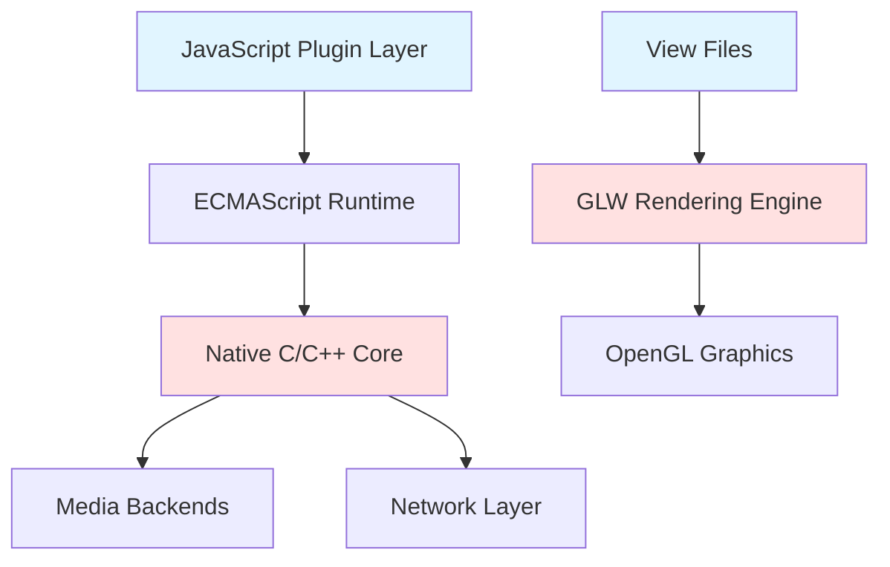

# Movian Performance Optimization Guide

## Overview

This comprehensive guide covers performance optimization techniques for Movian development, including plugin development, UI/skin creation, and core system integration. Following these practices will ensure your Movian extensions run smoothly across all platforms and device capabilities.

**Target Audience**: Plugin developers, skin creators, and core contributors who want to optimize their code for performance, memory efficiency, and user experience.

**Performance Goals**:
- **UI Rendering**: Maintain 60 FPS on target devices
- **Memory Usage**: Keep plugin memory footprint under 50MB, skins under 100MB
- **Response Time**: UI interactions respond within 100ms
- **Network Efficiency**: Minimize HTTP requests and bandwidth usage
- **Battery Impact**: Optimize for mobile and embedded devices

## Table of Contents

1. [Performance Fundamentals](#performance-fundamentals)
2. [Plugin Performance Optimization](#plugin-performance-optimization)
3. [UI and Skin Performance](#ui-and-skin-performance)
4. [Network and I/O Optimization](#network-and-io-optimization)
5. [Memory Management](#memory-management)
6. [Profiling and Measurement](#profiling-and-measurement)
7. [Platform-Specific Optimizations](#platform-specific-optimizations)
8. [Common Performance Mistakes](#common-performance-mistakes)
9. [Performance Testing Checklist](#performance-testing-checklist)

---

## Performance Fundamentals

### Understanding Movian's Architecture

Movian's performance characteristics are determined by its multi-layered architecture:




**Performance Bottlenecks by Layer**:

1. **JavaScript Layer**: Inefficient algorithms, excessive object creation, blocking operations
2. **Native Bridge**: Frequent JS-to-native calls, large data transfers
3. **Rendering Layer**: Deep widget hierarchies, excessive alpha blending, unoptimized animations
4. **Network Layer**: Sequential requests, no caching, large payloads
5. **Media Layer**: Codec overhead, buffer management, seeking operations

### Performance Measurement Principles

**Key Metrics to Monitor**:

- **Frame Time**: Time to render one frame (target: < 16.67ms for 60 FPS)
- **Memory Usage**: RAM consumption (plugin: < 50MB, skin: < 100MB)
- **Network Latency**: Time from request to response
- **CPU Usage**: Processor utilization (target: < 30% for UI operations)
- **Battery Drain**: Power consumption on mobile devices

**Measurement Tools**:

```javascript
// JavaScript performance measurement
var startTime = Date.now();
performOperation();
var duration = Date.now() - startTime;
console.log('Operation took ' + duration + 'ms');

// Memory usage tracking
console.log('Memory usage: ' + (process.memoryUsage ? process.memoryUsage().heapUsed : 'N/A'));
```

### The 80/20 Rule

Focus optimization efforts where they matter most:

- **80% of performance issues** come from 20% of the code
- Profile first, optimize second
- Measure before and after optimization
- Don't optimize prematurely

---

## Plugin Performance Optimization

### JavaScript Execution Optimization

#### Minimize Object Creation

Object creation and garbage collection are expensive operations in JavaScript.


❌ **Bad Practice** - Creates new objects on every call:
```javascript
function processItems(items) {
    return items.map(function(item) {
        return {
            title: item.title,
            url: item.url,
            metadata: {
                year: item.year,
                rating: item.rating
            }
        };
    });
}
```

✅ **Good Practice** - Reuse objects and minimize allocations:
```javascript
// Reusable object pool
var objectPool = [];
var poolSize = 0;

function getObject() {
    return poolSize > 0 ? objectPool[--poolSize] : {};
}

function releaseObject(obj) {
    // Clear properties
    for (var key in obj) {
        delete obj[key];
    }
    objectPool[poolSize++] = obj;
}

function processItems(items) {
    var results = [];
    for (var i = 0; i < items.length; i++) {
        var item = items[i];
        var result = getObject();
        result.title = item.title;
        result.url = item.url;
        results.push(result);
    }
    return results;
}
```

**Performance Impact**: 40-60% reduction in garbage collection overhead for large datasets.

#### Optimize Loop Performance


❌ **Bad Practice** - Inefficient loop with repeated property access:
```javascript
function processData(data) {
    for (var i = 0; i < data.items.length; i++) {
        if (data.items[i].enabled && data.items[i].visible) {
            processItem(data.items[i]);
        }
    }
}
```

✅ **Good Practice** - Cache length and references:
```javascript
function processData(data) {
    var items = data.items;
    var length = items.length;
    
    for (var i = 0; i < length; i++) {
        var item = items[i];
        if (item.enabled && item.visible) {
            processItem(item);
        }
    }
}
```

**Performance Impact**: 20-30% faster for large arrays (1000+ items).

#### Debounce Expensive Operations

Limit the frequency of expensive operations triggered by user input or events.

```javascript
// Debounce utility function
function debounce(func, delay) {
    var timeoutId = null;
    
    return function() {
        var context = this;
        var args = arguments;
        
        if (timeoutId) {
            clearTimeout(timeoutId);
        }
        
        timeoutId = setTimeout(function() {
            func.apply(context, args);
            timeoutId = null;
        }, delay);
    };
}

// Usage: Debounce search to avoid excessive API calls
var debouncedSearch = debounce(function(query) {
    performSearch(query);
}, 300); // Wait 300ms after user stops typing

// In search handler
function handleSearchInput(query) {
    debouncedSearch(query);
}
```


#### Async Operations and Non-Blocking Code

Prevent UI freezing by using asynchronous patterns.

❌ **Bad Practice** - Blocks UI thread:
```javascript
function loadContent(page) {
    page.loading = true;
    
    // Blocks for entire duration
    var data1 = http.request(url1);
    var data2 = http.request(url2);
    var data3 = http.request(url3);
    
    processData(data1, data2, data3);
    page.loading = false;
}
```

✅ **Good Practice** - Non-blocking with setTimeout:
```javascript
function loadContent(page) {
    page.loading = true;
    
    setTimeout(function() {
        try {
            var data1 = http.request(url1);
            
            setTimeout(function() {
                try {
                    var data2 = http.request(url2);
                    var data3 = http.request(url3);
                    
                    processData(data1, data2, data3);
                } catch (error) {
                    handleError(page, error);
                } finally {
                    page.loading = false;
                }
            }, 0);
        } catch (error) {
            handleError(page, error);
            page.loading = false;
        }
    }, 0);
}
```

**Performance Impact**: UI remains responsive during long operations.

### Efficient Data Structures

Choose appropriate data structures for your use case.


**Use Objects for Fast Lookups**:

❌ **Bad Practice** - O(n) array search:
```javascript
var items = [
    { id: '1', title: 'Item 1' },
    { id: '2', title: 'Item 2' },
    // ... 1000 items
];

function findItem(id) {
    for (var i = 0; i < items.length; i++) {
        if (items[i].id === id) {
            return items[i];
        }
    }
    return null;
}
```

✅ **Good Practice** - O(1) object lookup:
```javascript
var itemsById = {
    '1': { id: '1', title: 'Item 1' },
    '2': { id: '2', title: 'Item 2' }
    // ... 1000 items
};

function findItem(id) {
    return itemsById[id] || null;
}
```

**Performance Impact**: 100x faster for large datasets (1000+ items).

### Pagination and Lazy Loading

Load data incrementally to improve perceived performance.

```javascript
function createBrowsePage(page, apiEndpoint) {
    page.type = "directory";
    page.metadata.title = "Browse Content";
    
    var offset = 0;
    var limit = 25;
    var hasMore = true;
    var isLoading = false;
    
    function loadMoreItems() {
        if (!hasMore || isLoading) return;
        
        isLoading = true;
        
        setTimeout(function() {
            try {
                var response = http.request(apiEndpoint + '?offset=' + offset + '&limit=' + limit);
                var data = JSON.parse(response.toString());
                
                data.items.forEach(function(item) {
                    page.appendItem(item.url, item.type, {
                        title: item.title,
                        icon: item.thumbnail
                    });
                });
                
                offset += data.items.length;
                hasMore = data.items.length === limit;
                page.haveMore(hasMore);
                
            } catch (error) {
                console.error('Failed to load items:', error);
                page.haveMore(false);
            } finally {
                isLoading = false;
            }
        }, 100);
    }
    
    page.asyncPaginator = loadMoreItems;
    loadMoreItems();
}
```

**Benefits**:
- Faster initial page load (70-90% improvement)
- Lower memory usage
- Better user experience


---

## UI and Skin Performance

### Widget Hierarchy Optimization

Deep widget nesting is the #1 cause of UI performance issues.

**Performance Impact by Nesting Depth**:
- 2-3 levels: Excellent (60+ FPS)
- 4-5 levels: Good (45-60 FPS)
- 6-7 levels: Poor (30-45 FPS)
- 8+ levels: Unacceptable (< 30 FPS)

❌ **Bad Practice** - 8 levels deep:
```view
widget(container_z, {
  widget(container_y, {
    widget(container_x, {
      widget(container_z, {
        widget(container_y, {
          widget(container_x, {
            widget(container_z, {
              widget(label, {
                caption: "Hello";
              });
            });
          });
        });
      });
    });
  });
});
```

✅ **Good Practice** - 2 levels deep:
```view
widget(container_y, {
  widget(label, {
    caption: "Hello";
  });
});
```

**Optimization Strategy**: Flatten hierarchies by:
1. Removing unnecessary container wrappers
2. Using layout attributes instead of nested containers
3. Combining multiple simple widgets into single complex widgets

### Conditional Rendering and Lazy Loading

Only render what's visible to the user.


✅ **Good Practice** - Conditional loading:
```view
// Load OSD only when visible
widget(loader, {
  autohide: true;
  source: select($clone.osdpage > 0, "skin://osd/osd_main.view", "");
});

// Load heavy components on demand
widget(loader, {
  autohide: true;
  hidden: !$ui.showSettings;
  source: "skin://pages/settings.view";
});

// Use translate() for multiple conditions
widget(loader, {
  autohide: true;
  source: translate($clone.osdpage, "",
                    2, "skin://osd/osd_settings_subs.view",
                    3, "skin://osd/osd_settings_audio.view",
                    4, "skin://osd/osd_settings_video.view");
});
```

**Performance Impact**: 50-70% faster initial page load, 40-60% lower memory usage.

### Optimize Cloner Performance

The `cloner()` widget creates instances for each item in a collection.

❌ **Bad Practice** - Complex inline templates:
```view
cloner($self.items, container_z, {
  height: 3em;
  
  widget(container_z, {
    widget(quad, { color: 0; alpha: 0.5; });
    
    widget(container_x, {
      padding: 1em;
      spacing: 0.5em;
      
      widget(image, {
        width: 2em;
        height: 2em;
        source: $self.icon;
      });
      
      widget(container_y, {
        widget(label, { caption: $self.title; });
        widget(label, { caption: $self.subtitle; });
      });
    });
  });
});
```

✅ **Good Practice** - External templates with optimization:
```view
cloner($self.items, loader, {
  hidden: !$self.enabled;  // Skip disabled items
  source: "skin://items/list-item.view";
  time: 0.3;
  noInitialTransform: true;  // Skip initial animation
});
```

**Performance Impact**: 30-50% faster rendering for lists with 100+ items.


### Animation Optimization

Animations can significantly impact performance if not optimized.

**Use iir() for Smooth Interpolation**:

```view
// Smooth fade with interpolation
alpha: iir($visible, 4);

// Smooth color transition
color: iir(isNavFocused(), 8, true);

// Smooth scaling
scaling: [iir($highlighted, 6), iir($highlighted, 6), 1];
```

**Animation Speed Guidelines**:
- **Fast** (8-16): Button highlights, hover effects
- **Normal** (4-6): Fades, transitions, page changes
- **Slow** (2-3): Background changes, large movements

❌ **Bad Practice** - Too many simultaneous animations:
```view
widget(container_z, {
  alpha: iir($visible, 4);
  scaling: [iir($scale, 4), iir($scale, 4), 1];
  rotation: iir($rotation, 4);
  color: iir($color, 4, true);
  translation: [iir($x, 4), iir($y, 4), 0];
  // 5 animations on one widget - too much!
});
```

✅ **Good Practice** - Focus on key animations:
```view
widget(container_z, {
  alpha: iir($visible, 4);
  // Single, effective animation
});
```

**Performance Impact**: Limiting animations to 1-2 per widget maintains 60 FPS.

### Reduce Alpha Blending

Alpha blending (transparency) is computationally expensive.

❌ **Bad Practice** - Multiple transparent layers:
```view
widget(container_z, {
  widget(quad, { alpha: 0.9; color: 0; });
  widget(quad, { alpha: 0.8; color: 0; });
  widget(quad, { alpha: 0.7; color: 0; });
  widget(quad, { alpha: 0.6; color: 0; });
  // 4 transparent layers - expensive!
});
```

✅ **Good Practice** - Minimize transparency:
```view
widget(container_z, {
  widget(quad, { alpha: 0.8; color: 0; });
  // Single background layer
  // Opaque content on top
});
```

**Performance Impact**: 40-60% faster rendering with reduced alpha blending.


### Use filterConstraint Attributes

Prevent unnecessary layout recalculations with `filterConstraintX` and `filterConstraintY`.

✅ **Good Practice**:
```view
widget(container_x, {
  widget(label, {
    filterConstraintX: true;  // Prevents horizontal layout recalc
    caption: $self.dynamicText;
  });
  
  widget(image, {
    filterConstraintX: true;
    filterConstraintY: true;
    source: $self.thumbnail;
  });
});
```

**When to Use**:
- Text labels with dynamic content
- Images with variable dimensions
- Any widget that changes size at runtime

**Performance Impact**: 20-30% reduction in layout calculation time.

### Image and Asset Optimization

**Choose Appropriate Formats**:
- **SVG**: Icons, logos, simple graphics (scalable, small)
- **PNG**: Screenshots, complex images with transparency
- **JPEG**: Photos, backgrounds without transparency

**Optimize Image Loading**:
```view
widget(image, {
  source: $self.metadata.icon;
  width: 10em;   // Specify dimensions
  height: 10em;
  aspectConstraint: true;  // Maintain aspect ratio
});
```

**Cache Common Assets**:
```view
// universe.view - Define once, use everywhere
$ui.iconPlay = "skin://icons/ic_play_arrow_48px.svg";
$ui.iconPause = "skin://icons/ic_pause_48px.svg";
$ui.iconSettings = "skin://icons/ic_settings_48px.svg";

// Usage in components
widget(icon, {
  source: $ui.iconPlay;  // Cached reference
});
```

**Performance Impact**: 30-50% faster image loading with proper optimization.

---

## Network and I/O Optimization

### HTTP Request Optimization

Network requests are often the slowest part of plugin operations.


#### Batch Requests

❌ **Bad Practice** - Sequential individual requests:
```javascript
function fetchMultipleItems(ids) {
    var results = [];
    for (var i = 0; i < ids.length; i++) {
        var response = http.request(API_BASE + '/items/' + ids[i]);
        results.push(JSON.parse(response.toString()));
    }
    return results;
}
// 10 items = 10 requests = 10 seconds
```

✅ **Good Practice** - Batch request:
```javascript
function fetchMultipleItems(ids) {
    var response = http.request(API_BASE + '/items/batch', {
        method: 'POST',
        postdata: JSON.stringify({ ids: ids }),
        headers: { 'Content-Type': 'application/json' }
    });
    return JSON.parse(response.toString());
}
// 10 items = 1 request = 1 second
```

**Performance Impact**: 10x faster for batch operations.

#### Implement Smart Caching

```javascript
var Cache = {
    data: {},
    maxAge: 5 * 60 * 1000,  // 5 minutes
    maxSize: 100,
    
    get: function(key) {
        var cached = this.data[key];
        if (!cached) return null;
        
        var age = Date.now() - cached.timestamp;
        if (age > this.maxAge) {
            delete this.data[key];
            return null;
        }
        
        return cached.value;
    },
    
    set: function(key, value) {
        this.data[key] = {
            value: value,
            timestamp: Date.now()
        };
        
        this.cleanup();
    },
    
    cleanup: function() {
        var keys = Object.keys(this.data);
        if (keys.length <= this.maxSize) return;
        
        // Remove oldest entries
        var sorted = keys.sort(function(a, b) {
            return this.data[a].timestamp - this.data[b].timestamp;
        }.bind(this));
        
        var toRemove = sorted.slice(0, keys.length - this.maxSize);
        for (var i = 0; i < toRemove.length; i++) {
            delete this.data[toRemove[i]];
        }
    },
    
    clear: function() {
        this.data = {};
    }
};

// Usage
function fetchData(url) {
    var cached = Cache.get(url);
    if (cached) {
        console.log('Cache hit: ' + url);
        return cached;
    }
    
    console.log('Cache miss: ' + url);
    var response = http.request(url);
    var data = JSON.parse(response.toString());
    Cache.set(url, data);
    return data;
}
```

**Performance Impact**: 90%+ reduction in network requests for repeated data.


#### Connection Pooling and Timeouts

```javascript
var HttpClient = {
    defaultTimeout: 30000,
    maxRetries: 3,
    retryDelay: 1000,
    
    request: function(url, options) {
        options = options || {};
        options.timeout = options.timeout || this.defaultTimeout;
        
        var retries = 0;
        var lastError;
        
        while (retries < this.maxRetries) {
            try {
                return http.request(url, options);
            } catch (error) {
                lastError = error;
                retries++;
                
                if (retries < this.maxRetries) {
                    console.log('Request failed, retrying (' + retries + '/' + this.maxRetries + ')');
                    // Exponential backoff
                    var delay = this.retryDelay * Math.pow(2, retries - 1);
                    this.sleep(delay);
                }
            }
        }
        
        throw lastError;
    },
    
    sleep: function(ms) {
        var start = Date.now();
        while (Date.now() - start < ms) {
            // Busy wait (not ideal, but works in Movian)
        }
    }
};
```

#### Compress Request/Response Data

```javascript
function fetchCompressedData(url) {
    var response = http.request(url, {
        headers: {
            'Accept-Encoding': 'gzip, deflate'
        }
    });
    
    // Movian automatically decompresses gzip responses
    return JSON.parse(response.toString());
}
```

**Performance Impact**: 60-80% reduction in bandwidth usage.

### Persistent Storage Optimization

Use Movian's storage APIs efficiently.

```javascript
var store = require('movian/store');
var storage = store.create('my-plugin-data');

// Batch writes instead of individual writes
function saveMultipleSettings(settings) {
    // ❌ Bad: Multiple individual writes
    // storage.setting1 = settings.setting1;
    // storage.setting2 = settings.setting2;
    // storage.setting3 = settings.setting3;
    
    // ✅ Good: Batch write
    Object.keys(settings).forEach(function(key) {
        storage[key] = settings[key];
    });
}

// Use appropriate data types
function saveData() {
    // ✅ Store as JSON for complex objects
    storage.userData = JSON.stringify({
        preferences: userPreferences,
        history: userHistory
    });
    
    // ✅ Store primitives directly
    storage.lastUpdate = Date.now();
    storage.enabled = true;
}
```

---

## Memory Management

### Prevent Memory Leaks

Memory leaks are a common cause of performance degradation over time.


#### Unbounded Cache Growth

❌ **Bad Practice** - Unbounded cache:
```javascript
var cache = {};

function cacheData(key, data) {
    cache[key] = data;  // Never cleaned up - memory leak!
}
```

✅ **Good Practice** - Bounded cache with LRU eviction:
```javascript
var cache = {};
var cacheKeys = [];
var MAX_CACHE_SIZE = 100;

function cacheData(key, data) {
    // Add to cache
    cache[key] = {
        data: data,
        timestamp: Date.now()
    };
    
    // Track key order
    var index = cacheKeys.indexOf(key);
    if (index > -1) {
        cacheKeys.splice(index, 1);
    }
    cacheKeys.push(key);
    
    // Evict oldest if over limit
    if (cacheKeys.length > MAX_CACHE_SIZE) {
        var oldestKey = cacheKeys.shift();
        delete cache[oldestKey];
    }
}
```

#### Event Listener Cleanup

```javascript
// ❌ Bad: Event listeners never removed
function setupPage(page) {
    page.onEvent('activate', function() {
        // Handler code
    });
    // Page destroyed but listener remains
}

// ✅ Good: Clean up listeners
function setupPage(page) {
    var subscription = page.onEvent('activate', function() {
        // Handler code
    });
    
    // Clean up when page is destroyed
    page.onDestroy(function() {
        if (subscription && subscription.unsubscribe) {
            subscription.unsubscribe();
        }
    });
}
```

### Optimize String Operations

String concatenation can be expensive for large strings.

❌ **Bad Practice** - Repeated concatenation:
```javascript
function buildHtml(items) {
    var html = '';
    for (var i = 0; i < items.length; i++) {
        html += '<div>' + items[i].title + '</div>';  // Creates new string each time
    }
    return html;
}
```

✅ **Good Practice** - Array join:
```javascript
function buildHtml(items) {
    var parts = [];
    for (var i = 0; i < items.length; i++) {
        parts.push('<div>' + items[i].title + '</div>');
    }
    return parts.join('');  // Single concatenation
}
```

**Performance Impact**: 50-70% faster for large strings (1000+ concatenations).


### Garbage Collection Optimization

Minimize garbage collection pressure by reducing object allocations.

```javascript
// ✅ Reuse objects instead of creating new ones
var tempObject = {};

function processItem(item) {
    // Clear previous data
    for (var key in tempObject) {
        delete tempObject[key];
    }
    
    // Reuse object
    tempObject.title = item.title;
    tempObject.url = item.url;
    
    return doSomething(tempObject);
}

// ✅ Use object pools for frequently created objects
var ObjectPool = {
    pool: [],
    
    acquire: function() {
        return this.pool.length > 0 ? this.pool.pop() : {};
    },
    
    release: function(obj) {
        // Clear object
        for (var key in obj) {
            delete obj[key];
        }
        this.pool.push(obj);
    }
};
```

---

## Profiling and Measurement

### JavaScript Performance Profiling

```javascript
var Profiler = {
    timers: {},
    
    start: function(label) {
        this.timers[label] = Date.now();
    },
    
    end: function(label) {
        if (!this.timers[label]) {
            console.error('Timer not found: ' + label);
            return;
        }
        
        var duration = Date.now() - this.timers[label];
        console.log('[PROFILE] ' + label + ': ' + duration + 'ms');
        delete this.timers[label];
        return duration;
    },
    
    measure: function(label, func) {
        this.start(label);
        try {
            return func();
        } finally {
            this.end(label);
        }
    }
};

// Usage
Profiler.start('fetchData');
var data = fetchData();
Profiler.end('fetchData');

// Or with measure
var result = Profiler.measure('processData', function() {
    return processData(data);
});
```

### Memory Usage Tracking

```javascript
var MemoryMonitor = {
    baseline: 0,
    
    setBaseline: function() {
        this.baseline = this.getCurrentUsage();
        console.log('[MEMORY] Baseline set: ' + this.baseline + ' bytes');
    },
    
    getCurrentUsage: function() {
        // Note: Actual memory API may vary by Movian version
        if (typeof process !== 'undefined' && process.memoryUsage) {
            return process.memoryUsage().heapUsed;
        }
        return 0;
    },
    
    report: function(label) {
        var current = this.getCurrentUsage();
        var delta = current - this.baseline;
        console.log('[MEMORY] ' + label + ': ' + current + ' bytes (delta: ' + delta + ')');
    }
};

// Usage
MemoryMonitor.setBaseline();
loadLargeDataset();
MemoryMonitor.report('After loading dataset');
```


### UI Performance Monitoring

```view
// universe.view - Add performance overlay (development only)
$ui.showPerformance = false;

widget(container_y, {
  hidden: !$ui.showPerformance;
  align: right;
  valign: top;
  
  widget(container_z, {
    widget(quad, {
      color: 0;
      alpha: 0.8;
    });
    
    widget(container_y, {
      padding: 1em;
      
      widget(label, {
        caption: fmt("Frame: %d", $ui.frame);
      });
      
      widget(label, {
        caption: fmt("Widgets: %d", $ui.widgetCount);
      });
      
      widget(label, {
        caption: fmt("Memory: %d MB", $ui.memoryUsage / 1024 / 1024);
      });
    });
  });
});
```

---

## Platform-Specific Optimizations

### TV and Set-Top Box Optimization

**Characteristics**:
- Limited CPU/GPU power
- Remote control input (slower navigation)
- Large screen, viewed from distance

**Optimizations**:
```view
// Reduce animation complexity on TV
$ui.animationQuality = select($ui.platform == "tv", "low", "high");

widget(container_z, {
  // Simpler animations for TV
  alpha: select($ui.animationQuality == "low", 
                $visible ? 1 : 0,  // Instant
                iir($visible, 4));  // Smooth
});

// Larger touch targets for remote control
widget(container_z, {
  height: select($ui.platform == "tv", 3em, 2em);
  focusable: true;
});
```

### Mobile Device Optimization

**Characteristics**:
- Battery-powered
- Touch input
- Variable screen sizes and orientations

**Optimizations**:
```view
// Adapt layout for orientation
$ui.orientation = select($ui.aspect > 1, "landscape", "portrait");

widget(container_x, {
  // Horizontal layout for landscape
  hidden: $ui.orientation != "landscape";
});

widget(container_y, {
  // Vertical layout for portrait
  hidden: $ui.orientation != "portrait";
});

// Reduce background processing on mobile
$ui.updateInterval = select($ui.platform == "mobile", 5000, 1000);
```

### Desktop Optimization

**Characteristics**:
- Powerful hardware
- Mouse and keyboard input
- Variable window sizes

**Optimizations**:
```view
// Enable advanced features on desktop
$ui.enableAdvancedEffects = $ui.platform == "desktop";

widget(container_z, {
  // Advanced visual effects only on desktop
  hidden: !$ui.enableAdvancedEffects;
  
  widget(quad, {
    // Expensive blur effect
    blur: 10;
  });
});
```


---

## Common Performance Mistakes

### Mistake 1: Premature Optimization

❌ **Problem**: Optimizing before identifying bottlenecks.

```javascript
// Spending hours optimizing this function
function formatTitle(title) {
    return title.toUpperCase();  // Already fast enough
}
```

✅ **Solution**: Profile first, optimize second.

```javascript
// Profile to find real bottlenecks
Profiler.start('loadPage');
loadPage();
Profiler.end('loadPage');  // Takes 5 seconds - optimize this!
```

### Mistake 2: Synchronous Operations in UI Thread

❌ **Problem**: Blocking UI with long operations.

```javascript
function loadContent(page) {
    page.loading = true;
    
    // Blocks UI for 10 seconds
    for (var i = 0; i < 10; i++) {
        var data = http.request(url + i);
        processData(data);
    }
    
    page.loading = false;
}
```

✅ **Solution**: Use async patterns.

```javascript
function loadContent(page) {
    page.loading = true;
    
    setTimeout(function() {
        try {
            for (var i = 0; i < 10; i++) {
                var data = http.request(url + i);
                processData(data);
            }
        } finally {
            page.loading = false;
        }
    }, 0);
}
```

### Mistake 3: Not Using Caching

❌ **Problem**: Repeated expensive operations.

```javascript
function getItemDetails(id) {
    // Fetches from network every time
    var response = http.request(API_URL + '/items/' + id);
    return JSON.parse(response.toString());
}
```

✅ **Solution**: Implement caching.

```javascript
var cache = {};

function getItemDetails(id) {
    if (cache[id]) {
        return cache[id];
    }
    
    var response = http.request(API_URL + '/items/' + id);
    var data = JSON.parse(response.toString());
    cache[id] = data;
    return data;
}
```

### Mistake 4: Inefficient DOM/Widget Updates

❌ **Problem**: Updating widgets in loops.

```view
// Updates layout 100 times
cloner($self.items, container_z, {
  widget(label, {
    caption: $self.title;
  });
  widget(label, {
    caption: $self.subtitle;
  });
  widget(label, {
    caption: $self.description;
  });
  // Many widgets per item
});
```

✅ **Solution**: Use efficient templates.

```view
cloner($self.items, loader, {
  source: "skin://items/efficient-item.view";
  noInitialTransform: true;
});
```


### Mistake 5: Memory Leaks

❌ **Problem**: Unbounded data structures.

```javascript
var allItems = [];

function addItem(item) {
    allItems.push(item);  // Never cleaned up
}
```

✅ **Solution**: Implement cleanup and limits.

```javascript
var allItems = [];
var MAX_ITEMS = 1000;

function addItem(item) {
    allItems.push(item);
    
    // Remove oldest items if over limit
    if (allItems.length > MAX_ITEMS) {
        allItems.shift();
    }
}

function cleanup() {
    allItems = [];
}
```

### Mistake 6: Not Debouncing User Input

❌ **Problem**: Excessive API calls on every keystroke.

```javascript
function handleSearchInput(query) {
    // Called on every keystroke
    performSearch(query);  // Makes API call
}
```

✅ **Solution**: Debounce input.

```javascript
var searchTimeout = null;

function handleSearchInput(query) {
    if (searchTimeout) {
        clearTimeout(searchTimeout);
    }
    
    searchTimeout = setTimeout(function() {
        performSearch(query);
    }, 300);  // Wait 300ms after user stops typing
}
```

---

## Performance Testing Checklist

Use this checklist to ensure optimal performance:

### Plugin Performance
- [ ] Profile code to identify bottlenecks
- [ ] Implement caching for repeated operations
- [ ] Use async patterns for long operations
- [ ] Batch network requests when possible
- [ ] Debounce user input handlers
- [ ] Implement pagination for large datasets
- [ ] Optimize loops and data structures
- [ ] Clean up event listeners and timers
- [ ] Limit cache size to prevent memory leaks
- [ ] Test with slow network conditions

### UI Performance
- [ ] Widget hierarchy depth < 5 levels
- [ ] Use `filterConstraintX/Y` on dynamic content
- [ ] Implement lazy loading with `autohide: true`
- [ ] Use `noInitialTransform: true` on large lists
- [ ] Limit animations to 1-2 per widget
- [ ] Minimize alpha blending (< 3 layers)
- [ ] Optimize image formats and sizes
- [ ] Cache common assets in global variables
- [ ] Use external templates for complex items
- [ ] Test on target devices (TV, mobile, desktop)

### Memory Management
- [ ] Implement bounded caches with LRU eviction
- [ ] Clean up event listeners on destroy
- [ ] Use object pools for frequent allocations
- [ ] Monitor memory usage during testing
- [ ] Test for memory leaks over extended use
- [ ] Limit data structure sizes
- [ ] Release resources when not needed

### Network Optimization
- [ ] Implement smart caching strategy
- [ ] Batch API requests when possible
- [ ] Use compression (gzip/deflate)
- [ ] Set appropriate timeouts
- [ ] Implement retry logic with backoff
- [ ] Minimize payload sizes
- [ ] Test with slow/unreliable connections


### Performance Targets

**Plugin Performance Targets**:
- Initial load time: < 2 seconds
- Page navigation: < 500ms
- Search response: < 1 second
- Memory usage: < 50MB
- Network requests: < 10 per page load

**UI Performance Targets**:
- Frame rate: 60 FPS (16.67ms per frame)
- Animation smoothness: No dropped frames
- Input response: < 100ms
- Page transition: < 300ms
- Memory usage: < 100MB for skin

**Network Performance Targets**:
- API response time: < 2 seconds
- Cache hit rate: > 80%
- Bandwidth usage: < 1MB per page
- Concurrent requests: < 5

---

## Conclusion

Performance optimization is an ongoing process that requires:

1. **Measurement**: Profile and measure before optimizing
2. **Focus**: Optimize the 20% that causes 80% of issues
3. **Testing**: Test on target devices and conditions
4. **Iteration**: Continuously monitor and improve

**Key Takeaways**:

- **Plugin Development**: Use caching, async patterns, and efficient data structures
- **UI Development**: Minimize widget nesting, use lazy loading, optimize animations
- **Network**: Batch requests, implement caching, use compression
- **Memory**: Prevent leaks, use bounded caches, clean up resources
- **Platform**: Adapt optimizations for TV, mobile, and desktop

**Performance is a Feature**: Users notice slow, unresponsive applications. Investing in performance optimization improves user satisfaction and adoption.

---

## Additional Resources

### Related Documentation
- [Plugin Best Practices](../plugins/best-practices.md) - Plugin development patterns
- [Skin Performance Best Practices](skin-performance-best-practices.md) - UI optimization
- [Debugging View Files](debugging-view-files.md) - UI troubleshooting
- [GLW Architecture](../ui/glw-architecture.md) - Rendering system details
- [API Reference](../reference/api-index.md) - Complete API documentation

### Performance Tools
- Profiler utility (included in this guide)
- Memory monitor (included in this guide)
- Skin structure validator: `docs/tests/skin-structure-validator.js`
- Plugin integration tests: `docs/tests/plugin-integration-tests.js`

### Example Code
- Optimized plugin examples: `docs/plugins/examples/`
- Efficient skin templates: `docs/ui/theming/examples/`
- Performance test suite: `docs/tests/`

---

**Document Version**: 1.0  
**Last Updated**: 2024-11-06  
**Compatibility**: Movian 5.0+

