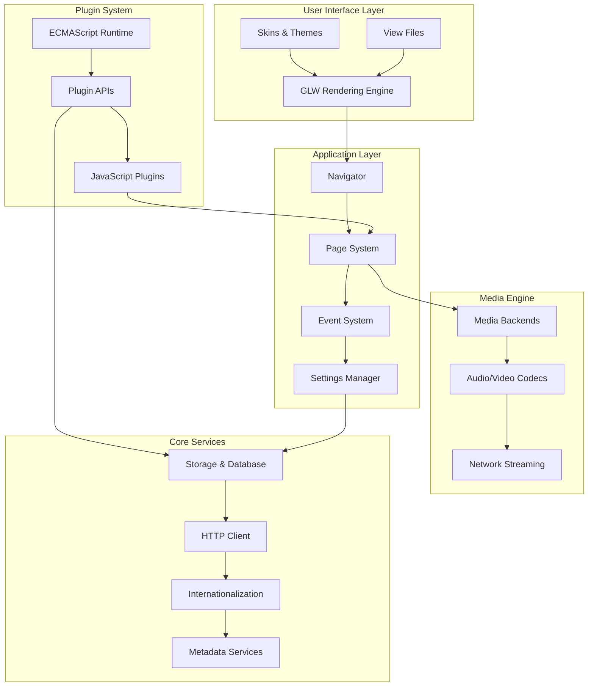

# Movian Media Player - Developer Documentation

[](https://doozer.io/user/andoma/movian)
[](https://www.gnu.org/licenses/gpl-3.0)

**Movian** is a cross-platform media player designed for home theater PCs, set-top boxes, and embedded devices. This comprehensive documentation provides everything developers need to understand, extend, and contribute to the Movian ecosystem.

## 🎯 What is Movian?

Movian is a powerful, extensible media player that combines:

- **Native Performance**: Written in C/C++ for optimal performance on resource-constrained devices
- **Plugin Architecture**: JavaScript-based plugin system for content providers and extensions  
- **Custom UI Engine**: GLW (OpenGL Widget) system for creating responsive, themeable inter[plugin system](reference/glossary.md#plugin-system)ss-Platform**: Runs on Linux, macOS, Windows, Android, PlayStati[GLW](reference/glossary.md#glw-opengl-widget)3,[OpenGL](reference/glossary.md#opengl)a[Widget](reference/glossary.md#widget)y Pi
- **Media Focus**: Optimized for video playback with support for numerous codecs and formats

### Target Audiences

This documentation serves four primary developer audiences:

| Audience | Primary Goals | Key Document[codecs](reference/glossary.md#codec)|
|----------|---------------|-------------------|
| **Plugin Developers** | Create content providers, scrapers, and extensions | [Plugin Development Guide](plugins/README.md) |
| **UI Designers** | Customize themes, skins, and user interfaces | [UI & Theming Guide](ui/README.md) |
| **Core Contributors** | Modify core functionality and add features | [Architecture Overview](architecture/overview.md) |
| **System Integrators** | Embed Movian in other applications | [Installation & Build Guide](installation/README.md) |

## 🏗️ Architecture Overview

Movian's architecture is built around several key subsystems that work together to provide a complete media experience:



### Core Components

- **GLW (OpenGL Widget) System**: Custom UI rendering engine for creating responsive interfaces
- **ECMAScript Runtime**: JavaScript execution environment for plugins with native API bindings
- **Navigator & Page System**: Application flow control and page lifecycle management
- **Media Pipeline**: Multi-format playbook with codec abstraction and streaming support
- **Plugin Architecture**: Sandboxed JavaScript environment for third-party extensions

## 📚 Documentation Structure

### Quick Start Guides
- [Installation Guide](installation/README.md) - Build and install Movian on your platform
- [Your First Plugin](plugins/getting-started.md) - Create a simple content provider plugin
- [Customizing the UI](ui/getting-started.md) - Modify themes and create custom skins

### Core Documentation

#### 🔧 [Installation & Build System](installation/)
Complete guides for building Movian from source on all supported platforms.

- **[Requirements](installation/requirements.md)** - System dependencies and prerequisites
- **[Linux Build Guide](installation/linux.md)** - Ubuntu, Debian, Fedora, and other distributions
- **[macOS Build Guide](installation/macos.md)** - Xcode setup and dependency management
- **[Windows Build Guide](installation/windows.md)** - MinGW and Visual Studio configurations
- **[Cross-Platform Builds](installation/cross-platform.md)** - Android, PS3, and Raspberry Pi
- **[Troubleshooting](installation/troubleshooting.md)** - Common build issues and solutions

#### 🏛️ [Architecture Documentation](architecture/)
Deep dive into Movian's internal design and component interactions.

- **[System Overview](architecture/overview.md)** - High-level architecture and design principles
- **[Application Lifecycle](architecture/lifecycle.md)** - Startup, initialization, and shutdown sequences
- **[Component Interaction](architecture/components.md)** - How major subsystems communicate
- **[Threading Model](architecture/threading.md)** - Concurrency patterns and synchronization
- **[Memory Management](architecture/memory.md)** - Resource allocation and cleanup strategies

#### 🔌 [Plugin Development](plugins/)
Complete guide to creating JavaScript plugins for Movian.

- **[Getting Started](plugins/getting-started.md)** - Your first plugin in 15 minutes
- **[Plugin Architecture](plugins/architecture.md)** - Lifecycle, manifest, and security model
- **[ECMAScript API Reference](plugins/api/)** - Complete JavaScript API documentation
  - [Core APIs](plugins/api/core-api.md) - Service registration and page management
  - [HTTP Client](plugins/api/http-api.md) - Network requests and content fetching
  - [Storage APIs](plugins/api/storage-api.md) - Persistent data and SQLite database
  - [Settings APIs](plugins/api/settings-api.md) - Plugin configuration and preferences
- **[Working Examples](plugins/examples/)** - Complete plugin implementations
  - [Hello World](plugins/examples/hello-world/) - Basic plugin structure
  - [Content Provider](plugins/examples/content-provider/) - Media source integration
  - [Search Plugin](plugins/examples/search-plugin/) - Search functionality
  - [Configurable Plugin](plugins/examples/configurable-plugin/) - Settings and preferences
  - [Advanced UI Plugin](plugins/examples/advanced-ui-plugin/) - Custom interface elements
- **[Best Practices](plugins/best-practices.md)** - Patterns, performance, and debugging

#### 🎨 [UI System & Theming](ui/)
Master Movian's GLW rendering engine and create custom interfaces.

- **[GLW Architecture](ui/glw-architecture.md)** - OpenGL Widget system internals
- **[View Files](ui/view-files/)** - XML-like UI definition language
  - [Syntax Reference](ui/view-files/syntax-reference.md) - Complete language specification
  - [Elements Reference](ui/view-files/elements-reference.md) - All available UI elements
  - [Attributes Reference](ui/view-files/attributes-reference.md) - Element properties and values
  - [Expression System](ui/view-files/expressions.md) - Dynamic values and data binding
- **[Source Code Analysis](ui/source-analysis/)** - Deep dive into GLW implementation
  - [Parser Analysis](ui/source-analysis/glw_view_parser.c.md) - Element and attribute parsing
  - [Lexer Analysis](ui/source-analysis/glw_view_lexer.c.md) - Token definitions and syntax
  - [Evaluator Analysis](ui/source-analysis/glw_view_eval.c.md) - Expression evaluation engine
- **[Theming System](ui/theming/)** - Create and customize skins
  - [Skin Structure](ui/theming/skin-structure.md) - Directory organization and file relationships
  - [Creating Skins](ui/theming/creating-skins.md) - Complete skin development workflow
  - [Theme Variables](ui/theming/theme-variables.md) - Customization and device adaptation
- **[Widget Reference](ui/widgets/)** - Available UI components
  - [Containers](ui/widgets/container.md) - Layout and positioning widgets
  - [Text Elements](ui/widgets/text.md) - Typography and text rendering
  - [Images](ui/widgets/image.md) - Image display and manipulation
  - [Lists & Grids](ui/widgets/list.md) - Data presentation widgets

#### 🎬 [Media System](media/)
Understanding Movian's media playback pipeline and backend architecture.

- **[Pipeline Architecture](media/pipeline-architecture.md)** - Media processing flow
- **[Codec Support](media/codecs.md)** - Audio and video format handling
- **[Streaming Protocols](media/streaming.md)** - Network media sources
- **[Subtitle System](media/subtitles.md)** - Text overlay and synchronization

### Reference Documentation

#### 📖 [Complete API Reference](reference/)
Comprehensive reference materials for quick lookup.

- **[API Index](reference/api-index.md)** - All JavaScript APIs with signatures
- **[Element Index](reference/element-index.md)** - All view file elements
- **[Attribute Index](reference/attribute-index.md)** - All element attributes
- **[Glossary](reference/glossary.md)** - Technical terms and definitions
- **[FAQ](reference/faq.md)** - Frequently asked questions
- **[Troubleshooting](reference/troubleshooting.md)** - Common issues and solutions

#### 🛠️ [Developer Tools](guides/)
Practical guides for development workflows.

- **[Development Setup](guides/development-setup.md)** - IDE configuration and debugging tools
- **[Plugin Debugging](guides/debugging-plugins.md)** - JavaScript debugging techniques
- **[UI Debugging](guides/debugging-view-files.md)** - Layout and rendering troubleshooting
- **[Performance Optimization](guides/performance-optimization.md)** - Profiling and optimization strategies

## 🚀 Quick Start

### For Plugin Developers
```bash
# 1. Clone and build Movian
git clone https://github.com/andoma/movian.git
cd movian
./configure
make

# 2. Create your first plugin
mkdir my-plugin
cd my-plugin
# Follow the plugin guide: plugins/getting-started.md
```

### For UI Designers
```bash
# 1. Examine existing skins
cd movian/glwskins/flat
# Study the view files and theme structure

# 2. Create custom theme
# Follow the theming guide: ui/theming/creating-skins.md
```

### For Core Contributors
```bash
# 1. Set up development environment
# Follow: guides/development-setup.md

# 2. Understand the architecture
# Read: architecture/overview.md
```

## 🤝 Contributing

We welcome contributions to both Movian and its documentation!

### Documentation Contributions
- **Found an error?** Open an issue or submit a pull request
- **Missing information?** Help us fill the gaps
- **Better examples?** Share your working code

### Code Contributions
- **Plugin development** - Create and share useful plugins
- **Core improvements** - Bug fixes and feature enhancements
- **Platform support** - Help with new platform ports

See our [Contributing Guide](CONTRIBUTING.md) for detailed information.

## 📄 License

Movian is licensed under the GNU General Public License v3.0. See the LICENSE file in the Movian source repository for details.

This documentation is licensed under [Creative Commons Attribution 4.0 International](https://creativecommons.org/licenses/by/4.0/).

## 🔗 Links

- **Official Website**: [https://movian.tv/](https://movian.tv/)
- **Source Code**: [https://github.com/andoma/movian](https://github.com/andoma/movian)
- **Issue Tracker**: [https://github.com/andoma/movian/issues](https://github.com/andoma/movian/issues)
- **Community Forum**: [Movian Community](https://movian.tv/forum)

---

**Documentation Version**: 1.0.0  
**Last Updated**: November 2025  
**Movian Version Compatibility**: 4.8+  
**Accuracy Status**: 🟢 Verified from source code analysis

*This documentation is actively maintained and updated with each Movian release. For the most current information, always refer to the latest version.*