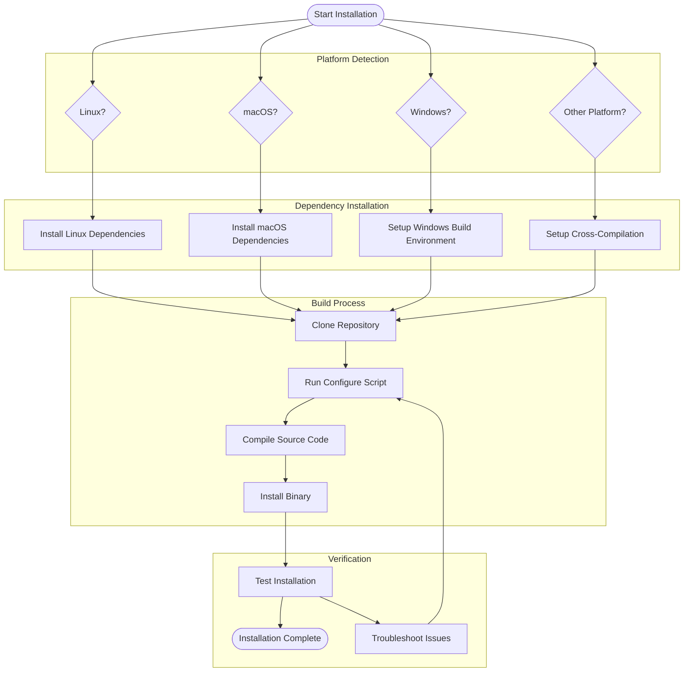

# Movian Installation Guide

This directory contains comprehensive installation instructions for building and installing Movian on all supported platforms.

## Quick Platform Selection

| Platform | Guide | Difficulty | Build Time |
|----------|-------|------------|------------|
| **Ubuntu/Debian** | [Linux Guide](linux.md) | Easy | 15-30 min |
| **Fedora/CentOS** | [Linux Guide](linux.md) | Easy | 15-30 min |
| **macOS** | [macOS Guide](macos.md) | Medium | 20-40 min |
| **Windows** | [Windows Guide](windows.md) | Hard | 30-60 min |
| **Android** | [Cross-Platform Guide](cross-platform.md) | Hard | 45-90 min |
| **Raspberry Pi** | [Cross-Platform Guide](cross-platform.md) | Medium | 30-60 min |
| **PlayStation 3** | [Cross-Platform Guide](cross-platform.md) | Hard | 60+ min |

## Prerequisites

Before starting, ensure you have:

- **Git** - For cloning the repository
- **Build tools** - Platform-specific compilers and build systems
- **Dependencies** - Required libraries (see platform guides)
- **Disk space** - At least 2GB free space for build
- **Internet connection** - For downloading dependencies

## Installation Overview



## Quick Start (Ubuntu/Debian)

For the impatient, here's a one-liner for Ubuntu/Debian systems:

```bash
# Install dependencies, clone, build, and install
sudo apt-get update && \
sudo apt-get install -y git build-essential libfreetype6-dev libfontconfig1-dev \
    libxext-dev libgl1-mesa-dev libasound2-dev libgtk2.0-dev libxss-dev \
    libxxf86vm-dev libxv-dev libvdpau-dev yasm libpulse-dev libssl-dev \
    curl libwebkitgtk-dev libsqlite3-dev libavahi-client-dev && \
git clone https://github.com/andoma/movian.git && \
cd movian && \
./configure && \
make -j$(nproc) && \
sudo make install
```

## Platform-Specific Guides

### [Linux Installation](linux.md)
Complete guide for Linux distributions including:
- Ubuntu/Debian package installation
- Fedora/CentOS/RHEL setup
- Arch Linux installation
- Generic Linux from source
- Development environment setup

### [macOS Installation](macos.md)
Comprehensive macOS build guide covering:
- Xcode and command line tools setup
- Homebrew dependency management
- Native compilation and app bundle creation
- Code signing and distribution

### [Windows Installation](windows.md)
Windows build instructions for:
- MinGW-w64 cross-compilation
- Visual Studio native compilation
- MSYS2 development environment
- Dependency management with vcpkg

### [Cross-Platform Builds](cross-platform.md)
Advanced cross-compilation for:
- Android devices and Android TV
- Raspberry Pi and ARM boards
- PlayStation 3 homebrew
- iOS devices (experimental)

## Build System Documentation

For detailed information about Movian's build system:
- [Build System Overview](build-system.md) - Architecture and configuration
- [Dependencies Reference](dependencies.md) - Complete library requirements
- [Troubleshooting Guide](troubleshooting.md) - Common issues and solutions

## Development Environment Setup

### Recommended IDEs

| IDE | Platform | Setup Guide |
|-----|----------|-------------|
| **Visual Studio Code** | All | [VSCode Setup](development-setup.md#vscode) |
| **CLion** | All | [CLion Setup](development-setup.md#clion) |
| **Xcode** | macOS | [Xcode Setup](development-setup.md#xcode) |
| **Code::Blocks** | Linux/Windows | [Code::Blocks Setup](development-setup.md#codeblocks) |

### Debugging Tools

- **GDB** - GNU Debugger for Linux/macOS
- **LLDB** - LLVM Debugger for macOS/iOS
- **Valgrind** - Memory debugging on Linux
- **AddressSanitizer** - Memory error detection
- **Movian Debug Mode** - Built-in debugging features

## Common Issues

### Build Failures
- **Missing dependencies** → Check platform-specific dependency lists
- **Compiler errors** → Verify compiler version and flags
- **Linker errors** → Check library paths and versions

### Runtime Issues
- **Segmentation faults** → Build with debug symbols and use debugger
- **Missing libraries** → Check LD_LIBRARY_PATH or install missing packages
- **Permission errors** → Verify file permissions and user privileges

### Performance Issues
- **Slow startup** → Check plugin loading and disable unnecessary features
- **High CPU usage** → Profile with system tools and optimize build flags
- **Memory leaks** → Use Valgrind or AddressSanitizer for detection

## Getting Help

### Documentation
- [FAQ](../reference/faq.md) - Frequently asked questions
- [Troubleshooting](troubleshooting.md) - Detailed problem solving
- [API Reference](../reference/api-index.md) - Complete API documentation

### Community Support
- **GitHub Issues** - [Report bugs and request features](https://github.com/andoma/movian/issues)
- **Community Forum** - [Get help from other users](https://movian.tv/forum)
- **IRC Channel** - #movian on Freenode

### Contributing
- [Contributing Guide](../CONTRIBUTING.md) - How to contribute to Movian
- [Development Workflow](development-setup.md) - Setting up for development
- [Plugin Development](../plugins/getting-started.md) - Creating plugins

---

**Next Steps:**
1. Choose your platform from the guides above
2. Follow the step-by-step instructions
3. Test your installation with a simple media file
4. Explore [plugin development](../plugins/getting-started.md) or [UI customization](../ui/getting-started.md)

**Need Help?** Check the [troubleshooting guide](troubleshooting.md) or ask for help in the community forum.