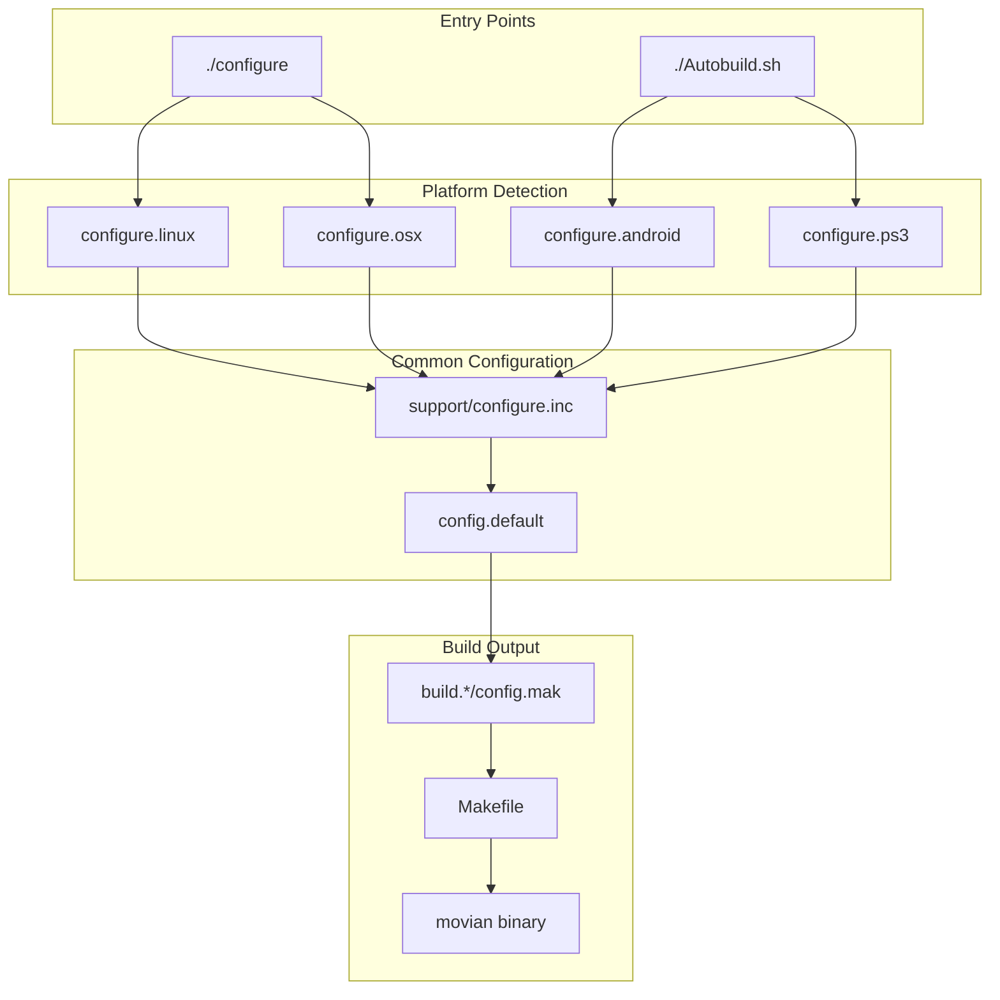

# Movian Build System Documentation

## Overview

Movian uses a custom configure-based build system that supports multiple platforms and architectures. The build system is designed to handle cross-compilation, dependency detection, and platform-specific optimizations.

## Build System Architecture



## Core Build Files

### Main Configuration Scripts

| File | Purpose | Platform |
|------|---------|----------|
| `configure` | Main entry point, detects platform | Linux, macOS |
| `configure.linux` | Linux-specific configuration | Linux |
| `configure.osx` | macOS-specific configuration | macOS |
| `configure.android` | Android cross-compilation | Android |
| `configure.ps3` | PlayStation 3 configuration | PS3 |
| `configure.rpi` | Raspberry Pi configuration | Raspberry Pi |

### Build Support Files

| File | Purpose |
|------|---------|
| `support/configure.inc` | Common configuration functions and feature definitions |
| `config.default` | Default build configuration values |
| `Makefile` | Main build rules and targets |
| `Autobuild.sh` | Automated build script for CI/CD |

### Platform-Specific Autobuild Scripts

| Script | Target Platform | Description |
|--------|----------------|-------------|
| `Autobuild/android.sh` | Android | Cross-compilation for Android devices |
| `Autobuild/debian.sh` | Debian Linux | Debian package building |
| `Autobuild/ios.sh` | iOS | Cross-compilation for iOS devices |
| `Autobuild/osx.sh` | macOS | macOS application bundle creation |
| `Autobuild/ps3.sh` | PlayStation 3 | PS3 homebrew compilation |
| `Autobuild/rpi.sh` | Raspberry Pi | ARM cross-compilation for RPi |

## System Dependencies

### Core Dependencies (All Platforms)

| Library | Purpose | Required | Notes |
|---------|---------|----------|-------|
| **libfreetype** | Font rendering | Yes | TrueType font support |
| **libfontconfig** | Font configuration | Yes | Font discovery and matching |
| **zlib** | Compression | Yes | Data compression support |
| **libpthread** | Threading | Yes | POSIX thread support |
| **OpenSSL/PolarSSL** | Cryptography | Yes | HTTPS and encryption |
| **SQLite** | Database | Yes | Settings and metadata storage |

### Media Dependencies

| Library | Purpose | Required | Notes |
|---------|---------|----------|-------|
| **FFmpeg/libav** | Media codecs | Yes | Audio/video decoding |
| **libpulse** | Audio output | Linux | PulseAudio support |
| **libasound** | Audio output | Linux | ALSA support |
| **CoreAudio** | Audio output | macOS | Native macOS audio |

### UI Dependencies

| Library | Purpose | Required | Notes |
|---------|---------|----------|-------|
| **OpenGL** | Graphics rendering | Yes | GLW rendering backend |
| **libX11** | Window system | Linux | X11 window management |
| **libXext** | X11 extensions | Linux | Extended X11 functionality |
| **libXv** | Video output | Linux | X11 video acceleration |
| **libXss** | Screen saver | Linux | Screen saver integration |
| **VDPAU** | Video acceleration | Linux | NVIDIA video acceleration |

### Network Dependencies

| Library | Purpose | Required | Notes |
|---------|---------|----------|-------|
| **libcurl** | HTTP client | Optional | Alternative HTTP implementation |
| **librtmp** | RTMP streaming | Optional | Real-time streaming protocol |
| **Avahi** | Service discovery | Optional | Bonjour/Zeroconf support |

### Optional Dependencies

| Library | Purpose | Platform | Notes |
|---------|---------|----------|-------|
| **libwebkit** | Web rendering | Linux | HTML content display |
| **libcec** | HDMI-CEC | Linux | TV remote control |
| **lirc** | IR remote | Linux | Infrared remote support |
| **libntfs** | NTFS support | Linux | NTFS filesystem access |

## Build Configuration Options

### Common Configure Options

```bash
# Basic configuration
./configure --help                    # Show all options
./configure --release                 # Release build (optimized)
./configure --debug                   # Debug build (symbols)

# Installation paths
./configure --prefix=/usr/local       # Installation prefix
./configure --bindir=/usr/local/bin   # Binary installation directory
./configure --datadir=/usr/share      # Data files directory

# Compiler options
./configure --cc=gcc-9                # Specify compiler
./configure --cxx=g++-9               # Specify C++ compiler
./configure --optlevel=3              # Optimization level (0-3)

# Feature control
./configure --disable-webkit          # Disable WebKit support
./configure --disable-vdpau           # Disable VDPAU acceleration
./configure --enable-bughunt          # Enable debugging features
```

### Platform-Specific Options

#### Linux Options
```bash
./configure --glw-frontend=x11        # Use X11 frontend (default)
./configure --glw-frontend=none       # Disable GLW (headless)
./configure --pkg-config-path=PATH    # Additional pkg-config paths
```

#### macOS Options
```bash
./configure --arch=x86_64             # Target architecture
./configure --macosx-sdk=PATH         # macOS SDK path
./configure --release                 # Stage for release (app bundle)
```

#### Cross-Compilation Options
```bash
# Android
./Autobuild.sh -t android -v 5.0.500

# Raspberry Pi
./Autobuild.sh -t rpi -v 5.0.500

# PlayStation 3
./Autobuild.sh -t ps3 -v 5.0.500
```

## Feature Configuration System

### Feature Flags

The build system uses a comprehensive feature flag system defined in `support/configure.inc`:

```bash
# Core features (always enabled)
enable libpthread
enable zlib
enable libfreetype
enable libfontconfig

# Platform-specific features
if [ "$PLATFORM" = "linux" ]; then
    enable libpulse
    enable lirc
    enable vdpau
fi

if [ "$PLATFORM" = "osx" ]; then
    enable coreaudio
    enable bonjour
    enable spotlight
fi
```

### Available Features

| Feature | Description | Default |
|---------|-------------|---------|
| `glw` | OpenGL Widget UI system | Enabled |
| `plugins` | JavaScript plugin support | Enabled |
| `httpserver` | Built-in HTTP server | Enabled |
| `dvd` | DVD playback support | Enabled |
| `bittorrent` | BitTorrent support | Optional |
| `airplay` | AirPlay streaming | Optional |
| `webpopup` | Web popup windows | Optional |

## Build Targets and Output

### Standard Build Targets

```bash
make                    # Build main binary
make clean             # Clean build files
make distclean         # Clean all generated files
make install           # Install to system (requires root)
```

### Platform-Specific Targets

#### Linux
```bash
make                   # Creates build.linux/movian
make install          # Installs to /usr/local/bin/movian
```

#### macOS
```bash
make                   # Creates build.osx/Movian.app
make dist             # Creates distributable DMG file
```

#### Cross-Platform
```bash
./Autobuild.sh -t rpi  # Creates build.rpi/showtime.sqfs
./Autobuild.sh -t ps3  # Creates PS3 homebrew package
```

### Build Directory Structure

```
build.{platform}/
├── config.mak              # Generated build configuration
├── movian                  # Main executable (Linux)
├── Movian.app/             # Application bundle (macOS)
│   ├── Contents/
│   │   ├── Info.plist
│   │   ├── MacOS/movian
│   │   └── Resources/
├── libmovian.a            # Static library (if built)
└── [object files]         # Compiled object files
```

## Dependency Detection

### Automatic Detection

The configure scripts automatically detect available libraries using several methods:

1. **pkg-config**: Primary method for library detection
2. **Header checks**: Compile tests for header availability
3. **Library linking**: Link tests for library availability
4. **Feature probing**: Runtime capability detection

### Manual Override

You can manually specify library locations:

```bash
# PKG_CONFIG_PATH for non-standard locations
export PKG_CONFIG_PATH="/usr/local/lib/pkgconfig:$PKG_CONFIG_PATH"

# Direct compiler flags
./configure --extra-cflags="-I/opt/include" --extra-ldflags="-L/opt/lib"

# Disable problematic dependencies
./configure --disable-webkit --disable-vdpau
```

## Version Requirements

### Minimum Versions

| Component | Minimum Version | Notes |
|-----------|----------------|-------|
| **GCC** | 4.8+ | C99 and C++11 support required |
| **Clang** | 3.4+ | Alternative to GCC |
| **Make** | 3.81+ | GNU Make required |
| **pkg-config** | 0.25+ | Library detection |
| **Python** | 2.7+ or 3.x | Build script support |

### Library Versions

| Library | Minimum Version |[glw](../reference/glossary.md#glw-opengl-widget)commended |
|---------|----------------|-------------|
| **FFmpeg** | 2.8+ | 4.0+ |
| **OpenSSL** | 1.0.2+ | 1.1.1+ |
| **FreeType** | 2.4+ | 2.10+ |
| **FontConfig** | 2.8+ | 2.13+ |
| **PulseAudio** | 4.0+ | 12.0+ |

## Troubleshooting Build Issues

### Common Configuration Problems

#### Missing Dependencies
```bash
# Error: Package 'freetype2' not found
sudo apt-get install libfreetype6-dev

# Error: Package 'fontconfig' not found  
sudo apt-get install libfontconfig1-dev

# Error: OpenGL headers not found
sudo apt-get install libgl1-mesa-dev
```

#### Compiler Issues
```bash
# Use specific compiler version
./configure --cc=gcc-8 --cxx=g++-8

# Add debugging symbols
./configure --optlevel=g --enable-bughunt

# Disable problematic optimizations
./configure --extra-cflags="-fno-omit-frame-pointer"
```

#### Cross-Compilation Issues
```bash
# Ensure toolchain is in PATH
export PATH="/opt/cross-compiler/bin:$PATH"

# Specify target architecture
./configure --arch=arm --cpu=cortex-a7

# Use system root for libraries
./configure --sysroot=/opt/cross-sysroot
```

### Build Verification

After successful configuration, verify the build setup:

```bash
# Check generated configuration
cat build.linux/config.mak

# Verify enabled features
grep "^CONFIG_" build.linux/config.mak

# Test compilation
make -j4

# Verify binary
file build.linux/movian
ldd build.linux/movian  # Check library dependencies
```

## Advanced Build Scenarios

### Development Builds

For active development with debugging support:

```bash
./configure \
    --enable-bughunt \
    --optlevel=g \
    --extra-cflags="-fsanitize=address -fno-omit-frame-pointer" \
    --extra-ldflags="-fsanitize=address"
```

### Minimal Builds

For embedded systems with limited resources:

```bash
./configure \
    --disable-webkit \
    --disable-bittorrent \
    --disable-airplay \
    --disable-httpserver \
    --glw-frontend=none
```

### Static Builds

For distribution without external dependencies:

```bash
./configure \
    --enable-static \
    --disable-shared \
    --extra-ldflags="-static"
```

## Integration with IDEs

### Code::Blocks
1. Import Makefile project
2. Set build directory to `build.linux/`
3. Configure custom build commands

### CLion
1. Open as Makefile project
2. Configure toolchain in settings
3. Set working directory to project root

### Visual Studio Code
1. Install C/C++ extension
2. Configure `c_cpp_properties.json` with include paths
3. Set up build tasks in `tasks.json`

---

**Source References:**
- `configure` - Main configuration entry point
- `support/configure.inc` - Common configuration functions  
- `Makefile` - Build rules and targets
- `Autobuild/` - Platform-specific build scripts

**Accuracy Status:** 🟢 Verified from source code analysis  
**Last Updated:** November 2025  
**Movian Version:** 4.8+