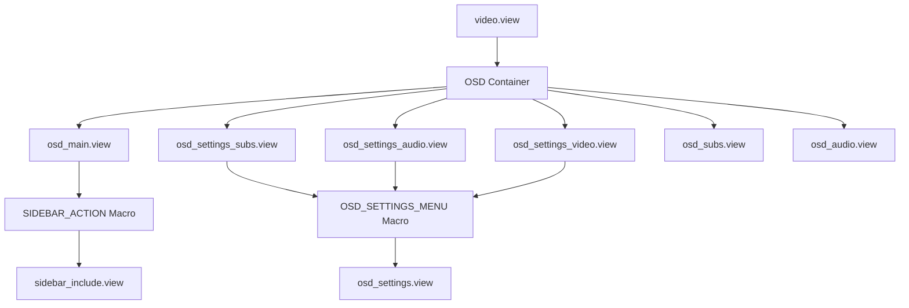
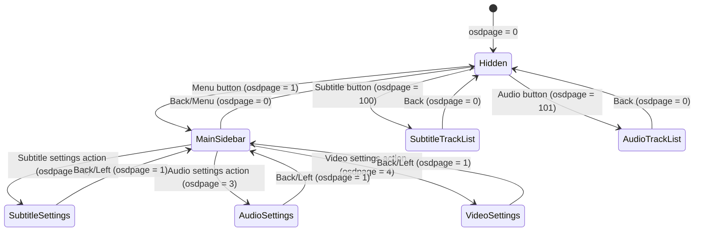

# OSD (On-Screen Display) System

## Overview

The OSD (On-Screen Display) system in Movian provides an interactive overlay interface for controlling media playback and adjusting settings during video playback. The OSD appears when the user presses the menu button during video playback and provides access to subtitle settings, audio track selection, and video configuration options.

## Architecture

### OSD Component Structure

The OSD system is built from multiple view files that work together to create a cohesive user interface:



### OSD View Files

The OSD system consists of 6 main view files located in `glwskins/flat/osd/`:

1. **`osd_main.view`** - Main OSD sidebar with navigation actions
2. **`osd_audio.view`** - Audio track selection interface
3. **`osd_subs.view`** - Subtitle track selection interface
4. **`osd_settings.view`** - Reusable settings menu template (macro definition)
5. **`osd_settings_audio.view`** - Audio settings configuration
6. **`osd_settings_subs.view`** - Subtitle settings configuration
7. **`osd_settings_video.view`** - Video settings configuration

## OSD Page Management System

### Page State Variable

The OSD uses a page management system controlled by the `$clone.osdpage` variable:

```view
$clone.osdpage = 0;  // OSD hidden
$clone.osdpage = 1;  // Main OSD sidebar visible
$clone.osdpage = 2;  // Subtitle settings
$clone.osdpage = 3;  // Audio settings
$clone.osdpage = 4;  // Video settings
$clone.osdpage = 100; // Subtitle track selection
$clone.osdpage = 101; // Audio track selection
```

### Page Navigation Flow



## OSD Main Sidebar

### Structure

The main OSD sidebar (`osd_main.view`) provides the primary navigation interface:

```view
widget(container_y, {
  width: 22em;
  id: "osd_main";
  padding: [0, 3em, 0, 0];

  widget(list_y, {
    id: "sidebar";
    navWrap: true;

    SIDEBAR_ACTION(_("Subtitle settings"),
                   "skin://icons/ic_subtitles_48px.svg",
                   {
                     $clone.osdpage = 2;
                     focus("osd_settings_subs");
                   });

    SIDEBAR_ACTION(_("Audio settings"),
                   "skin://icons/ic_speaker_48px.svg",
                   {
                     $clone.osdpage = 3;
                     focus("osd_settings_audio");
                   });

    SIDEBAR_ACTION(_("Video settings"),
                   "skin://icons/ic_videocam_48px.svg",
                   {
                     $clone.osdpage = 4;
                     focus("osd_settings_video");
                   });

    // Additional common sidebar actions imported
    #import "skin://menu/sidebar_common.view"
  });
});
```

### SIDEBAR_ACTION Macro

The `SIDEBAR_ACTION` macro (defined in `menu/sidebar_include.view`) creates clickable navigation items:

```view
#define SIDEBAR_ACTION(CAPTION, ICON, EVENT, HIDDEN=false) {
  widget(container_z, {
    hidden: HIDDEN;
    height: 2em;
    ListItemBevel();
    ListItemHighlight();
    focusable: true;
    onEvent(activate, EVENT);

    widget(container_x, {
      style: "ListItem";

      widget(icon, {
        style: "ListItemIcon";
        source: ICON;
      });

      widget(label, {
        filterConstraintX: true;
        caption: CAPTION;
        style: "ActionLabel";
      });
    });
  });
}
```

**Parameters:**
- `CAPTION` - Display text for the action
- `ICON` - Path to icon SVG file
- `EVENT` - Action to execute on activation (typically sets `$clone.osdpage` and calls `focus()`)
- `HIDDEN` - Optional visibility control (default: false)

## Focus Management System

### Focus Control Function

The OSD system uses the `focus()` function to manage keyboard/controller navigation:

```view
focus("target_id");  // Moves focus to widget with specified id
```

### Focus Flow Examples

**Opening Subtitle Settings:**
```view
SIDEBAR_ACTION(_("Subtitle settings"),
               "skin://icons/ic_subtitles_48px.svg",
               {
                 $clone.osdpage = 2;           // Switch to subtitle settings page
                 focus("osd_settings_subs");   // Move focus to settings list
               });
```

**Returning to Main Sidebar:**
```view
onEvent(back, {
  $clone.osdpage = 1;      // Return to main sidebar
  focus("osd_main");       // Focus the sidebar
});
```

**Returning from Settings to Sidebar:**
```view
onEvent(back, {
  $clone.osdpage = 0;        // Hide OSD
  focus("audio-btn");        // Focus the audio button in playdeck
}, $clone.osdpage);
```

## Track Selection Interfaces

### Audio Track Selection (osd_audio.view)

Displays available audio tracks with selection indicators:

```view
widget(container_y, {
  id: "osd_audio";

  widget(label, {
    style: "osdsettingtitle";
    height: 3em;
    align: center;
    caption: _("Audio");
    size: 1.5em;
  });

  onEvent(back, {
    $clone.osdpage = 0;
    focus("audio-btn");
  }, $clone.osdpage);

  widget(container_x, {
    widget(list_y, {
      id: "list";

      cloner($self.media.audio.sorted, container_z, {
        height: 1.5em;
        focusable: true;
        ListItemHighlight();
        ListItemBevel();
        onEvent(activate, deliverEvent($parent.control,
                                       selectAudioTrack($self.url)));

        widget(container_x, {
          padding: [0.5em, 0];

          // Manual selection indicator (favorite icon)
          widget(icon, {
            source: "skin://icons/ic_favorite_48px.svg";
            alpha: iir($self.url == $parent.media.audio.current &&
                       $parent.media.audio.manual, 4);
            style: "NavSelectedText";
          });

          // Current track indicator (check icon)
          widget(icon, {
            source: "skin://icons/ic_check_48px.svg";
            alpha: iir($self.url == $parent.media.audio.current, 4);
            style: "NavSelectedText";
          });

          // Track information
          widget(label, {
            filterConstraintX: true;
            weight: 2;
            caption: $self.title;
            style: "NavSelectedText";
          });

          widget(label, {
            filterConstraintX: true;
            weight: 1;
            caption: $self.language;
            style: "NavSelectedText";
          });

          widget(label, {
            filterConstraintX: true;
            weight: 0.5;
            caption: $self.format;
            style: "NavSelectedText";
          });
        });
      });
    });
    
    // Scrollbar
    widget(slider_y, {
      bind("list");
      width: 4;
      focusable: canScroll();
      alpha: iir(canScroll(), 16);
      widget(quad, {
        alpha: 1;
      });
    });
  });
});
```

**Key Features:**
- **Track Cloning**: Uses `cloner($self.media.audio.sorted, ...)` to iterate over available audio tracks
- **Selection Indicators**: 
  - Favorite icon for manually selected tracks
  - Check icon for currently active track
- **Track Information**: Displays title, language, and format
- **Track Selection**: `deliverEvent($parent.control, selectAudioTrack($self.url))`

### Subtitle Track Selection (osd_subs.view)

Similar structure to audio track selection with subtitle-specific data:

```view
cloner($self.media.subtitle.sorted, container_z, {
  height: 2.5em;
  ListItemHighlight();
  ListItemBevel();
  focusable: true;
  onEvent(activate, deliverEvent($parent.control,
                                 selectSubtitleTrack($self.url)));

  widget(container_x, {
    padding: [0.5em, 0];

    // Selection indicators (same as audio)
    widget(icon, {
      source: "skin://icons/ic_favorite_48px.svg";
      alpha: iir($self.url == $parent.media.subtitle.current &&
                 $parent.media.subtitle.manual, 4);
      style: "NavSelectedText";
    });

    widget(icon, {
      source: "skin://icons/ic_check_48px.svg";
      alpha: iir($self.url == $parent.media.subtitle.current, 4);
      style: "NavSelectedText";
    });

    // Subtitle information (two rows)
    widget(container_y, {
      padding: [0.5em, 0, 0, 0];
      align: center;

      widget(container_x, {
        widget(label, {
          filterConstraintX: true;
          caption: $self.title;
          style: "NavSelectedTextSecondary";
        });

        widget(label, {
          filterConstraintX: true;
          caption: $self.longformat;
          style: "NavSelectedTextSecondary";
        });
      });
      
      widget(container_x, {
        widget(label, {
          filterConstraintX: true;
          caption: $self.language;
          style: "NavSelectedTextSecondary";
        });

        widget(label, {
          filterConstraintX: true;
          caption: $self.source;
          style: "NavSelectedTextSecondary";
        });
      });
    });
  });
});
```

## Settings Configuration Interfaces

### OSD_SETTINGS_MENU Macro

The `OSD_SETTINGS_MENU` macro (defined in `osd_settings.view`) provides a reusable template for settings pages:

```view
#define OSD_SETTINGS_MENU(NODES, TITLE, ID) {
  widget(container_y, {
    id: ID;

    widget(label, {
      style: "osdsettingtitle";
      height: 3em;
      align: center;
      caption: TITLE;
      size: 1.5em;
    });

    onEvent(back, {
      $clone.osdpage = 1;
      focus("osd_main");
    });

    onEvent(left, {
      $clone.osdpage = 1;
      focus("osd_main");
    });

    widget(container_x, {
      widget(list_y, {
        navWrap: true;
        id: "list";

        cloner(NODES, loader, {
          hidden: !$self.enabled;
          source: "skin://items/list/" + $self.type + ".view";
          time: 0.3;
          noInitialTransform: true;
        });
      });
      
      widget(slider_y, {
        bind("list");
        width: 4;
        focusable: canScroll();
        alpha: iir(canScroll(), 16);
        widget(quad, {
          alpha: 1;
        });
      });
    });
  });
}
```

**Parameters:**
- `NODES` - Data source for settings items (e.g., `$self.media.audio.settings.nodes`)
- `TITLE` - Page title
- `ID` - Widget identifier for focus management

### Settings Page Implementations

**Subtitle Settings:**
```view
#import "osd_settings.view"

OSD_SETTINGS_MENU($self.media.subtitle.settings.nodes, 
                  _("Subtitle settings"),
                  "osd_settings_subs");
```

**Audio Settings:**
```view
#import "osd_settings.view"

OSD_SETTINGS_MENU($self.media.audio.settings.nodes, 
                  _("Audio settings"),
                  "osd_settings_audio");
```

**Video Settings:**
```view
#import "osd_settings.view"

OSD_SETTINGS_MENU($self.media.video.settings.nodes, 
                  _("Video settings"),
                  "osd_settings_video");
```

## OSD Integration in Video Playback

### OSD Container in video.view

The OSD is integrated into the video playback page through a layered container system:

```view
widget(container_y, {
  hidden: !$clone.showPlaydeck;

  widget(container_x, {
    filterConstraintY: true;

    widget(dummy, {
      // Clickable zone that closes everything
      clickable: true;
      onEvent(activate, {
        $clone.osdpage = 0;
        $clone.showPlaydeck = 0;
      });
    });

    widget(displacement, {
      hidden: iir($clone.osdpage > 0, 3) < 0.01;
      width: 22em;
      scaling: [1.2 - iir($clone.osdpage > 0, 3) * 0.2,
                1.2 - iir($clone.osdpage > 0, 3) * 0.2,
                1];

      widget(container_z, {
        onEvent(left, {
          $clone.osdpage = 0;
        }, true, false);

        widget(quad, {
          color: 0;
          alpha: iir($clone.osdpage > 0, 4) * 0.8;
        });
        
        widget(layer, {
          // Main OSD sidebar
          widget(loader, {
            autohide: true;
            alpha: iir($clone.osdpage == 1, 4);
            source: select($clone.osdpage, "skin://osd/osd_main.view", "");
          });

          // Settings and track selection pages
          widget(loader, {
            autohide: true;
            source: translate($clone.osdpage, "",
                              2, "skin://osd/osd_settings_subs.view",
                              3, "skin://osd/osd_settings_audio.view",
                              4, "skin://osd/osd_settings_video.view",
                              100, "skin://osd/osd_subs.view",
                              101, "skin://osd/osd_audio.view"
                             );
          });
        });
      });
    });
  });
  
  // OSD buttons row (playdeck controls)
  // ... (see audio-video-ui.md for details)
});
```

### OSD Visibility Control

**Show/Hide Logic:**
```view
$clone.osdpage = 0;  // Initialize OSD as hidden
$clone.showPlaydeck = 0;  // Initialize playdeck as hidden

// Menu button toggles OSD
onEvent(menu, {
  $clone.osdpage = 1;
  $clone.showPlaydeck = 1;
  focus("osd_main");
}, !$clone.osdpage);

onEvent(menu, {
  $clone.osdpage = 0;
  $clone.showPlaydeck = 0;
}, $clone.osdpage);

// Back button closes OSD
onEvent(back, {
  $clone.showPlaydeck = 0;
}, $clone.showPlaydeck && !$clone.osdpage);

onEvent(back, {
  $clone.osdpage = 0;
}, $clone.osdpage);
```

### Auto-Hide Behavior

The OSD automatically hides after inactivity:

```view
onInactivity(select($clone.showPlaydeck && $clone.osdpage == 0, 5, 0), {
  $clone.showPlaydeck = 0;
});
```

- When playdeck is visible but no OSD page is open, hide after 5 seconds of inactivity
- When OSD pages are open, auto-hide is disabled (timeout = 0)

## Visual Effects and Animations

### Smooth Transitions

The OSD uses `iir()` (Infinite Impulse Response) for smooth animations:

```view
// Fade in/out
alpha: iir($clone.osdpage == 1, 4);

// Scaling animation
scaling: [1.2 - iir($clone.osdpage > 0, 3) * 0.2,
          1.2 - iir($clone.osdpage > 0, 3) * 0.2,
          1];

// Background opacity
alpha: iir($clone.osdpage > 0, 4) * 0.8;
```

### Selection Indicators

Track selection uses animated alpha values:

```view
// Current track indicator
alpha: iir($self.url == $parent.media.audio.current, 4);

// Manual selection indicator
alpha: iir($self.url == $parent.media.audio.current &&
           $parent.media.audio.manual, 4);
```

## Media System Integration

### Media Data Sources

The OSD accesses media information through the `$self.media` property tree:

**Audio Tracks:**
```view
$self.media.audio.sorted          // List of available audio tracks
$self.media.audio.current         // Currently active audio track URL
$self.media.audio.manual          // Whether track was manually selected
$self.media.audio.settings.nodes  // Audio configuration settings
```

**Subtitle Tracks:**
```view
$self.media.subtitle.sorted          // List of available subtitle tracks
$self.media.subtitle.current         // Currently active subtitle track URL
$self.media.subtitle.manual          // Whether track was manually selected
$self.media.subtitle.settings.nodes  // Subtitle configuration settings
```

**Video Settings:**
```view
$self.media.video.settings.nodes  // Video configuration settings
```

### Track Selection Events

**Selecting Audio Track:**
```view
onEvent(activate, deliverEvent($parent.control,
                               selectAudioTrack($self.url)));
```

**Selecting Subtitle Track:**
```view
onEvent(activate, deliverEvent($parent.control,
                               selectSubtitleTrack($self.url)));
```

## Best Practices

### Creating Custom OSD Pages

1. **Use the OSD_SETTINGS_MENU macro** for consistent settings pages
2. **Implement proper focus management** with `focus()` calls
3. **Handle back navigation** to return to appropriate pages
4. **Use smooth animations** with `iir()` for professional appearance
5. **Provide visual feedback** for current selections

### Focus Management Guidelines

1. **Always set focus** when changing pages: `focus("target_id")`
2. **Handle back events** at each level of navigation
3. **Use meaningful IDs** for all focusable widgets
4. **Test navigation flow** with keyboard/controller input

### Performance Considerations

1. **Use `autohide: true`** on loaders to unload hidden pages
2. **Implement conditional rendering** with `hidden` attribute
3. **Optimize cloner usage** for large track lists
4. **Use `iir()` for smooth animations** instead of instant changes

## Example: Adding a Custom OSD Page

```view
// 1. Define the page view file (osd_custom.view)
#import "skin://theme.view"

widget(container_y, {
  id: "osd_custom";

  widget(label, {
    style: "osdsettingtitle";
    height: 3em;
    align: center;
    caption: _("Custom Settings");
    size: 1.5em;
  });

  onEvent(back, {
    $clone.osdpage = 1;
    focus("osd_main");
  });

  widget(list_y, {
    id: "list";
    // Custom settings content here
  });
});

// 2. Add navigation action to osd_main.view
SIDEBAR_ACTION(_("Custom settings"),
               "skin://icons/ic_settings_48px.svg",
               {
                 $clone.osdpage = 5;  // Use unique page number
                 focus("osd_custom");
               });

// 3. Add loader in video.view
widget(loader, {
  autohide: true;
  source: translate($clone.osdpage, "",
                    // ... existing pages ...
                    5, "skin://osd/osd_custom.view"
                   );
});
```

## See Also

- [Audio and Video UI Components](audio-video-ui.md) - Playdeck controls and media player UI
- [Skin Architecture](../ui/theming/skin-architecture.md) - Overall skin component system
- [Macro Reference](../ui/theming/macro-reference.md) - Available UI macros
- [Widget System](../ui/widgets/) - Widget documentation
