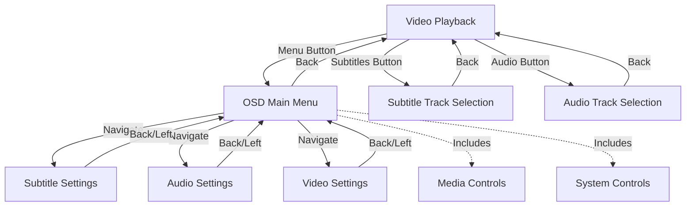

# OSD System Architecture and Navigation

## Overview

The On-Screen Display (OSD) system in Movian provides an overlay interface for accessing media playback settings, track selection, and system controls during video playback. The OSD appears as a sidebar menu that slides in from the left side of the screen, offering hierarchical navigation through various settings pages.

**Key Characteristics**:
- **Overlay Interface**: Appears on top of video playback without interrupting playback
- **Sidebar Navigation**: 22em wide sidebar with vertical list navigation
- **Page-Based Architecture**: Multiple interconnected pages for different functions
- **Focus Management**: Explicit focus control for keyboard/controller navigation
- **Smooth Animations**: Interpolated transitions for professional appearance

## System Architecture

### Component Overview



### File Organization

```
movian/glwskins/flat/osd/
├── osd_main.view              # Main OSD menu with navigation sidebar
├── osd_settings.view          # Shared settings page macro definition
├── osd_settings_audio.view    # Audio-specific settings page
├── osd_settings_subs.view     # Subtitle-specific settings page
├── osd_settings_video.view    # Video-specific settings page
├── osd_audio.view             # Audio track selection list
└── osd_subs.view              # Subtitle track selection list
```


## Page Management System

### State Variable

The OSD system uses a single state variable to manage which page is currently displayed:

```view
$clone.osdpage = 0;  // Initialized in video.view
```

This clone-scoped variable ensures each video playback instance has independent OSD state.

### Page Number Mapping

| Page Number | View File | Description | Entry Point |
|-------------|-----------|-------------|-------------|
| 0 | (none) | OSD hidden / playdeck only | Default state |
| 1 | `osd_main.view` | Main OSD menu | Menu button |
| 2 | `osd_settings_subs.view` | Subtitle settings | Main menu → Subtitle settings |
| 3 | `osd_settings_audio.view` | Audio settings | Main menu → Audio settings |
| 4 | `osd_settings_video.view` | Video settings | Main menu → Video settings |
| 100 | `osd_subs.view` | Subtitle track selection | Playdeck → Subtitles button |
| 101 | `osd_audio.view` | Audio track selection | Playdeck → Audio button |

### Dynamic Page Loading

Pages are loaded dynamically in `video.view` using conditional loaders:

```view
// Main menu (page 1)
widget(loader, {
  autohide: true;
  alpha: iir($clone.osdpage == 1, 4);
  source: select($clone.osdpage, "skin://osd/osd_main.view", "");
});

// Settings and track selection pages (2-4, 100-101)
widget(loader, {
  autohide: true;
  source: translate($clone.osdpage, "",
                    2, "skin://osd/osd_settings_subs.view",
                    3, "skin://osd/osd_settings_audio.view",
                    4, "skin://osd/osd_settings_video.view",
                    100, "skin://osd/osd_subs.view",
                    101, "skin://osd/osd_audio.view"
                   );
});
```

**Loading Features**:
- **Conditional Loading**: `select()` and `translate()` functions choose source based on page number
- **Auto-hide**: `autohide: true` removes widgets when source is empty
- **Smooth Transitions**: `alpha: iir($clone.osdpage == 1, 4)` creates fade effects
- **Lazy Loading**: Pages only loaded when needed, reducing memory usage


## OSD Main Menu

### Container Structure

The main OSD menu (`osd_main.view`) provides the primary navigation hub:

```view
#import "skin://theme.view"
#import "skin://menu/sidebar_include.view"

widget(container_y, {
  width: 22em;
  id: "osd_main";
  padding: [0, 3em, 0, 0];
  
  widget(list_y, {
    id: "sidebar";
    navWrap: true;
    
    SIDEBAR_ACTION(_("Subtitle settings"), "skin://icons/ic_subtitles_48px.svg", {
      $clone.osdpage = 2;
      focus("osd_settings_subs");
    });
    
    SIDEBAR_ACTION(_("Audio settings"), "skin://icons/ic_speaker_48px.svg", {
      $clone.osdpage = 3;
      focus("osd_settings_audio");
    });
    
    SIDEBAR_ACTION(_("Video settings"), "skin://icons/ic_videocam_48px.svg", {
      $clone.osdpage = 4;
      focus("osd_settings_video");
    });
    
    #import "skin://menu/sidebar_common.view"
  });
});
```

**Key Features**:
- **Fixed Width**: 22em container for consistent sizing across all screens
- **Sidebar Navigation**: Vertical list with `navWrap: true` for circular navigation
- **Three Main Actions**: Subtitle, audio, and video settings
- **Common Controls**: Imports `sidebar_common.view` for media playback and system controls

### SIDEBAR_ACTION Macro

The `SIDEBAR_ACTION` macro (defined in `sidebar_include.view`) creates consistent navigation items:

```view
#define SIDEBAR_ACTION(CAPTION, ICON, EVENT, HIDDEN=false) {
  widget(container_z, {
    hidden: HIDDEN;
    height: 2em;
    ListItemBevel();
    ListItemHighlight();
    focusable: true;
    onEvent(activate, EVENT);
    
    widget(container_x, {
      style: "ListItem";
      
      widget(icon, {
        style: "ListItemIcon";
        source: ICON;
      });
      
      widget(label, {
        filterConstraintX: true;
        caption: CAPTION;
        style: "ActionLabel";
      });
    });
  });
}
```

**Macro Parameters**:
- `CAPTION` - Text label for the action (e.g., `_("Subtitle settings")`)
- `ICON` - Path to icon resource (e.g., `"skin://icons/ic_subtitles_48px.svg"`)
- `EVENT` - Action to execute on activation (typically page change + focus)
- `HIDDEN` - Optional boolean to conditionally hide the action

**Visual Feedback**:
- `ListItemBevel()` - Adds subtle shadow effect for depth
- `ListItemHighlight()` - Provides hover and focus highlighting
- Both macros defined in `theme.view` for consistent appearance


### Common Sidebar Controls

The main menu includes common controls from `sidebar_common.view`:

**Media Playback Controls**:
```view
widget(container_z, {
  height: 2em;
  ListItemBevel();
  hidden: translate($core.media.current.type, true,
                    "tracks", false,
                    "radio", false);
  
  widget(container_x, {
    align: center;
    
    SIDEBAR_BUTTON("skin://icons/ic_list_48px.svg",
                   navOpen("playqueue:"),
                   $core.playqueue.active);
    
    SIDEBAR_BUTTON("skin://icons/ic_skip_previous_48px.svg",
                   deliverEvent($core.media.eventSink, "PreviousTrack"),
                   $core.media.current.canSkipBackward);
    
    SIDEBAR_BUTTON(translate($core.media.current.playstatus,
                             "skin://icons/ic_pause_48px.svg",
                             "pause",
                             "skin://icons/ic_play_arrow_48px.svg"),
                   deliverEvent($core.media.eventSink, "PlayPause"),
                   $core.media.current.canPause);
    
    SIDEBAR_BUTTON("skin://icons/ic_skip_next_48px.svg",
                   deliverEvent($core.media.eventSink, "NextTrack"),
                   $core.media.current.canSkipForward);
    
    SIDEBAR_BUTTON_TOGGLE("dataroot://res/svg/Repeat.svg",
                          $core.media.current.repeat,
                          $core.media.current.canRepeat);
    
    SIDEBAR_BUTTON_TOGGLE("dataroot://res/svg/Shuffle.svg",
                          $core.media.current.shuffle,
                          $core.media.current.canShuffle);
  });
});
```

**System Controls**:
```view
SIDEBAR_INTEGER(_("Master volume"), "skin://icons/ic_speaker_48px.svg",
                -75, 12, 1, $core.audio.mastervolume, _("dB"));

SIDEBAR_ACTION(select($ui.mediainfo, _("Hide media info"), _("Show media info")),
               select($ui.mediainfo, "skin://icons/ic_info_48px.svg",
                      "skin://icons/ic_info_outline_48px.svg"),
               { toggle($ui.mediainfo); });

SIDEBAR_ACTION(select($ui.sysinfo, _("Hide system info"), _("Show system info")),
               select($ui.sysinfo, "skin://icons/ic_info_48px.svg",
                      "skin://icons/ic_info_outline_48px.svg"),
               { toggle($ui.sysinfo); });

SIDEBAR_ACTION(_("View log"), "skin://icons/ic_my_library_books_48px.svg", {
  $ui.logwindow = true;
});
```


## Settings Pages

### OSD_SETTINGS_MENU Macro

The `OSD_SETTINGS_MENU` macro (defined in `osd_settings.view`) provides a reusable template for all settings pages:

```view
#define OSD_SETTINGS_MENU(NODES, TITLE, ID) {
  widget(container_y, {
    id: ID;
    
    widget(label, {
      style: "osdsettingtitle";
      height: 3em;
      align: center;
      caption: TITLE;
      size: 1.5em;
    });
    
    onEvent(back, {
      $clone.osdpage = 1;
      focus("osd_main");
    });
    
    onEvent(left, {
      $clone.osdpage = 1;
      focus("osd_main");
    });
    
    widget(container_x, {
      widget(list_y, {
        navWrap: true;
        id: "list";
        
        cloner(NODES, loader, {
          hidden: !$self.enabled;
          source: "skin://items/list/" + $self.type + ".view";
          time: 0.3;
          noInitialTransform: true;
        });
      });
      
      widget(slider_y, {
        bind("list");
        width: 4;
        focusable: canScroll();
        alpha: iir(canScroll(), 16);
        widget(quad, {
          alpha: 1;
        });
      });
    });
  });
}
```

**Macro Parameters**:
- `NODES` - Data source for settings items (e.g., `$self.media.audio.settings.nodes`)
- `TITLE` - Page title displayed at top (e.g., `_("Audio settings")`)
- `ID` - Widget ID for focus targeting (e.g., `"osd_settings_audio"`)

**Key Features**:
1. **Title Bar**: Centered label with `osdsettingtitle` style
2. **Dual Back Navigation**: Both `back` and `left` events return to main menu
3. **Data-Driven Content**: Uses `cloner()` to dynamically load settings items
4. **Dynamic Item Loading**: Loads appropriate view based on `$self.type` property
5. **Scrollbar Integration**: Automatic scrollbar with smooth fade-in/out
6. **Conditional Visibility**: Hides disabled settings items

### Settings Page Implementations

**Subtitle Settings** (`osd_settings_subs.view`):
```view
#import "osd_settings.view"

OSD_SETTINGS_MENU($self.media.subtitle.settings.nodes, _("Subtitle settings"),
                 "osd_settings_subs");
```

**Audio Settings** (`osd_settings_audio.view`):
```view
#import "osd_settings.view"

OSD_SETTINGS_MENU($self.media.audio.settings.nodes, _("Audio settings"),
                 "osd_settings_audio");
```

**Video Settings** (`osd_settings_video.view`):
```view
#import "osd_settings.view"

OSD_SETTINGS_MENU($self.media.video.settings.nodes, _("Video settings"),
                 "osd_settings_video");
```


## Track Selection Pages

### Subtitle Track Selection

The subtitle track selection page (`osd_subs.view`) displays all available subtitle tracks:

```view
widget(container_y, {
  id: "osd_subs";
  
  widget(label, {
    style: "osdsettingtitle";
    height: 3em;
    align: center;
    caption: _("Subtitles");
    size: 1.5em;
  });
  
  onEvent(back, {
    $clone.osdpage = 0;
    focus("subtitles-btn");
  }, $clone.osdpage);
  
  widget(container_x, {
    widget(list_y, {
      id: "list";
      
      cloner($self.media.subtitle.sorted, container_z, {
        height: 2.5em;
        ListItemHighlight();
        ListItemBevel();
        focusable: true;
        onEvent(activate, deliverEvent($parent.control,
                                       selectSubtitleTrack($self.url)));
        
        widget(container_x, {
          padding: [0.5em, 0];
          
          widget(icon, {
            source: "skin://icons/ic_favorite_48px.svg";
            alpha: iir($self.url == $parent.media.subtitle.current &&
                       $parent.media.subtitle.manual, 4);
            style: "NavSelectedText";
          });
          
          widget(icon, {
            source: "skin://icons/ic_check_48px.svg";
            alpha: iir($self.url == $parent.media.subtitle.current, 4);
            style: "NavSelectedText";
          });
          
          widget(container_y, {
            padding: [0.5em, 0, 0, 0];
            align: center;
            
            widget(container_x, {
              widget(label, {
                filterConstraintX: true;
                caption: $self.title;
                style: "NavSelectedTextSecondary";
              });
              
              widget(label, {
                filterConstraintX: true;
                caption: $self.longformat;
                style: "NavSelectedTextSecondary";
              });
            });
            
            widget(container_x, {
              widget(label, {
                filterConstraintX: true;
                caption: $self.language;
                style: "NavSelectedTextSecondary";
              });
              
              widget(label, {
                filterConstraintX: true;
                caption: $self.source;
                style: "NavSelectedTextSecondary";
              });
            });
          });
        });
      });
    });
    
    widget(slider_y, {
      bind("list");
      width: 4;
      focusable: canScroll();
      alpha: iir(canScroll(), 16);
      widget(quad, {
        alpha: 1;
      });
    });
  });
});
```

**Key Features**:
- **Data Source**: `$self.media.subtitle.sorted` - sorted list of subtitle tracks
- **Multi-line Display**: Shows title, format, language, and source
- **Current Track Indicators**:
  - Check icon (✓) for currently active subtitle
  - Favorite icon (★) for manually selected subtitle
- **Track Selection**: `deliverEvent($parent.control, selectSubtitleTrack($self.url))`
- **Back Navigation**: Returns to playdeck (page 0) with focus on `"subtitles-btn"`


### Audio Track Selection

The audio track selection page (`osd_audio.view`) displays all available audio tracks:

```view
widget(container_y, {
  id: "osd_audio";
  
  widget(label, {
    style: "osdsettingtitle";
    height: 3em;
    align: center;
    caption: _("Audio");
    size: 1.5em;
  });
  
  onEvent(back, {
    $clone.osdpage = 0;
    focus("audio-btn");
  }, $clone.osdpage);
  
  widget(container_x, {
    widget(list_y, {
      id: "list";
      
      cloner($self.media.audio.sorted, container_z, {
        height: 1.5em;
        focusable: true;
        ListItemHighlight();
        ListItemBevel();
        onEvent(activate, deliverEvent($parent.control,
                                       selectAudioTrack($self.url)));
        
        widget(container_x, {
          padding: [0.5em, 0];
          
          widget(icon, {
            source: "skin://icons/ic_favorite_48px.svg";
            alpha: iir($self.url == $parent.media.audio.current &&
                       $parent.media.audio.manual, 4);
            style: "NavSelectedText";
          });
          
          widget(icon, {
            source: "skin://icons/ic_check_48px.svg";
            alpha: iir($self.url == $parent.media.audio.current, 4);
            style: "NavSelectedText";
          });
          
          widget(label, {
            filterConstraintX: true;
            weight: 2;
            caption: $self.title;
            style: "NavSelectedText";
          });
          
          widget(label, {
            filterConstraintX: true;
            weight: 1;
            caption: $self.language;
            style: "NavSelectedText";
          });
          
          widget(label, {
            filterConstraintX: true;
            weight: 0.5;
            caption: $self.format;
            style: "NavSelectedText";
          });
        });
      });
    });
    
    widget(slider_y, {
      bind("list");
      width: 4;
      focusable: canScroll();
      alpha: iir(canScroll(), 16);
      widget(quad, {
        alpha: 1;
      });
    });
  });
});
```

**Key Features**:
- **Data Source**: `$self.media.audio.sorted` - sorted list of audio tracks
- **Single-line Display**: Shows title, language, and format in weighted columns (2:1:0.5 ratio)
- **Current Track Indicators**: Same as subtitle selection
- **Track Selection**: `deliverEvent($parent.control, selectAudioTrack($self.url))`
- **Back Navigation**: Returns to playdeck (page 0) with focus on `"audio-btn"`


## Focus Management System

### Focus Control Function

The `focus("target_id")` function moves keyboard/controller focus to a specific widget:

```view
focus("osd_main");           // Focus main OSD sidebar
focus("osd_settings_subs");  // Focus subtitle settings page
focus("subtitles-btn");      // Focus subtitle button in playdeck
```

### Focus Targets in OSD System

| Focus ID | Location | Purpose |
|----------|----------|---------|
| `"osd_main"` | Main OSD sidebar | Primary navigation menu |
| `"osd_settings_subs"` | Subtitle settings page | Subtitle configuration |
| `"osd_settings_audio"` | Audio settings page | Audio configuration |
| `"osd_settings_video"` | Video settings page | Video configuration |
| `"osd_subs"` | Subtitle track list | Subtitle track selection |
| `"osd_audio"` | Audio track list | Audio track selection |
| `"subtitles-btn"` | Playdeck button | Subtitle button in video controls |
| `"audio-btn"` | Playdeck button | Audio button in video controls |
| `"pause-btn"` | Playdeck button | Play/pause button in video controls |
| `"menu-btn"` | Playdeck button | Menu button in video controls |

### Navigation Patterns

**From Main Menu to Settings**:
```view
SIDEBAR_ACTION(_("Subtitle settings"), "...", {
  $clone.osdpage = 2;
  focus("osd_settings_subs");
});
```

**From Settings Back to Main Menu**:
```view
onEvent(back, {
  $clone.osdpage = 1;
  focus("osd_main");
});
```

**From Track Selection Back to Playdeck**:
```view
onEvent(back, {
  $clone.osdpage = 0;
  focus("subtitles-btn");
}, $clone.osdpage);
```

**Bidirectional Navigation**:
```view
// From settings page, both back and left return to main menu
onEvent(back, {
  $clone.osdpage = 1;
  focus("osd_main");
});

onEvent(left, {
  $clone.osdpage = 1;
  focus("osd_main");
});
```

### Focus Coordination

Every page transition includes both state change and focus management:

1. **Update Page State**: `$clone.osdpage = X;`
2. **Set Focus**: `focus("target_id");`

This ensures proper keyboard/controller navigation and prevents focus loss during transitions.


## OSD Integration in Video Playback

### OSD State Management

The video playback page (`video.view`) manages OSD state and visibility:

```view
$clone.osdpage = 0;
$clone.showPlaydeck = 0;

// Menu button toggles OSD
onEvent(menu, {
  $clone.osdpage = 1;
  $clone.showPlaydeck = 1;
  focus("osd_main");
}, !$clone.osdpage);

onEvent(menu, {
  $clone.osdpage = 0;
  $clone.showPlaydeck = 0;
}, $clone.osdpage);

// Back button navigation
onEvent(back, {
  $clone.showPlaydeck = 0;
}, $clone.showPlaydeck && !$clone.osdpage);

onEvent(back, {
  $clone.osdpage = 0;
}, $clone.osdpage);
```

### OSD Display Container

The OSD appears in a `displacement` widget with slide-in animation:

```view
widget(displacement, {
  hidden: iir($clone.osdpage > 0, 3) < 0.01;
  width: 22em;
  scaling: [1.2 - iir($clone.osdpage > 0, 3) * 0.2,
            1.2 - iir($clone.osdpage > 0, 3) * 0.2,
            1];
  
  widget(container_z, {
    onEvent(left, {
      $clone.osdpage = 0;
    }, true, false);
    
    widget(quad, {
      color: 0;
      alpha: iir($clone.osdpage > 0, 4) * 0.8;
    });
    
    widget(layer, {
      widget(loader, {
        autohide: true;
        alpha: iir($clone.osdpage == 1, 4);
        source: select($clone.osdpage, "skin://osd/osd_main.view", "");
      });
      
      widget(loader, {
        autohide: true;
        source: translate($clone.osdpage, "",
                          2, "skin://osd/osd_settings_subs.view",
                          3, "skin://osd/osd_settings_audio.view",
                          4, "skin://osd/osd_settings_video.view",
                          100, "skin://osd/osd_subs.view",
                          101, "skin://osd/osd_audio.view"
                         );
      });
    });
  });
});
```

**Visual Effects**:
- **Scaling Animation**: `scaling: [1.2 - iir($clone.osdpage > 0, 3) * 0.2, ...]` creates zoom effect
- **Background Dimming**: Semi-transparent black quad with `alpha: iir($clone.osdpage > 0, 4) * 0.8`
- **Smooth Transitions**: `iir()` function provides interpolated animations
- **Displacement Widget**: Allows OSD to slide in from side


### Playdeck Button Integration

The video playdeck includes buttons that open OSD pages:

```view
PLAYDECK_BUTTON("skin://icons/ic_subtitles_48px.svg", _("Subtitles"), {
  $clone.osdpage = select($clone.osdpage == 100, 0, 100);
  focus("osd_subs");
}, true, "subtitles-btn");

PLAYDECK_BUTTON("skin://icons/ic_speaker_48px.svg", _("Audio tracks"), {
  $clone.osdpage = select($clone.osdpage == 101, 0, 101);
  focus("osd_audio");
}, true, "audio-btn");

PLAYDECK_BUTTON("skin://icons/ic_menu_48px.svg", _("Settings"), {
  toggle($clone.osdpage);
  focus("osd_main");
}, true, "menu-btn", $clone.osdpage > 0 && $clone.osdpage < 100);
```

**Button Features**:
- **Toggle Behavior**: `select($clone.osdpage == 100, 0, 100)` toggles between page and closed
- **Focus Coordination**: Each button focuses appropriate OSD page
- **Visual State**: Menu button shows rotation when OSD is open

## Animation and Transition System

### Interpolation Function

The `iir()` function provides smooth interpolated transitions:

```view
iir(value, speed)
```

**Parameters**:
- `value` - Target value (typically boolean or numeric)
- `speed` - Number of frames for transition (lower = faster)

**Common Usage**:
```view
alpha: iir($clone.osdpage > 0, 4);     // 4-frame fade
alpha: iir(canScroll(), 16);           // 16-frame smooth fade
scaling: [1.2 - iir($condition, 3) * 0.2, ...];  // Zoom effect
```

### Fade Effects

**Page Fade-In**:
```view
widget(loader, {
  alpha: iir($clone.osdpage == 1, 4);
  source: select($clone.osdpage, "skin://osd/osd_main.view", "");
});
```

**Icon Fade Based on State**:
```view
widget(icon, {
  alpha: iir($self.url == $parent.media.subtitle.current, 4);
  source: "skin://icons/ic_check_48px.svg";
});
```

**Scrollbar Auto-Fade**:
```view
widget(slider_y, {
  alpha: iir(canScroll(), 16);
  focusable: canScroll();
});
```

### Scaling Animation

The OSD container uses scaling for zoom effect:

```view
scaling: [1.2 - iir($clone.osdpage > 0, 3) * 0.2,
          1.2 - iir($clone.osdpage > 0, 3) * 0.2,
          1];
```

**Calculation**:
- Closed state: `1.2 - 0 * 0.2 = 1.2` (120% scale)
- Open state: `1.2 - 1 * 0.2 = 1.0` (100% scale)
- Transition: Smooth interpolation over 3 frames


## Media System Integration

### Media Properties

The OSD system accesses media state through various properties:

**Playback State**:
```view
$core.media.current.type           // Media type: "tracks", "radio", "video"
$core.media.current.playstatus     // "play", "pause", "stop"
$core.media.current.eventSink      // Event delivery target
```

**Capabilities**:
```view
$core.media.current.canPause       // Can pause/resume
$core.media.current.canSeek        // Can seek to position
$core.media.current.canSkipForward // Can skip to next track
$core.media.current.canSkipBackward // Can skip to previous track
$core.media.current.canRepeat      // Supports repeat mode
$core.media.current.canShuffle     // Supports shuffle mode
```

**Audio System**:
```view
$core.audio.mastervolume           // Master volume (-75 to 12 dB)
$core.audio.mastermute             // Mute state (boolean)
```

**Track Information**:
```view
$self.media.audio.sorted           // Sorted audio track list
$self.media.subtitle.sorted        // Sorted subtitle track list
$self.media.audio.current          // Current audio track URL
$self.media.subtitle.current       // Current subtitle track URL
$self.media.audio.manual           // Manually selected audio
$self.media.subtitle.manual        // Manually selected subtitle
```

**Settings Nodes**:
```view
$self.media.audio.settings.nodes   // Audio settings data
$self.media.subtitle.settings.nodes // Subtitle settings data
$self.media.video.settings.nodes   // Video settings data
```

### Event Delivery

**Media Control Events**:
```view
deliverEvent($core.media.eventSink, "PlayPause")
deliverEvent($core.media.eventSink, "PreviousTrack")
deliverEvent($core.media.eventSink, "NextTrack")
```

**Track Selection Events**:
```view
deliverEvent($parent.control, selectAudioTrack($self.url))
deliverEvent($parent.control, selectSubtitleTrack($self.url))
```

**Event Flow**:
1. User activates track item
2. `deliverEvent()` sends command to control system
3. Media system processes track selection
4. UI updates to reflect new current track


## Design Patterns and Best Practices

### Consistent Navigation

All OSD pages follow consistent navigation patterns:

1. **Back Event**: Always returns to previous page
2. **Focus Management**: Always sets focus explicitly
3. **Page State**: Always updates `$clone.osdpage`

**Example Pattern**:
```view
onEvent(back, {
  $clone.osdpage = 1;      // Return to main menu
  focus("osd_main");       // Focus main menu sidebar
});
```

### Data-Driven UI

Settings pages use data-driven approach for flexibility:

```view
cloner(NODES, loader, {
  hidden: !$self.enabled;
  source: "skin://items/list/" + $self.type + ".view";
});
```

**Benefits**:
- Automatic UI updates when settings change
- No hardcoded settings items
- Easy to add new settings
- Type-based view loading

### Smooth Animations

All transitions use `iir()` for smooth interpolation:

```view
alpha: iir($condition, frames);
```

**Guidelines**:
- Lower frame count (3-4) = faster transition
- Higher frame count (8-16) = smoother, slower transition
- Typical values: 4 for quick fades, 16 for subtle effects

### Conditional Visibility

Items are hidden rather than removed for better performance:

```view
hidden: !$self.enabled;
alpha: iir($condition, 4);
```

**Benefits**:
- Maintains layout stability
- Smooth fade in/out
- Better performance than adding/removing widgets
- Preserves widget state

### Scrollbar Integration

All scrollable lists include consistent scrollbar:

```view
widget(slider_y, {
  bind("list");
  width: 4;
  focusable: canScroll();
  alpha: iir(canScroll(), 16);
  widget(quad, { alpha: 1; });
});
```

**Features**:
- Only visible when scrollable
- Smooth fade in/out
- Focusable for direct scrolling
- Consistent 4px width


## Customization Guide

### Adding New OSD Pages

To add a new OSD page to the system:

**1. Choose Page Number**:
Select an unused number (e.g., 5 for new settings page):

```view
// Page number mapping
// 0-4: Reserved for main menu and core settings
// 5: Available for custom page
// 100-101: Reserved for track selection
```

**2. Create View File**:
Create new file in `osd/` directory:

```view
// osd_custom_page.view
#import "skin://theme.view"

widget(container_y, {
  id: "osd_custom_page";
  
  widget(label, {
    style: "osdsettingtitle";
    height: 3em;
    align: center;
    caption: _("Custom Settings");
    size: 1.5em;
  });
  
  onEvent(back, {
    $clone.osdpage = 1;
    focus("osd_main");
  });
  
  // Custom content here...
});
```

**3. Add to Page Loading**:
Update `video.view` loader to include new page:

```view
widget(loader, {
  autohide: true;
  source: translate($clone.osdpage, "",
                    2, "skin://osd/osd_settings_subs.view",
                    3, "skin://osd/osd_settings_audio.view",
                    4, "skin://osd/osd_settings_video.view",
                    5, "skin://osd/osd_custom_page.view",  // New page
                    100, "skin://osd/osd_subs.view",
                    101, "skin://osd/osd_audio.view"
                   );
});
```

**4. Add Navigation**:
Add action to `osd_main.view`:

```view
SIDEBAR_ACTION(_("Custom Settings"), "skin://icons/ic_settings_48px.svg", {
  $clone.osdpage = 5;
  focus("osd_custom_page");
});
```

### Modifying Track Display

To customize track list appearance:

**Adjust Item Height**:
```view
cloner($self.media.audio.sorted, container_z, {
  height: 2em;  // Change from default 1.5em
  // ...
});
```

**Modify Layout**:
```view
widget(container_x, {
  // Add/remove label widgets
  widget(label, {
    caption: $self.custom_field;
  });
});
```

**Change Indicators**:
```view
widget(icon, {
  source: "skin://icons/custom_icon.svg";  // Custom icon
  alpha: iir($self.custom_condition, 4);   // Custom condition
});
```

### Customizing Settings Pages

Settings pages automatically adapt to data source:

```view
OSD_SETTINGS_MENU($custom.data.source, _("Custom Settings"),
                 "osd_custom");
```

The macro handles:
- Title display
- Navigation (back/left events)
- Scrolling
- Item loading based on `$self.type`


## Troubleshooting

### Common Issues

**Issue: OSD doesn't appear**

Possible causes and solutions:
- **Check**: `$clone.osdpage` value - should be 1-4, 100, or 101
- **Check**: Loader source paths are correct
- **Check**: Page number exists in `translate()` function
- **Solution**: Add debug label to display page state:
  ```view
  widget(label, {
    caption: fmt("OSD Page: %d", $clone.osdpage);
  });
  ```

**Issue: Focus not working**

Possible causes and solutions:
- **Check**: Widget ID matches `focus()` call exactly
- **Check**: Widget has `focusable: true` attribute
- **Check**: Navigation events are properly defined
- **Solution**: Verify focus target exists:
  ```view
  widget(container_y, {
    id: "osd_main";  // Must match focus("osd_main")
    focusable: true;
  });
  ```

**Issue: Track selection not working**

Possible causes and solutions:
- **Check**: `deliverEvent()` target is correct (`$parent.control`)
- **Check**: Track URL (`$self.url`) is valid
- **Check**: Media control system is available
- **Solution**: Add debug output:
  ```view
  onEvent(activate, {
    print("Selecting track:", $self.url);
    deliverEvent($parent.control, selectAudioTrack($self.url));
  });
  ```

**Issue: Scrollbar not appearing**

Possible causes and solutions:
- **Check**: List has enough items to require scrolling
- **Check**: `bind()` target matches list widget ID
- **Check**: `canScroll()` function returns true
- **Solution**: Force scrollbar visibility for testing:
  ```view
  widget(slider_y, {
    bind("list");
    alpha: 1;  // Force visible instead of iir(canScroll(), 16)
  });
  ```

**Issue: Animations are jerky**

Possible causes and solutions:
- **Check**: `iir()` frame count is appropriate (4-16 typical)
- **Check**: Not animating too many properties simultaneously
- **Solution**: Adjust interpolation speed:
  ```view
  alpha: iir($condition, 8);  // Increase from 4 for smoother
  ```

### Debugging Tips

**1. Add Debug Labels**:
Display state variables to understand current state:

```view
widget(label, {
  caption: fmt("Page: %d, Playdeck: %d", $clone.osdpage, $clone.showPlaydeck);
  zoffset: 1000;  // Ensure visible on top
});
```

**2. Check Data Sources**:
Verify data is available before displaying:

```view
widget(label, {
  caption: fmt("Audio tracks: %d", count($self.media.audio.sorted));
});

widget(label, {
  caption: fmt("Subtitle tracks: %d", count($self.media.subtitle.sorted));
});
```

**3. Test Navigation**:
Add logging to verify page transitions:

```view
onEvent(activate, {
  print("Navigating from page", $clone.osdpage, "to page 2");
  $clone.osdpage = 2;
  focus("osd_settings_subs");
});
```

**4. Verify Focus Targets**:
Ensure all focus targets have correct IDs:

```view
widget(container_y, {
  id: "osd_main";  // ID must be unique and match focus() calls
  
  widget(label, {
    caption: "Focus target: osd_main";
  });
});
```


## Summary

The OSD system demonstrates several key Movian UI patterns:

### Core Architectural Patterns

1. **Modular Design**: Separate files for each function (main menu, settings, track selection)
2. **Reusable Macros**: Shared components (`SIDEBAR_ACTION`, `OSD_SETTINGS_MENU`) for consistency
3. **Data-Driven UI**: Dynamic content from media system using `cloner()` widgets
4. **Page-Based Navigation**: State variable (`$clone.osdpage`) controls which page is displayed
5. **Focus Management**: Explicit focus control ensures proper keyboard/controller navigation

### Visual Design Patterns

1. **Smooth Animations**: `iir()` function for professional interpolated transitions
2. **Conditional Visibility**: `hidden` attribute for efficient rendering
3. **Consistent Styling**: Theme macros (`ListItemBevel()`, `ListItemHighlight()`) for uniform appearance
4. **Scrollbar Integration**: Automatic scrollbars with smooth fade effects
5. **Visual Feedback**: Icons and highlights indicate current state

### Integration Patterns

1. **Event Delivery**: `deliverEvent()` for communication with media system
2. **State Management**: Clone-scoped variables for per-instance state
3. **Dynamic Loading**: Conditional loaders with `autohide` for resource efficiency
4. **Bidirectional Navigation**: Consistent back/left event handling
5. **Media System Binding**: Direct access to media properties and capabilities

### Best Practices Demonstrated

1. **Separation of Concerns**: UI logic separate from media control logic
2. **Reusability**: Macros and templates reduce code duplication
3. **Accessibility**: Keyboard/controller navigation fully supported
4. **Performance**: Lazy loading and conditional rendering optimize resource usage
5. **Maintainability**: Clear structure and consistent patterns ease modifications

These patterns can be applied to other UI components in custom skins and plugins, providing a solid foundation for creating professional, user-friendly interfaces in Movian.

## Related Documentation

- **[OSD View Files Reference](osd-view-files-reference.md)** - Detailed reference for all OSD view files
- **[Playdeck System](playdeck-system.md)** - Persistent media controls architecture
- **[Audio/Video UI Integration](audio-video-ui.md)** - Complete media player UI overview
- **[Macro System Reference](../ui/theming/macro-reference.md)** - All available UI macros
- **[Global Configuration](../ui/theming/global-configuration.md)** - System integration variables
- **[Skin Architecture](../ui/theming/skin-architecture.md)** - Overall skin component system
- **[Widget Reference](../ui/widgets/)** - Widget documentation and usage

---

**Document Version**: 1.0  
**Last Updated**: 2025-11-07  
**Movian Version**: 4.8+  
**Status**: ✅ Verified from source code analysis

