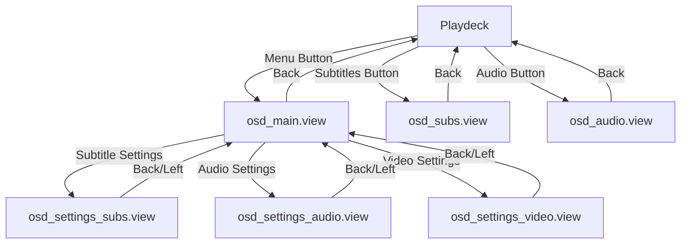

# OSD View Files Reference

## Overview

The On-Screen Display (OSD) system in Movian provides an overlay interface for media playback controls, settings, and track selection during video playback. The OSD consists of 6 interconnected view files that work together to create a cohesive user experience.

This document provides a comprehensive reference for all OSD view files, their structure, interactions, and integration patterns.

## OSD Architecture

### File Organization

```
movian/glwskins/flat/osd/
├── osd_main.view              # Main OSD menu with navigation
├── osd_settings.view          # Shared settings page macro
├── osd_settings_audio.view    # Audio settings page
├── osd_settings_subs.view     # Subtitle settings page
├── osd_settings_video.view    # Video settings page
├── osd_audio.view             # Audio track selection
└── osd_subs.view              # Subtitle track selection
```

### Page State Management

The OSD system uses a single state variable `$clone.osdpage` to manage which page is currently displayed:

| Page Number | View File | Description |
|-------------|-----------|-------------|
| 0 | (none) | OSD hidden / playdeck only |
| 1 | `osd_main.view` | Main OSD menu |
| 2 | `osd_settings_subs.view` | Subtitle settings |
| 3 | `osd_settings_audio.view` | Audio settings |
| 4 | `osd_settings_video.view` | Video settings |
| 100 | `osd_subs.view` | Subtitle track selection |
| 101 | `osd_audio.view` | Audio track selection |

### Navigation Flow



## View File Detailed Reference

### 1. osd_main.view - Main OSD Menu

**Purpose**: Primary navigation hub for accessing all OSD features and settings.

**File Location**: `movian/glwskins/flat/osd/osd_main.view`

**Structure**:

```view
#import "skin://theme.view"
#import "skin://menu/sidebar_include.view"

widget(container_y, {
  width: 22em;
  id: "osd_main";
  padding: [0, 3em, 0, 0];
  
  widget(list_y, {
    id: "sidebar";
    navWrap: true;
    
    // Navigation actions...
    #import "skin://menu/sidebar_common.view"
  });
});
```

**Key Features**:

- **Fixed Width**: 22em container for consistent sizing
- **Sidebar Navigation**: Vertical list with circular navigation (`navWrap: true`)
- **Three Main Actions**:
  1. Subtitle settings → Page 2
  2. Audio settings → Page 3
  3. Video settings → Page 4
- **Common Controls**: Imports `sidebar_common.view` for media controls and system settings

**Navigation Actions**:

```view
SIDEBAR_ACTION(_("Subtitle settings"),
               "skin://icons/ic_subtitles_48px.svg",
               {
                 $clone.osdpage = 2;
                 focus("osd_settings_subs");
               });

SIDEBAR_ACTION(_("Audio settings"),
               "skin://icons/ic_speaker_48px.svg",
               {
                 $clone.osdpage = 3;
                 focus("osd_settings_audio");
               });

SIDEBAR_ACTION(_("Video settings"),
               "skin://icons/ic_videocam_48px.svg",
               {
                 $clone.osdpage = 4;
                 focus("osd_settings_video");
               });
```

**Integration Points**:

- **Theme System**: Imports `theme.view` for visual macros (`ListItemBevel()`, `ListItemHighlight()`)
- **Sidebar Macros**: Uses `SIDEBAR_ACTION` macro from `sidebar_include.view`
- **Common Controls**: Includes media playback controls, volume, system info toggles
- **Focus Management**: Explicitly sets focus to target page on navigation

**Data Bindings**: None (navigation only)

---

### 2. osd_settings.view - Settings Page Macro

**Purpose**: Provides a reusable macro for creating consistent settings pages across audio, subtitle, and video settings.

**File Location**: `movian/glwskins/flat/osd/osd_settings.view`

**Macro Definition**:

```view
#import "skin://theme.view"

#define OSD_SETTINGS_MENU(NODES, TITLE, ID) {
  widget(container_y, {
    id: ID;
    
    widget(label, {
      style: "osdsettingtitle";
      height: 3em;
      align: center;
      caption: TITLE;
      size: 1.5em;
    });
    
    onEvent(back, {
      $clone.osdpage = 1;
      focus("osd_main");
    });
    
    onEvent(left, {
      $clone.osdpage = 1;
      focus("osd_main");
    });
    
    widget(container_x, {
      widget(list_y, {
        navWrap: true;
        id: "list";
        
        cloner(NODES, loader, {
          hidden: !$self.enabled;
          source: "skin://items/list/" + $self.type + ".view";
          time: 0.3;
          noInitialTransform: true;
        });
      });
      
      widget(slider_y, {
        bind("list");
        width: 4;
        focusable: canScroll();
        alpha: iir(canScroll(), 16);
        widget(quad, {
          alpha: 1;
        });
      });
    });
  });
}
```

**Macro Parameters**:

| Parameter | Type | Description |
|-----------|------|-------------|
| `NODES` | Collection | Data source for settings items (e.g., `$self.media.audio.settings.nodes`) |
| `TITLE` | String | Page title displayed at top (e.g., `_("Audio settings")`) |
| `ID` | String | Widget ID for focus targeting (e.g., `"osd_settings_audio"`) |

**Key Features**:

1. **Title Bar**: Centered label with `osdsettingtitle` style
2. **Dual Back Navigation**: Both `back` and `left` events return to main menu
3. **Data-Driven Content**: Uses `cloner()` to dynamically load settings items
4. **Dynamic Item Loading**: Loads appropriate view based on `$self.type` property
5. **Scrollbar Integration**: Automatic scrollbar with smooth fade-in/out
6. **Conditional Visibility**: Hides disabled settings items

**Navigation Pattern**:

```view
onEvent(back, {
  $clone.osdpage = 1;      // Return to main menu
  focus("osd_main");       // Focus main menu sidebar
});

onEvent(left, {
  $clone.osdpage = 1;      // Same as back
  focus("osd_main");
});
```

**Item Loading System**:

```view
cloner(NODES, loader, {
  hidden: !$self.enabled;                              // Hide disabled items
  source: "skin://items/list/" + $self.type + ".view"; // Dynamic view loading
  time: 0.3;                                           // Transition duration
  noInitialTransform: true;                            // No initial animation
});
```

**Scrollbar Implementation**:

```view
widget(slider_y, {
  bind("list");                    // Bind to list widget
  width: 4;                        // 4px wide scrollbar
  focusable: canScroll();          // Only focusable when scrollable
  alpha: iir(canScroll(), 16);     // Smooth fade based on scroll state
  widget(quad, {
    alpha: 1;                      // Solid scrollbar indicator
  });
});
```

---

### 3. osd_settings_audio.view - Audio Settings Page

**Purpose**: Displays audio-specific settings using the shared settings macro.

**File Location**: `movian/glwskins/flat/osd/osd_settings_audio.view`

**Complete Source**:

```view
#import "osd_settings.view"

OSD_SETTINGS_MENU($self.media.audio.settings.nodes, _("Audio settings"),
                 "osd_settings_audio");
```

**Data Source**: `$self.media.audio.settings.nodes`

**Settings Categories** (typical):
- Audio delay/sync adjustment
- Audio gain/volume boost
- Audio normalization
- Downmix settings
- Audio passthrough options

**Navigation**:
- **Entry**: From `osd_main.view` via "Audio settings" action
- **Exit**: Back/Left → `osd_main.view` (page 1)
- **Page Number**: 3

**Focus ID**: `"osd_settings_audio"`

---

### 4. osd_settings_subs.view - Subtitle Settings Page

**Purpose**: Displays subtitle-specific settings using the shared settings macro.

**File Location**: `movian/glwskins/flat/osd/osd_settings_subs.view`

**Complete Source**:

```view
#import "osd_settings.view"

OSD_SETTINGS_MENU($self.media.subtitle.settings.nodes, _("Subtitle settings"),
                 "osd_settings_subs");
```

**Data Source**: `$self.media.subtitle.settings.nodes`

**Settings Categories** (typical):
- Subtitle position (vertical offset)
- Subtitle scale/size
- Subtitle color and style
- Subtitle encoding
- Subtitle alignment

**Navigation**:
- **Entry**: From `osd_main.view` via "Subtitle settings" action
- **Exit**: Back/Left → `osd_main.view` (page 1)
- **Page Number**: 2

**Focus ID**: `"osd_settings_subs"`

---

### 5. osd_settings_video.view - Video Settings Page

**Purpose**: Displays video-specific settings using the shared settings macro.

**File Location**: `movian/glwskins/flat/osd/osd_settings_video.view`

**Complete Source**:

```view
#import "osd_settings.view"

OSD_SETTINGS_MENU($self.media.video.settings.nodes, _("Video settings"),
                 "osd_settings_video");
```

**Data Source**: `$self.media.video.settings.nodes`

**Settings Categories** (typical):
- Video zoom/aspect ratio
- Deinterlacing options
- Video filters
- Hardware acceleration
- Color adjustments

**Navigation**:
- **Entry**: From `osd_main.view` via "Video settings" action
- **Exit**: Back/Left → `osd_main.view` (page 1)
- **Page Number**: 4

**Focus ID**: `"osd_settings_video"`

---

### 6. osd_audio.view - Audio Track Selection

**Purpose**: Displays list of available audio tracks for selection during playback.

**File Location**: `movian/glwskins/flat/osd/osd_audio.view`

**Structure**:

```view
#import "skin://theme.view"

widget(container_y, {
  id: "osd_audio";
  
  widget(label, {
    style: "osdsettingtitle";
    height: 3em;
    align: center;
    caption: _("Audio");
    size: 1.5em;
  });
  
  onEvent(back, {
    $clone.osdpage = 0;
    focus("audio-btn");
  }, $clone.osdpage);
  
  widget(container_x, {
    widget(list_y, {
      id: "list";
      
      cloner($self.media.audio.sorted, container_z, {
        height: 1.5em;
        focusable: true;
        ListItemHighlight();
        ListItemBevel();
        onEvent(activate, deliverEvent($parent.control,
                                       selectAudioTrack($self.url)));
        
        widget(container_x, {
          padding: [0.5em, 0];
          
          widget(icon, {
            source: "skin://icons/ic_favorite_48px.svg";
            alpha: iir($self.url == $parent.media.audio.current &&
                       $parent.media.audio.manual, 4);
            style: "NavSelectedText";
          });
          
          widget(icon, {
            source: "skin://icons/ic_check_48px.svg";
            alpha: iir($self.url == $parent.media.audio.current, 4);
            style: "NavSelectedText";
          });
          
          widget(label, {
            filterConstraintX: true;
            weight: 2;
            caption: $self.title;
            style: "NavSelectedText";
          });
          
          widget(label, {
            filterConstraintX: true;
            weight: 1;
            caption: $self.language;
            style: "NavSelectedText";
          });
          
          widget(label, {
            filterConstraintX: true;
            weight: 0.5;
            caption: $self.format;
            style: "NavSelectedText";
          });
        });
      });
    });
    
    widget(slider_y, {
      bind("list");
      width: 4;
      focusable: canScroll();
      alpha: iir(canScroll(), 16);
      widget(quad, {
        alpha: 1;
      });
    });
  });
});
```

**Key Features**:

1. **Track List Display**: Shows all available audio tracks
2. **Current Track Indicators**:
   - Check icon (✓) for currently playing track
   - Favorite icon (★) for manually selected track
3. **Track Information**: Title, language, and format
4. **Track Selection**: Activate event triggers track change
5. **Smooth Animations**: Icons fade in/out with `iir()` function

**Data Source**: `$self.media.audio.sorted`

**Track Properties**:
- `$self.url` - Track identifier
- `$self.title` - Track name/description
- `$self.language` - Language code (e.g., "eng", "spa")
- `$self.format` - Audio codec (e.g., "AAC", "AC3")

**Visual Indicators**:

```view
// Favorite icon - shown for manually selected track
widget(icon, {
  source: "skin://icons/ic_favorite_48px.svg";
  alpha: iir($self.url == $parent.media.audio.current &&
             $parent.media.audio.manual, 4);
  style: "NavSelectedText";
});

// Check icon - shown for current track
widget(icon, {
  source: "skin://icons/ic_check_48px.svg";
  alpha: iir($self.url == $parent.media.audio.current, 4);
  style: "NavSelectedText";
});
```

**Track Selection Event**:

```view
onEvent(activate, deliverEvent($parent.control,
                               selectAudioTrack($self.url)));
```

**Navigation**:
- **Entry**: From playdeck via "Audio tracks" button
- **Exit**: Back → Playdeck (page 0), focus on `"audio-btn"`
- **Page Number**: 101

**Layout**: Single-line items with weighted columns (2:1:0.5 ratio)

---

### 7. osd_subs.view - Subtitle Track Selection

**Purpose**: Displays list of available subtitle tracks for selection during playback.

**File Location**: `movian/glwskins/flat/osd/osd_subs.view`

**Structure**:

```view
#import "skin://theme.view"

widget(container_y, {
  id: "osd_subs";
  
  widget(label, {
    style: "osdsettingtitle";
    height: 3em;
    align: center;
    caption: _("Subtitles");
    size: 1.5em;
  });
  
  onEvent(back, {
    $clone.osdpage = 0;
    focus("subtitles-btn");
  }, $clone.osdpage);
  
  widget(container_x, {
    widget(list_y, {
      id: "list";
      
      cloner($self.media.subtitle.sorted, container_z, {
        height: 2.5em;
        ListItemHighlight();
        ListItemBevel();
        focusable: true;
        onEvent(activate, deliverEvent($parent.control,
                                       selectSubtitleTrack($self.url)));
        
        widget(container_x, {
          padding: [0.5em, 0];
          
          widget(icon, {
            source: "skin://icons/ic_favorite_48px.svg";
            alpha: iir($self.url == $parent.media.subtitle.current &&
                       $parent.media.subtitle.manual, 4);
            style: "NavSelectedText";
          });
          
          widget(icon, {
            source: "skin://icons/ic_check_48px.svg";
            alpha: iir($self.url == $parent.media.subtitle.current, 4);
            style: "NavSelectedText";
          });
          
          widget(container_y, {
            padding: [0.5em, 0, 0, 0];
            align: center;
            
            widget(container_x, {
              widget(label, {
                filterConstraintX: true;
                caption: $self.title;
                style: "NavSelectedTextSecondary";
              });
              
              widget(label, {
                filterConstraintX: true;
                caption: $self.longformat;
                style: "NavSelectedTextSecondary";
              });
            });
            
            widget(container_x, {
              widget(label, {
                filterConstraintX: true;
                caption: $self.language;
                style: "NavSelectedTextSecondary";
              });
              
              widget(label, {
                filterConstraintX: true;
                caption: $self.source;
                style: "NavSelectedTextSecondary";
              });
            });
          });
        });
      });
    });
    
    widget(slider_y, {
      bind("list");
      width: 4;
      focusable: canScroll();
      alpha: iir(canScroll(), 16);
      widget(quad, {
        alpha: 1;
      });
    });
  });
});
```

**Key Features**:

1. **Track List Display**: Shows all available subtitle tracks
2. **Current Track Indicators**:
   - Check icon (✓) for currently active subtitle
   - Favorite icon (★) for manually selected subtitle
3. **Multi-line Track Information**:
   - Line 1: Title and format
   - Line 2: Language and source
4. **Track Selection**: Activate event triggers subtitle change
5. **Taller Items**: 2.5em height vs 1.5em for audio (more info displayed)

**Data Source**: `$self.media.subtitle.sorted`

**Track Properties**:
- `$self.url` - Track identifier
- `$self.title` - Track name/description
- `$self.longformat` - Detailed format (e.g., "SubRip", "ASS")
- `$self.language` - Language code
- `$self.source` - Source type (e.g., "Embedded", "External")

**Visual Indicators**:

```view
// Favorite icon - shown for manually selected subtitle
widget(icon, {
  source: "skin://icons/ic_favorite_48px.svg";
  alpha: iir($self.url == $parent.media.subtitle.current &&
             $parent.media.subtitle.manual, 4);
  style: "NavSelectedText";
});

// Check icon - shown for current subtitle
widget(icon, {
  source: "skin://icons/ic_check_48px.svg";
  alpha: iir($self.url == $parent.media.subtitle.current, 4);
  style: "NavSelectedText";
});
```

**Track Selection Event**:

```view
onEvent(activate, deliverEvent($parent.control,
                               selectSubtitleTrack($self.url)));
```

**Navigation**:
- **Entry**: From playdeck via "Subtitles" button
- **Exit**: Back → Playdeck (page 0), focus on `"subtitles-btn"`
- **Page Number**: 100

**Layout**: Multi-line items with two rows of information

---

## OSD Integration Patterns

### Page Loading System

The OSD pages are loaded dynamically in the video playback page (`video.view`):

```view
// Main menu (page 1)
widget(loader, {
  autohide: true;
  alpha: iir($clone.osdpage == 1, 4);
  source: select($clone.osdpage, "skin://osd/osd_main.view", "");
});

// Settings and track selection pages (2-4, 100-101)
widget(loader, {
  autohide: true;
  source: translate($clone.osdpage, "",
                    2, "skin://osd/osd_settings_subs.view",
                    3, "skin://osd/osd_settings_audio.view",
                    4, "skin://osd/osd_settings_video.view",
                    100, "skin://osd/osd_subs.view",
                    101, "skin://osd/osd_audio.view"
                   );
});
```

**Loading Features**:
- **Conditional Loading**: Pages only loaded when needed
- **Auto-hide**: Widgets removed when source is empty
- **Smooth Transitions**: Fade effects with `iir()` function
- **Lazy Loading**: Reduces memory usage

### Focus Management

Focus is explicitly managed during navigation to ensure proper keyboard/controller navigation:

```view
// From main menu to settings
SIDEBAR_ACTION(_("Subtitle settings"), "...", {
  $clone.osdpage = 2;
  focus("osd_settings_subs");
});

// From settings back to main menu
onEvent(back, {
  $clone.osdpage = 1;
  focus("osd_main");
});

// From track selection back to playdeck
onEvent(back, {
  $clone.osdpage = 0;
  focus("subtitles-btn");
}, $clone.osdpage);
```

**Focus Targets**:
- `"osd_main"` - Main OSD sidebar
- `"osd_settings_subs"` - Subtitle settings page
- `"osd_settings_audio"` - Audio settings page
- `"osd_settings_video"` - Video settings page
- `"osd_subs"` - Subtitle track list
- `"osd_audio"` - Audio track list
- `"subtitles-btn"` - Subtitle button in playdeck
- `"audio-btn"` - Audio button in playdeck

### Event Delivery Pattern

Track selection uses the `deliverEvent()` function to send commands to the media control system:

```view
onEvent(activate, deliverEvent($parent.control,
                               selectAudioTrack($self.url)));

onEvent(activate, deliverEvent($parent.control,
                               selectSubtitleTrack($self.url)));
```

**Event Flow**:
1. User activates track item
2. `deliverEvent()` sends command to `$parent.control`
3. Media system processes track selection
4. UI updates to reflect new current track

### Visual Feedback System

All OSD pages use consistent visual feedback:

```view
// Hover and focus highlighting
ListItemHighlight();  // Macro from theme.view
ListItemBevel();      // Macro from theme.view

// Smooth icon transitions
alpha: iir($condition, 4);  // 4-frame interpolation

// Scrollbar fade
alpha: iir(canScroll(), 16);  // 16-frame interpolation
```

## Common Patterns and Best Practices

### 1. Consistent Navigation

All OSD pages follow consistent navigation patterns:

- **Back Event**: Always returns to previous page
- **Focus Management**: Always sets focus explicitly
- **Page State**: Always updates `$clone.osdpage`

### 2. Data-Driven UI

Settings pages use data-driven approach:

```view
cloner(NODES, loader, {
  hidden: !$self.enabled;
  source: "skin://items/list/" + $self.type + ".view";
});
```

Benefits:
- Automatic UI updates when settings change
- No hardcoded settings items
- Easy to add new settings

### 3. Smooth Animations

All transitions use `iir()` for smooth interpolation:

```view
alpha: iir($condition, frames);
```

- Lower frame count = faster transition
- Higher frame count = smoother, slower transition
- Typical values: 4-16 frames

### 4. Conditional Visibility

Items are hidden rather than removed:

```view
hidden: !$self.enabled;
alpha: iir($condition, 4);
```

Benefits:
- Maintains layout stability
- Smooth fade in/out
- Better performance than adding/removing widgets

### 5. Scrollbar Integration

All scrollable lists include consistent scrollbar:

```view
widget(slider_y, {
  bind("list");
  width: 4;
  focusable: canScroll();
  alpha: iir(canScroll(), 16);
  widget(quad, { alpha: 1; });
});
```

Features:
- Only visible when scrollable
- Smooth fade in/out
- Focusable for direct scrolling
- Consistent 4px width

## Customization Guide

### Adding New OSD Pages

To add a new OSD page:

1. **Choose Page Number**: Select unused number (e.g., 5 for new settings)

2. **Create View File**: Create new file in `osd/` directory

3. **Add to Page Loading**: Update `video.view` loader:
   ```view
   source: translate($clone.osdpage, "",
                     // ... existing pages ...
                     5, "skin://osd/osd_new_page.view"
                    );
   ```

4. **Add Navigation**: Add action to `osd_main.view`:
   ```view
   SIDEBAR_ACTION(_("New Settings"), "icon.svg", {
     $clone.osdpage = 5;
     focus("osd_new_page");
   });
   ```

### Modifying Track Display

To customize track list appearance:

1. **Adjust Item Height**: Change `height:` property
2. **Modify Layout**: Change container structure
3. **Add/Remove Fields**: Add/remove label widgets
4. **Change Indicators**: Modify icon sources or conditions

### Customizing Settings Pages

Settings pages automatically adapt to data source:

```view
OSD_SETTINGS_MENU($custom.data.source, _("Custom Settings"),
                 "osd_custom");
```

The macro handles:
- Title display
- Navigation
- Scrolling
- Item loading

## Troubleshooting

### Common Issues

**Issue**: OSD doesn't appear
- **Check**: `$clone.osdpage` value
- **Check**: Loader source paths
- **Check**: Page number in translate() function

**Issue**: Focus not working
- **Check**: Widget ID matches focus() call
- **Check**: Widget is focusable
- **Check**: Navigation events are properly defined

**Issue**: Track selection not working
- **Check**: `deliverEvent()` target is correct
- **Check**: Track URL is valid
- **Check**: Media control system is available

**Issue**: Scrollbar not appearing
- **Check**: List has enough items to scroll
- **Check**: `bind()` target matches list ID
- **Check**: `canScroll()` function is working

### Debugging Tips

1. **Add Debug Labels**: Display state variables
   ```view
   widget(label, {
     caption: fmt("Page: %d", $clone.osdpage);
   });
   ```

2. **Check Data Sources**: Verify data is available
   ```view
   widget(label, {
     caption: fmt("Tracks: %d", count($self.media.audio.sorted));
   });
   ```

3. **Test Navigation**: Verify page transitions
   ```view
   onEvent(activate, {
     print("Navigating to page:", 2);
     $clone.osdpage = 2;
   });
   ```

## Summary

The OSD system demonstrates several key Movian UI patterns:

1. **Modular Design**: Separate files for each function
2. **Reusable Macros**: Shared settings page macro
3. **Data-Driven UI**: Dynamic content from media system
4. **Consistent Navigation**: Predictable user experience
5. **Smooth Animations**: Professional visual feedback
6. **Focus Management**: Proper keyboard/controller support

These patterns can be applied to other UI components in custom skins and plugins.

---

**Document Version**: 1.0  
**Last Updated**: 2025-11-07  
**Movian Version**: 4.8+  
**Status**: ✅ Verified from source code
