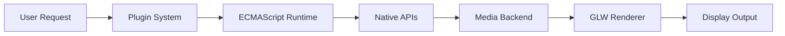
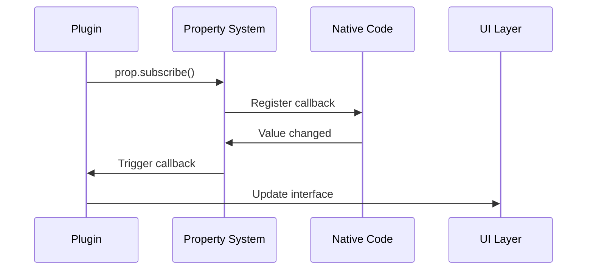
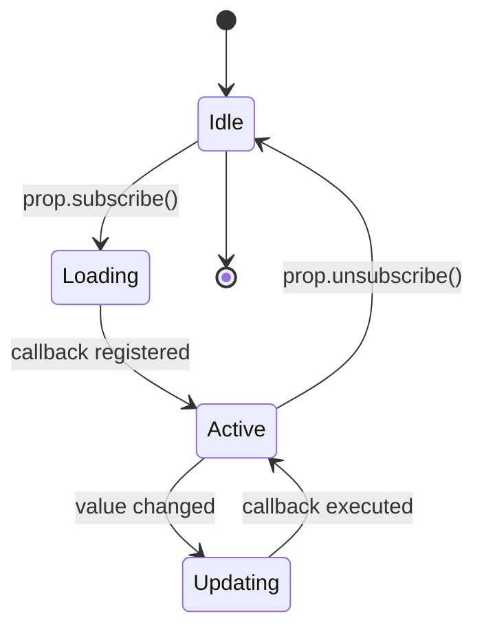

# Mermaid Diagram Test

This page tests Mermaid diagram rendering in the documentation.

## Architecture Flow



## Property System Flow



## Component Hierarchy

```mermaid
classDiagram
    class PropertyNode {
        +string name
        +variant value
        +PropertyNode parent
        +PropertyNode[] children
        +subscribe()
        +set()
        +get()
    }
    
    class PropertyCallback {
        +function callback
        +PropertyNode node
        +execute()
    }
    
    PropertyNode ||--o{ PropertyCallback : triggers
    PropertyNode ||--o{ PropertyNode : contains
```

## State Machine



If you can see the diagrams above, Mermaid is working correctly!