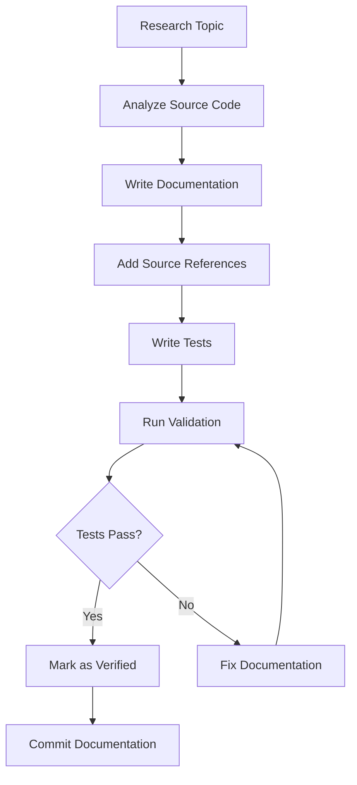
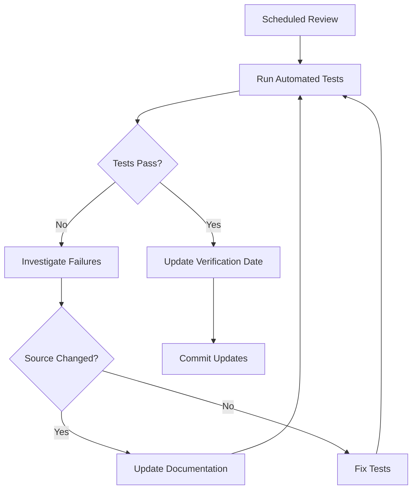

# Documentation Accuracy Tracking System

## Overview

This document describes the comprehensive system for tracking, verifying, and maintaining the accuracy of Movian documentation. Accuracy is critical for developer trust and successful implementation of Movian features.

## Accuracy Status Indicators

### Status Levels

All documentation sections should include an accuracy status indicator:

#### 🟢 Verified from Source Code
```markdown
**Accuracy Status:** 🟢 Verified from source code  
**Last Verified:** 2024-11-08  
**Movian Version:** 4.8+
```

Content has been directly verified against Movian source code and tested.

#### 🟡 Partially Verified
```markdown
**Accuracy Status:** 🟡 Partially verified  
**Last Verified:** 2024-11-08  
**Notes:** Core functionality verified, edge cases not fully tested
```

Main functionality verified, but some details may need additional validation.

#### 🔴 Needs Verification
```markdown
**Accuracy Status:** 🔴 Needs verification  
**Last Updated:** 2024-11-08  
**Notes:** Based on older documentation, requires source code review
```

Content needs to be verified against current source code.

#### ⚪ Conceptual/Theoretical
```markdown
**Accuracy Status:** ⚪ Conceptual documentation  
**Type:** Architecture overview
```

High-level conceptual content that doesn't require source verification.

## Verification Methods

### Method 1: Source Code Analysis

Direct analysis of Movian source code to verify documented behavior.

**Process:**
1. Locate relevant source files
2. Read and analyze implementation
3. Compare with documentation
4. Update documentation if discrepancies found
5. Add source references

**Example:**
```markdown
## HTTP Request Function

The `http.request()` function performs HTTP requests.

**Source Reference:** src/ecmascript/es_http.c:123-456

**Verified Behavior:**
- Supports GET, POST, PUT, DELETE methods ✓
- Handles timeout parameter ✓
- Returns response object with statuscode and body ✓

**Accuracy Status:** 🟢 Verified from source code  
**Last Verified:** 2024-11-08
```

### Method 2: Automated Testing

Automated tests that validate documented behavior.

**Process:**
1. Write test cases based on documentation
2. Execute tests against Movian or mock environment
3. Verify results match documented behavior
4. Update documentation if tests fail

**Example:**
```javascript
// Test: HTTP request returns expected structure
const response = http.request('https://api.example.com/data');
assert(response.hasOwnProperty('statuscode'));
assert(response.hasOwnProperty('body'));
assert(response.hasOwnProperty('headers'));
```

### Method 3: Manual Testing

Manual testing of documented features in actual Movian environment.

**Process:**
1. Set up Movian test environment
2. Follow documented procedures
3. Verify results match documentation
4. Document any discrepancies
5. Update documentation as needed

**Example:**
```markdown
## Manual Test Results

**Test Date:** 2024-11-08  
**Movian Version:** 4.8.1  
**Platform:** Ubuntu 22.04

**Test Case:** Plugin loading and initialization
- ✓ Plugin loads successfully
- ✓ Service registers correctly
- ✓ Routes are accessible
- ✗ Settings page has layout issue (documented in known issues)

**Accuracy Status:** 🟡 Partially verified
```

### Method 4: Community Feedback

Validation through community usage and feedback.

**Process:**
1. Monitor community forums and issue trackers
2. Collect feedback on documentation accuracy
3. Investigate reported issues
4. Update documentation based on findings

## Verification Workflow

### Initial Documentation

When creating new documentation:



### Regular Verification

Ongoing verification process:



## Accuracy Tracking Database

### Tracking Structure

Maintain a tracking database for all documentation sections:

```json
{
  "sections": [
    {
      "id": "plugin-http-api",
      "file": "docs/plugins/api/http-api.md",
      "status": "verified",
      "lastVerified": "2024-11-08",
      "verificationMethod": "source-analysis",
      "movianVersion": "4.8",
      "sourceReferences": [
        "src/ecmascript/es_http.c:123-456"
      ],
      "tests": [
        "docs/tests/plugin-integration-tests.js"
      ],
      "knownIssues": [],
      "nextReview": "2024-12-08"
    }
  ]
}
```

### Tracking Metrics

Track the following metrics:

| Metric | Description | Target |
|--------|-------------|--------|
| **Verification Coverage** | % of docs with verified status | >90% |
| **Average Age** | Days since last verification | <90 days |
| **Test Coverage** | % of docs with automated tests | >70% |
| **Source References** | % of docs with source refs | >80% |
| **Known Issues** | Number of documented issues | Minimize |

## Version Compatibility Tracking

### Version Tagging

Tag documentation with compatible Movian versions:

```markdown
**Movian Version:** 4.8+  
**Compatibility:**
- ✓ Movian 4.8.x
- ✓ Movian 4.9.x
- ⚠️ Movian 4.7.x (partial support)
- ✗ Movian 4.6.x and earlier
```

### Change Tracking

Track changes across Movian versions:

```markdown
## Version History

### Movian 4.8
- Added support for WebSocket connections
- Enhanced HTTP timeout handling
- **Documentation Updated:** 2024-11-08

### Movian 4.7
- Initial HTTP API implementation
- **Documentation Updated:** 2024-06-15
```

### Deprecation Tracking

Document deprecated features:

```markdown
## Deprecated Features

### `http.get()` (Deprecated in 4.8)

**Status:** ⚠️ Deprecated  
**Replacement:** Use `http.request()` with method: 'GET'  
**Removal:** Planned for 5.0

**Migration Example:**
```javascript
// Old (deprecated)
const response = http.get(url);

// New (recommended)
const response = http.request(url, { method: 'GET' });
```
```

## Quality Assurance Checks

### Automated QA Checks

Run comprehensive QA validation:

```bash
# Run all QA validation checks
bash docs/tests/run-qa-validation.sh --verbose

# Individual checks
node docs/tests/file-reference-validator.js
node docs/tests/link-validator.js
node docs/tests/cross-reference-validator.js
```

### QA Checklist

Before marking documentation as verified:

- [ ] Source code analyzed and referenced
- [ ] All code examples tested
- [ ] Links validated (internal and external)
- [ ] Cross-references checked
- [ ] Version compatibility documented
- [ ] Accuracy status indicator added
- [ ] Automated tests written (if applicable)
- [ ] Manual testing performed (if applicable)
- [ ] Known issues documented
- [ ] Next review date set

## Handling Inaccuracies

### When Inaccuracies Are Found

1. **Document the Issue**
   ```markdown
   **Known Issue:** Documentation states X, but actual behavior is Y
   **Reported:** 2024-11-08
   **Status:** Under investigation
   ```

2. **Investigate Root Cause**
   - Check source code
   - Review Movian version
   - Test in multiple environments
   - Check for recent changes

3. **Update Documentation**
   - Correct inaccurate information
   - Add clarifications
   - Update examples
   - Add warnings if needed

4. **Verify Fix**
   - Re-run tests
   - Manual verification
   - Community feedback

5. **Update Status**
   ```markdown
   **Accuracy Status:** 🟢 Verified from source code  
   **Last Verified:** 2024-11-08  
   **Previous Issue:** Resolved - timeout parameter behavior corrected
   ```

### Issue Tracking

Track accuracy issues:

```json
{
  "issues": [
    {
      "id": "ACC-001",
      "section": "plugins/api/http-api.md",
      "description": "Timeout parameter behavior incorrectly documented",
      "severity": "medium",
      "reportedDate": "2024-11-01",
      "resolvedDate": "2024-11-08",
      "resolution": "Documentation updated to match actual behavior"
    }
  ]
}
```

## Continuous Improvement

### Regular Reviews

Schedule regular documentation reviews:

| Review Type | Frequency | Scope |
|-------------|-----------|-------|
| **Quick Check** | Weekly | Run automated validation |
| **Section Review** | Monthly | Review 10-20% of docs |
| **Comprehensive Audit** | Quarterly | Full documentation review |
| **Version Update** | Per Movian release | Update version compatibility |

### Review Process

1. **Select Sections**: Choose sections for review
2. **Run Validation**: Execute automated checks
3. **Manual Review**: Read and verify content
4. **Test Examples**: Test all code examples
5. **Update Status**: Update accuracy indicators
6. **Document Changes**: Log all updates

### Improvement Metrics

Track improvement over time:

```markdown
## Accuracy Metrics - Q4 2024

| Metric | Q3 2024 | Q4 2024 | Change |
|--------|---------|---------|--------|
| Verified Sections | 75% | 92% | +17% |
| Avg Days Since Verification | 120 | 45 | -75 days |
| Known Issues | 15 | 3 | -12 |
| Test Coverage | 60% | 78% | +18% |
```

## Integration with Development

### Documentation-Driven Development

Use documentation accuracy tracking to drive development:

1. **Document First**: Write documentation before implementation
2. **Verify Against Code**: Ensure implementation matches docs
3. **Update Together**: Update docs and code simultaneously
4. **Test Both**: Test code and documentation together

### Code Review Integration

Include documentation review in code reviews:

```markdown
## Code Review Checklist

- [ ] Code changes reviewed
- [ ] Tests added/updated
- [ ] Documentation updated
- [ ] Documentation accuracy verified
- [ ] Source references added
- [ ] Examples tested
```

## Tools and Automation

### Validation Tools

Available validation tools:

| Tool | Purpose | Usage |
|------|---------|-------|
| `file-reference-validator.js` | Validate source references | `node file-reference-validator.js` |
| `link-validator.js` | Check internal/external links | `node link-validator.js` |
| `cross-reference-validator.js` | Verify cross-references | `node cross-reference-validator.js` |
| `run-qa-validation.sh` | Run all validations | `bash run-qa-validation.sh` |

### CI/CD Integration

Integrate validation into CI/CD pipeline:

```yaml
# .github/workflows/docs-validation.yml
name: Documentation Validation

on:
  push:
    paths: ['docs/**']
  pull_request:
    paths: ['docs/**']
  schedule:
    - cron: '0 0 * * 0'  # Weekly

jobs:
  validate:
    runs-on: ubuntu-latest
    steps:
      - uses: actions/checkout@v2
      - name: Run QA Validation
        run: bash docs/tests/run-qa-validation.sh
      - name: Upload Results
        uses: actions/upload-artifact@v2
        with:
          name: validation-results
          path: docs/tests/results/
```

## Reporting

### Accuracy Reports

Generate regular accuracy reports:

```markdown
# Documentation Accuracy Report - November 2024

## Summary
- Total Sections: 150
- Verified: 138 (92%)
- Partially Verified: 10 (7%)
- Needs Verification: 2 (1%)

## Recent Updates
- Updated HTTP API documentation (verified against 4.8)
- Added GLW widget examples (tested)
- Corrected plugin lifecycle documentation

## Action Items
- Verify remaining 2 sections
- Update 5 sections with old verification dates
- Add tests for 10 sections without coverage

## Next Review: December 15, 2024
```

### Stakeholder Communication

Communicate accuracy status to stakeholders:

- **Weekly**: Automated validation results
- **Monthly**: Accuracy metrics and trends
- **Quarterly**: Comprehensive accuracy audit report
- **Per Release**: Version compatibility update

---

**Last Updated:** November 2024  
**Maintained By:** Movian Documentation Team  
**Related Documents:**
- [Source Reference Tracking](source-references.md)
- [Documentation Standards](documentation-standards.md)
- [Testing Guide](../tests/README.md)
