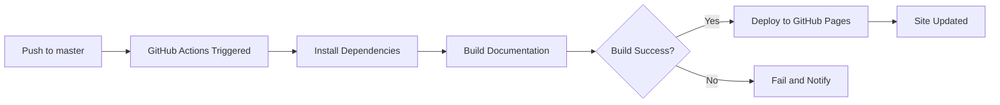

# Deployment Guide

## Overview

This guide covers the complete deployment process for the Movian Architecture Documentation, including initial setup, continuous deployment, version management, and troubleshooting.

## Table of Contents

1. [Initial Setup](#initial-setup)
2. [GitHub Pages Configuration](#github-pages-configuration)
3. [Continuous Deployment](#continuous-deployment)
4. [Version Management](#version-management)
5. [Manual Deployment](#manual-deployment)
6. [Deployment Verification](#deployment-verification)
7. [Troubleshooting](#troubleshooting)

---

## Initial Setup

### Prerequisites

Before deploying the documentation, ensure you have:

- **Git repository** on GitHub
- **Python 3.8+** installed locally
- **MkDocs** and dependencies installed
- **Write access** to the repository
- **GitHub Pages** enabled for the repository

### Local Environment Setup

```bash
# Clone the repository
git clone https://github.com/username/movian-docs.git
cd movian-docs

# Install Python dependencies
pip install -r requirements.txt

# Install Node.js dependencies (for validation tools)
npm install

# Verify installation
mkdocs --version
python --version
node --version
```

### Configuration Files

Ensure these files are properly configured:

#### `mkdocs.yml`

```yaml
site_name: Movian Architecture Documentation
site_url: https://username.github.io/movian-docs/
repo_url: https://github.com/username/movian-docs

theme:
  name: material
  # ... theme configuration ...

plugins:
  - search
  # ... other plugins ...

# ... rest of configuration ...
```

**Important**: Update `site_url` and `repo_url` with your actual repository information.

#### `requirements.txt`

```
mkdocs>=1.5.0
mkdocs-material>=9.0.0
markdown>=3.4.0
pymdown-extensions>=10.0.0
pygments>=2.13.0
pyyaml>=6.0
```

---

## GitHub Pages Configuration

### Step 1: Enable GitHub Pages

1. Navigate to your repository on GitHub
2. Go to **Settings** → **Pages**
3. Under **Source**, select **GitHub Actions**
4. Save the configuration

### Step 2: Verify Workflow Files

Ensure these workflow files exist in `.github/workflows/`:

#### `deploy-docs.yml`

This workflow automatically deploys documentation on push to master:

```yaml
name: Deploy Documentation to GitHub Pages

on:
  push:
    branches:
      - master
      - main
  workflow_dispatch:

permissions:
  contents: write
  pages: write
  id-token: write

concurrency:
  group: "pages"
  cancel-in-progress: false

jobs:
  build:
    runs-on: ubuntu-latest
    steps:
      - name: Checkout repository
        uses: actions/checkout@v4
        with:
          fetch-depth: 0
      
      - name: Set up Python
        uses: actions/setup-python@v5
        with:
          python-version: '3.11'
          cache: 'pip'
      
      - name: Install dependencies
        run: |
          pip install --upgrade pip
          pip install -r requirements.txt
      
      - name: Build documentation
        run: mkdocs build --verbose
      
      - name: Upload artifact
        uses: actions/upload-pages-artifact@v3
        with:
          path: ./site

  deploy:
    needs: build
    runs-on: ubuntu-latest
    environment:
      name: github-pages
      url: ${{ steps.deployment.outputs.page_url }}
    steps:
      - name: Deploy to GitHub Pages
        id: deployment
        uses: actions/deploy-pages@v4
```

### Step 3: Initial Deployment

```bash
# Ensure you're on master branch
git checkout master

# Push to trigger deployment
git push origin master

# Monitor deployment
# Visit: https://github.com/username/movian-docs/actions
```

### Step 4: Verify Deployment

After 2-5 minutes, visit your documentation site:

```
https://username.github.io/movian-docs/
```

---

## Continuous Deployment

### Automatic Deployment Workflow

Every push to the `master` branch triggers automatic deployment:



### Deployment Triggers

Deployment is triggered by:

1. **Push to master**: Automatic deployment
2. **Manual trigger**: Via GitHub Actions UI
3. **Tag creation**: Optional versioned deployment

### Monitoring Deployments

#### GitHub Actions Dashboard

1. Navigate to **Actions** tab in your repository
2. View **Deploy Documentation to GitHub Pages** workflow
3. Check status of recent runs:
   - ✅ Green checkmark: Successful deployment
   - ❌ Red X: Failed deployment
   - 🟡 Yellow circle: In progress

#### Deployment Logs

To view detailed logs:

1. Click on a workflow run
2. Expand **build** and **deploy** jobs
3. Review step-by-step execution logs
4. Check for errors or warnings

### Deployment Notifications

Configure notifications for deployment status:

1. Go to **Settings** → **Notifications**
2. Enable **Actions** notifications
3. Choose notification method (email, web, mobile)

---

## Version Management

### Semantic Versioning

The documentation follows semantic versioning:

```
v<major>.<minor>.<patch>
```

**Examples:**
- `v1.0.0`: Initial release
- `v1.1.0`: New section added (minor update)
- `v1.1.1`: Bug fix or correction (patch)
- `v2.0.0`: Major restructure (major update)

### Creating Releases

#### Step 1: Prepare Release

```bash
# Ensure all changes are committed
git status

# Update CHANGELOG.md with release notes
# Edit CHANGELOG.md

# Commit changelog
git add CHANGELOG.md
git commit -m "docs: prepare release v1.1.0"
```

#### Step 2: Create Tag

```bash
# Create annotated tag
git tag -a v1.1.0 -m "Release v1.1.0: OSD System Documentation

Added:
- Complete OSD system documentation
- Media player integration guide
- Focus control system documentation

Changed:
- Enhanced theming documentation

Fixed:
- Corrected attribute references"

# Push tag to remote
git push origin v1.1.0
```

#### Step 3: Create GitHub Release

1. Navigate to **Releases** → **Draft a new release**
2. Select tag: `v1.1.0`
3. Release title: `Movian Documentation v1.1.0`
4. Description: Copy from CHANGELOG.md
5. Attach assets if needed (PDF exports, etc.)
6. Click **Publish release**

### Version-Specific Deployments

For maintaining multiple documentation versions:

#### Using Mike (Version Manager)

```bash
# Install mike
pip install mike

# Deploy version 1.0
mike deploy 1.0 latest --update-aliases

# Deploy version 1.1
mike deploy 1.1 latest --update-aliases

# Set default version
mike set-default latest

# List versions
mike list

# Serve locally with versions
mike serve
```

#### Update `mkdocs.yml` for Versioning

```yaml
extra:
  version:
    provider: mike
    default: latest
```

---

## Manual Deployment

### When to Deploy Manually

- **Testing**: Verify changes before automatic deployment
- **Emergency**: Quick fix deployment
- **Rollback**: Revert to previous version
- **Branch Testing**: Deploy from non-master branch

### Manual Deployment Commands

#### Deploy from Local Machine

```bash
# Build and deploy in one command
mkdocs gh-deploy

# Deploy with custom commit message
mkdocs gh-deploy -m "Manual deployment: emergency fix"

# Deploy from specific branch
git checkout feature/test-branch
mkdocs gh-deploy --force

# Deploy to custom branch
mkdocs gh-deploy -b gh-pages-test
```

#### Deploy Specific Version

```bash
# Checkout specific tag
git checkout v1.0.0

# Deploy with version identifier
mkdocs gh-deploy -m "Deploy version 1.0.0"

# Return to master
git checkout master
```

### Manual Deployment Workflow

```bash
# 1. Ensure clean working directory
git status

# 2. Build locally to test
mkdocs build --clean

# 3. Serve locally for verification
mkdocs serve
# Visit http://127.0.0.1:8000

# 4. Deploy to GitHub Pages
mkdocs gh-deploy

# 5. Verify deployment
# Visit https://username.github.io/movian-docs/
```

---

## Deployment Verification

### Automated Verification

After deployment, run automated checks:

```bash
# Check site accessibility
curl -I https://username.github.io/movian-docs/

# Check specific pages
curl -I https://username.github.io/movian-docs/plugins/api/core-api/

# Run link checker
make test-links

# Verify search functionality
curl https://username.github.io/movian-docs/search/search_index.json
```

### Manual Verification Checklist

- [ ] **Homepage loads**: Main page displays correctly
- [ ] **Navigation works**: All menu items accessible
- [ ] **Search functions**: Search returns relevant results
- [ ] **Links work**: Internal and external links functional
- [ ] **Images display**: All images and diagrams visible
- [ ] **Code highlighting**: Syntax highlighting applied
- [ ] **Mobile responsive**: Site works on mobile devices
- [ ] **Dark mode**: Theme switching works
- [ ] **Mermaid diagrams**: Diagrams render correctly

### Performance Verification

```bash
# Check page load times
curl -w "@curl-format.txt" -o /dev/null -s https://username.github.io/movian-docs/

# curl-format.txt content:
# time_namelookup:  %{time_namelookup}\n
# time_connect:  %{time_connect}\n
# time_starttransfer:  %{time_starttransfer}\n
# time_total:  %{time_total}\n
```

### Accessibility Verification

- **Keyboard navigation**: Tab through navigation
- **Screen reader**: Test with screen reader software
- **Color contrast**: Verify sufficient contrast ratios
- **Alt text**: Check images have descriptive alt text

---

## Troubleshooting

### Common Deployment Issues

#### Issue: Build Fails

**Symptoms:**
- GitHub Actions shows red X
- Error in build logs

**Solutions:**

```bash
# Check mkdocs.yml syntax
python -c "import yaml; yaml.safe_load(open('mkdocs.yml'))"

# Verify all files referenced in nav exist
mkdocs build --verbose

# Check for Markdown syntax errors
find docs -name "*.md" -exec python -m markdown {} \; > /dev/null

# Test build locally
mkdocs build --clean
```

#### Issue: Site Not Updating

**Symptoms:**
- Deployment succeeds but changes not visible
- Old content still showing

**Solutions:**

```bash
# Clear browser cache
# Ctrl+Shift+R (Windows/Linux) or Cmd+Shift+R (Mac)

# Check GitHub Pages settings
# Settings → Pages → Source should be "GitHub Actions"

# Verify gh-pages branch updated
git fetch origin
git log origin/gh-pages

# Force rebuild
mkdocs gh-deploy --force

# Check deployment timestamp
curl -I https://username.github.io/movian-docs/ | grep -i last-modified
```

#### Issue: 404 Errors

**Symptoms:**
- Some pages return 404
- Links broken after deployment

**Solutions:**

```bash
# Check file paths in mkdocs.yml
# Ensure paths match actual file locations

# Verify case sensitivity
# GitHub Pages is case-sensitive

# Check for renamed/moved files
git log --follow -- docs/path/to/file.md

# Update all references
grep -r "old-path" docs/

# Rebuild with clean slate
rm -rf site/
mkdocs build
```

#### Issue: Search Not Working

**Symptoms:**
- Search returns no results
- Search index not loading

**Solutions:**

```bash
# Rebuild search index
mkdocs build --clean

# Check search plugin in mkdocs.yml
# Ensure 'search' plugin is enabled

# Verify search_index.json exists
ls site/search/search_index.json

# Check browser console for errors
# Open DevTools → Console

# Clear browser cache and retry
```

#### Issue: Mermaid Diagrams Not Rendering

**Symptoms:**
- Diagrams show as code blocks
- Mermaid syntax not processed

**Solutions:**

```yaml
# Verify pymdownx.superfences configuration in mkdocs.yml
markdown_extensions:
  - pymdownx.superfences:
      custom_fences:
        - name: mermaid
          class: mermaid
          format: !!python/name:pymdownx.superfences.fence_code_format
```

```bash
# Check Mermaid syntax
# Use Mermaid Live Editor: https://mermaid.live/

# Rebuild documentation
mkdocs build --clean
```

#### Issue: Slow Build Times

**Symptoms:**
- Build takes several minutes
- GitHub Actions timeout

**Solutions:**

```bash
# Enable caching in GitHub Actions
# Already configured in deploy-docs.yml

# Optimize images
# Compress large images before committing

# Reduce plugin usage
# Disable unnecessary plugins in mkdocs.yml

# Use incremental builds locally
mkdocs serve  # Watches for changes
```

### Rollback Procedures

#### Rollback to Previous Commit

```bash
# Identify last good commit
git log --oneline

# Revert to specific commit
git revert <commit-hash>

# Push revert
git push origin master

# Automatic redeployment with reverted changes
```

#### Rollback to Previous Tag

```bash
# List available tags
git tag -l

# Checkout previous tag
git checkout v1.0.0

# Force deploy
mkdocs gh-deploy --force

# Return to master
git checkout master
```

#### Emergency Rollback

```bash
# Checkout gh-pages branch
git checkout gh-pages

# Reset to previous commit
git reset --hard HEAD~1

# Force push
git push origin gh-pages --force

# Return to master
git checkout master
```

### Getting Help

If issues persist:

1. **Check Documentation**: Review [Update Procedures](update-procedures.md)
2. **GitHub Issues**: Search existing issues or create new one
3. **MkDocs Documentation**: https://www.mkdocs.org/
4. **Material Theme Docs**: https://squidfunk.github.io/mkdocs-material/
5. **GitHub Pages Docs**: https://docs.github.com/en/pages

---

## Best Practices

### Pre-Deployment Checklist

Before deploying significant changes:

- [ ] Test build locally: `mkdocs build`
- [ ] Serve locally: `mkdocs serve`
- [ ] Run validation: `make test`
- [ ] Check links: `make test-links`
- [ ] Review changes: `git diff`
- [ ] Update CHANGELOG.md
- [ ] Create descriptive commit message

### Deployment Timing

- **Major updates**: Deploy during low-traffic periods
- **Emergency fixes**: Deploy immediately
- **Regular updates**: Deploy during business hours for monitoring

### Monitoring

- **Set up alerts**: Configure GitHub Actions notifications
- **Check logs**: Review deployment logs regularly
- **Monitor analytics**: Track page views and search queries
- **User feedback**: Monitor issues and discussions

### Security

- **Permissions**: Limit write access to repository
- **Branch protection**: Require reviews for master branch
- **Secrets**: Never commit sensitive information
- **Dependencies**: Keep dependencies updated

---

## Appendix

### Quick Reference

```bash
# Local development
mkdocs serve                    # Start dev server
mkdocs build                    # Build static site
mkdocs build --clean            # Clean build

# Deployment
mkdocs gh-deploy                # Deploy to GitHub Pages
git push origin master          # Trigger auto-deployment

# Version management
git tag -a v1.1.0 -m "Release"  # Create tag
git push origin v1.1.0          # Push tag
mike deploy 1.1 latest          # Deploy with mike

# Verification
curl -I https://site.url/       # Check accessibility
make test-links                 # Validate links
make test                       # Run all tests

# Troubleshooting
mkdocs build --verbose          # Verbose build
git log origin/gh-pages         # Check gh-pages history
mkdocs gh-deploy --force        # Force deployment
```

### Useful Links

- **Repository**: https://github.com/username/movian-docs
- **Documentation Site**: https://username.github.io/movian-docs/
- **GitHub Actions**: https://github.com/username/movian-docs/actions
- **MkDocs**: https://www.mkdocs.org/
- **Material Theme**: https://squidfunk.github.io/mkdocs-material/
- **Mike (Versioning)**: https://github.com/jimporter/mike

---

*Last Updated: 2024-11-08*
*Version: 1.0.0*
