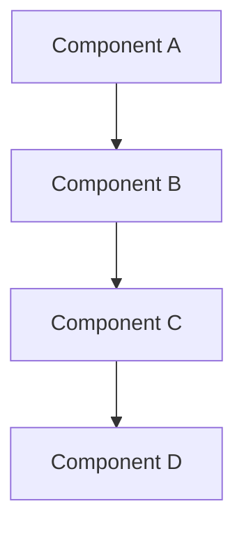
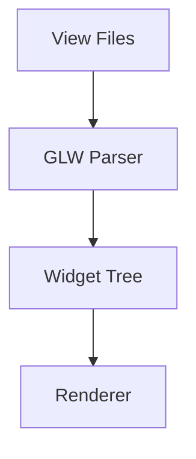
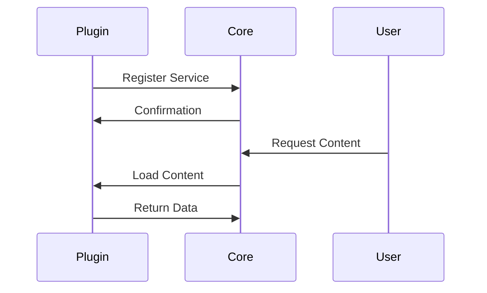
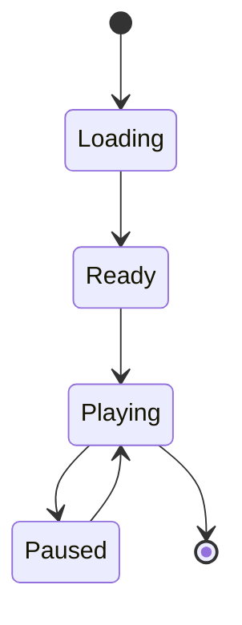

# Documentation Standards

This document defines the standards, conventions, and best practices for contributing to the Movian Architecture Documentation. Following these guidelines ensures consistency, maintainability, and high quality across all documentation.

## Purpose and Scope

These standards apply to all documentation in the Movian documentation repository, including:

- Architecture documentation
- API references
- Guides and tutorials
- Code examples
- Reference materials

## Target Audiences

Documentation should be written with these primary audiences in mind:

1. **Plugin Developers** - JavaScript developers creating Movian extensions
2. **UI Designers** - Developers customizing Movian's interface and themes
3. **Core Contributors** - C/C++ developers working on Movian's core functionality
4. **System Integrators** - Developers embedding Movian in other applications

## Document Structure Standards

### File Organization

```
docs/
├── architecture/          # Core system architecture
├── plugins/              # Plugin development
│   ├── api/             # API references
│   └── examples/        # Working examples
├── ui/                  # UI system and theming
│   ├── view-files/      # View file syntax
│   ├── widgets/         # Widget documentation
│   ├── theming/         # Theming system
│   ├── examples/        # UI examples
│   └── source-analysis/ # GLW source analysis
├── media/               # Media player components
├── guides/              # How-to guides
├── reference/           # Quick reference materials
├── examples-templates/  # Reusable templates
├── tests/               # Validation and testing
└── meta/                # Documentation about documentation
```

### File Naming Conventions

- Use lowercase with hyphens: `plugin-architecture.md`
- Use descriptive names: `http-api.md` not `api2.md`
- README.md for section overviews
- Match directory names to content: `plugins/architecture.md`

### Document Template

Every documentation file should follow this structure:

```markdown
# Document Title

Brief one-paragraph overview of what this document covers.

## Overview

Detailed introduction explaining:
- What this document covers
- Who should read it
- Prerequisites (if any)
- Related documents

## [Main Content Sections]

### Section Heading

Content organized logically...

## Examples

Practical examples demonstrating concepts.

## Best Practices

Recommended patterns and approaches.

## Common Pitfalls

Things to avoid and why.

## See Also

- [Related Document 1](RELATIVE_PATH_TO_DOC)
- [Related Document 2](RELATIVE_PATH_TO_DOC)
```

## Writing Style Guidelines

### Voice and Tone

- **Use active voice**: "The plugin loads the manifest" not "The manifest is loaded by the plugin"
- **Be direct and concise**: Avoid unnecessary words
- **Use present tense**: "The function returns" not "The function will return"
- **Address the reader**: Use "you" when giving instructions
- **Be objective**: Avoid subjective terms like "easy" or "simple"

### Language Conventions

- **Use American English spelling**: "color" not "colour"
- **Capitalize proper nouns**: Movian, JavaScript, OpenGL, GLW
- **Use consistent terminology**: Refer to the glossary for standard terms
- **Avoid jargon**: Explain technical terms on first use
- **Define acronyms**: "GLW (OpenGL Widget)" on first use

### Formatting Standards

#### Headings

- Use sentence case: "Plugin architecture" not "Plugin Architecture"
- Use descriptive headings: "Creating a content provider plugin" not "Example 1"
- Maintain hierarchy: Don't skip levels (H1 → H2 → H3)
- Limit to 4 levels deep (H1-H4)

#### Code Formatting

**Inline Code**:
- Use backticks for: `function names`, `variable names`, `file paths`, `commands`
- Example: "The `http.request()` function accepts a URL parameter"

**Code Blocks**:
- Always specify language for syntax highlighting
- Include comments explaining complex logic
- Keep examples focused and minimal
- Test all code examples before publishing

```javascript
// Good: Specific language, clear comments
/**
 * Register a content provider service
 */
service.create("My Service", "myservice:start", "video", true, 
  "skin://icons/myicon.png");
```

**File Paths**:
- Use forward slashes: `src/ui/glw/glw.c`
- Use relative paths in documentation: `../plugins/api/core-api.md`
- Use `skin://` protocol for skin resources: `skin://theme.view`

#### Lists

**Unordered Lists**:
- Use for non-sequential items
- Start with a capital letter
- End with period if complete sentences
- Use consistent punctuation

**Ordered Lists**:
- Use for sequential steps or ranked items
- Number from 1 (Markdown auto-numbers)
- Use for procedures and tutorials

**Definition Lists**:
```markdown
Term
: Definition of the term with explanation
```

#### Emphasis

- **Bold** for UI elements, important concepts, warnings
- *Italic* for emphasis, introducing new terms
- `Code formatting` for technical terms, functions, variables
- Don't overuse emphasis - it loses impact

### Links and References

#### Internal Links

- Use relative paths: `[Plugin Architecture](../plugins/architecture.md)`
- Link to specific sections: `[Threading Model](../architecture/threading.md#thread-safety)`
- Verify all links work (use link validator)

#### External Links

- Use descriptive text: `[Movian GitHub Repository](https://github.com/andoma/movian)`
- Avoid "click here" or "this link"
- Include context: "See the [ECMAScript specification](URL_HERE) for details"

#### Source Code References

When referencing source code:

```markdown
**Source Reference**: `src/ecmascript/es_http.c:123-456`

See the implementation in [`glw_view_parser.c`](https://github.com/andoma/movian/blob/master/src/ui/glw/glw_view_parser.c)
```

## Technical Content Standards

### API Documentation

Every API function must include:

```markdown
### function_name()

**Purpose**: Brief description of what the function does

**Syntax**:
```javascript
result = function_name(param1, param2, options)
```

**Parameters**:
- `param1` (type) - Description of parameter
- `param2` (type) - Description of parameter
- `options` (Object, optional) - Configuration options
  - `option1` (type) - Description
  - `option2` (type) - Description

**Returns**:
- (type) Description of return value

**Throws**:
- `ErrorType` - When this error occurs

**Example**:
```javascript
// Practical example showing typical usage
var result = function_name("value", 42, {
  option1: true
});
```

**Source Reference**: `src/path/to/file.c:line-range`

**Version**: Movian 4.8+

**See Also**:
- [Related Function](LINK_HERE)
- [Related Guide](LINK_HERE)
```

### Code Examples

#### Example Standards

- **Complete**: Examples should be runnable
- **Minimal**: Include only relevant code
- **Commented**: Explain non-obvious logic
- **Tested**: Verify examples work
- **Realistic**: Show real-world usage patterns

#### Example Template

```markdown
## Example: [Descriptive Title]

**Purpose**: What this example demonstrates

**Prerequisites**:
- Required knowledge or setup

**Code**:
```javascript
// Complete, working example
// with explanatory comments
```

**Explanation**:
Step-by-step breakdown of how the code works.

**Expected Output**:
What the user should see when running this example.

**Variations**:
Alternative approaches or modifications.
```

### Diagrams and Visualizations

#### Mermaid Diagrams

Use Mermaid for:
- Architecture diagrams
- Flow charts
- Sequence diagrams
- State diagrams

**Standards**:
- Keep diagrams simple and focused
- Use consistent styling
- Include diagram title
- Provide text description for accessibility

```markdown
**Architecture Overview**:



This diagram shows the data flow from Component A through to Component D.
```

#### Diagram Types

**Architecture Diagrams**:


**Sequence Diagrams**:


**State Diagrams**:


### Tables

Use tables for:
- Parameter lists
- Comparison matrices
- Reference data
- Configuration options

**Standards**:
- Include header row
- Align columns appropriately
- Keep tables readable (max 5-6 columns)
- Use line breaks for long content

```markdown
| Parameter | Type | Required | Description |
|-----------|------|----------|-------------|
| url | string | Yes | Target URL for request |
| method | string | No | HTTP method (default: GET) |
| timeout | number | No | Timeout in milliseconds |
```

## Accuracy and Verification

### Source Code Verification

- **Always verify against source code**: Don't rely on assumptions
- **Include source references**: Link to specific files and line numbers
- **Note version information**: Specify which Movian version
- **Mark accuracy status**: Use indicators for verification level

**Accuracy Indicators**:
- 🟢 **Verified**: Confirmed from source code analysis
- 🟡 **Inferred**: Logical deduction from related code
- 🔴 **Unverified**: Needs source code confirmation
- ⚠️ **Deprecated**: Feature no longer recommended

### Version Information

Always specify version applicability:

```markdown
**Version**: Movian 4.8+

**Deprecated**: This API is deprecated as of Movian 5.0. Use [new_api](LINK_HERE) instead.

**Experimental**: This feature is experimental and may change in future versions.
```

### Testing Requirements

- **Test all code examples**: Verify they work in actual Movian
- **Validate links**: Use link validator tool
- **Check cross-references**: Ensure referenced documents exist
- **Verify file paths**: Confirm source file references are correct

## Admonitions and Callouts

Use admonitions to highlight important information:

```markdown
!!! note "Note Title"
    Additional information that helps understanding.

!!! tip "Pro Tip"
    Helpful advice for better implementation.

!!! warning "Important"
    Critical information to avoid problems.

!!! danger "Caution"
    Serious warning about potential issues.

!!! example "Example"
    Practical demonstration of concept.

!!! info "Information"
    Supplementary details.
```

**Usage Guidelines**:
- Use sparingly - too many reduce impact
- Choose appropriate type for content
- Keep content concise
- Don't nest admonitions

## Glossary and Terminology

### Using the Glossary

- **Define terms on first use**: Link to glossary entry
- **Use consistent terminology**: Always use the same term for the same concept
- **Add new terms**: Update glossary when introducing new concepts
- **Cross-reference**: Link related terms

### Glossary Entry Format

```markdown
**Term_Name**
: Brief definition of the term.

  Extended explanation with context and usage. May include multiple paragraphs.
  
  **Example**: Practical example showing the term in use.
  
  **See Also**: [Related Term](LINK_HERE)
```

### Common Terms

Refer to [Glossary](../reference/glossary.md) for standard terminology:

- **Movian** - The media player application (not "movian" or "MOVIAN")
- **GLW** - OpenGL Widget system (always capitalized)
- **View Files** - UI definition files with .view extension
- **Plugin** - JavaScript extension (not "plug-in" or "add-on")
- **Skin** - Complete UI theme package
- **Widget** - UI component in GLW system

## Documentation Maintenance

### Update Procedures

1. **Review regularly**: Check documentation against latest source code
2. **Update version info**: Note when features change
3. **Fix broken links**: Run link validator periodically
4. **Improve clarity**: Refine based on user feedback
5. **Add examples**: Expand with real-world use cases

### Deprecation Process

When documenting deprecated features:

```markdown
!!! warning "Deprecated"
    This API is deprecated as of Movian 5.0 and will be removed in Movian 6.0.
    
    **Migration**: Use [new_api](LINK_HERE) instead. See [Migration Guide](LINK_HERE) for details.
    
    **Reason**: Explanation of why feature was deprecated.
```

### Change Tracking

- Use Git commit messages to track changes
- Update PROGRESS.md with major documentation updates
- Create task reports for significant additions
- Note breaking changes prominently

## Quality Checklist

Before submitting documentation, verify:

### Content Quality
- [ ] Accurate information verified from source code
- [ ] Clear and concise writing
- [ ] Appropriate level of detail for audience
- [ ] Complete examples that work
- [ ] Proper use of technical terminology

### Structure and Format
- [ ] Follows document template
- [ ] Proper heading hierarchy
- [ ] Consistent formatting throughout
- [ ] Code blocks have language specified
- [ ] Tables are properly formatted

### Links and References
- [ ] All internal links work
- [ ] External links are valid
- [ ] Source code references are accurate
- [ ] Cross-references are appropriate
- [ ] Glossary terms are linked

### Technical Accuracy
- [ ] Code examples tested
- [ ] API signatures verified
- [ ] Version information included
- [ ] Accuracy status indicated
- [ ] Deprecation warnings added

### Accessibility
- [ ] Diagrams have text descriptions
- [ ] Tables have headers
- [ ] Links have descriptive text
- [ ] Images have alt text
- [ ] Proper semantic markup

## Tools and Automation

### Validation Tools

The documentation includes several validation tools:

- **Link Validator**: `tests/link-validator.js` - Checks all links
- **Cross-Reference Validator**: `tests/cross-reference-validator.js` - Verifies references
- **File Reference Validator**: `tests/file-reference-validator.js` - Checks file paths
- **Macro Validator**: `tests/macro-validator.js` - Validates macro usage
- **View Syntax Validator**: `tests/view-syntax-validator.js` - Tests view file syntax

### Running Validation

```bash
# Run all validation tests
cd docs/tests
npm install
npm test

# Run specific validator
node link-validator.js
node cross-reference-validator.js
```

### Build and Preview

```bash
# Install MkDocs and dependencies
pip install -r requirements.txt

# Serve documentation locally
mkdocs serve

# Build static site
mkdocs build

# Deploy to GitHub Pages
mkdocs gh-deploy
```

## Contributing Guidelines

### Contribution Process

1. **Identify gap**: Find missing or outdated documentation
2. **Research**: Analyze source code and existing docs
3. **Draft**: Write documentation following these standards
4. **Review**: Self-review using quality checklist
5. **Test**: Validate examples and links
6. **Submit**: Create pull request with clear description

### Pull Request Standards

**Title Format**: `docs: [section] - Brief description`

**Description Template**:
```markdown
## Changes
- List of changes made
- Files added or modified

## Verification
- [ ] Code examples tested
- [ ] Links validated
- [ ] Follows documentation standards
- [ ] Accuracy verified from source

## Related Issues
Fixes #123
```

### Review Criteria

Documentation reviews check for:
- Accuracy and correctness
- Clarity and readability
- Completeness of information
- Adherence to standards
- Quality of examples
- Proper formatting

## Style Guide Summary

### Quick Reference

**DO**:
- ✅ Use active voice
- ✅ Be concise and direct
- ✅ Include working examples
- ✅ Verify against source code
- ✅ Link to related documentation
- ✅ Use consistent terminology
- ✅ Test all code examples
- ✅ Include version information

**DON'T**:
- ❌ Use passive voice unnecessarily
- ❌ Include untested examples
- ❌ Make assumptions without verification
- ❌ Use inconsistent terminology
- ❌ Skip source code references
- ❌ Overuse emphasis
- ❌ Create orphaned documents
- ❌ Ignore accessibility

## Examples of Good Documentation

### Good API Documentation Example

```markdown
### http.request()

**Purpose**: Execute an HTTP request and return the response

**Syntax**:
```javascript
response = http.request(url, options)
```

**Parameters**:
- `url` (string) - Target URL for the HTTP request
- `options` (Object, optional) - Request configuration
  - `method` (string) - HTTP method: GET, POST, PUT, DELETE (default: GET)
  - `headers` (Object) - Request headers as key-value pairs
  - `postdata` (string|Buffer) - Request body for POST/PUT requests
  - `timeout` (number) - Request timeout in milliseconds (default: 30000)

**Returns**:
- (Object) Response object with properties:
  - `statuscode` (number) - HTTP status code (200, 404, etc.)
  - `body` (string) - Response body content
  - `headers` (Object) - Response headers

**Throws**:
- `Error` - Network errors, timeouts, or invalid URLs

**Example**:
```javascript
// Fetch JSON data from API
var response = http.request('https://api.example.com/data', {
  method: 'GET',
  headers: {
    'User-Agent': 'Movian Plugin/1.0',
    'Accept': 'application/json'
  },
  timeout: 30000
});

if (response.statuscode === 200) {
  var data = JSON.parse(response.body);
  console.log('Received:', data.title);
} else {
  console.error('Request failed:', response.statuscode);
}
```

**Source Reference**: `src/ecmascript/es_http.c:245-389`

**Version**: Movian 4.8+

**See Also**:
- [HTTP & Networking Guide](../guides/http-networking.md)
- [HTML Parsing](../plugins/api/html-modules-comparison.md)
```

### Good Tutorial Example

```markdown
## Creating a Content Provider Plugin

This guide walks you through creating a basic content provider plugin that displays a list of videos.

### Prerequisites

- Basic JavaScript knowledge
- Movian installed and running
- Text editor for code

### Step 1: Create Plugin Directory

Create a new directory for your plugin:

```
my-video-plugin/
├── plugin.json
└── index.js
```

### Step 2: Define Plugin Manifest

Create `plugin.json` with basic metadata:

```json
{
  "id": "my-video-plugin",
  "version": "1.0.0",
  "title": "My Video Plugin",
  "synopsis": "Provides video content",
  "author": "Your Name",
  "homepage": "https://example.com",
  "type": "javascript",
  "file": "index.js"
}
```

### Step 3: Register Service

In `index.js`, register your content provider:

```javascript
/**
 * Register the video service
 */
(function(plugin) {
  // Create service
  var service = plugin.createService("My Videos", "myvideos:start", "video", true,
    "skin://icons/ic_videocam_48px.svg");
  
  // Handle service start
  service.addURI("myvideos:start", function(page) {
    page.type = "directory";
    page.contents = "items";
    page.metadata.title = "My Videos";
    
    // Add video items
    page.appendItem("myvideos:video:1", "directory", {
      title: "Sample Video 1",
      icon: "https://example.com/thumb1.jpg"
    });
  });
})(this);
```

### Step 4: Test Plugin

1. Copy plugin directory to Movian plugins folder
2. Restart Movian
3. Navigate to "My Videos" in the main menu
4. Verify video list appears

### Next Steps

- Add video playback functionality
- Implement search feature
- Add settings for customization

See [Advanced Plugin Examples](../plugins/examples/advanced-ui-plugin/README.md) for more features.
```

## Conclusion

Following these documentation standards ensures that the Movian documentation remains:

- **Consistent**: Uniform style and structure throughout
- **Accurate**: Verified against source code
- **Maintainable**: Easy to update and extend
- **Accessible**: Clear and understandable for all audiences
- **Professional**: High-quality technical documentation

When in doubt, refer to existing high-quality documentation as examples, and always prioritize clarity and accuracy over brevity.

## See Also

- [Glossary](../reference/glossary.md) - Standard terminology
- [Accuracy Tracking](accuracy-tracking.md) - Verification status
- [Source References](source-references.md) - Source code mapping
- [Contributing Guide](../CONTRIBUTING.md) - How to contribute
