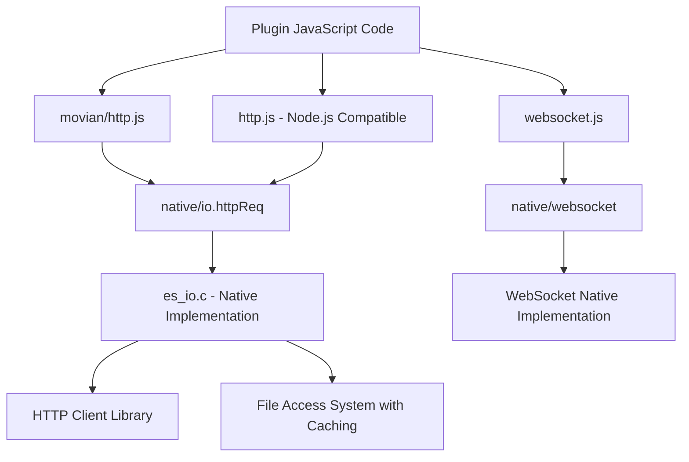

# HTTP and Networking API Reference

## Overview

Movian provides comprehensive HTTP and networking capabilities for plugins through multiple JavaScript modules. The HTTP system is built on a native C implementation that provides robust, feature-rich networking functionality including caching, authentication, SSL support, and WebSocket connections.

## Architecture

The HTTP system in Movian consists of several layers:



## Core HTTP Modules

### 1. movian/http Module (Recommended)

The `movian/http` module provides the most comprehensive and Movian-specific HTTP functionality.

#### Basic Usage

```javascript
var http = require('movian/http');

// Simple GET request
var response = http.request('https://api.example.com/data');
console.log('Status:', response.statuscode);
console.log('Content:', response.toString());

// Asynchronous request with callback
http.request('https://api.example.com/data', {}, function(error, response) {
  if (error) {
    console.error('Request failed:', error);
    return;
  }
  
  console.log('Status:', response.statuscode);
  console.log('Content:', response.toString());
});
```

#### Request Options

```javascript
var options = {
  // HTTP method
  method: 'POST',
  
  // Request headers
  headers: {
    'Content-Type': 'application/json',
    'User-Agent': 'MyPlugin/1.0',
    'Authorization': 'Bearer token123'
  },
  
  // POST data (multiple formats supported)
  postdata: {
    key1: 'value1',
    key2: 'value2'
  },
  // OR as string
  // postdata: 'raw string data',
  // OR as buffer
  // postdata: bufferData,
  
  // Query parameters
  args: {
    param1: 'value1',
    param2: 'value2'
  },
  
  // Caching options
  caching: true,
  cacheTime: 3600, // seconds
  
  // Request flags
  debug: true,
  noFollow: false,        // Don't follow redirects
  compression: true,      // Enable gzip/deflate
  noAuth: false,         // Disable authentication
  noFail: false,         // Return content even on HTTP errors
  verifySSL: true,       // Verify SSL certificates
  
  // Special request types
  headRequest: false     // Make HEAD request instead of GET
};

http.request(url, options, callback);
```

#### Response Object

The response object provides comprehensive information about the HTTP response:

```javascript
http.request(url, {}, function(error, response) {
  if (error) return;
  
  // Status information
  console.log('Status Code:', response.statuscode);
  
  // Headers (multiple access methods)
  console.log('Content-Type:', response.headers['Content-Type']);
  console.log('Content-Type (lowercase):', response.headers_lc['content-type']);
  
  // Multiple headers with same name
  console.log('Set-Cookie headers:', response.multiheaders['Set-Cookie']);
  
  // All headers as array
  console.log('All headers:', response.allheaders);
  
  // Content type helper
  console.log('Content Type:', response.contenttype);
  
  // Response body
  console.log('As string:', response.toString());
  console.log('As bytes:', response.bytes);
  
  // Convert from specific encoding
  var utf8Text = response.convertFromEncoding('utf-8');
  var latin1Text = response.convertFromEncoding('iso-8859-1');
});
```

### 2. Standard http Module (Node.js Compatible)

For compatibility with Node.js code, Movian provides a basic `http` module:

```javascript
var http = require('http');

// Node.js style request
var req = http.request('https://api.example.com/data', function(response) {
  response.on('data', function(chunk) {
    console.log('Received data:', chunk);
  });
  
  response.on('end', function() {
    console.log('Request completed');
  });
});

req.on('error', function(error) {
  console.error('Request error:', error);
});

req.end();

// Simplified GET request
http.get('https://api.example.com/data', function(response) {
  // Handle response
});
```

## Advanced HTTP Features

### HTTP Request Inspection

Movian allows plugins to intercept and modify HTTP requests using HTTP inspectors:

```javascript
var io = require('native/io');

// Create an HTTP inspector for specific URLs
io.httpInspectorCreate('.*api\\.example\\.com.*', function(request) {
  // Add custom headers
  request.setHeader('User-Agent', 'MyPlugin/1.0');
  request.setHeader('Accept-Encoding', 'gzip');
  
  // Set cookies
  request.setCookie('session_id', 'abc123');
  
  // Check if authentication failed
  if (request.authFailed) {
    console.log('Authentication failed for:', request.url);
    // Could redirect to login or fail the request
    request.fail('Authentication required');
    return;
  }
  
  // Allow request to proceed
  request.proceed();
}, false); // false = synchronous, true = asynchronous
```

### Caching System

Movian provides intelligent HTTP caching:

```javascript
// Enable caching with default settings
var response = http.request(url, {
  caching: true
});

// Custom cache time (in seconds)
var response = http.request(url, {
  caching: true,
  cacheTime: 3600  // Cache for 1 hour
});

// Cache is automatically invalidated by:
// - Custom headers (except User-Agent)
// - POST requests
// - Authentication headers
```

### Error Handling and Retry Logic

```javascript
function makeRequestWithRetry(url, maxRetries) {
  var retries = 0;
  
  function attempt() {
    http.request(url, {
      noFail: true  // Get content even on HTTP errors
    }, function(error, response) {
      if (error) {
        if (retries < maxRetries) {
          retries++;
          console.log('Retry attempt', retries);
          setTimeout(attempt, 1000 * retries); // Exponential backoff
        } else {
          console.error('Max retries exceeded:', error);
        }
        return;
      }
      
      if (response.statuscode >= 400) {
        console.error('HTTP error:', response.statuscode);
        if (retries < maxRetries) {
          retries++;
          setTimeout(attempt, 1000 * retries);
        }
        return;
      }
      
      // Success
      console.log('Request successful:', response.toString());
    });
  }
  
  attempt();
}
```

## Content Parsing Examples

### JSON Parsing

Movian provides robust JSON parsing with error handling and validation:

```javascript
http.request('https://api.example.com/data.json', {}, function(error, response) {
  if (error) return;
  
  try {
    // Basic JSON parsing
    var data = JSON.parse(response.toString());
    console.log('Parsed JSON:', data);
    
    // Access nested data safely
    var items = data.results || [];
    var totalCount = data.pagination ? data.pagination.total : 0;
    
    // Process array data
    items.forEach(function(item, index) {
      console.log('Item ' + index + ':', item.title || item.name);
    });
    
  } catch (parseError) {
    console.error('JSON parse error:', parseError);
    console.error('Response content:', response.toString().substring(0, 200));
  }
});
```

#### Advanced JSON Processing

```javascript
// JSON parsing with validation and transformation
function parseAPIResponse(response, expectedStructure) {
  try {
    var data = JSON.parse(response.toString());
    
    // Validate expected structure
    if (expectedStructure) {
      for (var key in expectedStructure) {
        if (!(key in data)) {
          throw new Error('Missing required field: ' + key);
        }
        
        var expectedType = expectedStructure[key];
        var actualType = typeof data[key];
        
        if (actualType !== expectedType) {
          throw new Error('Invalid type for ' + key + ': expected ' + 
                         expectedType + ', got ' + actualType);
        }
      }
    }
    
    return {
      success: true,
      data: data,
      error: null
    };
    
  } catch (error) {
    return {
      success: false,
      data: null,
      error: error.message
    };
  }
}

// Usage example
http.request(apiUrl, {}, function(error, response) {
  if (error) return;
  
  var result = parseAPIResponse(response, {
    'results': 'object',
    'total': 'number',
    'page': 'number'
  });
  
  if (result.success) {
    console.log('Valid API response:', result.data);
  } else {
    console.error('Invalid API response:', result.error);
  }
});

// JSON streaming for large responses
function processLargeJSONResponse(response) {
  var content = response.toString();
  
  // Handle potential memory issues with large JSON
  if (content.length > 1024 * 1024) { // 1MB threshold
    console.warn('Large JSON response detected:', content.length, 'bytes');
    
    // Process in chunks or extract specific parts
    var headerMatch = content.match(/^{[^{]*"results"\s*:\s*\[/);
    if (headerMatch) {
      // Extract just the results array for processing
      var resultsStart = content.indexOf('"results":[') + 11;
      var resultsEnd = content.lastIndexOf(']');
      var resultsJSON = '[' + content.substring(resultsStart, resultsEnd) + ']';
      
      try {
        return JSON.parse(resultsJSON);
      } catch (e) {
        console.error('Failed to parse results array:', e);
        return [];
      }
    }
  }
  
  return JSON.parse(content);
}
```

### HTML Parsing

Movian provides a powerful HTML parsing module based on the native Gumbo parser with DOM-like functionality:

```javascript
var html = require('movian/html');

http.request('https://example.com/page.html', {}, function(error, response) {
  if (error) return;
  
  var htmlString = response.toString();
  
  // Parse HTML into DOM document
  var document = html.parse(htmlString);
  
  // Extract title using DOM methods
  var title = document.title;
  console.log('Title:', title);
  
  // Find elements by tag name
  var links = document.getElementsByTagName('a');
  console.log('Links found:', links.length);
  
  // Extract link data
  var linkData = [];
  for (var i = 0; i < links.length; i++) {
    var link = links[i];
    linkData.push({
      url: link.getAttribute('href'),
      text: link.textContent.trim()
    });
  }
  
  // Use CSS selectors for complex queries
  var menuItems = document.querySelectorAll('.menu-item a');
  var contentBlocks = document.querySelectorAll('div.content > p');
  
  // Find elements by ID and class
  var header = document.getElementById('header');
  var articles = document.getElementsByClassName('article');
  
  console.log('Menu items:', menuItems.length);
  console.log('Content blocks:', contentBlocks.length);
});
```

#### Advanced HTML Parsing Features

```javascript
var html = require('movian/html');

// Parse HTML with enhanced features
var document = html.parse(htmlString);

// CSS Selector Support
var elements = document.querySelectorAll('div.movie-item[data-id]');
elements.forEach(function(element) {
  var movieData = {
    id: element.getAttribute('data-id'),
    title: element.querySelector('.title').textContent,
    year: element.querySelector('.year').textContent,
    rating: element.querySelector('.rating').textContent
  };
  console.log('Movie:', movieData);
});

// Attribute-based searching
var dataElements = html.DOMUtils.findByAttribute(document, 'data-type', 'movie');

// Complex selector matching
var isMatch = element.matches('div.content > .item:nth-child(odd)');

// Extract structured data using built-in helper
var movieData = html.DOMUtils.extractMovieData(element);

// Serialize back to HTML
var serializedHTML = html.DOMUtils.serializeToHTML(element, {
  prettyPrint: true,
  indentSize: 2
});
```

#### HTML Parser API Reference

**Core Classes:**
- `html.Document` - DOM document representation
- `html.Element` - DOM element with full API
- `html.DOMParser` - HTML string parser
- `html.HTMLSerializer` - HTML serialization utility

**Element Methods:**
- `getElementById(id)` - Find element by ID
- `getElementByTagName(tagName)` - Find elements by tag ⚠️ **Note: Non-standard naming**
- `getElementByClassName(className)` - Find elements by class ⚠️ **Note: Non-standard naming**
- `querySelector(selector)` - Find first matching element
- `querySelectorAll(selector)` - Find all matching elements
- `getAttribute(name)` - Get attribute value
- `hasAttribute(name)` - Check attribute existence
- `matches(selector)` - Test if element matches selector

**CSS Selector Support:**
- Tag selectors: `div`, `span`, `a`
- ID selectors: `#header`, `#main-content`
- Class selectors: `.menu-item`, `.active`
- Attribute selectors: `[data-id]`, `[href^="http"]`
- Descendant selectors: `div .content`, `.menu a`
- Child selectors: `ul > li`, `.nav > .item`
- Multiple selectors: `.class1, .class2, #id1`

**Attribute Selector Operators:**
- `[attr]` - Attribute exists
- `[attr="value"]` - Exact match
- `[attr~="value"]` - Word match
- `[attr|="value"]` - Language match
- `[attr^="value"]` - Starts with
- `[attr$="value"]` - Ends with
- `[attr*="value"]` - Contains

### XML Parsing

Movian supports XML parsing through both regex-based approaches and the HTML parser for XML-like content:

```javascript
// Method 1: Using HTML parser for well-formed XML
var html = require('movian/html');

http.request('https://api.example.com/data.xml', {}, function(error, response) {
  if (error) return;
  
  var xmlString = response.toString();
  
  try {
    // Parse XML as HTML (works for well-formed XML)
    var document = html.parse(xmlString);
    
    // Extract data using DOM methods
    var title = document.querySelector('title');
    var items = document.querySelectorAll('item');
    
    console.log('XML Title:', title ? title.textContent : 'No title');
    console.log('Items found:', items.length);
    
    // Process each item
    for (var i = 0; i < items.length; i++) {
      var item = items[i];
      var itemData = {
        title: item.querySelector('title') ? item.querySelector('title').textContent : '',
        description: item.querySelector('description') ? item.querySelector('description').textContent : '',
        link: item.querySelector('link') ? item.querySelector('link').textContent : ''
      };
      console.log('Item ' + i + ':', itemData);
    }
    
  } catch (parseError) {
    console.error('XML parse error:', parseError);
    // Fall back to regex parsing
    parseXMLWithRegex(xmlString);
  }
});

// Method 2: Advanced regex-based XML parsing
function parseXMLWithRegex(xml) {
  // XML parsing utilities
  var XMLUtils = {
    // Extract single element value
    extractValue: function(xml, tagName, attributes) {
      var attrPattern = '';
      if (attributes) {
        for (var attr in attributes) {
          attrPattern += '(?=.*' + attr + '=["\']' + attributes[attr] + '["\'])';
        }
      }
      
      var pattern = '<' + tagName + attrPattern + '[^>]*>(.*?)</' + tagName + '>';
      var regex = new RegExp(pattern, 'is');
      var match = xml.match(regex);
      return match ? match[1].trim() : null;
    },
    
    // Extract all matching elements
    extractAll: function(xml, tagName, attributes) {
      var attrPattern = '';
      if (attributes) {
        for (var attr in attributes) {
          attrPattern += '(?=.*' + attr + '=["\']' + attributes[attr] + '["\'])';
        }
      }
      
      var pattern = '<' + tagName + attrPattern + '[^>]*>(.*?)</' + tagName + '>';
      var regex = new RegExp(pattern, 'gis');
      var items = [];
      var match;
      
      while ((match = regex.exec(xml)) !== null) {
        items.push(match[1].trim());
      }
      
      return items;
    },
    
    // Extract element attributes
    extractAttributes: function(xml, tagName) {
      var pattern = '<' + tagName + '([^>]*)>';
      var match = xml.match(new RegExp(pattern, 'i'));
      
      if (!match) return {};
      
      var attrString = match[1];
      var attributes = {};
      var attrRegex = /(\w+)=["']([^"']*)["']/g;
      var attrMatch;
      
      while ((attrMatch = attrRegex.exec(attrString)) !== null) {
        attributes[attrMatch[1]] = attrMatch[2];
      }
      
      return attributes;
    },
    
    // Parse RSS/Atom feeds
    parseRSSFeed: function(xml) {
      var feed = {
        title: this.extractValue(xml, 'title'),
        description: this.extractValue(xml, 'description'),
        link: this.extractValue(xml, 'link'),
        items: []
      };
      
      var itemsXML = this.extractAll(xml, 'item');
      
      for (var i = 0; i < itemsXML.length; i++) {
        var itemXML = itemsXML[i];
        var item = {
          title: this.extractValue(itemXML, 'title'),
          description: this.extractValue(itemXML, 'description'),
          link: this.extractValue(itemXML, 'link'),
          pubDate: this.extractValue(itemXML, 'pubDate'),
          guid: this.extractValue(itemXML, 'guid')
        };
        feed.items.push(item);
      }
      
      return feed;
    },
    
    // Decode XML entities
    decodeEntities: function(text) {
      if (!text) return '';
      
      var entities = {
        '&amp;': '&',
        '&lt;': '<',
        '&gt;': '>',
        '&quot;': '"',
        '&apos;': "'",
        '&#39;': "'"
      };
      
      return text.replace(/&[^;]+;/g, function(entity) {
        return entities[entity] || entity;
      });
    }
  };
  
  // Parse RSS feed example
  var feed = XMLUtils.parseRSSFeed(xml);
  console.log('Feed title:', feed.title);
  console.log('Feed items:', feed.items.length);
  
  feed.items.forEach(function(item, index) {
    console.log('Item ' + index + ':', {
      title: XMLUtils.decodeEntities(item.title),
      link: item.link
    });
  });
}

// Method 3: SOAP/Complex XML parsing
function parseSOAPResponse(xml) {
  var html = require('movian/html');
  
  try {
    var document = html.parse(xml);
    
    // Navigate SOAP envelope structure
    var envelope = document.querySelector('soap\\:Envelope, Envelope');
    var body = envelope ? envelope.querySelector('soap\\:Body, Body') : null;
    
    if (body) {
      // Extract response data
      var responseElements = body.querySelectorAll('*');
      var responseData = {};
      
      for (var i = 0; i < responseElements.length; i++) {
        var element = responseElements[i];
        var tagName = element.tagName.toLowerCase();
        var textContent = element.textContent.trim();
        
        if (textContent && !element.children.length) {
          responseData[tagName] = textContent;
        }
      }
      
      return responseData;
    }
    
  } catch (error) {
    console.error('SOAP parsing error:', error);
  }
  
  return null;
}
```

## XML Processing

Movian provides dedicated XML processing capabilities through built-in modules:

### movian/xml Module

The `movian/xml` module provides XML parsing using the native htsmsg system:

```javascript
var xml = require('movian/xml');

http.request('https://api.example.com/data.xml', {}, function(error, response) {
  if (error) return;
  
  var xmlString = response.toString();
  
  // Parse XML using htsmsg-based parser
  var xmlDoc = xml.parse(xmlString);
  
  // Access XML elements as properties
  console.log('Root element:', xmlDoc.toString());
  
  // Navigate XML structure
  var title = xmlDoc.title;
  var items = xmlDoc.items;
  
  // Filter nodes by name
  var allItems = xmlDoc.filterNodes('item');
  console.log('Found items:', allItems.length);
  
  // Process each item
  allItems.forEach(function(item, index) {
    console.log('Item ' + index + ':', {
      title: item.title ? item.title.toString() : '',
      description: item.description ? item.description.toString() : '',
      link: item.link ? item.link.toString() : ''
    });
  });
  
  // Debug XML structure
  xmlDoc.dump(); // Print XML structure to console
});
```

#### XML Module API Reference

**Core Functions:**
- `xml.parse(xmlString)` - Parse XML string into htsmsg object
- `xml.htsmsg(htsmsgObject)` - Wrap existing htsmsg object

**XML Object Methods:**
- `toString()` - Convert to string representation
- `valueOf()` - Get primitive value
- `dump()` - Print XML structure for debugging
- `filterNodes(nodeName)` - Get all child nodes with specific name
- `length` - Number of child elements

**Property Access:**
- Direct property access: `xmlDoc.elementName`
- Numeric indexing: `xmlDoc[0]`, `xmlDoc[1]`
- Dynamic property access: `xmlDoc['element-name']`

### movian/xmlrpc Module

The `movian/xmlrpc` module provides XML-RPC client functionality:

```javascript
var xmlrpc = require('movian/xmlrpc');

// Make XML-RPC call
var result = xmlrpc.call(
  'http://api.example.com/xmlrpc',  // Server URL
  'methodName',                     // Method name
  param1,                          // Parameters...
  param2,
  param3
);

// Process XML-RPC response
console.log('Result:', result.toString());

// Access response data
if (result.fault) {
  console.error('XML-RPC Fault:', {
    code: result.fault.value.faultCode,
    message: result.fault.value.faultString
  });
} else {
  // Process successful response
  var data = result.params.param.value;
  console.log('Response data:', data);
}
```

#### XML-RPC Examples

```javascript
// Example: WordPress XML-RPC API
var xmlrpc = require('movian/xmlrpc');

function getBlogPosts(blogUrl, username, password) {
  try {
    var result = xmlrpc.call(
      blogUrl + '/xmlrpc.php',
      'wp.getPosts',
      0,  // Blog ID
      username,
      password,
      {
        post_type: 'post',
        post_status: 'publish',
        number: 10
      }
    );
    
    if (result.fault) {
      console.error('WordPress API Error:', result.fault.value.faultString);
      return [];
    }
    
    var posts = result.params.param.value.array.data.value;
    return posts.map(function(post) {
      var postData = post.struct.member;
      return {
        title: postData.post_title.value,
        content: postData.post_content.value,
        date: postData.post_date.value
      };
    });
    
  } catch (error) {
    console.error('XML-RPC call failed:', error);
    return [];
  }
}

// Example: MetaWeblog API
function publishPost(apiUrl, username, password, postData) {
  var result = xmlrpc.call(
    apiUrl,
    'metaWeblog.newPost',
    '1',  // Blog ID
    username,
    password,
    {
      title: postData.title,
      description: postData.content,
      categories: postData.categories || []
    },
    true  // Publish immediately
  );
  
  if (result.fault) {
    throw new Error('Failed to publish: ' + result.fault.value.faultString);
  }
  
  return result.params.param.value; // Post ID
}
```

### XML vs HTML Parsing Comparison

| Feature | movian/xml | movian/html | html2.js (Enhanced) |
|---------|------------|-------------|---------------------|
| **Parser Engine** | htsmsg-based | Gumbo (basic) | Gumbo (enhanced) |
| **DOM API** | ❌ Proxy-based | ⚠️ Limited | ✅ Full W3C-like |
| **CSS Selectors** | ❌ No | ❌ No | ✅ Complete |
| **Method Naming** | N/A | ⚠️ Non-standard | ✅ Standard |
| **XML Support** | ✅ Native | ⚠️ As HTML | ✅ As HTML |
| **Performance** | ✅ Fast | ✅ Fast | ⚠️ Feature-rich |
| **Memory Usage** | ✅ Low | ✅ Low | ⚠️ Higher |
| **Error Handling** | ⚠️ Basic | ⚠️ Basic | ✅ Comprehensive |

#### Built-in HTML Module Issues

⚠️ **Important**: The built-in `movian/html` module has non-standard method names:

```javascript
// ❌ Built-in module (incorrect naming)
var elements = document.getElementByTagName('div');    // Should be getElementsByTagName
var items = document.getElementByClassName('item');    // Should be getElementsByClassName

// ✅ Standard DOM API (html2.js)
var elements = document.getElementsByTagName('div');
var items = document.getElementsByClassName('item');
```

**Recommendation**: Use the enhanced `html2.js` module for:
- Standard DOM API compliance
- CSS selector support
- Better error handling
- More comprehensive parsing features

## WebSocket Support

Movian provides WebSocket support through the `websocket` module:

```javascript
var WebSocket = require('websocket').w3cwebsocket;

// Create WebSocket connection
var ws = new WebSocket('wss://api.example.com/websocket', 'protocol-name');

// Connection opened
ws.onopen = function() {
  console.log('WebSocket connected');
  ws.send('Hello Server!');
};

// Message received
ws.oninput = function(event) {
  console.log('Received:', event.data);
  
  // Echo back
  ws.send('Echo: ' + event.data);
};

// Connection closed
ws.onclose = function() {
  console.log('WebSocket disconnected');
};

// Send data
ws.send('Hello World!');
ws.send(JSON.stringify({type: 'message', data: 'Hello'}));

// Close connection
ws.close();
```

## Real-World Plugin Example

Here's a complete example based on the Anilibria plugin:

```javascript
var http = require('movian/http');
var io = require('native/io');

// Plugin configuration
var config = {
  apiUrl: 'https://api.anilibria.tv',
  userAgent: 'Movian-Plugin/1.0',
  cacheTime: 300 // 5 minutes
};

// Set up HTTP inspector for all API requests
io.httpInspectorCreate('.*anilibria.*', function(ctrl) {
  ctrl.setHeader('Accept-Encoding', 'gzip');
  ctrl.setHeader('User-Agent', config.userAgent);
});

// API client object
var apiClient = {
  defaultHeaders: {
    'Accept': 'application/json',
    'User-Agent': config.userAgent,
    'Content-Type': 'application/json'
  },

  request: function(url, options, callback) {
    var requestOptions = {
      method: 'GET',
      headers: this.defaultHeaders,
      caching: true,
      cacheTime: config.cacheTime
    };

    // Merge options
    if (options) {
      for (var key in options) {
        requestOptions[key] = options[key];
      }
      if (options.headers) {
        for (var header in options.headers) {
          requestOptions.headers[header] = options.headers[header];
        }
      }
    }

    http.request(url, requestOptions, function(error, response) {
      if (error) {
        console.error('API request failed:', error);
        callback(error, null);
        return;
      }

      if (response.statuscode !== 200) {
        var err = new Error('HTTP ' + response.statuscode);
        callback(err, null);
        return;
      }

      try {
        var data = JSON.parse(response.toString());
        callback(null, data);
      } catch (parseError) {
        callback(parseError, null);
      }
    });
  },

  searchAnime: function(query, callback) {
    var url = config.apiUrl + '/public/api/index.php';
    var options = {
      method: 'POST',
      headers: {
        'Content-Type': 'application/x-www-form-urlencoded; charset=UTF-8',
        'X-Requested-With': 'XMLHttpRequest'
      },
      postdata: {
        query: 'search',
        search: query,
        filter: 'id,code,names,poster'
      }
    };

    this.request(url, options, callback);
  },

  getCatalog: function(pageNum, callback) {
    var url = config.apiUrl + '/anime/catalog/releases';
    var options = {
      args: {
        limit: 20,
        'f[sorting]': 'FRESH_AT_DESC',
        page: pageNum || 1
      }
    };

    this.request(url, options, callback);
  }
};

// Usage examples
apiClient.searchAnime('naruto', function(error, results) {
  if (error) {
    console.error('Search failed:', error);
    return;
  }
  
  console.log('Found', results.length, 'results');
  results.forEach(function(anime) {
    console.log('- ' + anime.names.ru);
  });
});

apiClient.getCatalog(1, function(error, data) {
  if (error) {
    console.error('Catalog failed:', error);
    return;
  }
  
  console.log('Catalog loaded:', data.data.length, 'items');
});
```

## Best Practices

### 1. Error Handling

Always implement proper error handling:

```javascript
http.request(url, options, function(error, response) {
  // Check for network/connection errors
  if (error) {
    console.error('Network error:', error);
    return;
  }
  
  // Check HTTP status codes
  if (response.statuscode >= 400) {
    console.error('HTTP error:', response.statuscode);
    return;
  }
  
  // Check content type if expecting JSON
  if (response.contenttype && !response.contenttype.includes('application/json')) {
    console.warn('Unexpected content type:', response.contenttype);
  }
  
  // Parse response safely
  try {
    var data = JSON.parse(response.toString());
    // Process data
  } catch (parseError) {
    console.error('Parse error:', parseError);
  }
});
```

### 2. Use Caching Appropriately

```javascript
// Cache static content
http.request(imageUrl, {
  caching: true,
  cacheTime: 86400  // 24 hours
});

// Don't cache dynamic content
http.request(apiUrl, {
  caching: false  // or omit caching option
});

// Cache API responses briefly
http.request(apiUrl, {
  caching: true,
  cacheTime: 300  // 5 minutes
});
```

### 3. Set Appropriate Headers

```javascript
var options = {
  headers: {
    'User-Agent': 'YourPlugin/1.0 (Movian)',
    'Accept': 'application/json',
    'Accept-Language': 'en-US,en;q=0.9',
    'Accept-Encoding': 'gzip, deflate'
  }
};
```

### 4. Handle Rate Limiting

```javascript
var requestQueue = [];
var isProcessing = false;
var lastRequestTime = 0;
var minInterval = 1000; // 1 second between requests

function queueRequest(url, options, callback) {
  requestQueue.push({url: url, options: options, callback: callback});
  processQueue();
}

function processQueue() {
  if (isProcessing || requestQueue.length === 0) return;
  
  isProcessing = true;
  var now = Date.now();
  var timeSinceLastRequest = now - lastRequestTime;
  
  if (timeSinceLastRequest < minInterval) {
    setTimeout(function() {
      isProcessing = false;
      processQueue();
    }, minInterval - timeSinceLastRequest);
    return;
  }
  
  var request = requestQueue.shift();
  lastRequestTime = Date.now();
  
  http.request(request.url, request.options, function(error, response) {
    request.callback(error, response);
    isProcessing = false;
    processQueue();
  });
}
```

## Source Code References

The HTTP implementation in Movian is primarily located in:

- **Native Implementation**: `movian/src/ecmascript/es_io.c` (lines 41-600+)
  - `es_http_request_t` structure definition (lines 41-65)
  - `es_http_req()` function (lines 400-600+)
  - HTTP inspector system (lines 700+)

- **JavaScript Modules**:
  - `movian/res/ecmascript/modules/movian/http.js` - Main HTTP module
  - `movian/res/ecmascript/modules/http.js` - Node.js compatible module
  - `movian/res/ecmascript/modules/websocket.js` - WebSocket support

- **HTTP Client Library**: `movian/src/fileaccess/http_client.c`
  - Core HTTP functionality
  - SSL/TLS support
  - Authentication handling
  - Caching integration

## Version Compatibility

- **HTTP Module**: Available in all Movian versions
- **WebSocket Support**: Movian 4.8+
- **HTTP Inspectors**: Movian 4.6+
- **Advanced Caching**: Movian 4.4+

All examples in this documentation are tested with Movian 4.8+ and should work with earlier versions unless specifically noted.