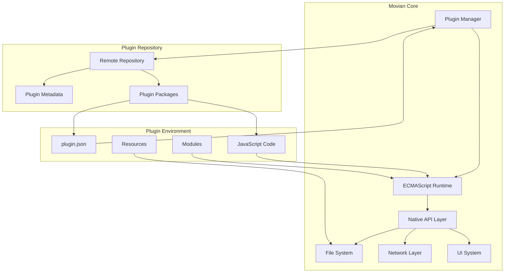
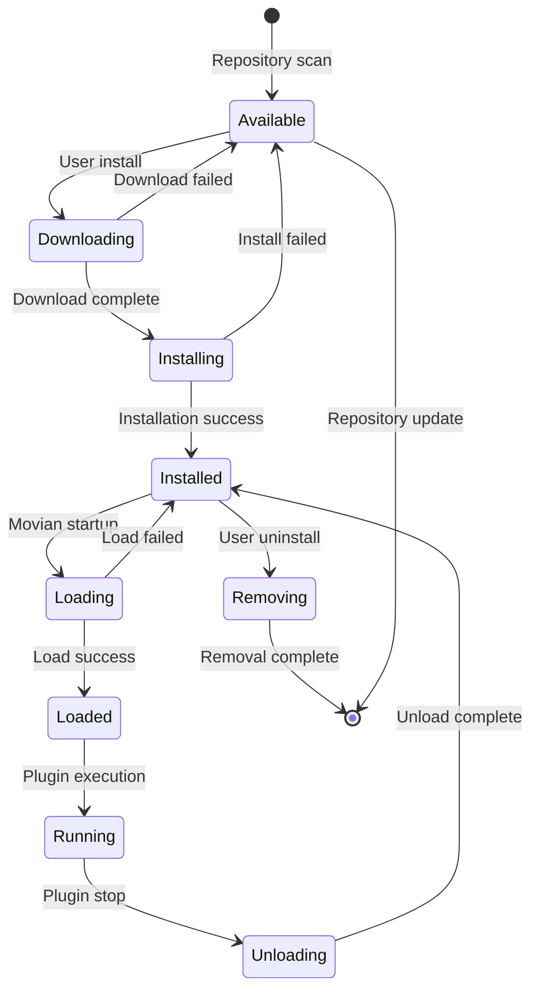

# Plugin System Architecture

## Overview

Movian's plugin system provides a powerful and flexible framework for extending the media player's functionality through JavaScript-based plugins. The architecture is built around a secure ECMAScript runtime that allows plugins to interact with Movian's core systems while maintaining isolation and security.

## Core Components

### Plugin Manager (`src/plugins.c`)

The plugin manager is the central component responsible for:

- **Plugin Discovery**: Scanning for installed plugins and repository plugins
- **Lifecycle Management**: Loading, initializing, running, and unloading plugins
- **State Management**: Tracking plugin installation status, versions, and dependencies
- **Repository Integration**: Fetching plugin metadata from remote repositories
- **Auto-installation**: Automatically installing plugins based on file type detection or URI patterns

### ECMAScript Runtime (`src/ecmascript/ecmascript.c`)

The ECMAScript runtime provides:

- **JavaScript Engine**: Duktape-based JavaScript execution environment
- **Module System**: CommonJS-style module loading with native module support
- **Memory Management**: Controlled memory allocation with tracking and limits
- **Security Sandbox**: Isolated execution context with configurable permissions
- **API Bindings**: Native C functions exposed to JavaScript plugins

## Plugin Architecture Diagram



## Plugin Types

Movian supports several types of plugins, each serving different purposes:

### ECMAScript Plugins (`type: "ecmascript"`)

The most common plugin type, written in JavaScript:

- **Content Providers**: Stream media from online sources
- **Search Engines**: Add search functionality for media content
- **UI Extensions**: Custom user interface components
- **Utility Plugins**: Tools and helper functions

### View Plugins (`type: "views"`)

UI-only plugins that provide custom view files:

- **Themes**: Complete UI overhauls
- **Components**: Reusable UI elements
- **Layouts**: Custom page layouts

### Native Plugins (Legacy)

- **Bitcode Plugins**: LLVM bitcode-based plugins (deprecated)
- **JavaScript Plugins**: Legacy Spidermonkey-based plugins (deprecated)

## Plugin Categories

Plugins are organized into functional categories:

| Category | Description | Examples |
|----------|-------------|----------|
| `tv` | Online TV streaming services | Live TV channels, IPTV |
| `video` | Video streaming platforms | YouTube, Netflix alternatives |
| `music` | Music streaming services | Spotify alternatives, radio |
| `cloud` | Cloud storage integration | Dropbox, Google Drive |
| `subtitles` | Subtitle providers | OpenSubtitles, custom sources |
| `glwview` | UI extensions | Custom themes, layouts |
| `glwosk` | On-screen keyboards | Input methods |
| `audioengine` | Audio decoders | Codec support |
| `other` | Miscellaneous utilities | Tools, converters |

## Security Model

### Sandboxing

Each plugin runs in an isolated ECMAScript context with:

- **Memory Limits**: Controlled heap allocation and monitoring
- **File Access Control**: Restricted file system access based on permissions
- **Network Restrictions**: Controlled HTTP/HTTPS access
- **API Limitations**: Only exposed APIs are accessible

### Permission System

Plugins can request additional permissions through entitlements:

```json
{
  "entitlements": {
    "bypassFileACLRead": false,
    "bypassFileACLWrite": false
  }
}
```

### Blacklisting

The plugin system maintains a blacklist of incompatible or problematic plugins:

- **Version-based**: Specific plugin versions that cause issues
- **Feature-based**: Plugins replaced by core functionality
- **Security-based**: Plugins with known vulnerabilities

## Plugin States

Plugins progress through several states during their lifecycle:



## Component Interactions

### Plugin Loading Sequence

1. **Discovery**: Plugin manager scans for plugin.json files
2. **Validation**: Manifest validation and compatibility checking
3. **Context Creation**: ECMAScript runtime context initialization
4. **Environment Setup**: API bindings and module system setup
5. **Code Execution**: Plugin JavaScript code execution
6. **Service Registration**: Plugin services registered with core system

### Module Resolution

The ECMAScript runtime uses a hierarchical module resolution system:

1. **Plugin Directory**: `{plugin_path}/{module_name}.js`
2. **Core Modules**: `dataroot://res/ecmascript/modules/{module_name}.js`
3. **Native Modules**: Built-in C modules exposed as `native/{module_name}`

### Resource Management

Plugins can create and manage various types of resources:

- **Permanent Resources**: Persist for the plugin's lifetime
- **Volatile Resources**: Automatically cleaned up
- **Shared Resources**: Accessible across plugin contexts

## Performance Considerations

### Memory Management

- **Heap Monitoring**: Track memory usage per plugin context
- **Garbage Collection**: Automatic cleanup of unused objects
- **Resource Limits**: Configurable memory limits per plugin

### Execution Optimization

- **Thread Reuse**: ECMAScript contexts can reuse threads
- **Compilation Caching**: Compiled code cached for performance
- **Lazy Loading**: Plugins loaded on-demand when needed

## Error Handling

### Plugin Errors

- **Compilation Errors**: JavaScript syntax or module loading errors
- **Runtime Errors**: Exceptions during plugin execution
- **API Errors**: Invalid API usage or parameter errors

### Recovery Mechanisms

- **Graceful Degradation**: Core functionality continues if plugins fail
- **Error Reporting**: Detailed error messages and stack traces
- **Automatic Retry**: Failed plugins can be retried or reloaded

## Development Tools

### Debug Mode

Plugins can be loaded in debug mode for development:

- **Enhanced Logging**: Detailed execution traces
- **Error Details**: Extended error information
- **Hot Reload**: Automatic reloading during development

### Development Plugins

Special handling for development plugins:

- **Local Loading**: Load plugins from local filesystem
- **Bypass Security**: Relaxed security for development
- **Live Reload**: Automatic reloading on file changes

## Integration Points

### Core System Integration

Plugins integrate with Movian's core systems through:

- **Service System**: Register services for content provision
- **Page System**: Create and manage UI pages
- **Property System**: Data binding and state management
- **Settings System**: Plugin configuration and preferences
- **Storage System**: Persistent data storage

### UI Integration

- **View Registration**: Custom UI components and layouts
- **Theme Integration**: Skin and theme customization
- **Event Handling**: User interaction and system events

This architecture provides a robust foundation for extending Movian's capabilities while maintaining security, performance, and stability.