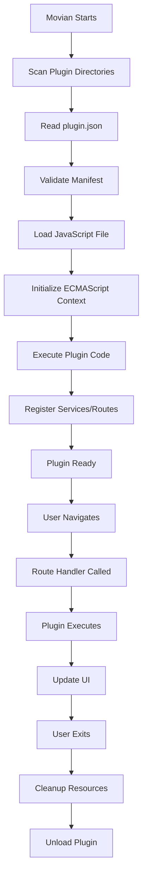
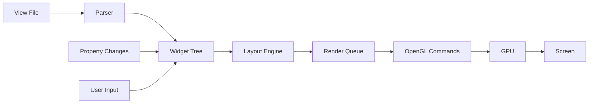
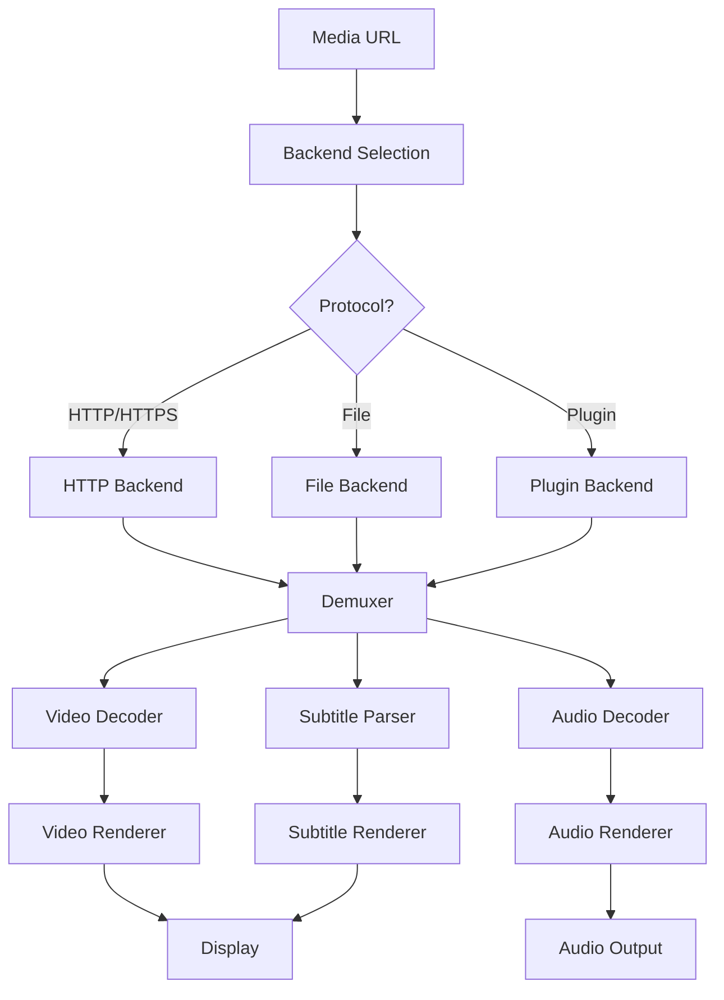

# Frequently Asked Questions (FAQ)

**Status**: 🟢 Complete reference guide  
**Last Updated**: 2024-11-06  
**Movian Version**: 4.8+

## Overview

This FAQ addresses common questions from developers working with Movian. For specific error messages and troubleshooting procedures, see the [Troubleshooting Reference](troubleshooting.md).

## Quick Navigation

- [General Questions](#general-questions)
- [Getting Started](#getting-started)
- [Plugin Development](#plugin-development)
- [View Files & UI](#view-files-ui)
- [Build & Installation](#build-installation)
- [Platform-Specific](#platform-specific)
- [Performance & Optimization](#performance-optimization)
- [Architecture & Design](#architecture-design)

---

## General Questions

### What is Movian?

Movian is a cross-platform media player with a powerful plugin system and customizable UI. It supports:

- **Multiple platforms**: Linux, macOS, Windows, Android, Raspberry Pi, PlayStation 3
- **Plugin architecture**: JavaScript-based extensions for content providers
- **Custom UI**: Complete theming system using view files
- **Media formats**: Wide codec support through FFmpeg
- **Network protocols**: HTTP, HTTPS, WebSocket, and more

**Key Features**:
- Hardware-accelerated rendering with OpenGL
- SQLite database for persistent storage
- Built-in HTTP client and HTML parser
- Property-based reactive UI system


### How is Movian different from other media players?

**Unique Characteristics**:

1. **Plugin System**: JavaScript-based plugins can add content sources without recompiling
2. **Complete UI Customization**: View files allow total interface redesign
3. **Cross-Platform**: Single codebase runs on desktop, mobile, and embedded devices
4. **Open Architecture**: Well-documented APIs and source code
5. **Lightweight**: Efficient C/C++ core with minimal dependencies

**Comparison**:
- **vs Kodi**: Lighter weight, simpler plugin API, more flexible UI system
- **vs VLC**: More extensible, better UI customization, plugin-friendly
- **vs Plex**: Open source, no server required, local-first architecture

### What programming languages do I need to know?

**For Plugin Development**:
- **JavaScript (ES5)**: Primary language for plugins
- **JSON**: Plugin manifests and configuration
- **HTML/XML**: Content parsing (optional)

**For UI Customization**:
- **View file syntax**: JavaScript-like declarative UI language
- **CSS concepts**: Understanding of layout, styling, and positioning

**For Core Development**:
- **C/C++**: Core application and native modules
- **OpenGL**: Graphics rendering (advanced)
- **Platform APIs**: Linux/macOS/Windows system programming

**Learning Path**:
- Beginners: Start with JavaScript plugins
- Intermediate: Add custom view files and UI
- Advanced: Contribute to C/C++ core


### Where can I get help?

**Official Resources**:
- **Documentation**: This documentation site (you're here!)
- **Source Code**: https://github.com/andoma/movian
- **Issue Tracker**: GitHub Issues for bug reports

**Community Resources**:
- **Forums**: Movian community forums
- **Plugin Examples**: Study existing plugins in the repository
- **Source Analysis**: Read the well-documented C/C++ source code

**Best Practices for Getting Help**:
1. Check this FAQ and [Troubleshooting Guide](troubleshooting.md) first
2. Search existing GitHub issues
3. Provide minimal reproducible examples
4. Include Movian version, platform, and error logs
5. Show what you've already tried

---

## Getting Started

### How do I start developing for Movian?

**Quick Start Path**:

1. **Install Movian**: Follow the [Installation Guide](../installation/README.md)
2. **Choose Your Focus**:
   - **Plugins**: Read [Plugin Architecture](../plugins/architecture.md)
   - **UI/Themes**: Read [View Files Syntax](../ui/view-files/syntax-reference.md)
   - **Core**: Read [Architecture Overview](../architecture/overview.md)
3. **Study Examples**:
   - Plugin: [Hello World Example](../plugins/examples/hello-world/)
   - UI: [Basic Layout Example](../ui/examples/basic-layout.view)
4. **Build Something**: Start with a simple plugin or view file
5. **Test and Iterate**: Use Movian's built-in debugging tools

**Recommended First Projects**:
- Simple content provider plugin (RSS feed reader)
- Custom page layout for existing plugin
- Theme color customization


### What's the fastest way to create a plugin?

**5-Minute Plugin**:

1. **Create plugin directory**:
```bash
mkdir my-plugin
cd my-plugin
```

2. **Create plugin.json**:
```json
{
  "id": "my.plugin",
  "version": "1.0.0",
  "title": "My Plugin",
  "synopsis": "A simple plugin",
  "description": "My first Movian plugin",
  "author": "Your Name",
  "homepage": "https://example.com",
  "type": "javascript",
  "file": "plugin.js"
}
```

3. **Create plugin.js** (API v2):
```javascript
var service = require('movian/service');
var page = require('movian/page');

service.create("My Service", "myservice:start", "video", true, 
  Plugin.path + "logo.png");

new page.Route("myservice:start", function(page) {
  page.type = "directory";
  page.contents = "items";
  page.metadata.title = "My Plugin";
  
  page.appendItem("myservice:video:1", "directory", {
    title: "Sample Video"
  });
});
```

4. **Install and test**: Copy to Movian plugins directory

See [Plugin Examples](../plugins/examples/) for more complete implementations.

### Do I need to compile Movian to develop plugins?

**No!** Plugins are JavaScript files that run in Movian's runtime.

**Development Workflow**:
1. Write JavaScript plugin code
2. Copy to plugins directory
3. Restart Movian (or reload plugins)
4. Test and debug

**When You DO Need to Compile**:
- Modifying core C/C++ code
- Adding new native APIs
- Platform-specific features
- Performance-critical operations

**Plugin Development is Interpreted**:
- No compilation step
- Fast iteration cycle
- Easy debugging with console.log()
- Cross-platform by default


### Where do I put my plugin files?

**Plugin Installation Locations**:

**Linux**:
```
~/.hts/movian/plugins/
/usr/share/movian/plugins/
```

**macOS**:
```
~/Library/Application Support/Movian/plugins/
/Applications/Movian.app/Contents/Resources/plugins/
```

**Windows**:
```
%APPDATA%\Movian\plugins\
C:\Program Files\Movian\plugins\
```

**Plugin Directory Structure**:
```
plugins/
└── my-plugin/
    ├── plugin.json          # Required: Plugin manifest
    ├── plugin.js            # Required: Main plugin code
    ├── logo.png             # Optional: Plugin icon
    ├── views/               # Optional: Custom view files
    │   └── page.view
    └── lib/                 # Optional: Helper modules
        └── utils.js
```

**Development Tip**: Use the user directory for development, system directory for distribution.

---

## Plugin Development

### What JavaScript version does Movian support?

**ECMAScript 5 (ES5)** is the primary supported version.

**Supported Features**:
- ✅ Functions, objects, arrays
- ✅ Closures and callbacks
- ✅ JSON parsing
- ✅ Regular expressions
- ✅ try/catch error handling
- ✅ setTimeout/setInterval

**NOT Supported**:
- ❌ ES6+ features (arrow functions, classes, let/const)
- ❌ async/await
- ❌ Promises (use callbacks instead)
- ❌ Modules (use require() instead)
- ❌ Template literals

**Code Style**:
```javascript
// ✅ Use ES5 syntax
var myFunction = function(param) {
  return param + 1;
};

// ❌ Don't use ES6+
const myFunction = (param) => param + 1;
```


### How do I debug my plugin?

**Debugging Techniques**:

1. **Console Logging**:
```javascript
console.log("Debug message:", variable);
console.error("Error occurred:", error);
```

2. **Check Movian Logs**:
```bash
# Linux/macOS
tail -f ~/.hts/movian/log/movian.log

# Windows
type %APPDATA%\Movian\log\movian.log
```

3. **Try-Catch Blocks**:
```javascript
try {
  // Your code
  var result = riskyOperation();
} catch (e) {
  console.error("Error:", e.message);
  console.error("Stack:", e.stack);
}
```

4. **Property Inspection**:
```javascript
// Dump object properties
for (var key in obj) {
  console.log(key + ":", obj[key]);
}
```

5. **Network Debugging**:
```javascript
var response = http.request(url);
console.log("Status:", response.statuscode);
console.log("Headers:", JSON.stringify(response.headers));
console.log("Body:", response.toString());
```

**Common Debug Patterns**:
- Add logging at function entry/exit
- Log API responses before parsing
- Validate data types before operations
- Use descriptive error messages

See [Debugging Guide](../guides/debugging-view-files.md) for more techniques.


### How do I make HTTP requests in plugins?

**Basic HTTP Request**:
```javascript
var response = http.request(url, {
  method: 'GET',
  headers: {
    'User-Agent': 'Movian Plugin/1.0'
  }
});

if (response.statuscode === 200) {
  var data = JSON.parse(response.toString());
  // Process data
}
```

**POST Request with Data**:
```javascript
var response = http.request(url, {
  method: 'POST',
  headers: {
    'Content-Type': 'application/json'
  },
  postdata: JSON.stringify({
    key: 'value'
  })
});
```

**Error Handling**:
```javascript
try {
  var response = http.request(url, {
    timeout: 30000  // 30 seconds
  });
  
  if (response.statuscode !== 200) {
    throw new Error("HTTP " + response.statuscode);
  }
} catch (e) {
  console.error("Request failed:", e.message);
  return null;
}
```

**Best Practices**:
- Always set User-Agent header
- Use appropriate timeouts
- Handle non-200 status codes
- Parse responses safely
- Cache responses when possible

See [HTTP API Reference](../plugins/api/http-api.md) for complete documentation.


### How do I parse HTML/XML in plugins?

**HTML Parsing with Gumbo**:
```javascript
var html = require('showtime/html');

var response = http.request(url);
var dom = html.parse(response.toString());

// Find elements
var titles = dom.root.getElementByClassName('title');
for (var i = 0; i < titles.length; i++) {
  console.log(titles[i].textContent);
}

// CSS selectors
var links = dom.root.querySelectorAll('a.video-link');
```

**XML Parsing**:
```javascript
var xml = require('showtime/xml');

var response = http.request(url);
var doc = xml.parse(response.toString());

// Navigate XML tree
var items = doc.filterNodes('item');
for (var i = 0; i < items.length; i++) {
  var title = items[i].getChildDataAsString('title');
  var link = items[i].getChildDataAsString('link');
}
```

**JSON Parsing** (simplest):
```javascript
var response = http.request(url);
var data = JSON.parse(response.toString());

// Access data directly
console.log(data.results[0].title);
```

**Parsing Tips**:
- Use JSON APIs when available (fastest)
- HTML parsing is more robust than regex
- Cache parsed results
- Handle malformed content gracefully

See [HTTP API Documentation](../plugins/api/http-api.md) for parsing examples.


### How do I store persistent data?

**Key-Value Store** (simple data):
```javascript
var store = require('movian/store');

// Save data
store.set('username', 'john');
store.set('settings', JSON.stringify({theme: 'dark'}));

// Load data
var username = store.get('username');
var settings = JSON.parse(store.get('settings') || '{}');
```

**SQLite Database** (complex data):
```javascript
var db = require('movian/db');

// Create table
db.query('CREATE TABLE IF NOT EXISTS videos (id INTEGER PRIMARY KEY, title TEXT, url TEXT)');

// Insert data
db.query('INSERT INTO videos (title, url) VALUES (?, ?)', ['Video Title', 'http://...']);

// Query data
var results = db.query('SELECT * FROM videos WHERE title LIKE ?', ['%search%']);
for (var i = 0; i < results.length; i++) {
  console.log(results[i].title);
}
```

**Settings API** (user preferences):
```javascript
var settings = require('movian/settings');

// Create setting
settings.createString('apiKey', 'API Key', '', function(v) {
  // Called when setting changes
  apiKey = v;
});

settings.createBool('enableCache', 'Enable Cache', true, function(v) {
  cacheEnabled = v;
});
```

**Storage Comparison**:
- **store**: Simple key-value, good for small data
- **db**: Relational data, complex queries
- **settings**: User-configurable preferences

See [Storage API Reference](../plugins/api/storage-api.md) for details.


### How do I create pages and navigation?

**Basic Page Creation**:
```javascript
new page.Route("myplugin:start", function(page) {
  page.type = "directory";
  page.contents = "items";
  page.metadata.title = "My Plugin";
  page.metadata.icon = require('showtime/richtext').imageFromPlugin("logo.png");
  
  // Add items
  page.appendItem("myplugin:video:1", "video", {
    title: "Video Title",
    icon: "http://example.com/thumb.jpg"
  });
  
  page.appendItem("myplugin:category:movies", "directory", {
    title: "Movies"
  });
});
```

**Service Registration** (adds to main menu - API v2):
```javascript
var service = require('movian/service');

service.create("My Service", "myplugin:start", "video", true,
  Plugin.path + "logo.png");
```

**Navigation Patterns**:
```javascript
// Category -> Items
new page.Route("myplugin:category:(.*)", function(page, category) {
  page.type = "directory";
  page.metadata.title = category;
  
  // Fetch and display items for category
  var items = fetchItems(category);
  items.forEach(function(item) {
    page.appendItem(item.url, "video", {
      title: item.title,
      icon: item.thumbnail
    });
  });
});

// Video playback
new page.Route("myplugin:video:(.*)", function(page, videoId) {
  page.type = "video";
  page.source = "videoparams:" + JSON.stringify({
    sources: [{
      url: getVideoUrl(videoId)
    }]
  });
});
```

See [Page API Reference](../plugins/api/page-api.md) for complete documentation.


---

## View Files & UI

### What are view files?

**View files** are declarative UI definitions using a JavaScript-like syntax. They define the visual layout and behavior of Movian's interface.

**Key Concepts**:
- **Widgets**: UI components (containers, labels, images, etc.)
- **Properties**: Widget attributes (width, color, alignment, etc.)
- **Expressions**: Dynamic values using variables and functions
- **Events**: User interaction handlers

**Simple Example**:
```javascript
widget(container_x, {
  spacing: 1em;
  
  widget(label, {
    caption: "Hello World";
    color: "#FFFFFF";
  });
  
  widget(image, {
    source: "logo.png";
    width: 100;
    height: 100;
  });
});
```

**View files are NOT**:
- XML (despite similar appearance)
- HTML (different rendering model)
- CSS (though concepts are similar)

See [View Files Syntax Reference](../ui/view-files/syntax-reference.md) for complete syntax.

### How do I create a custom skin?

**Minimal Skin Structure**:
```
my-skin/
├── universe.view          # Root entry point
├── theme.view             # Global configuration and macros
├── background.view        # Background layer
├── loading.view           # Loading indicator
└── pages/                 # Page templates
    ├── directory.view     # Directory listings
    ├── video.view         # Video playback
    └── home.view          # Home page
```

**universe.view** (entry point):
```javascript
#import "theme.view"

widget(container_z, {
  widget(loader, { source: "background.view"; });
  
  widget(container_y, {
    cloner($nav.pages, container_z, {
      widget(loader, {
        source: "pages/" + $self.model.type + ".view";
      });
    });
  });
});
```

**theme.view** (configuration):
```javascript
// Color scheme
$ui.color1 = "#4192ff";
$ui.color2 = "#306cbe";

// Reusable macros
#define Button(LABEL) {
  widget(container_x, {
    widget(label, { caption: LABEL; });
  });
}
```

See [Creating Skins Guide](../ui/theming/creating-skins.md) for step-by-step instructions.


### What's the difference between #import and #include?

**#import** (recommended):
- Loads file only once (like C++ #pragma once)
- Prevents circular dependencies
- Used for shared macros and definitions
- Idempotent (safe to import multiple times)

```javascript
#import "theme.view"      // Loaded once
#import "theme.view"      // Skipped (already loaded)
```

**#include** (legacy):
- Loads file every time
- Can cause circular dependency issues
- Used for inline content
- Not idempotent

```javascript
#include "header.view"    // Loaded
#include "header.view"    // Loaded again (duplicate)
```

**Best Practices**:
- Use `#import` for macro definitions and shared code
- Use `#include` only when you need multiple copies
- Prefer `#import` in modern skins

**Common Pattern**:
```javascript
// theme.view - define macros
#define Button(LABEL) { ... }

// page.view - use macros
#import "theme.view"
Button("Click Me");
```

### How do I use variables in view files?

**Variable Types**:

1. **Global Variables** (system state):
```javascript
$ui.width                 // Screen width
$ui.height                // Screen height
$ui.pointerVisible        // Mouse visible
$nav.canGoBack           // Can navigate back
$core.audio.mastervolume // System volume
```

2. **Local Variables** (custom):
```javascript
$ui.myCustomVar = "value";
$clone.pageNumber = 1;
```

3. **Item Variables** (in cloners):
```javascript
cloner($nav.pages, container_z, {
  // $self refers to current item
  widget(label, {
    caption: $self.model.title;
  });
});
```

**Variable Scope**:
- `$ui.*` - Global UI state
- `$nav.*` - Navigation state
- `$core.*` - Core system state
- `$self.*` - Current item in cloner
- `$parent.*` - Parent widget context
- `$clone.*` - Clone-specific state

See [Expressions Reference](../ui/view-files/expressions.md) for complete variable documentation.


### How do I handle user input and events?

**Event Handling**:
```javascript
widget(container_x, {
  focusable: true;
  
  // Activation (Enter/Click)
  onEvent(activate, {
    navOpen("mypage:url");
  });
  
  // Navigation events
  onEvent(back, {
    $ui.showMenu = false;
  });
  
  // Custom events
  onEvent(menu, {
    toggle($ui.showSettings);
  });
});
```

**Common Events**:
- `activate` - Enter key or click
- `back` - Back button
- `menu` - Menu button
- `left`, `right`, `up`, `down` - Navigation
- `itemMenu` - Context menu

**Focus Management**:
```javascript
widget(container_x, {
  id: "myButton";
  focusable: true;
  clickable: $ui.pointerVisible;
  
  // Visual feedback
  alpha: 0.5 + 0.5 * isNavFocused();
});

// Focus programmatically
focus("myButton");
```

**Interactive States**:
```javascript
widget(container_x, {
  // Hover state
  alpha: 0.8 + 0.2 * isHovered();
  
  // Focus state
  color: select(isNavFocused(), "#FFFFFF", "#CCCCCC");
  
  // Combined states
  scale: 1.0 + 0.1 * isHovered() + 0.2 * isNavFocused();
});
```

See [Widget Reference](../ui/view-files/widget-reference.md) for all event types.


### How do I create animations?

**Smooth Transitions with iir()**:
```javascript
widget(container_x, {
  // Smooth fade in/out
  alpha: iir($ui.visible, 4);
  
  // Smooth scaling
  scale: iir(isNavFocused() ? 1.2 : 1.0, 8);
  
  // Smooth color transition
  color: iir(isHovered() ? 1.0 : 0.5, 6);
});
```

**iir() Parameters**:
- First argument: Target value
- Second argument: Speed (higher = slower)
- Optional third: Absolute mode

**Loader Transitions**:
```javascript
widget(loader, {
  source: $ui.currentPage;
  time: 0.3;              // Transition duration
  effect: blend;          // Fade effect
  noInitialTransform: true;
});
```

**Transform Animations**:
```javascript
widget(displacement, {
  // Slide in from right
  translation: [iir($ui.visible ? 0 : 100, 4), 0, 0];
  
  // Zoom effect
  scaling: [iir($ui.visible ? 1.0 : 0.8, 6),
            iir($ui.visible ? 1.0 : 0.8, 6),
            1];
});
```

**Animation Best Practices**:
- Use iir() for smooth interpolation
- Keep speed values between 2-10
- Avoid animating too many properties
- Test on target hardware

See [Animation Examples](../ui/examples/animations.view) for more patterns.


---

## Build & Installation

### What are the minimum system requirements?

**Development Machine**:
- **CPU**: Dual-core 2GHz or better
- **RAM**: 4GB minimum, 8GB recommended
- **Disk**: 2GB free space for build
- **OS**: Linux, macOS 10.12+, Windows 10+

**Target Platforms**:
- **Desktop**: Linux (x86/x64), macOS (x86/ARM), Windows (x86/x64)
- **Mobile**: Android 4.4+
- **Embedded**: Raspberry Pi 2+, PlayStation 3

**Build Dependencies**:
- GCC 4.8+ or Clang 3.4+
- Make or CMake
- Git
- Platform-specific libraries (see [Installation Guide](../installation/README.md))

### How long does it take to build Movian?

**Typical Build Times**:

| Platform | First Build | Incremental | Parallel Jobs |
|----------|-------------|-------------|---------------|
| Linux (4 cores) | 15-20 min | 2-5 min | -j4 |
| macOS (8 cores) | 20-30 min | 3-7 min | -j8 |
| Windows (4 cores) | 30-45 min | 5-10 min | -j4 |
| Raspberry Pi | 60-90 min | 10-20 min | -j4 |

**Speed Up Builds**:
```bash
# Use parallel compilation
make -j$(nproc)           # Linux
make -j$(sysctl -n hw.ncpu)  # macOS

# Incremental builds (only changed files)
make

# Clean build (when needed)
make clean && make -j$(nproc)
```

**Factors Affecting Build Time**:
- CPU cores (more = faster)
- Disk speed (SSD vs HDD)
- Available RAM
- Enabled features
- Compiler optimization level


### Why does configure fail?

**Common Causes**:

1. **Missing Dependencies**:
```bash
# Error: "Package X not found"
# Solution: Install missing package
sudo apt-get install libX-dev  # Linux
brew install X                  # macOS
```

2. **Wrong Compiler Version**:
```bash
# Error: "GCC version too old"
# Solution: Update compiler
sudo apt-get install gcc-9 g++-9
export CC=gcc-9 CXX=g++-9
```

3. **PKG_CONFIG_PATH Issues**:
```bash
# Error: "Cannot find package config"
# Solution: Set PKG_CONFIG_PATH
export PKG_CONFIG_PATH=/usr/local/lib/pkgconfig:$PKG_CONFIG_PATH
```

4. **Platform Detection**:
```bash
# Error: "Unknown platform"
# Solution: Use platform-specific configure
./configure.linux    # Linux
./configure.osx      # macOS
```

**Debug Configure**:
```bash
# Verbose output
./configure --verbose

# Check config.log
cat config.log | grep -i error

# List available options
./configure --help
```

See [Installation Troubleshooting](../installation/troubleshooting.md) for platform-specific issues.

### Can I cross-compile Movian?

**Yes!** Movian supports cross-compilation for embedded targets.

**Android Cross-Compilation**:
```bash
# Install Android NDK
export ANDROID_NDK=/path/to/ndk

# Configure for Android
./configure.android

# Build
make -j$(nproc)
```

**Raspberry Pi Cross-Compilation**:
```bash
# Install cross-compiler
sudo apt-get install gcc-arm-linux-gnueabihf

# Configure for RPi
./configure.rpi

# Build
make -j$(nproc)
```

**PlayStation 3 Cross-Compilation**:
```bash
# Install PS3 toolchain
# Configure for PS3
./configure.ps3

# Build
make -j$(nproc)
```

**Cross-Compilation Tips**:
- Use dedicated build machine
- Install target SDK/toolchain first
- Test on actual hardware
- Check platform-specific documentation

See [Cross-Platform Guide](../installation/cross-platform.md) for details.


---

## Platform-Specific

### Linux: Why can't I find libvdpau?

**Problem**: VDPAU (Video Decode and Presentation API for Unix) not found during configure.

**Solutions**:

**Ubuntu/Debian**:
```bash
sudo apt-get install libvdpau-dev libvdpau1
```

**Fedora/CentOS**:
```bash
sudo dnf install libvdpau-devel
```

**Arch Linux**:
```bash
sudo pacman -S libvdpau
```

**Check Installation**:
```bash
pkg-config --modversion vdpau
ldconfig -p | grep vdpau
```

**Disable VDPAU** (if not needed):
```bash
./configure --disable-vdpau
```

**Alternative**: Use VA-API instead:
```bash
sudo apt-get install libva-dev
./configure --enable-vaapi
```

### macOS: Xcode Command Line Tools issues

**Problem**: "xcrun: error: invalid active developer path"

**Solution**:
```bash
# Install Xcode Command Line Tools
xcode-select --install

# Verify installation
xcode-select -p
# Should output: /Library/Developer/CommandLineTools

# If still issues, reset path
sudo xcode-select --reset
```

**Homebrew Dependencies**:
```bash
# Install Homebrew (if not installed)
/bin/bash -c "$(curl -fsSL https://raw.githubusercontent.com/Homebrew/install/HEAD/install.sh)"

# Install dependencies
brew install pkg-config freetype fontconfig yasm
```

**macOS Version Compatibility**:
- **macOS 10.12+**: Full support
- **macOS 10.10-10.11**: Limited support
- **macOS < 10.10**: Not supported


### Windows: MinGW vs Visual Studio?

**Movian uses MinGW** (Minimalist GNU for Windows), not Visual Studio.

**Why MinGW?**:
- Cross-platform compatibility
- POSIX API support
- Easier dependency management
- Consistent with Linux/macOS builds

**Setup MinGW**:
```bash
# Install MSYS2
# Download from https://www.msys2.org/

# Update package database
pacman -Syu

# Install build tools
pacman -S mingw-w64-x86_64-gcc mingw-w64-x86_64-make
pacman -S mingw-w64-x86_64-pkg-config

# Install dependencies
pacman -S mingw-w64-x86_64-freetype
pacman -S mingw-w64-x86_64-fontconfig
```

**Build on Windows**:
```bash
# Open MSYS2 MinGW 64-bit terminal
./configure
make -j$(nproc)
```

**Common Windows Issues**:
- Path separators (use forward slashes)
- Line endings (use Unix LF, not Windows CRLF)
- Case sensitivity (Windows is case-insensitive)
- Long paths (enable long path support in Windows 10+)

**Visual Studio NOT Supported**: The codebase uses GCC-specific features and POSIX APIs.

### Android: NDK version compatibility

**Supported NDK Versions**:
- **Recommended**: NDK r21e - r23
- **Minimum**: NDK r19c
- **Maximum**: NDK r25 (latest tested)

**Install Specific NDK Version**:
```bash
# Using Android Studio SDK Manager
# Tools -> SDK Manager -> SDK Tools -> NDK (Side by side)

# Or download directly
wget https://dl.google.com/android/repository/android-ndk-r21e-linux-x86_64.zip
unzip android-ndk-r21e-linux-x86_64.zip
export ANDROID_NDK=/path/to/android-ndk-r21e
```

**Configure for Android**:
```bash
export ANDROID_NDK=/path/to/ndk
./configure.android --arch=arm64  # or armeabi-v7a, x86, x86_64
make -j$(nproc)
```

**Android API Levels**:
- **Minimum**: API 19 (Android 4.4)
- **Recommended**: API 21+ (Android 5.0+)
- **Target**: API 30+ (Android 11+)

**Common Android Issues**:
- NDK path not set
- Wrong architecture selected
- Missing Android SDK tools
- Incompatible API level


### Raspberry Pi: Performance optimization

**Hardware Considerations**:
- **RPi 4**: Best performance, 4K support
- **RPi 3**: Good for 1080p
- **RPi 2**: Basic 720p playback
- **RPi 1/Zero**: Limited, 480p max

**Build Optimizations**:
```bash
# Configure with optimizations
./configure.rpi --enable-opt

# Use all cores for compilation
make -j4

# Strip debug symbols (smaller binary)
strip build.rpi/movian
```

**Runtime Optimizations**:

1. **GPU Memory Split**:
```bash
# Edit /boot/config.txt
gpu_mem=256  # Allocate more GPU memory
```

2. **Overclocking** (RPi 3/4):
```bash
# Edit /boot/config.txt
arm_freq=1500
gpu_freq=500
over_voltage=2
```

3. **Disable Desktop Environment**:
```bash
# Boot to console
sudo systemctl set-default multi-user.target
```

4. **Hardware Acceleration**:
```bash
# Enable OpenMAX IL
./configure.rpi --enable-omx

# Enable MMAL (preferred on RPi)
./configure.rpi --enable-mmal
```

**Performance Tips**:
- Use H.264 video (hardware decoded)
- Avoid 4K on RPi 3 and older
- Disable unnecessary plugins
- Use lightweight skins
- Enable hardware acceleration


---

## Performance & Optimization

### How do I optimize plugin performance?

**Performance Best Practices**:

1. **Cache HTTP Requests**:
```javascript
var cache = {};

function fetchData(url) {
  if (cache[url]) {
    return cache[url];
  }
  
  var response = http.request(url);
  var data = JSON.parse(response.toString());
  cache[url] = data;
  return data;
}
```

2. **Batch Database Operations**:
```javascript
// ❌ Slow - multiple queries
for (var i = 0; i < items.length; i++) {
  db.query('INSERT INTO items VALUES (?, ?)', [items[i].id, items[i].title]);
}

// ✅ Fast - single transaction
db.query('BEGIN TRANSACTION');
for (var i = 0; i < items.length; i++) {
  db.query('INSERT INTO items VALUES (?, ?)', [items[i].id, items[i].title]);
}
db.query('COMMIT');
```

3. **Lazy Loading**:
```javascript
new page.Route("myplugin:category:(.*)", function(page, category) {
  page.type = "directory";
  
  // Load items on demand
  var offset = 0;
  var limit = 20;
  
  page.paginator = function() {
    var items = fetchItems(category, offset, limit);
    items.forEach(function(item) {
      page.appendItem(item.url, "video", item);
    });
    offset += limit;
    return items.length > 0;  // Return true if more items available
  };
});
```

4. **Minimize DOM Parsing**:
```javascript
// ❌ Slow - parse entire document
var dom = html.parse(response.toString());
var items = dom.root.querySelectorAll('.item');

// ✅ Fast - use regex for simple extraction
var matches = response.toString().match(/<div class="item"[^>]*>(.*?)<\/div>/g);
```

5. **Avoid Blocking Operations**:
```javascript
// Use timeouts for long operations
setTimeout(function() {
  processLargeDataset();
}, 0);
```

See [Performance Optimization Guide](../guides/performance-optimization.md) for more techniques.


### How do I optimize view file performance?

**View File Optimization**:

1. **Minimize Widget Count**:
```javascript
// ❌ Slow - too many widgets
widget(container_x, {
  widget(container_y, {
    widget(container_z, {
      widget(label, { caption: "Text"; });
    });
  });
});

// ✅ Fast - flatten hierarchy
widget(container_x, {
  widget(label, { caption: "Text"; });
});
```

2. **Use Efficient Expressions**:
```javascript
// ❌ Slow - complex expression
alpha: (isHovered() ? 1.0 : 0.5) * (isNavFocused() ? 1.2 : 1.0) * $ui.globalAlpha;

// ✅ Fast - simplified
alpha: iir(isNavFocused() ? 1.0 : 0.8, 4);
```

3. **Avoid Unnecessary Updates**:
```javascript
// ❌ Slow - updates every frame
caption: $core.clock.unixtime;

// ✅ Fast - update only when needed
caption: changed($core.clock.unixtime, 1000, true);
```

4. **Optimize Cloners**:
```javascript
// ❌ Slow - clones everything
cloner($items, container_x, {
  widget(label, { caption: $self.title; });
});

// ✅ Fast - limit visible items
cloner($items, list_y, {
  // list_y only renders visible items
  widget(label, { caption: $self.title; });
});
```

5. **Use Hidden Instead of Conditional Loading**:
```javascript
// ❌ Slow - recreates widget
widget(loader, {
  source: select($ui.visible, "content.view", "");
});

// ✅ Fast - toggles visibility
widget(container_x, {
  hidden: !$ui.visible;
  // Content here
});
```

**Performance Monitoring**:
- Enable FPS counter in Movian settings
- Profile on target hardware
- Test with large datasets
- Monitor memory usage


### Why is my plugin slow?

**Common Performance Issues**:

1. **Synchronous HTTP Requests**:
```javascript
// ❌ Problem: Blocks UI thread
function loadPage(page) {
  for (var i = 0; i < 100; i++) {
    var response = http.request(urls[i]);  // Blocks!
    page.appendItem(response.url, "video", {});
  }
}

// ✅ Solution: Load incrementally
function loadPage(page) {
  page.paginator = function() {
    var batch = urls.slice(offset, offset + 10);
    batch.forEach(function(url) {
      var response = http.request(url);
      page.appendItem(response.url, "video", {});
    });
    offset += 10;
    return offset < urls.length;
  };
}
```

2. **Inefficient Parsing**:
```javascript
// ❌ Problem: Parse entire HTML
var dom = html.parse(largeHtmlString);
var items = dom.root.querySelectorAll('.item');

// ✅ Solution: Use targeted extraction
var itemsHtml = largeHtmlString.match(/<div class="items">(.*?)<\/div>/s)[1];
var dom = html.parse(itemsHtml);
```

3. **No Caching**:
```javascript
// ❌ Problem: Fetch every time
new page.Route("plugin:item:(.*)", function(page, id) {
  var data = http.request(apiUrl + id);  // Always fetches
});

// ✅ Solution: Cache results
var itemCache = {};
new page.Route("plugin:item:(.*)", function(page, id) {
  if (!itemCache[id]) {
    itemCache[id] = http.request(apiUrl + id);
  }
  var data = itemCache[id];
});
```

4. **Database Without Indexes**:
```javascript
// ❌ Problem: Slow queries
db.query('SELECT * FROM items WHERE title LIKE ?', ['%search%']);

// ✅ Solution: Add indexes
db.query('CREATE INDEX IF NOT EXISTS idx_title ON items(title)');
db.query('SELECT * FROM items WHERE title LIKE ?', ['%search%']);
```

**Profiling Tips**:
```javascript
// Measure execution time
var start = Date.now();
expensiveOperation();
console.log("Took:", Date.now() - start, "ms");
```


---

## Architecture & Design

### How does the plugin system work internally?

**Plugin Lifecycle**:



**Key Components**:

1. **Plugin Loader** (`src/plugins.c`):
   - Scans plugin directories
   - Validates manifests
   - Manages plugin lifecycle

2. **ECMAScript Runtime** (`src/ecmascript/`):
   - Duktape JavaScript engine
   - Native module bindings
   - Sandboxed execution

3. **Service Registry** (`src/service.c`):
   - Registers plugin services
   - Routes navigation requests
   - Manages plugin pages

4. **Property System** (`src/prop.c`):
   - Reactive data binding
   - UI updates
   - State management

**Security Model**:
- Plugins run in sandboxed JavaScript context
- Limited access to system APIs
- No direct file system access (except through APIs)
- Network requests controlled by HTTP API


### How does the property system work?

**Property System Overview**:

The property system is Movian's reactive data binding mechanism that connects data to UI.

**Key Concepts**:

1. **Properties** - Observable data containers
2. **Subscriptions** - Listeners for property changes
3. **Bindings** - Automatic UI updates
4. **Propagation** - Change notification flow

**Property Types**:
```javascript
// String property
var titleProp = prop.create("My Title");

// Integer property
var countProp = prop.create(42);

// Boolean property
var visibleProp = prop.create(true);

// Object property (JSON)
var dataProp = prop.create({key: "value"});
```

**Property Operations**:
```javascript
// Get value
var value = titleProp.value;

// Set value (triggers updates)
titleProp.value = "New Title";

// Subscribe to changes
titleProp.subscribe(function(newValue) {
  console.log("Title changed to:", newValue);
});
```

**UI Binding**:
```javascript
// In view files, properties are referenced with $
widget(label, {
  caption: $page.metadata.title;  // Automatically updates
});

// When property changes, UI updates automatically
page.metadata.title = "New Title";  // UI reflects change
```

**Property Tree**:
```
$global
├── $ui
│   ├── $ui.width
│   ├── $ui.height
│   └── $ui.pointerVisible
├── $nav
│   ├── $nav.pages
│   └── $nav.currentpage
└── $core
    ├── $core.audio
    └── $core.media
```

**Performance**:
- Properties are lightweight
- Updates are batched
- Only changed values propagate
- Efficient for large datasets

See [Architecture Documentation](../architecture/components.md) for implementation details.


### What is the GLW rendering pipeline?

**GLW (OpenGL Widget) Rendering Flow**:



**Pipeline Stages**:

1. **Parsing** (`glw_view_parser.c`):
   - Read view file syntax
   - Build widget tree
   - Resolve expressions

2. **Layout** (`glw_layout.c`):
   - Calculate widget positions
   - Apply constraints
   - Handle alignment

3. **Rendering** (`glw_renderer.c`):
   - Generate OpenGL commands
   - Apply transformations
   - Render textures

4. **Composition** (`glw_texture.c`):
   - Blend layers
   - Apply effects
   - Output to framebuffer

**Optimization Techniques**:
- **Dirty Rectangles**: Only redraw changed areas
- **Texture Caching**: Reuse rendered content
- **Culling**: Skip off-screen widgets
- **Batching**: Combine draw calls

**Hardware Acceleration**:
- OpenGL 2.0+ required
- Shader-based rendering
- GPU texture uploads
- Hardware video decode integration

**Performance Characteristics**:
- 60 FPS target on desktop
- 30 FPS acceptable on embedded
- Adaptive quality based on hardware
- Efficient for complex UIs

See [GLW Architecture](../ui/glw-architecture.md) and [Rendering Pipeline](../ui/rendering-pipeline.md) for details.


### How does Movian handle media playback?

**Media Playback Architecture**:



**Key Components**:

1. **Backends** (`src/backend/`):
   - Protocol handlers (HTTP, file, etc.)
   - Stream management
   - Buffering

2. **Demuxers** (FFmpeg):
   - Container parsing (MP4, MKV, etc.)
   - Stream extraction
   - Metadata reading

3. **Decoders**:
   - Software: FFmpeg codecs
   - Hardware: VDPAU, VA-API, VideoToolbox
   - Platform-specific acceleration

4. **Renderers**:
   - Video: OpenGL textures
   - Audio: ALSA, PulseAudio, CoreAudio
   - Subtitles: GLW text rendering

**Supported Formats**:
- **Containers**: MP4, MKV, AVI, WebM, TS
- **Video**: H.264, H.265, VP9, MPEG-2, MPEG-4
- **Audio**: AAC, MP3, Opus, Vorbis, AC3, DTS
- **Subtitles**: SRT, ASS, SSA, WebVTT, PGS

**Hardware Acceleration**:
- Linux: VDPAU, VA-API
- macOS: VideoToolbox
- Windows: DXVA2
- Android: MediaCodec
- Raspberry Pi: MMAL, OMX

See [Architecture Overview](../architecture/overview.md) for media subsystem details.


### Can I contribute to Movian?

**Yes!** Contributions are welcome.

**Ways to Contribute**:

1. **Plugin Development**:
   - Create new content provider plugins
   - Share on GitHub
   - Submit to plugin repository

2. **Skin/Theme Creation**:
   - Design custom skins
   - Share with community
   - Document your approach

3. **Documentation**:
   - Improve existing docs
   - Add examples
   - Fix errors

4. **Core Development**:
   - Fix bugs
   - Add features
   - Optimize performance

5. **Testing**:
   - Report bugs
   - Test on different platforms
   - Verify fixes

**Contribution Process**:

1. **Fork Repository**:
```bash
git clone https://github.com/andoma/movian.git
cd movian
git checkout -b my-feature
```

2. **Make Changes**:
```bash
# Edit code
# Test changes
# Commit with descriptive message
git commit -m "Add feature X"
```

3. **Submit Pull Request**:
   - Push to your fork
   - Create PR on GitHub
   - Describe changes clearly
   - Reference related issues

**Contribution Guidelines**:
- Follow existing code style
- Add tests for new features
- Update documentation
- Keep commits focused
- Be responsive to feedback

**Getting Started**:
- Check "good first issue" labels
- Ask questions in discussions
- Read architecture documentation
- Study existing code

See [Contributing Guide](../CONTRIBUTING.md) for detailed guidelines.

---

## Additional Resources

### Documentation Index

- [Installation Guide](../installation/README.md)
- [Plugin Development](../plugins/README.md)
- [UI System](../ui/README.md)
- [Architecture](../architecture/README.md)
- [API Reference](api-index.md)
- [Troubleshooting](troubleshooting.md)

### External Links

- **GitHub**: https://github.com/andoma/movian
- **Source Code**: Browse online or clone locally
- **Issue Tracker**: Report bugs and request features
- **Community**: Forums and discussions

### Quick Reference

- [Glossary](glossary.md) - Technical terms
- [API Index](api-index.md) - All APIs
- [Element Index](element-index.md) - View file elements
- [Attribute Index](attribute-index.md) - Widget attributes

---

**Last Updated**: 2024-11-06  
**Movian Version**: 4.8+  
**Documentation Status**: 🟢 Complete

For specific error messages and detailed troubleshooting, see the [Troubleshooting Reference](troubleshooting.md).
