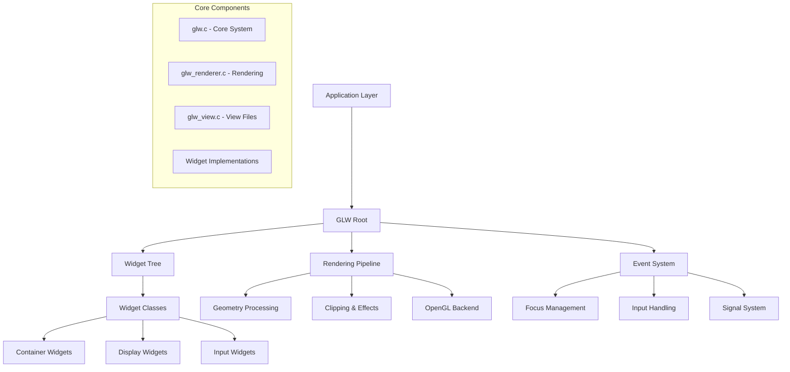

# GLW Architecture Overview

## Introduction

GLW (OpenGL Widget) is Movian's custom UI rendering engine that provides a complete widget system built on top of OpenGL. It serves as the foundation for all user interface elements in Movian, from simple text labels to complex interactive layouts.

## System Architecture



## Core Components

### GLW Root (`glw_root_t`)

The GLW root is the central management structure that coordinates all UI operations:

**Key Responsibilities:**
- Widget tree management and lifecycle
- Rendering pipeline coordination
- Event routing and focus management
- Resource management (textures, fonts, etc.)
- Frame timing and refresh scheduling

**Critical Fields:**
```c
typedef struct glw_root {
    // Widget hierarchy
    glw_t *gr_universe;           // Root widget of the UI tree
    glw_t *gr_current_focus;      // Currently focused widget
    
    // Rendering state
    int gr_width, gr_height;      // Screen dimensions
    int gr_need_refresh;          // Refresh flags
    float gr_framerate;           // Current framerate
    
    // Resource management
    pool_t *gr_token_pool;        // Memory pool for tokens
    pool_t *gr_clone_pool;        // Memory pool for clones
    
    // Event handling
    prop_courier_t *gr_courier;   // Property event dispatcher
    
    // Backend interface
    void (*gr_be_render_unlocked)(struct glw_root *gr);
} glw_root_t;
```

### Widget System (`glw_t`)

Every UI element in GLW is represented by a widget structure:

**Widget Structure:**
```c
typedef struct glw {
    // Class and identity
    const glw_class_t *glw_class;    // Widget type/behavior
    glw_root_t *glw_root;            // Reference to root
    
    // Hierarchy
    struct glw *glw_parent;          // Parent widget
    struct glw_queue glw_childs;     // Child widgets
    
    // Layout and rendering
    float glw_alpha;                 // Transparency
    float glw_sharpness;             // Blur factor
    Mtx *glw_matrix;                 // Transformation matrix
    
    // State and properties
    int glw_flags;                   // State flags
    int glw_flags2;                  // Extended flags
    float glw_focus_weight;          // Focus priority
    
    // Property bindings
    prop_t *glw_originating_prop;    // Source property
    glw_scope_t *glw_scope;          // Variable scope
} glw_t;
```

### Widget Classes (`glw_class_t`)

Widget behavior is defined by class structures that provide virtual methods:

**Class Interface:**
```c
typedef struct glw_class {
    const char *gc_name;             // Widget type name
    size_t gc_instance_size;         // Memory size
    
    // Lifecycle methods
    void (*gc_ctor)(glw_t *w);
    void (*gc_dtor)(glw_t *w);
    
    // Core operations
    void (*gc_layout)(glw_t *w, const glw_rctx_t *rc);
    void (*gc_render)(glw_t *w, const glw_rctx_t *rc);
    
    // Event handling
    int (*gc_signal_handler)(glw_t *w, void *opaque, 
                            glw_signal_t signal, void *extra);
    
    // Input processing
    int (*gc_pointer_event)(glw_t *w, const glw_pointer_event_t *gpe);
} glw_class_t;
```

## Rendering Pipeline

### Rendering Context (`glw_rctx_t`)

The rendering context carries transformation and state information through the rendering pipeline:

```c
typedef struct glw_rctx {
    // Viewport
    int rc_width, rc_height;         // Current viewport size
    
    // Transformation
    Mtx rc_mtx;                      // Current transformation matrix
    
    // Rendering state
    float rc_alpha;                  // Accumulated alpha
    float rc_sharpness;              // Accumulated sharpness
    int rc_zindex;                   // Z-order for sorting
    
    // Clipping
    int rc_invisible;                // Skip rendering flag
    int *rc_zmax;                    // Maximum Z value
} glw_rctx_t;
```

### Rendering Process

The rendering pipeline follows this sequence:

1. **Frame Preparation** (`glw_prepare_frame`)
   - Update timing information
   - Process property events
   - Handle focus changes
   - Update dynamic evaluations

2. **Layout Phase** (`glw_layout0`)
   - Traverse widget tree
   - Calculate positions and sizes
   - Apply transformations
   - Update visibility flags

3. **Render Phase** (`glw_render0`)
   - Generate geometry
   - Apply effects (clipping, fading)
   - Submit render jobs
   - Handle Z-ordering

4. **Backend Rendering** (`glw_renderer_render`)
   - Sort render jobs by Z-order and texture
   - Execute OpenGL commands
   - Present final frame

### Geometry Processing

GLW uses a sophisticated geometry processing system:

**Vertex Structure:**
```c
#define VERTEX_SIZE 12  // floats per vertex

// Vertex layout:
// [0-2]  Position (x, y, z)
// [3]    Reserved
// [4-7]  Color (r, g, b, a)
// [8-9]  Texture coordinates (s, t)
// [10-11] Secondary texture coordinates
```

**Clipping and Effects:**
- Software clipping for complex shapes
- Multi-plane clipping support
- Fade effects with distance-based alpha
- Blur effects for out-of-focus elements

## Widget Lifecycle

### Creation and Initialization

1. **Allocation** - Memory allocated based on class size
2. **Initialization** - Basic fields set up
3. **Constructor** - Class-specific initialization
4. **Insertion** - Added to parent's child list
5. **Signal** - Parent notified of new child

### Layout and Rendering

1. **Layout Calculation** - Size and position determined
2. **Matrix Update** - Transformation matrix calculated
3. **Visibility Check** - Determine if widget should render
4. **Geometry Generation** - Create vertex data
5. **Effect Processing** - Apply clipping, fading, etc.
6. **Render Job Submission** - Add to render queue

### Destruction

1. **Destruction Flag** - Mark widget for destruction
2. **Child Cleanup** - Recursively destroy children
3. **Signal Emission** - Notify parent and handlers
4. **Resource Cleanup** - Free textures, matrices, etc.
5. **Memory Release** - Return to memory pool

## Event System

### Signal Propagation

GLW uses a signal-based event system for widget communication:

**Signal Types:**
- `GLW_SIGNAL_DESTROY` - Widget being destroyed
- `GLW_SIGNAL_ACTIVE/INACTIVE` - Visibility changes
- `GLW_SIGNAL_CHILD_*` - Child widget events
- `GLW_SIGNAL_FOCUS_*` - Focus management
- `GLW_SIGNAL_FHP_PATH_CHANGED` - Focus/hover/press path changes

### Focus Management

Focus management is hierarchical and automatic:

**Focus Path:**
- Each widget can have one focused child
- Focus path traces from root to focused leaf
- Automatic focus weight-based selection
- Interactive vs automatic focus modes

**Focus Flags:**
- `GLW_IN_FOCUS_PATH` - Widget is in focus chain
- `GLW_IN_HOVER_PATH` - Widget is under mouse
- `GLW_IN_PRESSED_PATH` - Widget is being pressed

### Input Processing

Input events flow through the widget hierarchy:

1. **Event Reception** - Root receives input event
2. **Focus Descent** - Event sent down focus path
3. **Handler Invocation** - Widget-specific processing
4. **Bubble Up** - Unhandled events bubble to parent
5. **Default Handling** - Root provides fallback behavior

## Memory Management

### Object Pools

GLW uses memory pools for efficient allocation:

- **Token Pool** - View file parsing tokens
- **Clone Pool** - Widget cloning operations
- **Style Binding Pool** - CSS-like style bindings

### Reference Counting

Widgets use reference counting for lifecycle management:

```c
void glw_ref(glw_t *w);      // Increment reference
void glw_unref(glw_t *w);    // Decrement and possibly free
```

### Resource Management

- **Textures** - Automatic loading and caching
- **Fonts** - Shared font context and glyph caching
- **Matrices** - On-demand allocation for transformations

## Performance Considerations

### Rendering Optimization

- **Dirty Tracking** - Only re-render when needed
- **Culling** - Skip invisible widgets
- **Batching** - Group similar render operations
- **Z-Sorting** - Minimize state changes

### Memory Efficiency

- **Pool Allocation** - Reduce malloc/free overhead
- **Shared Resources** - Reuse textures and fonts
- **Lazy Initialization** - Allocate only when needed

### Update Optimization

- **Incremental Updates** - Process only changed widgets
- **Event Coalescing** - Batch property changes
- **Frame Rate Control** - Adaptive refresh rates

## Integration Points

### Property System

GLW integrates tightly with Movian's property system:

- **Data Binding** - Automatic UI updates from property changes
- **Event Routing** - Property events trigger UI actions
- **Scope Management** - Hierarchical variable scoping

### View Files

GLW renders layouts defined in XML-like view files:

- **Dynamic Loading** - Runtime view file compilation
- **Expression Evaluation** - JavaScript-like expressions
- **Style System** - CSS-like styling and theming

### Backend Abstraction

GLW abstracts the underlying graphics API:

- **OpenGL Backend** - Primary implementation
- **Platform Variants** - Desktop GL, OpenGL ES, etc.
- **Render Job System** - Backend-agnostic rendering

This architecture provides a robust, efficient, and flexible foundation for Movian's user interface system, supporting everything from simple media browsers to complex interactive applications.