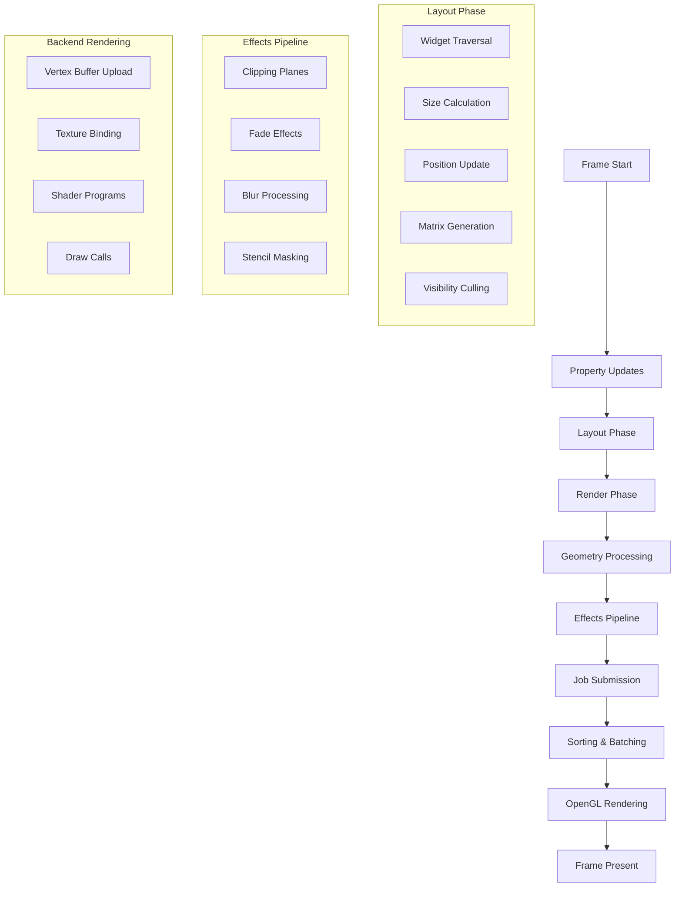

# GLW Rendering Pipeline

## Overview

The GLW rendering pipeline is a multi-stage process that transforms widget hierarchies into OpenGL draw calls. It handles geometry generation, effects processing, and efficient batching to deliver smooth 60fps performance.

## Pipeline Architecture



## Frame Lifecycle

### Frame Preparation (`glw_prepare_frame`)

**Timing Management:**
```c
void glw_prepare_frame(glw_root_t *gr, int flags) {
    // Update frame timing
    gr->gr_frame_start = arch_get_ts();
    gr->gr_time_usec = gr->gr_frame_start - gr->gr_ui_start;
    gr->gr_time_sec = gr->gr_time_usec / 1000000.0f;
    
    // Calculate framerate
    if(gr->gr_frames > 16) {
        int64_t d = gr->gr_frame_start - gr->gr_framerate_avg[gr->gr_frames & 0xf];
        double hz = 16000000.0 / d;
        gr->gr_framerate = hz;
    }
}
```

**Property Processing:**
- Dispatch pending property events
- Update widget properties from data bindings
- Process dynamic view evaluations
- Handle focus and navigation changes

**Resource Management:**
- Update screen dimensions and aspect ratio
- Process texture loading requests
- Manage font glyph caching
- Clean up destroyed widgets

### Layout Phase

The layout phase calculates widget positions and sizes through recursive traversal:

**Layout Context Propagation:**
```c
void glw_layout0(glw_t *w, const glw_rctx_t *rc) {
    // Update active widget list
    LIST_REMOVE(w, glw_active_link);
    LIST_INSERT_HEAD(&gr->gr_active_list, w, glw_active_link);
    
    // Mark as active if visible
    if(!rc->rc_invisible) {
        w->glw_flags |= GLW_ACTIVE;
        glw_signal0(w, GLW_SIGNAL_ACTIVE, NULL);
    }
    
    // Process dynamic evaluations
    if(w->glw_dynamic_eval & GLW_VIEW_EVAL_LAYOUT)
        glw_view_eval_layout(w, rc, GLW_VIEW_EVAL_LAYOUT);
    
    // Apply margins if present
    if(w->glw_flags & GLW_HAVE_MARGINS) {
        glw_rctx_t rc0 = *rc;
        glw_reposition(&rc0, w->glw_margin[0], rc->rc_height - w->glw_margin[1],
                       rc->rc_width - w->glw_margin[2], w->glw_margin[3]);
        w->glw_class->gc_layout(w, &rc0);
    } else {
        w->glw_class->gc_layout(w, rc);
    }
}
```

**Size and Position Calculation:**
- Container widgets calculate child positions
- Constraint propagation (min/max sizes, aspect ratios)
- Alignment and spacing application
- Transformation matrix generation

**Visibility Culling:**
- Check if widget intersects viewport
- Apply alpha and clipping tests
- Mark invisible widgets to skip rendering
- Update active widget lists

### Render Phase

The render phase generates geometry and submits render jobs:

**Render Context Processing:**
```c
void glw_render0(glw_t *w, const glw_rctx_t *rc) {
    // Handle Z-offset for layering
    if(w->glw_zoffset) {
        glw_rctx_t rc0 = *rc;
        rc0.rc_zindex = w->glw_zoffset;
        w->glw_class->gc_render(w, &rc0);
    } else {
        w->glw_class->gc_render(w, rc);
    }
    
    // Debug wireframe rendering
    if(w->glw_flags2 & GLW2_DEBUG)
        glw_wirebox(w->glw_root, rc);
}
```

**Matrix Storage:**
```c
void glw_store_matrix(glw_t *w, const glw_rctx_t *rc) {
    if(rc->rc_inhibit_matrix_store)
        return;
        
    if(w->glw_matrix == NULL)
        w->glw_matrix = malloc(sizeof(Mtx));
        
    *w->glw_matrix = rc->rc_mtx;
}
```

## Geometry Processing

### Vertex Format

GLW uses a standardized vertex format for all geometry:

```c
#define VERTEX_SIZE 12  // floats per vertex

// Vertex layout (48 bytes per vertex):
// Offset 0-2:   Position (x, y, z)
// Offset 3:     Reserved/padding
// Offset 4-7:   Color (r, g, b, a)
// Offset 8-9:   Primary texture coordinates (s, t)
// Offset 10-11: Secondary texture coordinates (s2, t2)
```

### Renderer System

**Renderer Initialization:**
```c
void glw_renderer_init_quad(glw_renderer_t *gr) {
    glw_renderer_init(gr, 4, 2, quadvertices);
    
    // Initialize vertex colors to white
    for(int i = 0; i < 4; i++) {
        gr->gr_vertices[i * VERTEX_SIZE + 4] = 1.0f; // r
        gr->gr_vertices[i * VERTEX_SIZE + 5] = 1.0f; // g
        gr->gr_vertices[i * VERTEX_SIZE + 6] = 1.0f; // b
        gr->gr_vertices[i * VERTEX_SIZE + 7] = 1.0f; // a
    }
}
```

**Vertex Manipulation:**
```c
void glw_renderer_vtx_pos(glw_renderer_t *gr, int vertex, float x, float y, float z) {
    gr->gr_vertices[vertex * VERTEX_SIZE + 0] = x;
    gr->gr_vertices[vertex * VERTEX_SIZE + 1] = y;
    gr->gr_vertices[vertex * VERTEX_SIZE + 2] = z;
    gr->gr_dirty = 1;
}

void glw_renderer_vtx_st(glw_renderer_t *gr, int vertex, float s, float t) {
    gr->gr_vertices[vertex * VERTEX_SIZE + 8] = s;
    gr->gr_vertices[vertex * VERTEX_SIZE + 9] = t;
    gr->gr_dirty = 1;
}
```

## Effects Pipeline

### Software Clipping

GLW implements sophisticated software clipping for complex shapes:

**Clipping Plane Setup:**
```c
int glw_clip_enable(glw_root_t *gr, const glw_rctx_t *rc, 
                   glw_clip_boundary_t how, float distance, 
                   float alpha_out, float sharpness_out) {
    // Find available clipper slot
    for(int i = 0; i < NUM_CLIPPLANES; i++)
        if(!(gr->gr_active_clippers & (1 << i)))
            break;
            
    // Transform clipping plane to eye space
    Vec4 v4 = {clip_planes[how][0], clip_planes[how][1], 
               clip_planes[how][2], 1 - (distance * 2)};
    
    Mtx inv;
    if(!glw_mtx_invert(&inv, &rc->rc_mtx))
        return -1;
        
    glw_mtx_trans_mul_vec4(gr->gr_clip[i], &inv, v4);
    gr->gr_active_clippers |= (1 << i);
    
    return i;
}
```

**Triangle Clipping Algorithm:**
```c
static void clipper(glw_root_t *gr, glw_renderer_cache_t *grc,
                   const Vec4 V1, const Vec4 V2, const Vec4 V3,
                   const Vec4 C1, const Vec4 C2, const Vec4 C3,
                   const Vec4 T1, const Vec4 T2, const Vec4 T3,
                   int plane) {
    // Test triangle vertices against clipping plane
    const float D1 = glw_vec34_dot(V1, grc->grc_clip[plane]);
    const float D2 = glw_vec34_dot(V2, grc->grc_clip[plane]);
    const float D3 = glw_vec34_dot(V3, grc->grc_clip[plane]);
    
    // Sutherland-Hodgman clipping algorithm
    // Generates new triangles for partially clipped geometry
    // Handles all 8 possible clipping cases
}
```

### Fade Effects

Distance-based fading for depth and focus effects:

```c
static void fader(glw_root_t *gr, glw_renderer_cache_t *grc,
                 const Vec4 V1, const Vec4 V2, const Vec4 V3,
                 const Vec4 C1, const Vec4 C2, const Vec4 C3,
                 const Vec4 T1, const Vec4 T2, const Vec4 T3,
                 int plane) {
    for(int i = 0; i < NUM_FADERS; i++) {
        if(!(grc->grc_active_faders & (1 << i)))
            continue;
            
        // Calculate distance from fade plane
        const float D1 = glw_vec34_dot(V1, grc->grc_fader[i]);
        const float D2 = glw_vec34_dot(V2, grc->grc_fader[i]);
        const float D3 = glw_vec34_dot(V3, grc->grc_fader[i]);
        
        // Apply alpha and blur based on distance
        float ar = grc->grc_fader_alpha[i];
        float br = grc->grc_fader_blur[i];
        
        if(ar > 0) {
            glw_vec4_mul_c3(c1, 1 + D1 / ar);
            glw_vec4_mul_c3(c2, 1 + D2 / ar);
            glw_vec4_mul_c3(c3, 1 + D3 / ar);
        }
    }
}
```

### Tessellation and Caching

**Geometry Tessellation:**
```c
static void glw_renderer_tesselate(glw_renderer_t *gr, glw_root_t *root,
                                  const glw_rctx_t *rc, glw_renderer_cache_t *grc) {
    root->gr_vtmp_cur = 0;
    
    // Copy transformation and effect state
    grc->grc_mtx = rc->rc_mtx;
    grc->grc_active_clippers = root->gr_active_clippers;
    
    // Process each triangle through effects pipeline
    for(int i = 0; i < gr->gr_num_triangles; i++) {
        int v1 = gr->gr_indices[i * 3 + 0];
        int v2 = gr->gr_indices[i * 3 + 1];
        int v3 = gr->gr_indices[i * 3 + 2];
        
        // Transform vertices to eye space
        Vec4 V1, V2, V3;
        glw_pmtx_mul_vec4_i(V1, &pmtx, glw_vec4_get(a + v1*VERTEX_SIZE));
        glw_pmtx_mul_vec4_i(V2, &pmtx, glw_vec4_get(a + v2*VERTEX_SIZE));
        glw_pmtx_mul_vec4_i(V3, &pmtx, glw_vec4_get(a + v3*VERTEX_SIZE));
        
        // Process through effects pipeline
        clipper(root, grc, V1, V2, V3, C1, C2, C3, T1, T2, T3, 0);
    }
}
```

**Cache Management:**
```c
static glw_renderer_cache_t *glw_renderer_get_cache(glw_root_t *root, glw_renderer_t *gr) {
    // Rotate cache slots each frame
    if((root->gr_frames & 0xff) != gr->gr_framecmp) {
        gr->gr_cacheptr = 0;
        gr->gr_framecmp = root->gr_frames & 0xff;
    } else {
        gr->gr_cacheptr = (gr->gr_cacheptr + 1) & (GLW_RENDERER_CACHES - 1);
    }
    
    int idx = gr->gr_cacheptr;
    if(gr->gr_cache[idx] == NULL)
        gr->gr_cache[idx] = calloc(1, sizeof(glw_renderer_cache_t));
        
    return gr->gr_cache[idx];
}
```

## Render Job System

### Job Submission

**Render Job Structure:**
```c
typedef struct glw_render_job {
    // Transformation
    Mtx m;                          // Model matrix
    int eyespace;                   // Pre-transformed flag
    
    // Geometry
    int vertex_offset;              // Vertex buffer offset
    int num_vertices;               // Vertex count
    int index_offset;               // Index buffer offset
    int num_indices;                // Index count
    
    // Textures and materials
    const glw_backend_texture_t *t0, *t1;
    glw_rgb_t rgb_mul, rgb_off;     // Color modulation
    float alpha, blur;              // Effects
    
    // Rendering state
    int blendmode;                  // Blend function
    int frontface;                  // Face culling
    int flags;                      // Render flags
    int16_t primitive_type;         // GL_TRIANGLES, etc.
} glw_render_job_t;
```

**Job Creation:**
```c
static void add_job(glw_root_t *gr, const Mtx *m,
                   const glw_backend_texture_t *t0, const glw_backend_texture_t *t1,
                   const glw_rgb_t *rgb_mul, const glw_rgb_t *rgb_off,
                   float alpha, float blur,
                   const float *vertices, int num_vertices,
                   const uint16_t *indices, int num_indices,
                   int flags, glw_program_args_t *gpa,
                   const glw_rctx_t *rc, int16_t primitive_type, int zoffset) {
    
    // Expand job arrays if needed
    if(gr->gr_num_render_jobs >= gr->gr_render_jobs_capacity) {
        gr->gr_render_jobs_capacity = 100 + gr->gr_render_jobs_capacity * 2;
        gr->gr_render_jobs = realloc(gr->gr_render_jobs, 
                                   sizeof(glw_render_job_t) * gr->gr_render_jobs_capacity);
    }
    
    // Copy vertex and index data to buffers
    // Set up render job parameters
    // Add to render queue
}
```

### Sorting and Batching

**Z-Order Sorting:**
```c
static int render_order_cmp(const void *A, const void *B) {
    const glw_render_order_t *a = A;
    const glw_render_order_t *b = B;
    
    // Primary sort: Z-index (front to back)
    if(a->zindex != b->zindex)
        return a->zindex - b->zindex;
        
    // Secondary sort: Texture (minimize state changes)
    const glw_render_job_t *aj = a->job;
    const glw_render_job_t *bj = b->job;
    
    if(aj->t0 < bj->t0) return -1;
    if(aj->t0 > bj->t0) return 1;
    
    return 0;
}

void glw_renderer_render(glw_root_t *gr) {
    // Sort render jobs for optimal rendering
    qsort(gr->gr_render_order, gr->gr_num_render_jobs,
          sizeof(glw_render_order_t), render_order_cmp);
          
    // Execute backend rendering
    gr->gr_be_render_unlocked(gr);
}
```

## Performance Optimizations

### Dirty Tracking

- **Geometry Dirty Flag** - Only re-tessellate when geometry changes
- **Matrix Comparison** - Cache tessellated geometry per transformation
- **Effect State Tracking** - Invalidate cache when clipping/fading changes

### Memory Management

- **Vertex Buffer Pooling** - Reuse large vertex buffers across frames
- **Cache Rotation** - Multiple cache slots to handle multi-frame effects
- **Temporary Buffer Growth** - Exponential growth to minimize allocations

### Culling and Optimization

- **Viewport Culling** - Skip widgets outside screen bounds
- **Alpha Culling** - Skip fully transparent widgets
- **Z-Order Optimization** - Front-to-back rendering for early Z rejection
- **Texture Batching** - Group draws by texture to minimize state changes

## Backend Integration

### OpenGL Backend

The rendering pipeline abstracts OpenGL operations through a backend interface:

```c
// Backend function pointers in glw_root_t
void (*gr_be_render_unlocked)(glw_root_t *gr);
pixmap_t *(*gr_br_read_pixels)(glw_root_t *gr);
```

**Vertex Buffer Management:**
- Dynamic vertex/index buffer allocation
- Efficient upload strategies for different GL versions
- Vertex array object (VAO) management

**Shader Program Management:**
- Program selection based on render job flags
- Uniform parameter binding
- Texture unit management

**State Management:**
- Blend mode switching
- Depth testing configuration
- Face culling setup

This rendering pipeline provides the foundation for GLW's smooth, efficient UI rendering while maintaining flexibility for complex effects and animations.