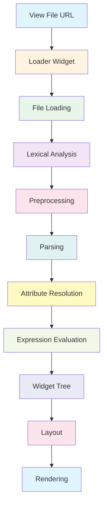

# GLW View System: Complete Source Analysis Summary

**Status**: 🟢 Comprehensive analysis complete  
**Last Updated**: 2024  
**Movian Version**: 4.8+

## Overview

This document consolidates the findings from the complete source code analysis of the GLW (OpenGL Widget) view system. It provides a high-level understanding of how view files are processed from raw text to rendered widgets, covering the entire pipeline from file loading through preprocessing, lexing, parsing, evaluation, and rendering.

## View File Processing Pipeline



## Component Overview

### 1. File Loading System

**File**: `glw_view_loader.c`  
**Purpose**: Dynamic view file loading with transitions

**Key Responsibilities**:
- Load view files dynamically at runtime
- Manage transitions between different views
- Handle fallback URLs
- Propagate scope ($args, $self) to loaded views
- Auto-hide when no content is loaded

**Core Widget**: `loader`

**Key Features**:
- Smooth transitions with configurable effects
- Frame-rate independent animation
- Automatic child lifecycle management
- Scope propagation for data binding

**Usage Example**:
```xml
<loader source="$page.model.viewUrl"
        args="$page.model.data"
        time="0.3"
        effect="blend"/>
```

### 2. Preprocessing System

**File**: `glw_view_preproc.c`  
**Purpose**: Macro expansion and file inclusion

**Key Responsibilities**:
- Define and expand macros
- Include files (#include)
- Import files once (#import)
- Support named and positional macro arguments
- Handle default argument values

**Directives**:
- `#define macroname(args) { body }` - Define macro
- `#include "file.view"` - Include file (multiple times allowed)
- `#import "file.view"` - Import file (once only)

**Macro Features**:
- Named arguments: `widget(name="test", width=100)`
- Positional arguments: `widget("test", 100)`
- Default values: `#define widget(name, width=100) { ... }`
- Nested macro calls
- Recursive expansion

**Usage Example**:
```c
#define button(label, width=100) {
  container_x {
    width = $width;
    label { caption = $label; }
  }
}

button("Click Me")
button("Wide Button", 200)
```

### 3. Lexical Analysis

**File**: `glw_view_lexer.c`  
**Purpose**: Convert text to tokens

**Key Responsibilities**:
- Tokenize view file text
- Recognize keywords, identifiers, operators
- Parse string literals and numbers
- Track file and line information
- Handle comments

**Token Categories**:
- **Structural**: `{`, `}`, `(`, `)`, `[`, `]`, `,`, `;`
- **Operators**: `=`, `+`, `-`, `*`, `/`, `&&`, `||`, `==`, `!=`, `<`, `>`
- **Values**: integers, floats, strings, identifiers
- **Special**: `$` (variables), `#` (preprocessor), `:` (attributes)

**Output**: Token chain ready for preprocessing

### 4. Parsing System

**File**: `glw_view_parser.c`  
**Purpose**: Build widget tree from tokens

**Key Responsibilities**:
- Parse widget definitions
- Build widget hierarchy
- Resolve widget types
- Parse attribute assignments
- Handle blocks and expressions

**Widget Definition Syntax**:
```xml
widgettype {
  attribute = value;
  attribute = expression;
  
  childwidget {
    ...
  }
}
```

**Supported Constructs**:
- Widget instantiation
- Attribute assignment (=, ?=, &=, !=, ~=)
- Property references ($variable)
- Nested widgets
- Cloner patterns
- Event handlers

### 5. Attribute System

**File**: `glw_view_attrib.c`  
**Purpose**: Process widget attributes

**Key Responsibilities**:
- Resolve attribute names to attribute IDs
- Validate attribute types
- Convert values to appropriate types
- Handle attribute-specific processing
- Support dynamic attributes

**Attribute Types**:
- **Integer**: width, height, align, etc.
- **Float**: alpha, blur, saturation, etc.
- **String**: id, source, caption, etc.
- **Color**: color, backgroundColor, etc.
- **Expression**: Evaluated dynamically
- **Property**: Property bindings

**Attribute Resolution**:
```
"width" → GLW_ATTRIB_WIDTH → int value → widget->width
```

### 6. Expression Evaluation

**File**: `glw_view_eval.c`  
**Purpose**: Evaluate expressions and bindings

**Key Responsibilities**:
- Evaluate mathematical expressions
- Resolve property references
- Handle function calls
- Manage property subscriptions
- Update bindings dynamically

**Expression Types**:
- **Arithmetic**: `$width * 2 + 10`
- **Logical**: `$enabled && $visible`
- **Comparison**: `$count > 0`
- **Ternary**: `$condition ? value1 : value2`
- **Function calls**: `translate($text)`
- **Property access**: `$page.model.title`

**Evaluation Modes**:
- **Static**: Evaluated once at parse time
- **Dynamic**: Re-evaluated when properties change
- **RPN**: Reverse Polish Notation for efficiency

### 7. Support Utilities

**File**: `glw_view_support.c`  
**Purpose**: Token manipulation utilities

**Key Responsibilities**:
- Allocate/free tokens
- Copy/clone tokens and chains
- Convert tokens to strings (debugging)
- Print token trees
- Error reporting
- Property name conversion

**Core Functions**:
- `glw_view_token_alloc()` - Allocate token
- `glw_view_token_free()` - Free token
- `glw_view_token_copy()` - Copy single token
- `glw_view_clone_chain()` - Deep copy token chain
- `glw_view_free_chain()` - Free token chain
- `token2name()` - Token to string
- `glw_view_print_tree()` - Debug print
- `glw_view_seterr()` - Error reporting

## Complete Processing Flow

### Step-by-Step Execution

1. **View File Request**
   ```
   User/Code → loader.source = "views/content.view"
   ```

2. **File Loading** (`glw_view_loader.c`)
   ```
   set_source() → glw_view_create() → glw_view_load1()
   ```
   - Resolves file path
   - Reads file content
   - Creates initial token stream

3. **Lexical Analysis** (`glw_view_lexer.c`)
   ```
   File Content → Tokenizer → Token Chain
   ```
   - Converts text to tokens
   - Tracks line numbers
   - Handles string escaping

4. **Preprocessing** (`glw_view_preproc.c`)
   ```
   Token Chain → Preprocessor → Expanded Token Chain
   ```
   - Expands macros
   - Includes files
   - Imports definitions

5. **Parsing** (`glw_view_parser.c`)
   ```
   Expanded Tokens → Parser → Widget Tree
   ```
   - Creates widget instances
   - Builds hierarchy
   - Parses attributes

6. **Attribute Resolution** (`glw_view_attrib.c`)
   ```
   Attribute Names → Resolver → Attribute IDs + Values
   ```
   - Maps names to IDs
   - Validates types
   - Converts values

7. **Expression Evaluation** (`glw_view_eval.c`)
   ```
   Expressions → Evaluator → Values + Subscriptions
   ```
   - Evaluates expressions
   - Creates property bindings
   - Sets up subscriptions

8. **Widget Instantiation**
   ```
   Widget Tree → GLW System → Live Widgets
   ```
   - Calls widget constructors
   - Initializes state
   - Adds to parent

9. **Layout** (various widget files)
   ```
   Widget Tree → Layout Engine → Positioned Widgets
   ```
   - Calculates sizes
   - Positions children
   - Handles constraints

10. **Rendering** (`glw_renderer.c`)
    ```
    Positioned Widgets → Renderer → Screen Output
    ```
    - Renders widgets
    - Applies effects
    - Handles transitions

## Data Structures

### Token Structure

```c
typedef struct token {
  token_type_t type;        // Token type
  struct token *next;       // Next token in chain
  struct token *child;      // Child token chain
  
  rstr_t *file;            // Source file
  int line;                // Line number
  
  union {
    int t_int;             // Integer value
    float t_float;         // Float value
    rstr_t *t_rstring;     // String value
    prop_t *t_prop;        // Property reference
    glw_attribute_t t_attrib; // Attribute ID
    // ... other type-specific fields
  };
} token_t;
```

### Widget Structure

```c
typedef struct glw {
  glw_class_t *glw_class;   // Widget class
  glw_t *glw_parent;        // Parent widget
  
  TAILQ_HEAD(, glw) glw_childs; // Children
  TAILQ_ENTRY(glw) glw_parent_link;
  
  glw_scope_t *glw_scope;   // Variable scope
  
  float glw_alpha;          // Alpha value
  int glw_flags;            // Flags
  
  // ... widget-specific data
} glw_t;
```

### Scope Structure

```c
typedef struct glw_scope {
  int refcount;
  struct {
    prop_t *p;              // Property
    prop_sub_t *s;          // Subscription
  } gs_roots[GLW_ROOT_num];
} glw_scope_t;
```

**Scope Roots**:
- `GLW_ROOT_SELF` - $self (current item)
- `GLW_ROOT_PARENT` - $parent (parent scope)
- `GLW_ROOT_ARGS` - $args (arguments)
- `GLW_ROOT_CLONE` - $clone (cloner context)
- `GLW_ROOT_VIEW` - $view (view context)

## Key Concepts

### Property Binding

**Concept**: Link widget attributes to property values

**Mechanism**:
1. Parse property reference: `$page.model.title`
2. Resolve property path
3. Create subscription
4. Update attribute when property changes

**Example**:
```xml
<label caption="$page.model.title"/>
```

**Flow**:
```
Property Change → Subscription Callback → Attribute Update → Widget Refresh
```

### Macro Expansion

**Concept**: Reusable view fragments with parameters

**Mechanism**:
1. Define macro with parameters
2. Parse macro body
3. On invocation, bind arguments
4. Clone and expand body
5. Insert into token stream

**Example**:
```c
#define card(title, image) {
  container_y {
    image { source = $image; }
    label { caption = $title; }
  }
}

card("My Title", "icon.png")
```

**Expansion**:
```xml
container_y {
  image { source = "icon.png"; }
  label { caption = "My Title"; }
}
```

### Dynamic Loading

**Concept**: Load views at runtime based on data

**Mechanism**:
1. Loader widget monitors source property
2. When source changes, load new view
3. Transition out old view
4. Transition in new view
5. Destroy old view when hidden

**Example**:
```xml
<loader source="$page.model.viewUrl"
        args="$page.model.data"/>
```

**Flow**:
```
Property Change → Load View → Parse → Create Widgets → Transition → Display
```

### Scope Propagation

**Concept**: Pass data context to child views

**Mechanism**:
1. Parent creates scope with $args
2. Loader passes scope to loaded view
3. View accesses $args.property
4. Changes propagate through bindings

**Example**:
```xml
<!-- Parent -->
<loader source="item.view" args="$item"/>

<!-- item.view -->
<label caption="$args.title"/>
```

## Performance Considerations

### Memory Management

- **Token Pool**: Fast allocation/deallocation
- **Reference Counting**: Shared strings and properties
- **Scope Retention**: Scopes retained for widget lifetime
- **Chain Cloning**: Can be expensive for large macros

### Subscription Management

- **Lazy Evaluation**: Expressions evaluated only when needed
- **Subscription Batching**: Multiple updates batched per frame
- **Suspension**: Inactive widgets suspend subscriptions
- **Cleanup**: Subscriptions released when widgets destroyed

### Rendering Optimization

- **Dirty Tracking**: Only re-render changed widgets
- **Culling**: Skip rendering of off-screen widgets
- **Batching**: Batch similar rendering operations
- **Caching**: Cache computed layouts

### Preprocessing Optimization

- **Import vs Include**: Use #import for shared definitions
- **Macro Complexity**: Keep macros simple to reduce expansion cost
- **File Organization**: Structure files to minimize includes

## Common Patterns

### Conditional Rendering

```xml
<container_y alpha="$enabled ? 1.0 : 0.3">
  <label caption="$title"/>
</container_y>
```

### List Rendering

```xml
<list_y>
  <cloner source="$items">
    <container_x>
      <label caption="$self.title"/>
    </container_x>
  </cloner>
</list_y>
```

### Reusable Components

```c
#define listItem(title, subtitle) {
  container_x {
    container_y {
      label { caption = $title; }
      label { caption = $subtitle; }
    }
  }
}
```

### Dynamic Content

```xml
<loader source="$page.model.contentView"
        args="$page.model.contentData"
        time="0.3"/>
```

### Event Handling

```xml
<container_x focusable="true"
             onEvent(activate, navOpen($self.url))>
  <label caption="$self.title"/>
</container_x>
```

## Error Handling

### Lexer Errors

- Unterminated strings
- Invalid characters
- Malformed numbers

### Preprocessor Errors

- Invalid macro syntax
- Missing files
- Circular includes
- Argument count mismatch

### Parser Errors

- Unexpected tokens
- Unmatched braces
- Invalid widget types
- Malformed expressions

### Runtime Errors

- Property not found
- Type mismatches
- Division by zero
- Invalid function calls

### Error Reporting

All errors include:
- File name
- Line number
- Error description
- Context information

**Example**:
```
Error views/main.view:42: Unexpected token '}' after expression
```

## Debugging Techniques

### Token Tree Printing

```c
glw_view_print_tree(token_chain, 0);
```

**Output**:
```
<start> 0x12345678 (main.view:1)
    container_x 0x12345679 (main.view:2)
        width: 0x1234567a (main.view:3)
        = 0x1234567b (main.view:3)
        100 0x1234567c (main.view:3)
```

### Debug Logging

Enable GLW debug flag:
```xml
<widget debug="true">
```

**Output**:
```
GLW: myWidget: Loader loading views/content.view
GLW: myWidget: Property subscription created for $page.model.title
GLW: myWidget: Attribute width set to 100
```

### Property Inspection

Use debug assignment:
```xml
<label caption!="$page.model.title"/>
```

Logs property value changes.

### View File Validation

Check syntax before loading:
1. Verify braces match
2. Check attribute names
3. Validate expressions
4. Test with simple data

## Best Practices

### File Organization

```
views/
  ├── common/
  │   ├── macros.view      # Macro definitions
  │   ├── header.view      # Common header
  │   └── footer.view      # Common footer
  ├── pages/
  │   ├── home.view        # Home page
  │   ├── settings.view    # Settings page
  │   └── about.view       # About page
  └── components/
      ├── button.view      # Button component
      └── list-item.view   # List item component
```

### Macro Design

- Keep macros simple and focused
- Use descriptive parameter names
- Provide sensible defaults
- Document macro purpose
- Avoid deep nesting

### Property Binding

- Use specific property paths
- Avoid complex expressions in bindings
- Cache computed values
- Use conditional rendering wisely

### Performance

- Minimize file includes
- Use #import for shared code
- Keep widget trees shallow
- Avoid unnecessary subscriptions
- Use autohide for conditional content

### Maintainability

- Use consistent naming conventions
- Comment complex logic
- Organize files logically
- Keep view files focused
- Reuse components via macros

## Integration Points

### Plugin System

Plugins can:
- Create pages with custom views
- Provide view URLs dynamically
- Pass data via $args
- Handle events from views

**Example**:
```javascript
page.appendItem("", "separator", {
  title: "My Item",
  viewUrl: "plugin://myplugin/views/item.view"
});
```

### Property System

Views bind to properties:
- Page properties ($page.*)
- Global properties ($global.*)
- Plugin properties ($self.*)

**Example**:
```xml
<label caption="$page.model.title"/>
<image source="$global.settings.theme.icon"/>
```

### Event System

Views can:
- Handle user events (activate, cancel, etc.)
- Fire navigation events
- Trigger plugin actions

**Example**:
```xml
<container_x onEvent(activate, navOpen($self.url))>
```

### Theme System

Views can:
- Reference theme variables
- Override theme styles
- Adapt to different themes

**Example**:
```xml
<label color="$ui.color.text"/>
```

## Related Documentation

### Source Analysis

- [glw_view_loader.c.md](glw_view_loader.c.md) - File loading and transitions
- [glw_view_preproc.c.md](glw_view_preproc.c.md) - Preprocessing and macros
- [glw_view_support.c.md](glw_view_support.c.md) - Token utilities
- [glw_view_lexer.c.md](glw_view_lexer.c.md) - Lexical analysis
- [glw_view_parser.c.md](glw_view_parser.c.md) - Parsing
- [glw_view_attrib.c.md](glw_view_attrib.c.md) - Attribute processing
- [glw_view_eval.c.md](glw_view_eval.c.md) - Expression evaluation

### Architecture

- [../glw-architecture.md](../glw-architecture.md) - GLW system overview
- [../rendering-pipeline.md](../rendering-pipeline.md) - Rendering process

### Guides

- [../../plugins/api/core-api.md](../../plugins/api/core-api.md) - Plugin API
- [../../reference/glossary.md](../../reference/glossary.md) - Technical terms

## Conclusion

The GLW view system is a sophisticated framework for creating dynamic, data-driven user interfaces. Understanding the complete pipeline from file loading through preprocessing, parsing, and evaluation is essential for:

- Creating efficient view files
- Debugging view issues
- Extending the view system
- Optimizing performance
- Building reusable components

This analysis provides the foundation for working effectively with Movian's view system, whether you're creating plugins, customizing themes, or contributing to the core system.

## Version History

- **2024**: Complete source analysis of view system
  - Loader system documented
  - Preprocessing system documented
  - Support utilities documented
  - Complete pipeline documented

## See Also

- [Movian GitHub Repository](https://github.com/andoma/movian)
- [GLW Source Code](https://github.com/andoma/movian/tree/master/src/ui/glw)
- [View File Examples](https://github.com/andoma/movian/tree/master/glwskins)
