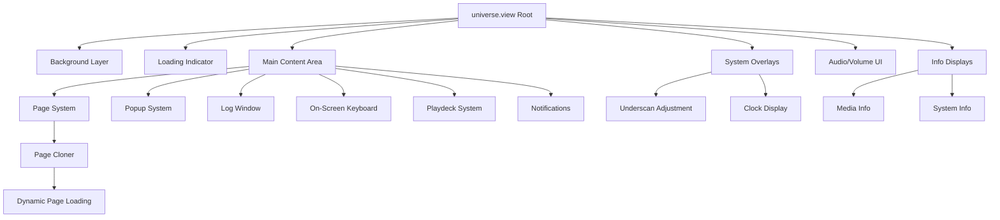
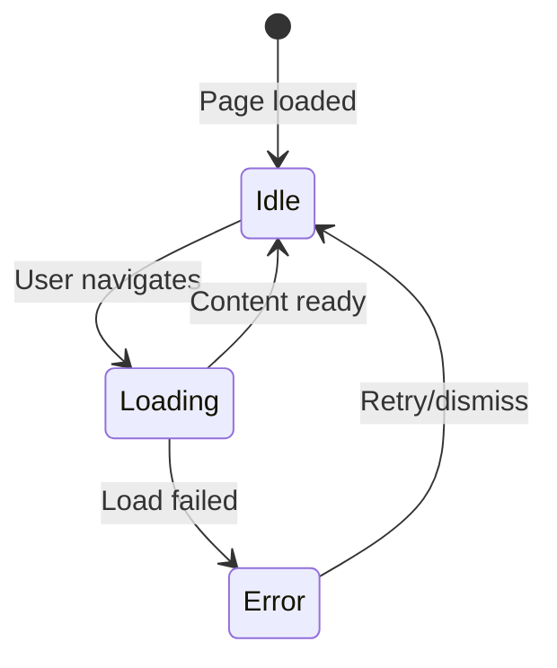
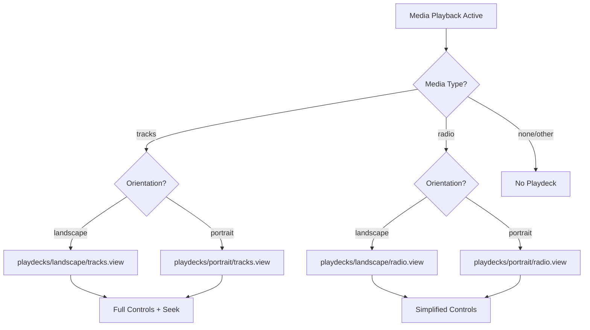
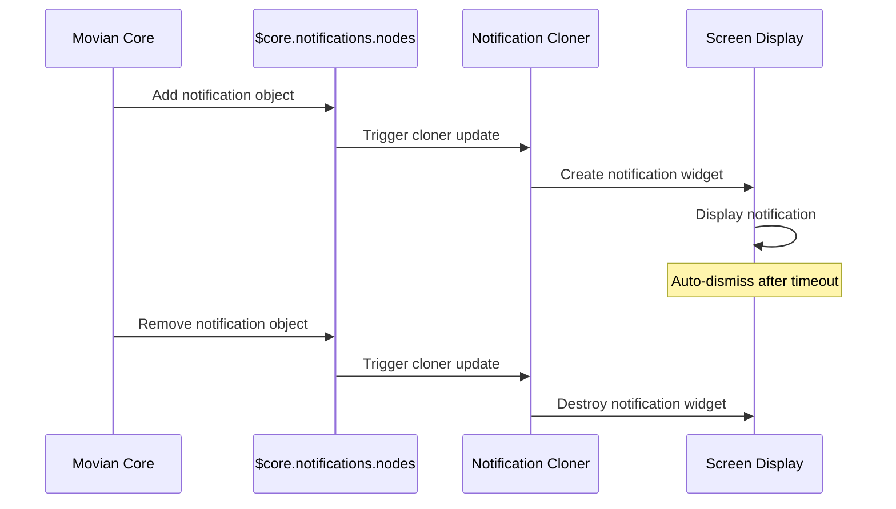
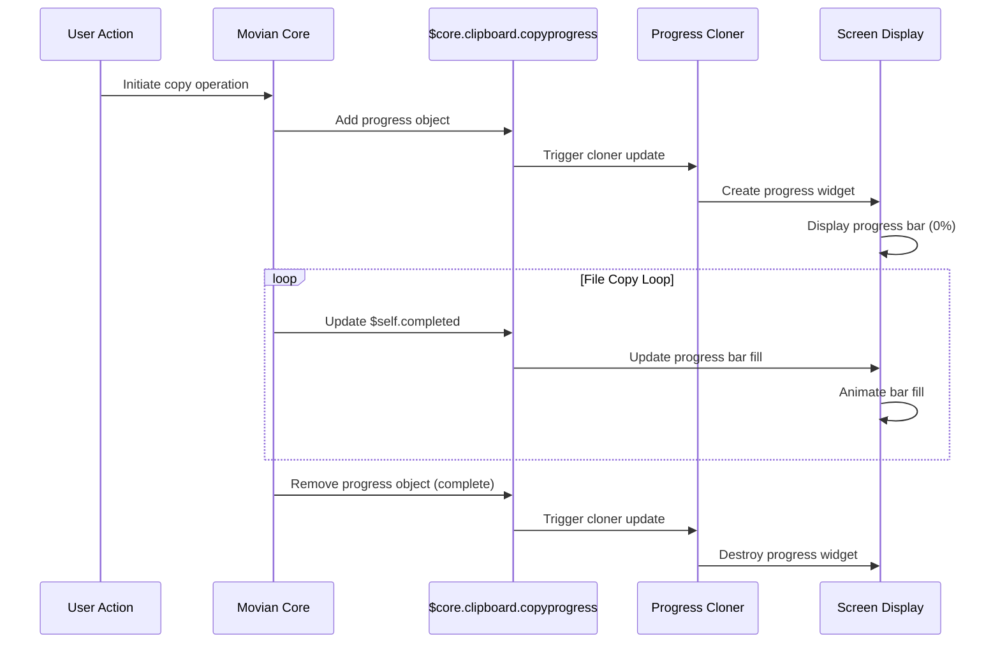
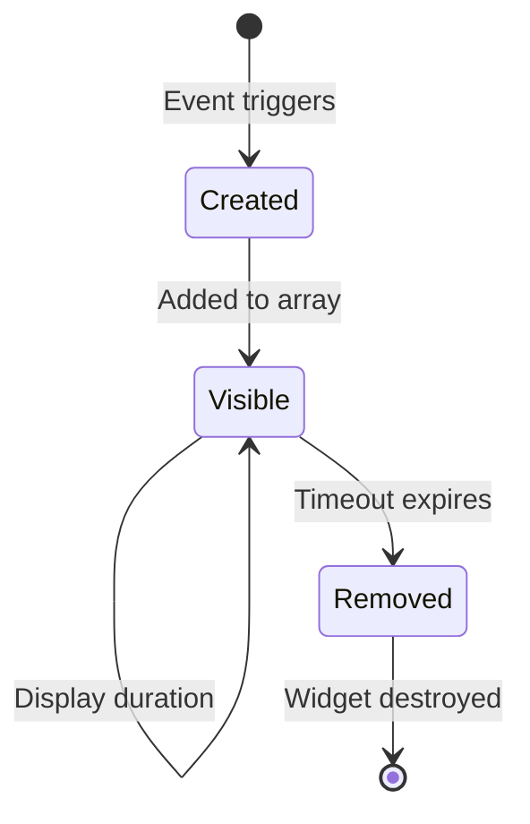
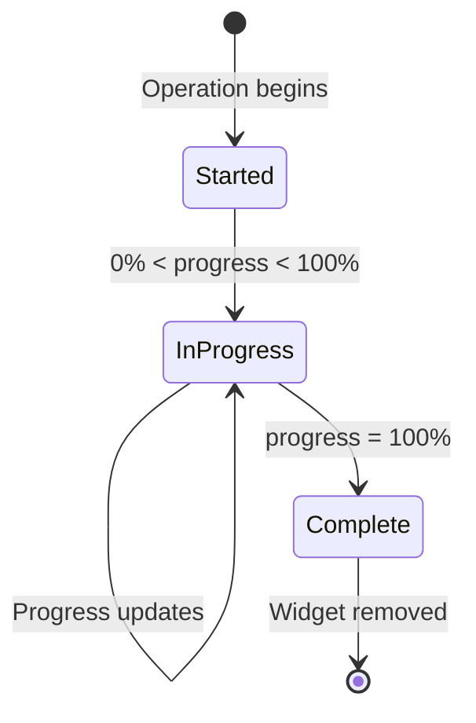

# Skin Architecture and Component System

## Overview

Movian's skin system is built on a sophisticated component architecture that enables complete UI customization through a modular, hierarchical structure. The skin architecture uses `universe.view` as the root entry point, which orchestrates the loading and management of all UI components including pages, popups, media players, and system overlays.

This document provides a comprehensive guide to understanding and working with Movian's skin architecture, component loading system, and the relationships between different UI elements.

## Root Entry Point: universe.view

### Purpose and Responsibility

The `universe.view` file serves as the **root container** and **orchestration layer** for the entire skin system. It is responsible for:

- **Global UI State Management**: Defining and managing UI-wide variables and settings
- **Component Lifecycle**: Loading and unloading UI components based on application state
- **System Integration**: Connecting to core Movian systems (navigation, audio, media, notifications)
- **Event Handling**: Managing global event handlers and user interactions
- **Layout Structure**: Establishing the fundamental z-order and spatial organization

**Source Reference**: `movian/glwskins/flat/universe.view`

### Architectural Structure



### Root Container Structure

The root container uses a `container_z` widget to establish z-order layering:

```view
widget(container_z, {
  // Layer 1: Background (lowest z-order)
  widget(loader, { source: "background.view"; });
  
  // Layer 2: Loading indicator
  widget(loader, {
    hidden: iir($nav.currentpage.model.loading, 8) < 0.001;
    zoffset: -999;
    alpha: iir($nav.currentpage.model.loading, 8);
    source: selectedElement(vectorize($core.glw.views.standard.loading))
      ?? "loading.view";
  });
  
  // Layer 3: Main content area (pages, popups, etc.)
  widget(underscan, {
    widget(container_z, {
      // Main UI components...
    });
  });
  
  // Layer 4+: System overlays (audio, info displays, clock)
  // ...
});
```

**Key Architectural Patterns**:

1. **Z-Order Layering**: Components are stacked using `container_z` with explicit `zoffset` values
2. **Underscan Management**: Critical UI elements wrapped in `underscan` widgets for TV safety
3. **Conditional Visibility**: Components shown/hidden based on state variables
4. **Smooth Transitions**: `iir()` function used for smooth alpha and state transitions

## Component Loading System

### Loading Mechanisms

Movian provides three primary mechanisms for loading UI components:

#### 1. Static Loading

**Purpose**: Load components that are always present

**Pattern**:
```view
widget(loader, {
  source: "background.view";
});
```

**Characteristics**:
- Component loaded immediately when parent is created
- No conditional logic
- Used for essential, always-visible components
- Examples: background, theme definitions

**Use Cases**:
- Background layers
- Global theme imports
- Essential UI scaffolding

#### 2. Conditional Loading

**Purpose**: Load components based on runtime conditions

**Pattern**:
```view
widget(loader, {
  autohide: true;
  source: select($ui.logwindow, "log.view", "");
});
```

**Characteristics**:
- `autohide: true` enables automatic show/hide based on source
- `select()` function provides ternary conditional logic
- Empty string `""` means "load nothing"
- Component lifecycle managed automatically

**Use Cases**:
- Optional UI elements (log window, on-screen keyboard)
- State-dependent displays
- User preference-based components

**Advanced Conditional Pattern**:
```view
widget(loader, {
  autohide: true;
  source: translate($core.media.current.type, "",
    "tracks", "playdecks/" + $ui.orientation + "/tracks.view",
    "radio",  "playdecks/" + $ui.orientation + "/radio.view"
  );
});
```

The `translate()` function provides multi-way conditional loading:
- First parameter: value to match
- Second parameter: default value if no match
- Remaining parameters: pairs of (match_value, result_value)

#### 3. Animated Loading

**Purpose**: Load components with visual transitions

**Pattern**:
```view
widget(loader, {
  time: 0.1;
  effect: blend;
  autohide: true;
  source: select($ui.sysinfo, "sysinfo.view", "");
});
```

**Characteristics**:
- `time`: Transition duration in seconds
- `effect`: Transition type (`blend`, `slide`, etc.)
- Smooth appearance/disappearance
- Combines with conditional loading

**Use Cases**:
- Overlay panels
- Information displays
- Modal dialogs
- Smooth UI state changes

### Dynamic Component Loading with Cloner

The `cloner` widget enables **data-driven component replication**:

```view
cloner($nav.pages, container_z, {
  widget(loader, {
    noInitialTransform: true;
    source: "skin://pages/" + $self.model.type + ".view";
  });
});
```

**How Cloner Works**:

1. **Data Source**: `$nav.pages` - array of page objects
2. **Container Type**: `container_z` - how cloned items are arranged
3. **Template**: Widget structure to replicate for each item
4. **Context**: Each clone has access to `$self` (current item) and `$parent` (container)

**Dynamic Path Construction**:
```view
source: "skin://pages/" + $self.model.type + ".view";
```

This pattern enables:
- Runtime determination of which view file to load
- Type-based component selection
- Flexible, extensible page system

**Common Cloner Patterns**:

```view
// Popup system
cloner($core.popups, loader, {
  source: "popups/" + $self.type + ".view";
});

// Notification system
cloner($core.notifications.nodes, container_z, {
  widget(quad, { color: 0; alpha: 0.6; });
  widget(label, {
    padding: [2em, 0.5em];
    caption: $self.text;
  });
});

// Progress indicators
cloner($core.clipboard.copyprogress, container_z, {
  // Progress bar UI...
});
```

## Page Management System

### Overview

The page management system is the core of Movian's navigation and content display architecture. It manages a stack of pages, handles navigation transitions, provides visual feedback during loading, and ensures smooth user experience through sophisticated layering and animation techniques.

**Source Reference**: `movian/glwskins/flat/universe.view` (lines 68-82)

### Complete Page System Architecture

The page system consists of three primary components working together:

```view
widget(layer, {
  filterConstraintY: true;
  alpha: iir(1 - $ui.screensaverActive, 8);
  
  widget(playfield, {
    effect: blend;
    noInitialTransform: true;
    alpha: 1 - iir(clamp(getLayer(), 0, 1), 7) * 0.66;
    
    cloner($nav.pages, container_z, {
      widget(loader, {
        noInitialTransform: true;
        source: "skin://pages/" + $self.model.type + ".view";
      });
    });
  });
});
```

### Navigation Pages: `cloner($nav.pages, container_z, { ... })`

#### Purpose and Functionality

The `cloner($nav.pages, container_z, { ... })` pattern is the heart of Movian's page system. It creates a **data-driven navigation stack** where each page in the navigation history is represented as a widget in a z-ordered container.

#### How It Works

**Data Source**: `$nav.pages`
- **Type**: Array of page objects maintained by Movian's core navigation system
- **Content**: Each element represents a page in the navigation stack
- **Order**: Index 0 is the oldest page (bottom of stack), last index is current page (top of stack)
- **Dynamic**: Automatically updated when user navigates forward or backward

**Container Type**: `container_z`
- **Purpose**: Stacks pages in z-order (depth)
- **Behavior**: Children are layered on top of each other
- **Visibility**: All pages remain in memory and rendered (with varying alpha)
- **Performance**: Enables instant back navigation without reloading

**Template Structure**:
```view
cloner($nav.pages, container_z, {
  widget(loader, {
    noInitialTransform: true;
    source: "skin://pages/" + $self.model.type + ".view";
  });
});
```

#### Context Variables in Cloner

Within the cloner template, special variables provide access to page data:

**`$self` - Current Page Object**:
```view
$self.model.type          // Page type: "directory", "video", "settings", etc.
$self.model.metadata      // Page metadata (background, custom view)
$self.model.contents      // Content type: "tracks", "album", "images"
$self.model.loading       // Loading state (boolean)
$self.url                 // Page URL
```

**`$parent` - Container Reference**:
```view
$parent.model             // Parent container model
$parent.url               // Parent URL
```

**`$clone` - Clone-Specific State**:
```view
$clone.index              // Index in the cloner array
$clone.total              // Total number of clones
```

#### Dynamic Page Loading

The page loader uses **runtime path construction** to load the appropriate view file:

```view
source: "skin://pages/" + $self.model.type + ".view";
```

**Example Resolution**:
- User opens a directory → `$self.model.type = "directory"` → loads `"skin://pages/directory.view"`
- User plays video → `$self.model.type = "video"` → loads `"skin://pages/video.view"`
- User opens settings → `$self.model.type = "settings"` → loads `"skin://pages/settings.view"`

**Fallback Mechanism**:
If a specific page type view doesn't exist, Movian may:
1. Use a default/generic page view
2. Display an error page
3. Fall back to a simpler representation

#### Navigation Stack Behavior

**Forward Navigation**:
1. User navigates to new page
2. New page object added to `$nav.pages` array
3. Cloner creates new widget for the page
4. Playfield animates transition (blend effect)
5. Previous page remains in stack (dimmed)

**Backward Navigation**:
1. User presses back button
2. Current page removed from `$nav.pages` array
3. Cloner destroys current page widget
4. Playfield animates to previous page
5. Previous page becomes active (alpha restored)

**Stack Visualization**:
```
$nav.pages = [
  { type: "home", ... },        // Index 0 - Bottom layer (most dimmed)
  { type: "directory", ... },   // Index 1 - Middle layer (dimmed)
  { type: "video", ... }        // Index 2 - Top layer (current, full alpha)
]
```

### Loading States: `$nav.currentpage.model.loading`

#### Purpose

The `$nav.currentpage.model.loading` variable provides **real-time loading state** for the currently active page, enabling visual feedback during content loading operations.

#### Variable Details

**Full Path**: `$nav.currentpage.model.loading`
- **`$nav`**: Global navigation system object
- **`currentpage`**: Reference to the topmost page in `$nav.pages`
- **`model`**: Page's data model
- **`loading`**: Boolean or numeric loading state

**Type**: Boolean (0 or 1) or numeric (0.0 to 1.0)
- `0` or `false` - Page fully loaded
- `1` or `true` - Page currently loading
- May represent loading progress (0.0 to 1.0)

#### Loading Indicator Implementation

The loading indicator in `universe.view` demonstrates sophisticated use of this variable:

```view
widget(loader, {
  hidden: iir($nav.currentpage.model.loading, 8) < 0.001;
  zoffset: -999;
  alpha: iir($nav.currentpage.model.loading, 8);
  source: selectedElement(vectorize($core.glw.views.standard.loading))
    ?? "loading.view";
});
```

**Breakdown**:

1. **Visibility Control**:
   ```view
   hidden: iir($nav.currentpage.model.loading, 8) < 0.001;
   ```
   - `iir(..., 8)` - Smooth interpolation with speed 8
   - `< 0.001` - Hidden when value nearly zero
   - **Effect**: Loading indicator fades out smoothly after loading completes

2. **Z-Order Positioning**:
   ```view
   zoffset: -999;
   ```
   - Places loading indicator behind main content
   - Prevents blocking interaction with loaded content
   - Visible through transparent areas

3. **Opacity Animation**:
   ```view
   alpha: iir($nav.currentpage.model.loading, 8);
   ```
   - Alpha directly tied to loading state
   - Smooth fade in when loading starts
   - Smooth fade out when loading completes
   - Speed 8 provides quick but smooth transition

4. **Custom Loading View**:
   ```view
   source: selectedElement(vectorize($core.glw.views.standard.loading))
     ?? "loading.view";
   ```
   - `$core.glw.views.standard.loading` - System-defined loading view
   - `??` - Null coalescing operator
   - Falls back to `"loading.view"` if no custom view defined
   - Allows plugins to provide custom loading animations

#### Loading State Lifecycle

**State Transitions**:



**Timeline Example**:
```
t=0.0s: User clicks link
        $nav.currentpage.model.loading = 1
        Loading indicator alpha: 0 → 1 (smooth)

t=0.5s: Network request in progress
        $nav.currentpage.model.loading = 1
        Loading indicator visible

t=2.0s: Content received, parsing
        $nav.currentpage.model.loading = 1
        Loading indicator still visible

t=2.5s: Page ready
        $nav.currentpage.model.loading = 0
        Loading indicator alpha: 1 → 0 (smooth)

t=3.0s: Fade complete
        Loading indicator hidden
```

#### Usage Patterns

**In Page Views**:
```view
// Show loading spinner in page
widget(container_z, {
  widget(loader, {
    alpha: $self.model.loading;
    source: "spinner.view";
  });
  
  widget(container_y, {
    alpha: 1 - $self.model.loading;
    // Page content...
  });
});
```

**Conditional Content Display**:
```view
// Hide content while loading
widget(container_y, {
  hidden: $nav.currentpage.model.loading;
  // Content that should only show when loaded
});
```

**Progress Indication**:
```view
// Show progress bar
widget(bar, {
  fill: $nav.currentpage.model.loading;
  color1: $ui.color1;
  color2: $ui.color2;
});
```

### Page Layer Management: `getLayer()`

#### Purpose and Functionality

The `getLayer()` function returns the **depth of the current page** in the navigation stack, enabling visual effects that differentiate between active and background pages.

#### Function Details

**Signature**: `getLayer()`
- **Parameters**: None
- **Returns**: Integer representing page depth
  - `0` - Current/active page (top of stack)
  - `1` - Previous page (one level back)
  - `2` - Two pages back
  - `n` - n pages back in history

**Context**: Must be called within a page widget context (inside cloner template)

#### Layer-Based Alpha Dimming

The primary use of `getLayer()` is to **dim background pages** for visual hierarchy:

```view
widget(playfield, {
  effect: blend;
  noInitialTransform: true;
  alpha: 1 - iir(clamp(getLayer(), 0, 1), 7) * 0.66;
  
  cloner($nav.pages, container_z, {
    // Page widgets...
  });
});
```

**Formula Breakdown**:

```view
alpha: 1 - iir(clamp(getLayer(), 0, 1), 7) * 0.66;
```

1. **`getLayer()`** - Get page depth (0, 1, 2, ...)
2. **`clamp(getLayer(), 0, 1)`** - Limit to range [0, 1]
   - Current page (0) → 0
   - Background pages (1+) → 1
3. **`iir(..., 7)`** - Smooth interpolation with speed 7
   - Prevents abrupt alpha changes
   - Creates smooth fade during navigation
4. **`* 0.66`** - Multiply by 66%
   - Background pages dimmed by 66%
5. **`1 - ...`** - Invert for alpha calculation
   - Current page: `1 - 0 = 1.0` (fully opaque)
   - Background pages: `1 - 0.66 = 0.34` (34% opacity)

**Visual Effect**:
- **Current page**: 100% opacity (fully visible)
- **Background pages**: 34% opacity (dimmed)
- **Transition**: Smooth fade when navigating

#### Global Style Application

The `getLayer()` function is also used in **global style definitions**:

```view
style(PageContainer, {
  alpha: 1 - iir(clamp(getLayer(), 0, 1), 4) * 0.9;
});
```

**Purpose**:
- Applies to all widgets with `PageContainer` style
- Provides consistent dimming across all page types
- Speed 4 (faster than playfield) for responsive feel
- 90% dimming (more aggressive than playfield)

**Usage in Pages**:
```view
// In any page view file
widget(container_y, {
  style: "PageContainer";
  // This container will automatically dim when page is in background
});
```

#### Advanced Layer-Based Effects

**Blur Background Pages**:
```view
widget(backdrop, {
  blur: getLayer() > 0 ? 5 : 0;
  source: $self.model.metadata.background;
});
```

**Scale Background Pages**:
```view
widget(container_z, {
  scale: 1 - getLayer() * 0.1;  // Shrink background pages by 10%
});
```

**Disable Interaction on Background Pages**:
```view
widget(container_y, {
  focusable: getLayer() == 0;  // Only current page is focusable
  clickable: getLayer() == 0;
});
```

**Conditional Rendering**:
```view
widget(loader, {
  // Only load expensive components for current page
  source: getLayer() == 0 ? "detailed-view.view" : "simple-view.view";
});
```

### Key Components

#### Layer Widget

**Purpose**: Manages z-order and page stacking at the container level

**Attributes**:
- `filterConstraintY: true` - Constrains layout calculations for performance
  - Prevents layout recalculation propagation
  - Improves rendering performance for page stack
- `alpha: iir(1 - $ui.screensaverActive, 8)` - Fades out during screensaver
  - Smooth transition when screensaver activates
  - Speed 8 for quick but smooth fade

**Responsibilities**:
- Contains the entire page system
- Manages screensaver integration
- Provides performance optimization boundary

#### Playfield Widget

**Purpose**: Provides smooth page transitions and navigation effects

**Attributes**:
- `effect: blend` - Smooth blending between pages
  - Cross-fade animation during navigation
  - Hardware-accelerated transitions
- `noInitialTransform: true` - Prevents initial animation
  - Pages appear instantly on first load
  - Improves perceived performance
- `alpha: 1 - iir(clamp(getLayer(), 0, 1), 7) * 0.66` - Dims background pages
  - Creates visual hierarchy
  - Focuses attention on current page

**Responsibilities**:
- Manages page transition animations
- Applies visual effects to page stack
- Handles navigation gestures (swipe, etc.)

### Page Types and Organization

Pages are organized in the `pages/` directory, with each page type having its own view file:

**Content Pages**:
- `directory.view` - Generic directory/list browsing
- `list.view` - List-based content display
- `grid.view` - Grid-based content display
- `home.view` - Home screen/dashboard

**Media Pages**:
- `video.view` - Video playback page
- `album.view` - Music album display
- `image.view` - Image viewer
- `slideshow.view` - Image slideshow mode

**Specialized Pages**:
- `settings.view` - Settings and configuration
- `searchresults.view` - Search results display
- `playqueue.view` - Media playback queue
- `openerror.view` - Error display page

**System Pages**:
- `about.view` - About/info page
- `upgrade.view` - Software update page
- `stpp.view` - STPP (Showtime Protocol) pages

### Page Loading Mechanism

**Dynamic Type Resolution**:

```view
source: "skin://pages/" + $self.model.type + ".view";
```

When a page is opened:
1. Movian core creates a page model with a `type` property
2. The cloner template constructs the path: `"skin://pages/" + type + ".view"`
3. The loader widget loads the corresponding view file
4. If file doesn't exist, fallback mechanisms may apply

**Example Flow**:
- User navigates to a directory
- Core creates page model with `type = "directory"`
- Path becomes `"skin://pages/directory.view"`
- `directory.view` is loaded and rendered

### Page State Management

Pages have access to navigation state through `$nav` and `$self`:

```view
// Current page loading state
$nav.currentpage.model.loading

// Page metadata
$self.model.metadata.background
$self.model.metadata.glwview

// Page content type
$self.model.contents  // "tracks", "album", "images", etc.

// Page type
$self.model.type  // "directory", "video", "settings", etc.
```

## Popup and Overlay System

### Overview

Movian's popup and overlay system provides modal dialogs, system windows, and on-screen interfaces that appear on top of the main UI. The system is built on three primary mechanisms:

1. **Modal Popups** - Dynamic dialogs managed by `$core.popups`
2. **System Windows** - Conditional overlays like log window and on-screen keyboard
3. **Notification Overlays** - Non-modal status displays

**Source Reference**: `movian/glwskins/flat/universe.view` (lines 83-93)

### Popup Architecture

#### Core Popup System: `cloner($core.popups, loader, { ... })`

The popup system uses a cloner to dynamically create modal dialogs based on system requests:

```view
cloner($core.popups, loader, {
  source: "popups/" + $self.type + ".view";
});
```

**Location in universe.view**:
```view
widget(layer, {
  filterConstraintY: true;
  alpha: iir(1 - $ui.screensaverActive, 8);
  
  widget(playfield, {
    // Page system...
  });
  
  // Popup system - appears above pages
  cloner($core.popups, loader, {
    source: "popups/" + $self.type + ".view";
  });
  
  // Other overlays...
});
```

#### How the Popup System Works

**Data Source**: `$core.popups`
- **Type**: Array of popup objects managed by Movian core
- **Content**: Each element represents an active popup dialog
- **Lifecycle**: Popups added when requested, removed when dismissed
- **Z-Order**: Rendered above page content in the layer hierarchy

**Dynamic Type Resolution**:
```view
source: "popups/" + $self.type + ".view";
```

When a popup is requested:
1. Core creates popup object with `type` property
2. Cloner template constructs path: `"popups/" + type + ".view"`
3. Loader widget loads the corresponding popup view file
4. Popup renders as modal overlay

**Example Flow**:
- Plugin requests authentication → Core adds popup with `type = "auth"`
- Path becomes `"popups/auth.view"`
- Authentication dialog loads and displays
- User enters credentials or cancels
- Popup removed from `$core.popups` array
- Dialog automatically disappears

#### Popup Context Variables

Within the popup cloner template, special variables provide access to popup data:

**`$self` - Current Popup Object**:
```view
$self.type              // Popup type: "message", "auth", "textDialog", etc.
$self.eventSink         // Event sink for communication back to requester
$self.message           // Message text (for message popups)
$self.ok                // Show OK button (boolean)
$self.cancel            // Show Cancel button (boolean)
$self.buttons           // Custom button array
$self.username          // Username field binding (auth popup)
$self.password          // Password field binding (auth popup)
$self.source            // Source identifier (auth popup)
$self.reason            // Reason text (auth popup)
```

### Popup Types and Implementation

#### Message Dialogs (`message.view`)

**Purpose**: Display messages with customizable buttons

**Source Reference**: `movian/glwskins/flat/popups/message.view`

**Structure**:
```view
#import "common.view"

onEvent(cancel, deliverEvent($self.eventSink));
onEvent(back,   deliverEvent($self.eventSink, "cancel"));

widget(popup, {
  clickable: true;
  onEvent(click, deliverEvent($self.eventSink, "Cancel"), true, true, true);
  
  widget(container_z, {
    clickable: true;
    PopupBackdrop();
    
    widget(container_y, {
      padding: 1em;
      spacing: 2em;
      
      widget(label, {
        width: select($ui.aspect > 1, $ui.width / 2, $ui.width - 4em);
        align: center;
        maxlines: 10;
        caption: $self.message;
      });
      
      widget(container_x, {
        align: center;
        spacing: 1em;
        homogenous: true;
        
        cloner($self.buttons, container_z, {
          popupButton(deliverEvent($parent.eventSink, $self.action),
                      0.1, false, $self.title);
        });
        
        popupButtonOK(deliverEvent($self.eventSink, "OK"),
                      0.5, !$self.ok);
        popupButtonCancel(deliverEvent($self.eventSink, "Cancel"),
                          1.0, !$self.cancel);
      });
    });
  });
});
```

**Features**:
- Adaptive width based on screen aspect ratio
- Multi-line message support (up to 10 lines)
- Custom button arrays via `$self.buttons`
- Standard OK/Cancel buttons
- Click outside to cancel

#### Authentication Dialogs (`auth.view`)

**Purpose**: Username/password input for authentication

**Source Reference**: `movian/glwskins/flat/popups/auth.view`

**Key Features**:
```view
widget(popup, {
  aspect: 2;
  clickable: true;
  
  widget(container_z, {
    filterConstraintX: true;
    PopupBackdrop();
    
    widget(container_y, {
      padding: [$ui.xmargin, 1em];
      spacing: 2em;
      
      widget(table, {
        widget(container_y, {
          spacing: 0.25em;
          
          // Header with lock icon and source
          widget(container_x, {
            tableMode: true;
            style: "popupRow";
            
            widget(icon, {
              source: "skin://icons/ic_lock_48px.svg";
              align: center;
              size: 2em;
            });
            
            widget(container_y, {
              filterConstraintX: true;
              widget(label, {
                align: left;
                caption: $self.source ?? $self.id;
              });
              widget(label, {
                align: left;
                caption: $self.reason;
              });
            });
          });
          
          // Username field
          widget(container_x, {
            tableMode: true;
            hidden: $self.disableUsername;
            style: "popupRow";
            
            widget(label, {
              caption: _("Username");
              align: right;
            });
            
            widget(container_z, {
              filterConstraintX: true;
              widget(quad, { style: "textBackdrop"; });
              widget(text, {
                style: "textInput";
                description: _("Username");
                id: "username";
                focusable: true;
                bind($self.username);
                onEvent(enter, deliverEvent($self.eventSink, "Ok"),
                        $self.username);
              });
            });
          });
          
          // Password field
          widget(container_x, {
            style: "popupRow";
            hidden: $self.disablePassword;
            tableMode: true;
            
            widget(label, {
              caption: _("Password");
              align: right;
            });
            
            widget(container_z, {
              filterConstraintX: true;
              widget(quad, { style: "textBackdrop"; });
              widget(text, {
                style: "textInput";
                description: _("Password");
                id: "password";
                focusable: true;
                password: true;
                bind($self.password);
                onEvent(enter, deliverEvent($self.eventSink, "Ok"),
                        $self.password);
              });
            });
          });
          
          // Domain field (optional)
          widget(container_x, {
            style: "popupRow";
            hidden: $self.disableDomain;
            tableMode: true;
            
            widget(label, {
              caption: _("Domain");
              align: right;
            });
            
            widget(container_z, {
              filterConstraintX: true;
              widget(quad, { style: "textBackdrop"; });
              widget(text, {
                style: "textInput";
                description: _("Domain");
                id: "domain";
                focusable: true;
                bind($self.domain);
                onEvent(enter, deliverEvent($self.eventSink, "Ok"),
                        $self.domain);
              });
            });
          });
          
          // Remember me checkbox
          widget(container_x, {
            style: "popupRow";
            hidden: !$self.canRemember;
            tableMode: true;
            
            focusable: true;
            onEvent(activate, { toggle($self.rememberMe); });
            
            widget(label, {
              caption: _("Remember me");
              align: right;
            });
            
            widget(container_z, {
              filterConstraintX: true;
              widget(quad, {
                padding: -0.1em;
                alpha: isNavFocused() + isHovered() * 0.2;
                color: 0.5;
              });
              
              widget(icon, {
                align: left;
                source: select($self.rememberMe,
                               "skin://icons/ic_check_box_48px.svg",
                               "skin://icons/ic_check_box_outline_blank_48px.svg");
              });
            });
          });
        });
      });
      
      widget(container_x, {
        align: center;
        spacing: 2em;
        homogenous: true;
        
        popupButtonOK(deliverEvent($self.eventSink, "OK"), true, false);
        popupButtonCancel(deliverEvent($self.eventSink, "Cancel"), true, false);
      });
    });
  });
});
```

**Features**:
- Lock icon header with source identification
- Conditional fields (username, password, domain)
- Password masking
- "Remember me" checkbox
- Enter key submits form
- Table layout for alignment

#### Other Popup Types

**File Picker** (`filepicker.view`):
- File/directory selection
- Browse filesystem
- Path selection
- Navigation controls

**Text Input** (`textDialog.view`):
- Text entry dialogs
- Search input
- Configuration input
- Single-line text entry

**Resume Dialog** (`resume.view`):
- Media playback resume
- Position selection
- Continue/restart options
- Playback state management

### Popup Component Pattern

Popups follow a consistent structure defined in `popups/common.view`:

**Source Reference**: `movian/glwskins/flat/popups/common.view`

#### PopupBackdrop Macro

Creates the semi-transparent background and shadow effect:

```view
#define PopupBackdrop() {
  widget(container_x, {
    filterConstraintX: true;
    filterConstraintY: true;
    
    widget(quad, { width: 0.2em; color: 0; });
    
    widget(container_y, {
      widget(quad, { height: 0.2em; color: 0; });
      widget(backdrop, {
        source: "pixmap:gradient:40,40,40:60,60,60";
        alpha: 0.5;
      });
      widget(quad, { height: 0.2em; color: 0; });
    });
    
    widget(quad, { width: 0.2em; color: 0; });
  });
}
```

**Design Pattern**:
- Black quads create shadow borders (0.2em)
- Gradient backdrop provides depth
- 50% alpha for semi-transparency
- Layout constraints for performance

#### Popup Button Macros

**Generic Button**:
```view
#define popupButton(EVENT, ENABLED, HIDDEN, CAPTION) {
  widget(container_z, {
    height: 2em;
    GridItemBevel();
    GridItemHighlight();
    
    hidden: HIDDEN;
    focusable: ENABLED;
    onEvent(activate, EVENT);
    
    widget(label, {
      padding: [0.5em, 0];
      align: center;
      caption: CAPTION;
      color: !isNavFocused();
    });
  });
}
```

**Convenience Macros**:
```view
#define popupButtonOK(EVENT, ENABLED, HIDDEN) {
  popupButton(EVENT, ENABLED, HIDDEN, _("Ok"));
}

#define popupButtonCancel(EVENT, ENABLED, HIDDEN) {
  popupButton(EVENT, ENABLED, HIDDEN, _("Cancel"));
}
```

**Features**:
- Consistent visual style (bevel and highlight)
- Conditional visibility and focusability
- Localized button text
- Focus-based color changes

#### Popup Styles

**Row Style**:
```view
style(popupRow, {
  padding: [0.5em, 0.25em];
  spacing: 1em;
});
```

**Text Backdrop Style**:
```view
style(textBackdrop, {
  color: 0;
  padding: [-0.1em, -0.1em];
});
```

**Group Container Macro**:
```view
#define popupGroup(BODY) {
  widget(container_z, {
    widget(quad, {
      color: 0;
      alpha: 0.9;
    });
    widget(container_x, {
      padding: 1em;
      BODY;
    });
  });
}
```

### Popup Event Handling

#### Event Sink Pattern

Popups use event sinks for bidirectional communication:

```view
onEvent(cancel, deliverEvent($self.eventSink));
onEvent(back,   deliverEvent($self.eventSink, "cancel"));

// Button click
popupButtonOK(deliverEvent($self.eventSink, "OK"), 0.5, !$self.ok);
popupButtonCancel(deliverEvent($self.eventSink, "Cancel"), 1.0, !$self.cancel);
```

**Event Flow**:
1. **Popup Creation**: Core creates popup with event sink
2. **User Interaction**: User clicks button or presses back
3. **Event Delivery**: `deliverEvent($self.eventSink, "action")` sends response
4. **Core Handling**: Event delivered to popup creator (plugin or core)
5. **Popup Removal**: Core removes popup from `$core.popups` array
6. **Automatic Cleanup**: Popup widget destroyed automatically

#### Click-Outside-to-Cancel Pattern

```view
widget(popup, {
  clickable: true;
  onEvent(click, deliverEvent($self.eventSink, "Cancel"), true, true, true);
  
  widget(container_z, {
    clickable: true;
    // Popup content - stops click propagation
  });
});
```

**How It Works**:
- Outer `popup` widget is clickable
- Click event delivers "Cancel" to event sink
- Inner `container_z` is also clickable (stops propagation)
- Clicking popup content doesn't trigger cancel
- Clicking outside popup content triggers cancel

#### Data Binding in Popups

```view
widget(text, {
  bind($self.username);
  onEvent(enter, deliverEvent($self.eventSink, "Ok"), $self.username);
});
```

**Binding Pattern**:
- `bind($self.username)` - Two-way data binding
- User input updates `$self.username`
- Changes reflected in popup object
- Event sink receives updated values
- Creator accesses final values after popup closes

## System Window Overlays

### Overview

System window overlays are conditional UI components that appear on demand, managed through state variables. Unlike modal popups, these windows can be toggled by user actions or system events and provide specialized functionality.

**Source Reference**: `movian/glwskins/flat/universe.view` (lines 88-93)

### Log Window System

#### Purpose and Architecture

The log window provides real-time access to system logs and debug information, essential for troubleshooting and development.

**Source Reference**: `movian/glwskins/flat/log.view`

#### Conditional Loading Pattern

```view
widget(loader, {
  autohide: true;
  source: select($ui.logwindow, "log.view", "");
});
```

**Location in universe.view**:
```view
widget(layer, {
  // Page system...
  // Popup system...
  
  // Log window overlay
  widget(loader, {
    autohide: true;
    source: select($ui.logwindow, "log.view", "");
  });
  
  // Other overlays...
});
```

**How It Works**:

1. **State Variable**: `$ui.logwindow` (boolean)
   - `true` - Log window visible
   - `false` - Log window hidden

2. **Conditional Source**: `select($ui.logwindow, "log.view", "")`
   - If `$ui.logwindow` is true → load `"log.view"`
   - If `$ui.logwindow` is false → load `""` (nothing)

3. **Autohide Attribute**: `autohide: true`
   - Automatically hides loader when source is empty
   - Automatically shows loader when source is valid
   - Manages widget lifecycle automatically

4. **Lifecycle**:
   - User triggers log window event
   - `$ui.logwindow` set to `true`
   - Loader loads `log.view`
   - Log window appears
   - User closes or presses back
   - `$ui.logwindow` set to `false`
   - Loader source becomes `""`
   - Log window automatically hidden and unloaded

#### Event Handling

**Toggle Activation**:
```view
onEvent(logwindow, {
  toggle($ui.logwindow);
});
```

- **Event**: `logwindow` (typically triggered by hotkey or menu)
- **Action**: `toggle($ui.logwindow)` - Flip boolean state
- **Effect**: Opens log window if closed, closes if open

**Back Button Handling**:
```view
onEvent(back, {
  $ui.logwindow = false;
}, $ui.logwindow);
```

- **Event**: `back` (back button or escape key)
- **Action**: `$ui.logwindow = false` - Close log window
- **Condition**: `$ui.logwindow` (third parameter)
  - Handler only active when log window is open
  - Prevents interfering with normal back navigation
  - Context-sensitive event handling

#### Log Window Implementation

**Complete Structure** (`log.view`):

```view
#import "skin://theme.view"

widget(container_z, {
  
  // Scrollable log content
  widget(container_x, {
    padding: [4, 0];
    widget(list_y, {
      id: "scrollable";
      bottomGravity: true;
      clipOffsetTop: 3em;
      scrollThresholdTop: 5em;
      scrollThresholdBottom: $ui.universeBottomHeight + 2em;
      clipOffsetBottom: $ui.universeBottomHeight;
      clipAlpha: 0.2;
      clipBlur: 1;
      
      cloner($core.logbuffer, label, {
        caption: $self.prefix + $self.message;
        ellipsize: true;
        font: "dataroot://res/fonts/UbuntuMono-Regular.ttf";
        size: 0.8em;
        
        color: translate($self.severity, [1,1,1],
                         "DEBUG", [0.5, 1, 0.5],
                         "INFO",  [1, 1, 0.5],
                         "ERROR", [1, 0.5, 0.5]);
      });
    });
  });
  
  // Scrollbar
  ScrollBar("scrollable", 3em, $ui.universeBottomHeight);
  
  // Header bar
  widget(container_y, {
    align: top;
    widget(container_z, {
      height: 3em;
      zoffset: 10;
      widget(quad, {
        color: 0;
        alpha: 0.2;
      });
      
      widget(container_x, {
        BackButton();
        
        widget(label, {
          filterConstraintX: true;
          padding: [4em, 0];
          align: center;
          caption: _("System log");
          size: 1.5em;
        });
      });
      
      widget(dummy, {
        width: 4em;
      });
    });
  });
});
```

**Key Features**:

1. **Data-Driven Log Display**:
   ```view
   cloner($core.logbuffer, label, {
     caption: $self.prefix + $self.message;
     color: translate($self.severity, [1,1,1],
                      "DEBUG", [0.5, 1, 0.5],
                      "INFO",  [1, 1, 0.5],
                      "ERROR", [1, 0.5, 0.5]);
   });
   ```
   - `$core.logbuffer` - Array of log entries from core
   - Each entry has `prefix`, `message`, and `severity`
   - Color-coded by severity (green=DEBUG, yellow=INFO, red=ERROR)
   - Monospace font for readability

2. **Bottom Gravity**:
   ```view
   bottomGravity: true;
   ```
   - New log entries appear at bottom
   - Auto-scrolls to latest entry
   - Similar to terminal/console behavior

3. **Clipping and Scrolling**:
   ```view
   clipOffsetTop: 3em;
   scrollThresholdTop: 5em;
   scrollThresholdBottom: $ui.universeBottomHeight + 2em;
   clipOffsetBottom: $ui.universeBottomHeight;
   clipAlpha: 0.2;
   clipBlur: 1;
   ```
   - Top clipping for header (3em)
   - Bottom clipping for playdeck area
   - Smooth fade at clip boundaries
   - Blur effect for visual polish

4. **Header with Back Button**:
   ```view
   BackButton();
   ```
   - Uses macro from `theme.view`
   - Closes log window when clicked
   - Consistent with other UI patterns

### On-Screen Keyboard (OSK)

#### Purpose and Architecture

The on-screen keyboard provides text input for devices without physical keyboards (TVs, set-top boxes, tablets).

**Source Reference**: `movian/glwskins/flat/osk.view`

#### Conditional Loading Pattern

```view
widget(loader, {
  autohide: true;
  source: select($ui.osk.show, "osk.view", "");
});
```

**Location in universe.view**:
```view
widget(layer, {
  // Page system...
  // Popup system...
  // Log window...
  
  // On-screen keyboard overlay
  widget(loader, {
    autohide: true;
    source: select($ui.osk.show, "osk.view", "");
  });
});
```

**How It Works**:

1. **State Variable**: `$ui.osk.show` (boolean)
   - Managed automatically by Movian core
   - Set to `true` when text input widget gains focus
   - Set to `false` when keyboard dismissed

2. **Conditional Source**: `select($ui.osk.show, "osk.view", "")`
   - If `$ui.osk.show` is true → load `"osk.view"`
   - If `$ui.osk.show` is false → load `""` (nothing)

3. **Automatic Activation**:
   - User focuses text input widget
   - Core detects need for keyboard
   - `$ui.osk.show` automatically set to `true`
   - Keyboard appears
   - User submits or cancels
   - `$ui.osk.show` automatically set to `false`
   - Keyboard disappears

#### OSK State Management

**Global OSK Variables**:
```view
$ui.osk.shift = 0;
$ui.osk.caps = 0;
$ui.osk.shifted = $ui.osk.shift ^^ $ui.osk.caps;
$ui.osk.title = "...";
$ui.osk.text = "...";
$ui.osk.password = false;
$ui.osk.eventSink = ...;
```

**State Variables**:
- `$ui.osk.show` - Keyboard visibility (managed by core)
- `$ui.osk.shift` - Temporary shift state (next character only)
- `$ui.osk.caps` - Caps lock state (persistent)
- `$ui.osk.shifted` - Combined shift state (XOR of shift and caps)
- `$ui.osk.title` - Dialog title text
- `$ui.osk.text` - Current input text (bound to text widget)
- `$ui.osk.password` - Password masking mode
- `$ui.osk.eventSink` - Event sink for OK/Cancel responses

#### OSK Implementation

**Complete Structure** (`osk.view`):

```view
#import "skin://osk/common.view"
#import "skin://popups/common.view"

// Initialize state
$ui.osk.shift = 0;
$ui.osk.caps = 0;
$ui.osk.shifted = $ui.osk.shift ^^ $ui.osk.caps;

// Keyboard layout selection
multiopt($view.path,
         $view.selopt,
         void,
         $core.glw.osk.userKeyboard,
         vectorize($core.glw.views.standard.osk),
         makeUri(_("Default"), "skin://osk/default.view")
         );

widget(popup, {
  clickable: true;
  onEvent(click, deliverEvent($ui.osk.eventSink, "Cancel"), true, true, true);
  
  widget(container_z, {
    clickable: true;
    PopupBackdrop();
    width: 30em;
    
    widget(container_y, {
      onEvent(cancel, deliverEvent($ui.osk.eventSink, "Cancel"));
      onEvent(back,   deliverEvent($ui.osk.eventSink, "Cancel"));
      navPositional: true;
      
      padding: 1em;
      spacing: 0.1em;
      
      // Title
      widget(label, {
        sizeScale: 1.5;
        caption: $ui.osk.title;
        shadow: true;
      });
      
      // Text input field with controls
      widget(container_x, {
        spacing: 0.1em;
        height: 2em;
        
        // Text input
        widget(container_z, {
          weight: 10;
          filterConstraintX: true;
          filterConstraintY: true;
          widget(quad, { color: 0; });
          widget(text, {
            password: $ui.osk.password;
            oskPassword: true;
            padding: [1em, 0];
            bind($ui.osk.text);
            sizeScale: 1.5;
            permanentCursor: true;
            id: "input";
          });
        });
        
        // Navigation buttons
        ACTION_ICON("skin://icons/ic_chevron_left_48px.svg",
                    targetedEvent("input", Left));
        
        ACTION_ICON("skin://icons/ic_chevron_right_48px.svg",
                    targetedEvent("input", Right));
        
        ACTION_ICON("skin://icons/ic_skip_previous_48px.svg", {
          $ui.osk.text = void;
        }, 1.5);
        
        ACTION_ICON("skin://icons/ic_cancel_48px.svg",
                    deliverEvent($ui.osk.eventSink, "Cancel"), 1.5);
        
        ACTION_ICON("skin://icons/ic_check_48px.svg",
                    deliverEvent($ui.osk.eventSink, "Ok"), 1.5);
      });
      
      // Keyboard layout loader
      widget(loader, {
        source: $view.path;
        time: 0;
      });
      
      // Layout selector
      widget(container_x, {
        height: 2em;
        spacing: 1em;
        
        space(6);
        
        ACTION("←", targetedEvent("opt", Decrease), 1, false, $view.canLayoutPrev);
        ACTION("→", targetedEvent("opt", Increase), 1, false, $view.canLayoutNext);
        
        widget(container_x, {
          weight: 6;
          filterConstraintX: true;
          widget(label, {
            caption: _("Keyboard layout:");
          });
          
          widget(deck, {
            $view.canLayoutPrev = canSelectPrevious();
            $view.canLayoutNext = canSelectNext();
            
            id: "opt";
            effect: blend;
            time: 0.1;
            
            cloner($view.selopt.options, label, {
              caption: $self.title;
            });
          });
        });
      });
    });
  });
});
```

**Key Features**:

1. **Text Input Field**:
   ```view
   widget(text, {
     password: $ui.osk.password;
     oskPassword: true;
     bind($ui.osk.text);
     permanentCursor: true;
   });
   ```
   - Bound to `$ui.osk.text` for two-way data flow
   - Password masking when `$ui.osk.password` is true
   - `oskPassword: true` - Special OSK mode
   - Permanent cursor for visibility

2. **Action Icons**:
   ```view
   ACTION_ICON("skin://icons/ic_chevron_left_48px.svg",
               targetedEvent("input", Left));
   ACTION_ICON("skin://icons/ic_chevron_right_48px.svg",
               targetedEvent("input", Right));
   ACTION_ICON("skin://icons/ic_skip_previous_48px.svg", {
     $ui.osk.text = void;
   }, 1.5);
   ACTION_ICON("skin://icons/ic_cancel_48px.svg",
               deliverEvent($ui.osk.eventSink, "Cancel"), 1.5);
   ACTION_ICON("skin://icons/ic_check_48px.svg",
               deliverEvent($ui.osk.eventSink, "Ok"), 1.5);
   ```
   - Cursor navigation (left/right arrows)
   - Clear text (skip previous icon)
   - Cancel (X icon)
   - Submit (checkmark icon)

3. **Dynamic Keyboard Layout**:
   ```view
   widget(loader, {
     source: $view.path;
     time: 0;
   });
   ```
   - Loads keyboard layout from `$view.path`
   - Multiple layouts supported (QWERTY, AZERTY, etc.)
   - User can switch layouts
   - Custom layouts via `$core.glw.osk.userKeyboard`

4. **Layout Selection**:
   ```view
   multiopt($view.path,
            $view.selopt,
            void,
            $core.glw.osk.userKeyboard,
            vectorize($core.glw.views.standard.osk),
            makeUri(_("Default"), "skin://osk/default.view")
            );
   ```
   - `multiopt` - Multi-option selector
   - User keyboard preferences
   - Standard system keyboards
   - Default fallback

5. **Shift and Caps Lock**:
   ```view
   $ui.osk.shift = 0;
   $ui.osk.caps = 0;
   $ui.osk.shifted = $ui.osk.shift ^^ $ui.osk.caps;
   ```
   - `shift` - Temporary uppercase (next char only)
   - `caps` - Caps lock (persistent uppercase)
   - `shifted` - XOR combination (either but not both)

#### OSK Event Handling

**Submit and Cancel**:
```view
onEvent(cancel, deliverEvent($ui.osk.eventSink, "Cancel"));
onEvent(back,   deliverEvent($ui.osk.eventSink, "Cancel"));

ACTION_ICON("skin://icons/ic_cancel_48px.svg",
            deliverEvent($ui.osk.eventSink, "Cancel"), 1.5);
ACTION_ICON("skin://icons/ic_check_48px.svg",
            deliverEvent($ui.osk.eventSink, "Ok"), 1.5);
```

**Event Flow**:
1. User types text using keyboard
2. Text bound to `$ui.osk.text`
3. User clicks OK or Cancel
4. Event delivered to `$ui.osk.eventSink`
5. Core receives response with final text
6. `$ui.osk.show` set to `false`
7. Keyboard automatically closes

#### OSK Integration

**Automatic Activation**:
- Any `text` widget with `focusable: true` can trigger OSK
- Core detects when text input needs keyboard
- OSK automatically shown on focus
- OSK automatically hidden on blur

**Manual Activation** (from plugins):
```javascript
// JavaScript plugin code
showKeyboard({
  title: "Enter search query",
  text: currentText,
  password: false
}).then(function(result) {
  if (result.ok) {
    // User entered text
    var enteredText = result.text;
  } else {
    // User cancelled
  }
});
```

### System Window Characteristics

**Common Patterns**:

1. **Conditional Loading**:
   ```view
   widget(loader, {
     autohide: true;
     source: select($condition, "window.view", "");
   });
   ```

2. **State Variable Management**:
   - Boolean state variables (`$ui.logwindow`, `$ui.osk.show`)
   - Toggle functions for user control
   - Automatic management by core system

3. **Event-Based Control**:
   - Global events for activation
   - Context-sensitive back button handling
   - Event sinks for communication

4. **Z-Order Placement**:
   - Rendered in `layer` widget above pages
   - Below system overlays (volume, clock)
   - Proper stacking for modal behavior

5. **Autohide Attribute**:
   - Automatic show/hide based on source
   - Lifecycle management
   - Performance optimization

## Playdeck System and Media Adaptation

### Overview

The **playdeck system** is Movian's adaptive media player UI that provides context-aware controls and information display for active media playback. The system automatically adapts to both **media type** (tracks vs. radio) and **device orientation** (landscape vs. portrait), ensuring optimal user experience across different playback scenarios and screen configurations.

**Source Reference**: `movian/glwskins/flat/universe.view` (lines 108-113), `movian/glwskins/flat/playdecks/`

### Core Architecture

#### Integration in universe.view

The playdeck system is integrated into the main UI hierarchy as a conditional overlay:

```view
widget(loader, {
  autohide: true;
  source: translate($core.media.current.type, "",
    "tracks", "playdecks/" + $ui.orientation + "/tracks.view",
    "radio",  "playdecks/" + $ui.orientation + "/radio.view"
  );
});
```

**Location in Hierarchy**:
- Positioned within the main `underscan` container
- Rendered above page content but below popups
- Z-order ensures visibility without blocking critical UI elements

**Key Attributes**:
- `autohide: true` - Automatically shows/hides based on media playback state
- Dynamic source path construction based on media type and orientation
- Seamless appearance/disappearance when media starts/stops

### Multi-Dimensional Adaptation System

The playdeck system uses a **two-dimensional adaptation matrix** to select the appropriate UI:



#### Dimension 1: Media Type Detection

**Media Type Variable**: `$core.media.current.type`

The `translate()` function provides multi-way conditional loading:

```view
translate($core.media.current.type, "",
  "tracks", "playdecks/" + $ui.orientation + "/tracks.view",
  "radio",  "playdecks/" + $ui.orientation + "/radio.view"
);
```

**Translation Function Syntax**:
```view
translate(value, default, match1, result1, match2, result2, ...)
```

**Parameters**:
- **`value`**: `$core.media.current.type` - Current media type from core system
- **`default`**: `""` (empty string) - No playdeck when no media playing
- **`match1, result1`**: `"tracks"`, `"playdecks/..." + "/tracks.view"` - Track playback
- **`match2, result2`**: `"radio"`, `"playdecks/..." + "/radio.view"` - Radio streaming

**Media Type Characteristics**:

**`"tracks"` - Audio Track Playback**:
- **Use Case**: Local files, streaming music, podcasts, audiobooks
- **Features**: Full playback controls with seeking capability
- **UI Elements**:
  - Seek bar with time display
  - Previous/next track buttons
  - Play/pause toggle
  - Shuffle and repeat controls
  - Album artwork display
  - Track metadata (artist, title, album)
  - Duration and current position

**`"radio"` - Radio Stream Playback**:
- **Use Case**: Internet radio, live streams, continuous broadcasts
- **Features**: Simplified controls without seeking
- **UI Elements**:
  - Play/pause toggle
  - Station information
  - Current program/song info
  - Album artwork (if available)
  - No seek bar (streams are live)
  - Limited skip functionality

**`""` (empty) - No Media**:
- **Condition**: No active media playback
- **Behavior**: Playdeck hidden via `autohide: true`
- **Result**: Clean UI without media controls

#### Dimension 2: Orientation Detection

**Orientation Variable**: `$ui.orientation`

Defined in `universe.view` global configuration:

```view
$ui.orientation = select($ui.aspect > 1, "landscape", "portrait");
```

**Calculation Logic**:
- **`$ui.aspect`**: Screen aspect ratio (width ÷ height)
- **`> 1`**: Width greater than height → `"landscape"`
- **`≤ 1`**: Height greater than or equal to width → `"portrait"`

**Orientation Characteristics**:

**Landscape Mode** (`$ui.aspect > 1`):
- **Typical Devices**: TVs, desktop monitors, tablets in horizontal position
- **Screen Dimensions**: Wider than tall (e.g., 16:9, 21:9)
- **Layout Strategy**: Horizontal arrangement with controls on left, info on right
- **Space Utilization**: Maximize horizontal space for controls and metadata

**Portrait Mode** (`$ui.aspect ≤ 1`):
- **Typical Devices**: Smartphones, tablets in vertical position
- **Screen Dimensions**: Taller than wide (e.g., 9:16, 9:18)
- **Layout Strategy**: Vertical stacking with controls centered
- **Space Utilization**: Compact vertical layout with essential controls

### Directory Structure and File Organization

```
playdecks/
├── playdeck_include.view          # Shared macros and components
├── landscape/                     # Horizontal orientation layouts
│   ├── tracks.view               # Full track controls (landscape)
│   └── radio.view                # Radio controls (landscape)
└── portrait/                      # Vertical orientation layouts
    ├── tracks.view               # Full track controls (portrait)
    └── radio.view                # Radio controls (portrait)
```

**File Naming Convention**:
- **Directory**: Orientation name (`landscape/`, `portrait/`)
- **Filename**: Media type name (`tracks.view`, `radio.view`)
- **Shared**: Common components in root (`playdeck_include.view`)

### Shared Component System: playdeck_include.view

#### Purpose and Architecture

The `playdeck_include.view` file provides **reusable macros and components** shared across all playdeck variants, ensuring consistent behavior and reducing code duplication.

**Source Reference**: `movian/glwskins/flat/playdecks/playdeck_include.view`

**Import Pattern**:
```view
#import "skin://playdecks/playdeck_include.view"
```

All playdeck view files import this shared component library.

#### Macro Definitions

**1. PLAYDECK_BUTTON - Standard Control Button**

```view
#define PLAYDECK_BUTTON(ICON, EVENT, ENABLED) {
  widget(container_z, {
    style: "playdeckButtonContainer";
    onEvent(activate, EVENT);
    clickable: ENABLED;

    GridItemHighlight2();

    widget(icon, {
      style: "playdeckButtonIcon";
      source: ICON;
      alpha: 0.7 * iir(ENABLED, 8) + 0.3;
    });
  });
}
```

**Parameters**:
- **`ICON`**: Icon file path (e.g., `"skin://icons/ic_play_arrow_48px.svg"`)
- **`EVENT`**: Action to perform on activation (e.g., `deliverEvent(...)`)
- **`ENABLED`**: Boolean condition for button availability

**Features**:
- **Visual Feedback**: `GridItemHighlight2()` macro for hover/focus states
- **Conditional Opacity**: Disabled buttons shown at 30% opacity, enabled fade to 100%
- **Smooth Transitions**: `iir(ENABLED, 8)` provides smooth enable/disable animation
- **Clickable State**: Button only responds to clicks when enabled

**Usage Example**:
```view
PLAYDECK_BUTTON("skin://icons/ic_skip_next_48px.svg",
                deliverEvent($core.media.current.eventSink, "NextTrack"),
                $core.media.current.canSkipForward);
```

**2. PLAYDECK_BUTTON2 - Alternative Button Style**

```view
#define PLAYDECK_BUTTON2(ICON, EVENT, ENABLED) {
  widget(container_z, {
    style: "playdeckButtonContainer";
    onEvent(activate, EVENT);
    clickable: ENABLED;

    GridItemHighlight2();

    widget(icon, {
      style: "playdeckButtonIcon";
      source: ICON;
      alpha: iir(ENABLED, 4);
    });
  });
}
```

**Differences from PLAYDECK_BUTTON**:
- **Faster Animation**: `iir(ENABLED, 4)` vs. `iir(ENABLED, 8)` - quicker response
- **Binary Opacity**: Fully visible when enabled, fully hidden when disabled
- **No Minimum Opacity**: Disabled buttons completely invisible

**Use Case**: Buttons that should completely disappear when unavailable (e.g., "show more" button)

**3. PLAYDECK_BUTTON_TOGGLE - Toggle State Button**

```view
#define PLAYDECK_BUTTON_TOGGLE(ICON, VALUE, ENABLED) {
  widget(container_z, {
    style: "playdeckButtonContainer";
    onEvent(activate, {
      toggle(VALUE);
    });

    clickable: ENABLED;

    GridItemHighlight2();

    widget(icon, {
      style: "playdeckButtonIcon";
      source: ICON;
      color: select(VALUE, 1, 0.3);
      alpha: 0.7 * iir(ENABLED, 8) + 0.3;
    });
  });
}
```

**Parameters**:
- **`ICON`**: Icon file path
- **`VALUE`**: Boolean variable to toggle (e.g., `$core.media.current.repeat`)
- **`ENABLED`**: Whether toggle is available

**Features**:
- **Automatic Toggle**: `toggle(VALUE)` flips boolean state on activation
- **Visual State Indication**: 
  - Active (VALUE = true): Full color (color: 1)
  - Inactive (VALUE = false): Dimmed (color: 0.3)
- **Conditional Availability**: Respects ENABLED parameter

**Usage Example**:
```view
PLAYDECK_BUTTON_TOGGLE("dataroot://res/svg/Repeat.svg",
                       $core.media.current.repeat,
                       $core.media.current.canRepeat);
```

**4. PLAYDECK_BUTTON_ROW - Complete Control Set**

```view
#define PLAYDECK_BUTTON_ROW() {
  PLAYDECK_BUTTON("skin://icons/ic_list_48px.svg",
                  navOpen("playqueue:"),
                  $core.playqueue.active);

  PLAYDECK_BUTTON("skin://icons/ic_skip_previous_48px.svg",
                  deliverEvent($core.media.current.eventSink, "PreviousTrack"),
                  $core.media.current.canSkipBackward);

  PLAYDECK_BUTTON(translate($core.media.current.playstatus,
                            "skin://icons/ic_pause_48px.svg",
                            "pause",
                            "skin://icons/ic_play_arrow_48px.svg"),
                  deliverEvent($core.media.current.eventSink, "PlayPause"),
                  $core.media.current.canPause);

  PLAYDECK_BUTTON("skin://icons/ic_skip_next_48px.svg",
                  deliverEvent($core.media.current.eventSink, "NextTrack"),
                  $core.media.current.canSkipForward);

  PLAYDECK_BUTTON_TOGGLE("dataroot://res/svg/Repeat.svg",
                         $core.media.current.repeat,
                         $core.media.current.canRepeat);

  PLAYDECK_BUTTON_TOGGLE("dataroot://res/svg/Shuffle.svg",
                         $core.media.current.shuffle,
                         $core.media.current.canShuffle);
}
```

**Complete Control Set**:

1. **Play Queue Button**:
   - Opens playback queue view
   - Enabled when queue is active
   - Icon: List icon

2. **Previous Track Button**:
   - Skips to previous track
   - Enabled when backward skip available
   - Icon: Skip previous icon

3. **Play/Pause Button**:
   - Toggles playback state
   - **Dynamic Icon**: Shows pause icon when playing, play icon when paused
   - Uses `translate()` to switch icons based on `$core.media.current.playstatus`
   - Enabled when pause capability available

4. **Next Track Button**:
   - Skips to next track
   - Enabled when forward skip available
   - Icon: Skip next icon

5. **Repeat Toggle**:
   - Cycles through repeat modes
   - Visual indication of active state
   - Icon: Repeat symbol

6. **Shuffle Toggle**:
   - Enables/disables shuffle mode
   - Visual indication of active state
   - Icon: Shuffle symbol

**5. PLAYDECK_BUTTONS - Expandable Button Container**

```view
#define PLAYDECK_BUTTONS() {
  widget(deck, {
    PLAYDECK_BUTTON2("skin://icons/ic_more_horiz_48px.svg",
                     {
                       $ui.showAllPlaydeckButtons = 1;
                     }, $ui.showTopIcons);

    widget(container_x, {
      PLAYDECK_BUTTON_ROW();
    });

    page: $ui.showAllPlaydeckButtons;
  });
}
```

**Deck Widget Behavior**:
- **Page 0**: Shows "more" button (collapsed state)
- **Page 1**: Shows full button row (expanded state)
- **Page Control**: `$ui.showAllPlaydeckButtons` variable

**Interaction Flow**:
1. **Initial State**: Deck shows page 0 (more button)
2. **User Clicks More**: `$ui.showAllPlaydeckButtons = 1`
3. **Deck Switches**: Animates to page 1 (full controls)
4. **User Clicks Label**: `$ui.showAllPlaydeckButtons = 0` (in playdeck views)
5. **Deck Returns**: Animates back to page 0

**Purpose**: Space-saving design for compact layouts

### Media System Integration

#### Core Media Variables

The playdeck system integrates with Movian's core media system through the `$core.media.current` object:

**Playback State**:
```view
$core.media.current.type              // Media type: "tracks", "radio", etc.
$core.media.current.playstatus        // "play", "pause", "stop"
$core.media.current.currenttime       // Current position (seconds)
```

**Capabilities**:
```view
$core.media.current.canPause          // Can pause playback
$core.media.current.canSeek           // Can seek within media
$core.media.current.canSkipForward    // Can skip to next
$core.media.current.canSkipBackward   // Can skip to previous
$core.media.current.canRepeat         // Repeat mode available
$core.media.current.canShuffle        // Shuffle mode available
```

**Metadata**:
```view
$core.media.current.metadata.title         // Track/stream title
$core.media.current.metadata.artist        // Artist name
$core.media.current.metadata.album         // Album name
$core.media.current.metadata.album_art     // Album artwork URL
$core.media.current.metadata.duration      // Total duration (seconds)
```

**Control Interface**:
```view
$core.media.current.eventSink         // Event delivery target
$core.media.current.repeat            // Repeat mode state (boolean)
$core.media.current.shuffle           // Shuffle mode state (boolean)
```

**Radio-Specific**:
```view
$core.media.current.radioinfo         // Current program/song info
```

**Play Queue**:
```view
$core.playqueue.active                // Play queue available
```

#### Event Delivery System

**deliverEvent() Function**:
```view
deliverEvent($core.media.current.eventSink, "EventName")
```

**Common Media Events**:
- **`"PlayPause"`**: Toggle play/pause state
- **`"NextTrack"`**: Skip to next track
- **`"PreviousTrack"`**: Skip to previous track
- **`"Stop"`**: Stop playback
- **`"Seek"`**: Seek to position (with parameter)

**Example Usage**:
```view
onEvent(activate, deliverEvent($core.media.current.eventSink, "PlayPause"));
```

### Landscape Layout Implementation

#### Tracks View (Landscape)

**Source Reference**: `movian/glwskins/flat/playdecks/landscape/tracks.view`

**Layout Strategy**: Horizontal bar at bottom of screen with controls on left, metadata in center, seek bar, and album art on right.

**Complete Structure**:
```view
#import "skin://playdecks/playdeck_include.view"

style(playdeckButtonContainer, {
  width: 2em;
});

widget(container_z, {
  widget(quad, {
    color: 0;
    alpha: 0.8;
  });

  widget(container_x, {
    height: 2em;
    padding: [0.5em, 0, 2em, 1];

    PLAYDECK_BUTTONS();

    widget(dummy, {
      width: 0.5em;
    });

    widget(label, {
      clickable: true;
      focusOnClick: false;
      onEvent(activate, {
        $ui.showAllPlaydeckButtons = 0;
      });

      maxWidth: $ui.width / 3;
      caption: join(" • ",
                    $core.media.current.metadata.artist,
                    $core.media.current.metadata.title);
      style: "playdeckText";
    });

    widget(label, {
      hidden: !$core.media.current.canSeek;
      width: 4em;
      caption: value2duration($view.tentativeSeekPosition ??
                              $core.media.current.currenttime);
      align: right;
      padding:[0,0,0.5em,0];
    });

    widget(container_z, {
      hidden: !$core.media.current.canSeek;
      widget(container_y, {
        align: center;
        widget(container_z, {
          height: 3;
          widget(container_y, {
            padding: 1;
            widget(quad, {
              alpha: 0.3;
              additive: true;
            });
          });
        });
      });

      widget(slider_x, {
        knobOverEdges: true;
        tentative: $view.tentativeSeekPosition;
        alwaysGrabKnob: true;
        clickable: true;
        bind($core.media.current.currenttime);
        max: $core.media.current.metadata.duration;
        widget(icon, {
          source: "skin://icons/dot.png";
        });
        widget(container_y, {
          space(1);
          widget(quad, {
            height: 3;
            alpha: 0.9;
            additive: true;
          });
          space(1);
        });
      });
    });

    widget(label, {
      hidden: !$core.media.current.canSeek;
      width: 3em;
      caption: value2duration($core.media.current.metadata.duration);
      padding:[0.5em,0,0,0];
    });

    widget(container_x, {
      hidden: isVoid($core.media.current.metadata.album_art);
      width: 5em;
      padding: [0, -4em, 0, 0];
      widget(image, {
        zoffset: 100;
        source: $core.media.current.metadata.album_art);
      });
    });
  });
});
```

**Component Breakdown**:

1. **Background Layer**:
   ```view
   widget(quad, {
     color: 0;      // Black
     alpha: 0.8;    // 80% opacity
   });
   ```
   - Semi-transparent black background
   - Ensures text readability over any content

2. **Control Buttons** (Left):
   ```view
   PLAYDECK_BUTTONS();
   ```
   - Expandable button deck
   - Compact "more" button or full control row

3. **Metadata Display** (Center-Left):
   ```view
   widget(label, {
     maxWidth: $ui.width / 3;
     caption: join(" • ", artist, title);
   });
   ```
   - Artist and title separated by bullet
   - Clickable to collapse button deck
   - Limited to 1/3 screen width

4. **Current Time** (Center):
   ```view
   widget(label, {
     hidden: !$core.media.current.canSeek;
     caption: value2duration($view.tentativeSeekPosition ?? currenttime);
   });
   ```
   - Shows current playback position
   - Updates during seeking (tentative position)
   - Hidden for non-seekable media

5. **Seek Bar** (Center):
   ```view
   widget(slider_x, {
     bind($core.media.current.currenttime);
     max: $core.media.current.metadata.duration;
     tentative: $view.tentativeSeekPosition;
   });
   ```
   - Interactive seek control
   - Bound to current time
   - Tentative position preview during drag

6. **Total Duration** (Center-Right):
   ```view
   widget(label, {
     caption: value2duration(duration);
   });
   ```
   - Total track duration
   - Fixed position on right of seek bar

7. **Album Artwork** (Right):
   ```view
   widget(image, {
     zoffset: 100;
     source: $core.media.current.metadata.album_art;
   });
   ```
   - Elevated z-order (appears above other elements)
   - Hidden if no artwork available
   - Negative padding creates overlap effect

#### Radio View (Landscape)

**Source Reference**: `movian/glwskins/flat/playdecks/landscape/radio.view`

**Differences from Tracks View**:
- **No Seek Bar**: Radio streams are live, seeking not applicable
- **Simplified Metadata**: Title and radio info instead of artist/title
- **Lighter Background**: `alpha: 0.2` vs. `0.8` for less intrusive appearance
- **No Time Display**: Current time and duration not relevant for streams

**Key Sections**:
```view
widget(label, {
  caption: join(" • ",
                $core.media.current.metadata.title,
                $core.media.current.radioinfo),
});
```

### Portrait Layout Implementation

#### Tracks View (Portrait)

**Source Reference**: `movian/glwskins/flat/playdecks/portrait/tracks.view`

**Layout Strategy**: Vertical stacking with background artwork, centered controls, and metadata overlay.

**Key Differences from Landscape**:

1. **Background Artwork**:
   ```view
   widget(image, {
     aspectConstraint: true;
     alpha: 0.5;
     source: $core.media.current.metadata.album_art;
   });
   ```
   - Full-width background image
   - 50% opacity for subtle effect
   - Aspect ratio maintained

2. **Vertical Layout**:
   ```view
   widget(container_y, {
     align: center;
     height: 4em;
     
     // Controls row
     widget(container_x, {
       PLAYDECK_BUTTON_ROW();
     });
     
     // Metadata label
     widget(label, { ... });
     
     // Seek bar and times
     widget(container_x, { ... });
   });
   ```

3. **Centered Controls**:
   - Buttons arranged horizontally in center
   - Metadata below controls
   - Seek bar at bottom

4. **Text Shadows**:
   ```view
   widget(label, {
     shadow: true;
   });
   ```
   - Ensures readability over background artwork

5. **Compact Button Sizing**:
   ```view
   style(playdeckButtonContainer, {
     width: 2em;
     height: 2em;
   });
   
   style(playdeckButtonIcon, {
     size: 1.2em;
   });
   ```
   - Smaller buttons for limited horizontal space

#### Radio View (Portrait)

**Source Reference**: `movian/glwskins/flat/playdecks/portrait/radio.view`

**Similar to Portrait Tracks** but:
- No seek bar or time displays
- Simplified metadata (title + radio info)
- Same background artwork treatment
- Same vertical layout strategy

### Adaptation Patterns and Best Practices

#### Responsive Design Principles

**1. Conditional Element Visibility**:
```view
hidden: !$core.media.current.canSeek;
hidden: isVoid($core.media.current.metadata.album_art);
```
- Show/hide elements based on capabilities
- Graceful degradation for missing data

**2. Dynamic Sizing**:
```view
maxWidth: $ui.width / 3;
width: select($ui.aspect > 1, $ui.width / 2, $ui.width - 4em);
```
- Proportional sizing based on screen dimensions
- Aspect ratio-aware calculations

**3. Orientation-Specific Styling**:
```view
// In landscape/tracks.view
style(playdeckButtonContainer, {
  width: 2em;
});

// In portrait/tracks.view
style(playdeckButtonContainer, {
  width: 2em;
  height: 2em;
});
```
- Override styles per orientation
- Optimize for available space

**4. Smooth State Transitions**:
```view
alpha: iir($core.media.current.canSeek, 8);
alpha: 0.7 * iir(ENABLED, 8) + 0.3;
```
- Use `iir()` for smooth animations
- Prevent jarring state changes

#### Common Customization Patterns

**Adding Custom Controls**:
```view
#define PLAYDECK_BUTTON_ROW() {
  // Standard controls...
  
  // Add custom button
  PLAYDECK_BUTTON("skin://icons/custom_icon.svg",
                  deliverEvent($core.media.current.eventSink, "CustomEvent"),
                  $core.media.current.customCapability);
}
```

**Alternative Metadata Display**:
```view
widget(container_y, {
  widget(label, {
    caption: $core.media.current.metadata.title;
    style: "playdeckTitleLarge";
  });
  widget(label, {
    caption: $core.media.current.metadata.artist;
    style: "playdeckArtistSmall";
  });
});
```

**Custom Seek Bar Styling**:
```view
widget(slider_x, {
  bind($core.media.current.currenttime);
  max: $core.media.current.metadata.duration;
  
  widget(quad, {
    color: $ui.color1;  // Custom color
    height: 5;          // Thicker bar
  });
});
```

**Conditional Layout Switching**:
```view
widget(deck, {
  // Compact layout
  widget(container_x, {
    // Minimal controls
  });
  
  // Expanded layout
  widget(container_y, {
    // Full controls with metadata
  });
  
  page: $ui.playdeckExpanded;
});
```

### Performance Considerations

**Efficient Updates**:
- Bind directly to media variables: `bind($core.media.current.currenttime)`
- Use `iir()` for smooth interpolation without excessive updates
- Conditional rendering with `hidden` instead of conditional loading

**Resource Management**:
- Album artwork loaded on-demand
- Automatic cleanup when media stops (via `autohide`)
- Shared macros reduce code duplication

**Rendering Optimization**:
- Z-order management prevents unnecessary redraws
- `filterConstraintX/Y` limits layout recalculation
- Hardware-accelerated transitions with `effect: blend`

## Notification System

### Overview

The notification system provides **non-intrusive, temporary user feedback** through toast-style messages that appear at the bottom of the screen. Notifications are managed by the core system and automatically appear/disappear based on application events.

**Source Reference**: `movian/glwskins/flat/universe.view` (lines 114-127)

### Notification Architecture: `cloner($core.notifications.nodes, container_z, { ... })`

#### Core Implementation

```view
cloner($core.notifications.nodes, container_z, {
  widget(quad, {
    color: 0;
    alpha: 0.6;
  });
  
  widget(label, {
    padding: [2em, 0.5em];
    caption: $self.text;
  });
});
```

#### How the Notification System Works

**Data Source**: `$core.notifications.nodes`
- **Type**: Array of notification objects managed by Movian core
- **Content**: Each element represents an active notification message
- **Lifecycle**: Notifications automatically added by system events, removed after timeout
- **Z-Order**: Rendered above main content but below critical system overlays
- **Location**: Positioned at bottom of screen within underscan area

**Container Type**: `container_z`
- **Purpose**: Stacks multiple notifications vertically
- **Behavior**: Multiple notifications can be visible simultaneously
- **Ordering**: Newer notifications appear on top of older ones
- **Auto-Layout**: Vertical stacking with automatic spacing

#### Notification Context Variables

Within the notification cloner template, the `$self` variable provides access to notification data:

**`$self` - Current Notification Object**:
```view
$self.text              // Notification message text (string)
$self.icon              // Optional icon identifier (string, may be undefined)
$self.timeout           // Display duration in seconds (number, managed by core)
$self.type              // Notification type: "info", "warning", "error" (string, optional)
```

**Primary Property**: `$self.text`
- Contains the notification message to display
- Supports localized strings
- Can include dynamic content (file names, counts, etc.)

#### Visual Design and Styling

**Background Layer**:
```view
widget(quad, {
  color: 0;        // Black background
  alpha: 0.6;      // 60% opacity for semi-transparency
});
```

**Design Rationale**:
- **Semi-transparent**: Allows underlying content to remain partially visible
- **Dark background**: Ensures text readability on any content
- **Subtle presence**: Non-intrusive, doesn't block important UI elements

**Text Layer**:
```view
widget(label, {
  padding: [2em, 0.5em];    // [vertical, horizontal] padding
  caption: $self.text;       // Notification message
});
```

**Text Characteristics**:
- **Padding**: Generous padding for readability and touch targets
- **Alignment**: Default left alignment (can be customized)
- **Color**: Inherits default text color (typically white)
- **Font**: Uses default UI font
- **Wrapping**: Automatically wraps long messages

#### Notification Lifecycle

**Creation Flow**:


**Timeline Example**:
```
t=0.0s: System event occurs (e.g., file saved)
        Core adds notification to $core.notifications.nodes
        Cloner creates widget
        Notification appears at bottom of screen

t=0.1s: Fade-in animation (if implemented)
        Notification fully visible

t=3.0s: Display duration (typical timeout)
        Notification remains visible

t=3.0s: Core removes notification from array
        Cloner destroys widget
        Notification disappears (may have fade-out)
```

#### Notification Use Cases

**Status Messages**:
```
"Settings saved successfully"
"Playlist updated"
"Bookmark added"
```

**Error Notifications**:
```
"Failed to connect to server"
"File not found"
"Invalid format"
```

**System Alerts**:
```
"Low disk space"
"Update available"
"Network connection lost"
```

**Progress Updates**:
```
"Downloading metadata..."
"Scanning library..."
"Processing files..."
```

#### Customization Patterns

**Enhanced Notification with Icon**:
```view
cloner($core.notifications.nodes, container_z, {
  widget(container_z, {
    widget(quad, {
      color: 0;
      alpha: 0.6;
    });
    
    widget(container_x, {
      padding: [1em, 0.5em];
      spacing: 1em;
      
      // Icon (if provided)
      widget(icon, {
        hidden: !$self.icon;
        source: $self.icon;
        size: 2em;
        color: 1;
      });
      
      // Message text
      widget(label, {
        padding: [1em, 0];
        caption: $self.text;
      });
    });
  });
});
```

**Type-Based Styling**:
```view
cloner($core.notifications.nodes, container_z, {
  widget(container_z, {
    widget(quad, {
      color: select($self.type == "error", [1, 0, 0],
                    $self.type == "warning", [1, 1, 0],
                    0);
      alpha: 0.6;
    });
    
    widget(label, {
      padding: [2em, 0.5em];
      caption: $self.text;
    });
  });
});
```

**Animated Appearance**:
```view
cloner($core.notifications.nodes, container_z, {
  widget(container_z, {
    alpha: iir(1, 8);  // Smooth fade-in
    
    widget(quad, {
      color: 0;
      alpha: 0.6;
    });
    
    widget(label, {
      padding: [2em, 0.5em];
      caption: $self.text;
    });
  });
});
```

#### Integration in universe.view

**Location in Hierarchy**:
```view
widget(underscan, {
  widget(container_z, {
    // Pages and main content...
    
    // Notifications appear above pages
    cloner($core.notifications.nodes, container_z, {
      // Notification implementation...
    });
    
    // Clipboard progress appears after notifications
    cloner($core.clipboard.copyprogress, container_z, {
      // Progress implementation...
    });
  });
});
```

**Z-Order Positioning**:
- Notifications render **above page content**
- Notifications render **below popups and critical overlays**
- Multiple notifications stack vertically
- Bottom-aligned within underscan area

## Progress Indicator System

### Overview

The progress indicator system provides **real-time visual feedback** for long-running operations through progress bars and status messages. Unlike notifications, progress indicators remain visible throughout the operation and update dynamically as work progresses.

**Source Reference**: `movian/glwskins/flat/universe.view` (lines 128-154)

### Clipboard Progress: `cloner($core.clipboard.copyprogress, container_z, { ... })`

#### Core Implementation

```view
cloner($core.clipboard.copyprogress, container_z, {
  quad({
    color: 0;
    alpha: 0.6;
  });
  
  hbox({
    margin: [2em, 0.5em];
    spacing: 2em;
    
    label({
      caption: fmt(_("Copying %d files"), $self.files);
    });
    
    vbox({
      space(1);
      zbox({
        quad({
          color: 0;
        });
        bar({
          fill: $self.completed / $self.total;
          color1: 1;
          color2: 1;
        });
      });
      space(1);
    });
  });
});
```

#### How the Progress System Works

**Data Source**: `$core.clipboard.copyprogress`
- **Type**: Array of active copy/move operations managed by Movian core
- **Content**: Each element represents an ongoing file operation
- **Lifecycle**: Added when operation starts, removed when operation completes
- **Updates**: Progress values updated in real-time as operation proceeds
- **Z-Order**: Rendered above notifications but below critical system overlays

**Container Type**: `container_z`
- **Purpose**: Stacks multiple progress indicators if multiple operations are active
- **Behavior**: Each operation gets its own progress bar
- **Ordering**: Newer operations appear on top
- **Auto-Layout**: Vertical stacking with automatic spacing

#### Progress Context Variables

Within the progress cloner template, the `$self` variable provides access to operation data:

**`$self` - Current Progress Object**:
```view
$self.files             // Total number of files to copy (integer)
$self.completed         // Number of files completed (integer)
$self.total             // Total bytes to copy (integer, bytes)
$self.bytesCompleted    // Bytes copied so far (integer, bytes)
$self.currentFile       // Name of file currently being copied (string, optional)
$self.speed             // Transfer speed in bytes/second (number, optional)
$self.timeRemaining     // Estimated time remaining in seconds (number, optional)
```

**Primary Properties**:
- **`$self.files`**: Used for status message ("Copying X files")
- **`$self.completed`**: Numerator for progress calculation
- **`$self.total`**: Denominator for progress calculation

#### Visual Structure and Components

**1. Background Container**:
```view
quad({
  color: 0;        // Black background
  alpha: 0.6;      // 60% opacity
});
```

**Purpose**: Provides contrast for text and progress bar visibility

**2. Horizontal Layout Container**:
```view
hbox({
  margin: [2em, 0.5em];    // [vertical, horizontal] margin
  spacing: 2em;             // Space between label and progress bar
  // ...
});
```

**Layout**:
- **Left side**: Status label with file count
- **Right side**: Progress bar
- **Spacing**: 2em gap between components

**3. Status Label**:
```view
label({
  caption: fmt(_("Copying %d files"), $self.files);
});
```

**Features**:
- **Localization**: `_()` function for translation support
- **Dynamic Content**: `fmt()` function for string formatting
- **File Count**: Shows total number of files being copied
- **Updates**: Automatically updates if `$self.files` changes

**4. Progress Bar Container**:
```view
vbox({
  space(1);              // Vertical centering (top spacer)
  zbox({
    quad({ color: 0; }); // Progress bar background
    bar({
      fill: $self.completed / $self.total;
      color1: 1;
      color2: 1;
    });
  });
  space(1);              // Vertical centering (bottom spacer)
});
```

**Structure**:
- **Vertical box**: Centers progress bar vertically
- **Z-box**: Layers background and fill bar
- **Background quad**: Dark background for unfilled portion
- **Bar widget**: Animated fill indicator

#### Progress Bar Calculation

**Fill Formula**:
```view
fill: $self.completed / $self.total;
```

**Calculation Details**:
- **`fill`**: Bar fill percentage (0.0 to 1.0)
- **`$self.completed`**: Number of bytes copied so far
- **`$self.total`**: Total number of bytes to copy
- **Result**: Decimal value representing completion percentage

**Example Calculations**:
```
Scenario 1: 50 MB of 100 MB copied
  fill = 50 / 100 = 0.5 (50% filled)

Scenario 2: 750 MB of 1000 MB copied
  fill = 750 / 1000 = 0.75 (75% filled)

Scenario 3: Just started (1 MB of 500 MB)
  fill = 1 / 500 = 0.002 (0.2% filled)

Scenario 4: Nearly complete (999 MB of 1000 MB)
  fill = 999 / 1000 = 0.999 (99.9% filled)
```

**Bar Colors**:
```view
color1: 1;    // Start color (white)
color2: 1;    // End color (white)
```

- Solid white fill (no gradient)
- Can be customized to use theme colors: `color1: $ui.color1; color2: $ui.color2;`

#### Progress Lifecycle

**Operation Flow**:


**Timeline Example**:
```
t=0.0s: User initiates file copy
        Core adds progress object to array
        Progress bar appears: "Copying 10 files" [0%]

t=0.5s: First file copied (10 MB of 100 MB)
        $self.completed = 10000000
        $self.total = 100000000
        Progress bar: [10%]

t=2.0s: Half complete (50 MB of 100 MB)
        $self.completed = 50000000
        Progress bar: [50%]

t=4.0s: Nearly complete (95 MB of 100 MB)
        $self.completed = 95000000
        Progress bar: [95%]

t=4.5s: Operation complete
        Core removes progress object
        Progress bar disappears
```

#### Customization Patterns

**Enhanced Progress with Speed and Time**:
```view
cloner($core.clipboard.copyprogress, container_z, {
  widget(container_z, {
    widget(quad, { color: 0; alpha: 0.6; });
    
    widget(container_y, {
      padding: [1em, 2em];
      spacing: 0.5em;
      
      // Status line
      widget(label, {
        caption: fmt(_("Copying %d files"), $self.files);
      });
      
      // Progress bar
      widget(container_z, {
        height: 1em;
        widget(quad, { color: 0; });
        widget(bar, {
          fill: $self.completed / $self.total;
          color1: $ui.color1;
          color2: $ui.color2;
        });
      });
      
      // Details line
      widget(container_x, {
        spacing: 2em;
        
        widget(label, {
          caption: fmt(_("%d of %d MB"), 
                      $self.completed / 1048576,
                      $self.total / 1048576);
        });
        
        widget(label, {
          caption: fmt(_("Speed: %d MB/s"), $self.speed / 1048576);
          hidden: !$self.speed;
        });
        
        widget(label, {
          caption: fmt(_("Time remaining: %d:%02d"),
                      $self.timeRemaining / 60,
                      $self.timeRemaining % 60);
          hidden: !$self.timeRemaining;
        });
      });
    });
  });
});
```

**Themed Progress Bar**:
```view
cloner($core.clipboard.copyprogress, container_z, {
  widget(container_z, {
    widget(quad, { color: 0; alpha: 0.8; });
    
    widget(container_x, {
      padding: [1em, 2em];
      spacing: 2em;
      
      widget(label, {
        caption: fmt(_("Copying %d files"), $self.files);
      });
      
      widget(container_z, {
        filterConstraintX: true;
        height: 1.5em;
        
        widget(quad, { color: 0.2; });  // Dark background
        
        widget(bar, {
          fill: $self.completed / $self.total;
          color1: $ui.color1;  // Theme primary color
          color2: $ui.color2;  // Theme secondary color
        });
        
        widget(border, {
          color: $ui.color3;  // Theme accent color
          border: 1;
        });
      });
    });
  });
});
```

**Percentage Display**:
```view
cloner($core.clipboard.copyprogress, container_z, {
  widget(container_z, {
    widget(quad, { color: 0; alpha: 0.6; });
    
    widget(container_x, {
      padding: [1em, 2em];
      spacing: 2em;
      
      widget(label, {
        caption: fmt(_("Copying %d files"), $self.files);
      });
      
      widget(container_z, {
        filterConstraintX: true;
        
        widget(quad, { color: 0; });
        widget(bar, {
          fill: $self.completed / $self.total;
          color1: 1;
          color2: 1;
        });
        
        // Percentage overlay
        widget(label, {
          align: center;
          caption: fmt("%d%%", ($self.completed * 100) / $self.total);
          shadow: true;
        });
      });
    });
  });
});
```

#### Integration in universe.view

**Location in Hierarchy**:
```view
widget(underscan, {
  widget(container_z, {
    // Pages and main content...
    
    // Notifications
    cloner($core.notifications.nodes, container_z, {
      // ...
    });
    
    // Progress indicators appear after notifications
    cloner($core.clipboard.copyprogress, container_z, {
      // Progress implementation...
    });
  });
});
```

**Z-Order Positioning**:
- Progress indicators render **above notifications**
- Progress indicators render **above page content**
- Progress indicators render **below popups and critical overlays**
- Multiple progress bars stack vertically if multiple operations are active

#### Other Progress Indicator Use Cases

The same pattern can be applied to other long-running operations:

**Download Progress**:
```view
cloner($core.downloads.active, container_z, {
  // Similar structure with download-specific variables
  label({ caption: fmt(_("Downloading: %s"), $self.filename); });
  bar({ fill: $self.bytesReceived / $self.totalBytes; });
});
```

**Library Scan Progress**:
```view
cloner($core.library.scanProgress, container_z, {
  label({ caption: fmt(_("Scanning: %d items"), $self.itemsScanned); });
  bar({ fill: $self.itemsScanned / $self.totalItems; });
});
```

**Upload Progress**:
```view
cloner($core.uploads.active, container_z, {
  label({ caption: fmt(_("Uploading: %s"), $self.filename); });
  bar({ fill: $self.bytesSent / $self.totalBytes; });
});
```

## System Overlays

### Audio Volume Display

**Purpose**: Visual feedback for volume changes

```view
widget(container_x, {
  alpha: iir(changed($core.audio.mastervolume, 2, true), 7);
  align: center;
  
  widget(container_z, {
    width: $ui.width / 2;
    
    widget(quad, { color: 0; alpha: 0.8; });
    
    widget(border, {
      color: $ui.color3;
      border: 1;
      margin: -1;
    });
    
    widget(container_x, {
      padding: 1;
      widget(bar, {
        color1: $ui.color1;
        color2: $ui.color2;
        fill: ($core.audio.mastervolume + 75) / 87;
      });
    });
    
    widget(label, {
      caption: fmt(_("Master volume: %d dB"), $core.audio.mastervolume);
      align: center;
    });
  });
});
```

**Auto-Hide Mechanism**:
```view
alpha: iir(changed($core.audio.mastervolume, 2, true), 7);
```

- `changed(variable, timeout, initial)` - Detects changes
- Returns 1.0 when changed, fades to 0.0 after timeout
- `timeout: 2` - 2 seconds before fade
- `iir(..., 7)` - Smooth fade with speed 7

### Mute Indicator

```view
widget(container_x, {
  alpha: iir($core.audio.mastermute, 7);
  padding: [2em, 0];
  
  widget(container_z, {
    widget(quad, { color: 0; alpha: 0.8; });
    widget(label, {
      padding: [1em, 0];
      caption: _("Audio muted");
      align: center;
    });
  });
});
```

**State-Based Visibility**:
- `$core.audio.mastermute` - Boolean mute state
- `iir()` - Smooth fade in/out
- Shown when muted, hidden when unmuted

### Clock Display

```view
widget(underscan, {
  widget(container_y, {
    widget(label, {
      alpha: iir(!$ui.showTopIcons && !$ui.hideClock, 4);
      padding: [1em, 0];
      height: 3em;
      align: right;
      caption: $core.clock.localtimeofday;
      shadow: true;
    });
  });
});
```

**Conditional Display**:
```view
alpha: iir(!$ui.showTopIcons && !$ui.hideClock, 4);
```

- Hidden when top icons are shown
- Hidden if user preference `$ui.hideClock` is true
- Smooth fade with `iir()`

## Information Displays

### Media Info Overlay

```view
widget(loader, {
  time: 0.1;
  effect: blend;
  autohide: true;
  source: select($ui.mediainfo, "mediainfo.view", "");
});
```

**Activation**:
```view
onEvent(mediastats, {
  toggle($ui.mediainfo);
});
```

**Purpose**:
- Display detailed media information
- Codec details
- Bitrate and format
- Stream information

### System Info Overlay

```view
widget(loader, {
  time: 0.1;
  effect: blend;
  autohide: true;
  source: select($ui.sysinfo, "sysinfo.view", "");
});
```

**Activation**:
```view
onEvent(sysinfo, {
  toggle($ui.sysinfo);
});
```

**Purpose**:
- System statistics
- Performance metrics
- Debug information
- Version details

## Underscan and Screen Safety

### Underscan System

**Purpose**: Ensure UI elements are visible on all displays, especially TVs

```view
widget(underscan, {
  widget(container_z, {
    // Main UI content...
  });
});
```

**Underscan Adjustment UI**:

```view
widget(container_z, {
  hidden: !changed($ui.underscan_changes, 5, true);
  
  widget(linebox, {});
  
  widget(container_z, {
    // Directional arrows showing screen edges
    widget(container_x, {
      widget(icon, {
        source: "skin://icons/ic_chevron_left_48px.svg";
        size: 5em;
        align: left;
      });
      space(1);
      widget(icon, {
        source: "skin://icons/ic_chevron_right_48px.svg";
        size: 5em;
        align: right;
      });
    });
    
    // Vertical arrows...
    
    widget(container_y, {
      space(4);
      widget(container_x, {
        space(0.3);
        widget(container_z, {
          widget(quad, { color: 0; alpha: 0.8; });
          widget(label, {
            padding: 0.5em;
            align: center;
            maxlines: 2;
            caption: _("Overscan adjustment\nPosition border at screen edges");
          });
        });
        space(0.3);
      });
      space(1);
    });
  });
});
```

**Auto-Hide**:
```view
hidden: !changed($ui.underscan_changes, 5, true);
```

- Shows for 5 seconds when underscan is adjusted
- Provides visual feedback for adjustment
- Automatically hides after timeout

## Component Communication Patterns

### Event-Based Communication

**Global Events**:
```view
onEvent(sysinfo, { toggle($ui.sysinfo); });
onEvent(mediastats, { toggle($ui.mediainfo); });
onEvent(logwindow, { toggle($ui.logwindow); });
```

**Conditional Event Handlers**:
```view
onEvent(back, {
  $ui.logwindow = false;
}, $ui.logwindow);
```

- Third parameter: condition for handler activation
- Handler only active when condition is true
- Enables context-sensitive event handling

### State Variables

**UI State** (`$ui.*`):
- `$ui.logwindow` - Log window visibility
- `$ui.mediainfo` - Media info overlay state
- `$ui.sysinfo` - System info overlay state
- `$ui.showTopIcons` - Top icon bar visibility
- `$ui.orientation` - Screen orientation

**Core State** (`$core.*`):
- `$core.audio.mastervolume` - System volume
- `$core.audio.mastermute` - Mute state
- `$core.media.current.type` - Current media type
- `$core.popups` - Active popup array
- `$core.notifications.nodes` - Notification array

**Navigation State** (`$nav.*`):
- `$nav.pages` - Page stack
- `$nav.currentpage` - Current page object
- `$nav.canGoBack` - Back navigation availability

### Data Flow Patterns

**Top-Down Data Flow**:
```view
cloner($nav.pages, container_z, {
  // $self refers to current page
  widget(loader, {
    source: "skin://pages/" + $self.model.type + ".view";
  });
});
```

**Bottom-Up Event Flow**:
```view
onEvent(activate, deliverEvent($self.eventSink, "OK"));
```

**Bidirectional Binding**:
```view
bind($view.searchQuery);
```

## Performance Optimization Patterns

### Layout Constraints

```view
widget(layer, {
  filterConstraintX: true;
  filterConstraintY: true;
  // ...
});
```

**Purpose**:
- Limit layout recalculation propagation
- Improve rendering performance
- Reduce unnecessary updates

### Smooth Interpolation

```view
alpha: iir($nav.currentpage.model.loading, 8);
```

**`iir()` Function**:
- Infinite Impulse Response filter
- Smooth value transitions
- Parameters: `iir(target_value, speed, absolute)`
- Higher speed = faster transition

### Conditional Rendering

```view
widget(loader, {
  autohide: true;
  source: select($condition, "component.view", "");
});
```

**Benefits**:
- Components not loaded when hidden
- Memory savings
- Faster rendering
- Automatic lifecycle management

### No Initial Transform

```view
widget(loader, {
  noInitialTransform: true;
  source: "page.view";
});
```

**Purpose**:
- Skip initial animation
- Instant appearance
- Used for page transitions
- Improves perceived performance

## Best Practices

### Component Organization

1. **Separate Concerns**: Keep pages, popups, and overlays in separate directories
2. **Shared Components**: Use `common.view` files for shared UI elements
3. **Macro Libraries**: Define reusable macros in `theme.view`
4. **Consistent Naming**: Use descriptive, consistent file names

### Loading Strategy

1. **Static for Essential**: Use static loading for always-needed components
2. **Conditional for Optional**: Use conditional loading for optional features
3. **Animated for Overlays**: Use animated loading for user-facing transitions
4. **Cloner for Collections**: Use cloner for data-driven UI

### State Management

1. **Centralize State**: Use `$ui.*` for UI state, `$core.*` for system state
2. **Minimize Global State**: Keep state as local as possible
3. **Clear Naming**: Use descriptive variable names
4. **Document State**: Comment state variable purposes

### Performance

1. **Use Constraints**: Apply `filterConstraintX/Y` where appropriate
2. **Smooth Transitions**: Use `iir()` for all animated values
3. **Lazy Loading**: Load components only when needed
4. **Optimize Cloners**: Minimize complexity in cloner templates

### Event Handling

1. **Specific Handlers**: Use conditional event handlers for context
2. **Event Sinks**: Use event sinks for popup communication
3. **Clear Actions**: Make event handler actions obvious
4. **Error Handling**: Handle edge cases in event handlers

## Troubleshooting

### Component Not Loading

**Check**:
1. File path correctness (case-sensitive on some platforms)
2. `skin://` protocol usage
3. Conditional logic in `select()` or `translate()`
4. Console logs for errors

**Debug Pattern**:
```view
widget(label, {
  caption: "Loading: " + $self.model.type;
});
```

### State Not Updating

**Check**:
1. Variable scope (`$ui.*`, `$self.*`, `$clone.*`)
2. Binding vs assignment (`:=` vs `=`)
3. Event handler conditions
4. `iir()` speed (may be too slow)

**Debug Pattern**:
```view
widget(label, {
  caption: fmt("State: %s", $ui.someState);
});
```

### Performance Issues

**Check**:
1. Missing `filterConstraintX/Y`
2. Complex expressions in frequently-updated properties
3. Too many active cloners
4. Large images without size constraints

**Optimization**:
```view
widget(container_y, {
  filterConstraintY: true;  // Add constraints
  expediteSubscriptions: true;  // Optimize bindings
  // ...
});
```

## Notification Systems

### Overview

Movian's notification system provides **non-intrusive, temporary user feedback** for system events, background operations, and status updates. Unlike modal popups that require user interaction, notifications appear briefly to inform users of events and automatically disappear, maintaining workflow continuity.

The notification system consists of two primary components:

1. **User Notifications** - General system messages and event notifications
2. **Progress Indicators** - Visual feedback for long-running operations

**Source Reference**: `movian/glwskins/flat/universe.view` (lines 114-145)

### Architecture and Integration

#### Location in UI Hierarchy

Notifications are positioned in the bottom section of the screen, above the playdeck but below popups:

```view
widget(container_y, {
  space(1);
  widget(container_y, {
    delta($ui.universeBottomHeight, getHeight());
    expediteSubscriptions: true;
    
    // Playdeck system
    widget(loader, {
      autohide: true;
      source: translate($core.media.current.type, ...);
    });
    
    // User notifications
    cloner($core.notifications.nodes, container_z, {
      // Notification UI...
    });
    
    // Progress indicators
    cloner($core.clipboard.copyprogress, container_z, {
      // Progress UI...
    });
  });
});
```

**Positioning Strategy**:
- **Bottom Alignment**: Notifications appear at bottom of screen
- **Above Playdeck**: Visible even during media playback
- **Below Popups**: Don't interfere with modal dialogs
- **Dynamic Height**: `delta($ui.universeBottomHeight, getHeight())` tracks total height

**Z-Order Hierarchy** (bottom to top):
```
1. Background
2. Pages
3. Playdeck
4. Notifications ← Here
5. Popups
6. System Overlays (volume, clock)
```

### User Notifications: `cloner($core.notifications.nodes, ...)`

#### Purpose and Functionality

User notifications provide **temporary, non-modal messages** for system events, plugin notifications, and status updates.

**Source Reference**: `movian/glwskins/flat/universe.view` (lines 114-123)

#### Implementation

```view
cloner($core.notifications.nodes, container_z, {
  widget(quad, {
    color: 0;
    alpha: 0.6;
  });

  widget(label, {
    padding: [2em, 0.5em];
    caption: $self.text;
  });
});
```

#### How It Works

**Data Source**: `$core.notifications.nodes`
- **Type**: Array of notification objects managed by Movian core
- **Content**: Each element represents an active notification
- **Lifecycle**: Notifications added when triggered, automatically removed after timeout
- **Automatic Management**: Core handles creation, display duration, and removal

**Notification Object Properties**:
```view
$self.text              // Notification message text
$self.type              // Notification type (info, warning, error)
$self.timeout           // Display duration (managed by core)
$self.icon              // Optional icon (if supported)
```

**Visual Structure**:

1. **Background Layer**:
   ```view
   widget(quad, {
     color: 0;      // Black background
     alpha: 0.6;    // 60% opacity
   });
   ```
   - Semi-transparent black backdrop
   - Ensures text readability
   - Consistent with other overlay elements

2. **Message Text**:
   ```view
   widget(label, {
     padding: [2em, 0.5em];    // Vertical: 2em, Horizontal: 0.5em
     caption: $self.text;
   });
   ```
   - Generous padding for readability
   - Simple text display
   - No interaction required

#### Notification Lifecycle

**Timeline Example**:
```
t=0.0s: Event occurs (e.g., file saved, download complete)
        Core creates notification object
        Object added to $core.notifications.nodes array
        Cloner creates notification widget
        Notification appears at bottom of screen

t=0.1s: Notification fully visible
        User continues working (no interaction required)

t=3.0s: Timeout expires (typical duration)
        Core removes notification from array
        Cloner automatically destroys widget
        Notification fades out and disappears
```

**State Diagram**:


#### Notification Types and Use Cases

**System Notifications**:
- **File Operations**: "File saved", "File deleted", "Copy complete"
- **Network Events**: "Connected to network", "Connection lost"
- **Plugin Events**: "Plugin loaded", "Plugin error"
- **Settings Changes**: "Settings saved", "Configuration updated"

**User Feedback**:
- **Action Confirmation**: "Item added to favorites", "Bookmark created"
- **Status Updates**: "Scanning library", "Updating metadata"
- **Warnings**: "Low disk space", "Unsupported format"
- **Errors**: "Failed to load", "Network error"

**Plugin Notifications** (from JavaScript):
```javascript
// JavaScript plugin code
showNotification("Download complete: " + filename, 3000);
showNotification("Error: " + errorMessage, 5000, "error");
```

#### Multiple Notification Handling

When multiple notifications are active, they stack vertically:

```view
cloner($core.notifications.nodes, container_z, {
  // Each notification is a separate container_z
  // Stacked vertically by parent container_y
});
```

**Stacking Behavior**:
- **Newest on Top**: Latest notifications appear above older ones
- **Automatic Layout**: Parent `container_y` handles vertical spacing
- **Independent Lifecycle**: Each notification has its own timeout
- **Smooth Transitions**: Notifications fade in/out independently

**Visual Example**:
```
┌─────────────────────────────────┐
│ Download complete: video.mp4    │  ← Newest (3s remaining)
└─────────────────────────────────┘
┌─────────────────────────────────┐
│ File saved successfully         │  ← Older (1s remaining)
└─────────────────────────────────┘
┌─────────────────────────────────┐
│ Connected to network            │  ← Oldest (about to disappear)
└─────────────────────────────────┘
```

### Progress Indicators: `cloner($core.clipboard.copyprogress, ...)`

#### Purpose and Functionality

Progress indicators provide **visual feedback for long-running operations**, showing both progress percentage and operation details. Unlike simple notifications, progress indicators remain visible until the operation completes.

**Source Reference**: `movian/glwskins/flat/universe.view` (lines 125-145)

#### Implementation

```view
cloner($core.clipboard.copyprogress, container_z, {
  quad({
    color: 0;
    alpha: 0.6;
  });

  hbox({
    margin: [2em, 0.5em];
    spacing: 2em;

    label({
      caption: fmt(_("Copying %d files"), $self.files);
    });

    vbox({
      space(1);
      zbox({
        quad({
          color: 0;
        });
        bar({
          fill: $self.completed / $self.total;
          color1: 1;
          color2: 1;
        });
      });
      space(1);
    });
  });
});
```

#### How It Works

**Data Source**: `$core.clipboard.copyprogress`
- **Type**: Array of progress operation objects
- **Content**: Each element represents an active long-running operation
- **Lifecycle**: Added when operation starts, removed when complete
- **Real-time Updates**: Progress values update continuously

**Progress Object Properties**:
```view
$self.files             // Number of files being processed
$self.completed         // Number of bytes/items completed
$self.total             // Total bytes/items to process
$self.operation         // Operation type (copy, move, delete, etc.)
$self.currentFile       // Current file being processed (optional)
```

**Visual Structure**:

1. **Background Layer**:
   ```view
   quad({
     color: 0;      // Black background
     alpha: 0.6;    // 60% opacity
   });
   ```
   - Consistent with notification styling
   - Semi-transparent backdrop

2. **Horizontal Layout** (`hbox`):
   ```view
   hbox({
     margin: [2em, 0.5em];
     spacing: 2em;
     // ...
   });
   ```
   - Left side: Operation description
   - Right side: Progress bar
   - 2em spacing between elements

3. **Operation Description**:
   ```view
   label({
     caption: fmt(_("Copying %d files"), $self.files);
   });
   ```
   - Localized text with file count
   - `fmt()` function for string formatting
   - `_()` function for translation

4. **Progress Bar Container** (`vbox`):
   ```view
   vbox({
     space(1);
     zbox({
       // Progress bar...
     });
     space(1);
   });
   ```
   - Vertical centering with `space(1)` above and below
   - `zbox` for layered progress bar

5. **Progress Bar**:
   ```view
   zbox({
     quad({
       color: 0;    // Background track
     });
     bar({
       fill: $self.completed / $self.total;
       color1: 1;
       color2: 1;
     });
   });
   ```
   - **Background Track**: Black quad for unfilled portion
   - **Fill Bar**: White bar showing progress
   - **Fill Calculation**: `completed / total` (0.0 to 1.0)
   - **Dynamic Update**: Automatically updates as progress changes

#### Progress Calculation

**Fill Value**:
```view
fill: $self.completed / $self.total;
```

**Examples**:
- 0 bytes of 1000 bytes → `0 / 1000 = 0.0` → 0% filled
- 250 bytes of 1000 bytes → `250 / 1000 = 0.25` → 25% filled
- 500 bytes of 1000 bytes → `500 / 1000 = 0.5` → 50% filled
- 1000 bytes of 1000 bytes → `1000 / 1000 = 1.0` → 100% filled

**Real-time Updates**:
- `$self.completed` updates continuously during operation
- Bar widget automatically re-renders with new fill value
- Smooth visual progress indication

#### Progress Indicator Lifecycle

**Timeline Example**:
```
t=0.0s: User initiates file copy operation
        Core creates progress object
        Object added to $core.clipboard.copyprogress array
        Cloner creates progress indicator widget
        Progress bar appears at 0%

t=0.5s: Copy operation in progress
        $self.completed = 100, $self.total = 1000
        Progress bar shows 10%

t=2.0s: Copy operation continuing
        $self.completed = 500, $self.total = 1000
        Progress bar shows 50%

t=4.0s: Copy operation nearly complete
        $self.completed = 950, $self.total = 1000
        Progress bar shows 95%

t=4.5s: Copy operation complete
        $self.completed = 1000, $self.total = 1000
        Progress bar shows 100%
        Core removes object from array
        Progress indicator disappears
```

**State Diagram**:


#### Use Cases

**File Operations**:
- **Copy**: Copying files between directories
- **Move**: Moving files to new location
- **Delete**: Deleting multiple files
- **Download**: Downloading files from network

**Media Operations**:
- **Transcoding**: Converting media formats
- **Scanning**: Scanning media library
- **Indexing**: Building search indexes

**Network Operations**:
- **Upload**: Uploading files to server
- **Sync**: Synchronizing with remote service
- **Backup**: Creating backups

#### Multiple Progress Indicators

Like notifications, multiple progress indicators can be active simultaneously:

```view
cloner($core.clipboard.copyprogress, container_z, {
  // Each operation is a separate container_z
  // Stacked vertically by parent container_y
});
```

**Stacking Behavior**:
- **Independent Operations**: Each has its own progress tracking
- **Vertical Stacking**: Newest operations appear on top
- **Simultaneous Display**: Multiple operations visible at once
- **Individual Completion**: Each disappears when its operation completes

**Visual Example**:
```
┌────────────────────────────────────────────┐
│ Copying 5 files  [████████░░░░░░] 60%     │  ← Operation 1
└────────────────────────────────────────────┘
┌────────────────────────────────────────────┐
│ Copying 3 files  [██████████████] 95%     │  ← Operation 2
└────────────────────────────────────────────┘
```

### Notification System Characteristics

#### Design Principles

1. **Non-Intrusive**: Don't block user workflow
2. **Temporary**: Automatically disappear after timeout
3. **Informative**: Provide clear, concise messages
4. **Consistent**: Use standard styling and positioning
5. **Stackable**: Support multiple simultaneous notifications

#### Visual Consistency

**Shared Styling**:
- **Background**: Black quad with 60% opacity
- **Text Color**: White (default)
- **Padding**: Generous spacing for readability
- **Position**: Bottom of screen, above playdeck
- **Z-Order**: Below popups, above content

**Differentiation**:
- **Notifications**: Simple text message
- **Progress**: Text + progress bar

#### Performance Considerations

**Efficient Rendering**:
```view
expediteSubscriptions: true;
```
- Applied to parent container
- Optimizes data binding updates
- Reduces rendering overhead for frequent updates

**Automatic Cleanup**:
- Core manages notification lifecycle
- Widgets automatically destroyed when removed from array
- No manual cleanup required
- Memory efficient

#### Integration with Core System

**Core Responsibilities**:
- Create notification/progress objects
- Add to appropriate array (`$core.notifications.nodes` or `$core.clipboard.copyprogress`)
- Update progress values in real-time
- Remove objects after timeout or completion
- Manage display duration and timing

**Skin Responsibilities**:
- Define visual appearance
- Layout and positioning
- Text formatting and styling
- Progress bar visualization
- Stacking and spacing

### Customization Patterns

#### Custom Notification Styling

**Color-Coded Notifications** (by type):
```view
cloner($core.notifications.nodes, container_z, {
  widget(quad, {
    color: translate($self.type, 0,
                     "info", 0,
                     "warning", [1, 0.5, 0],
                     "error", [1, 0, 0]);
    alpha: 0.6;
  });
  
  widget(label, {
    padding: [2em, 0.5em];
    caption: $self.text;
  });
});
```

**With Icons**:
```view
cloner($core.notifications.nodes, container_z, {
  widget(quad, {
    color: 0;
    alpha: 0.6;
  });
  
  widget(container_x, {
    padding: [2em, 0.5em];
    spacing: 1em;
    
    widget(icon, {
      source: translate($self.type, "",
                        "info", "skin://icons/ic_info_48px.svg",
                        "warning", "skin://icons/ic_warning_48px.svg",
                        "error", "skin://icons/ic_error_48px.svg");
      size: 1.5em;
    });
    
    widget(label, {
      caption: $self.text;
    });
  });
});
```

#### Enhanced Progress Indicators

**With Percentage Display**:
```view
cloner($core.clipboard.copyprogress, container_z, {
  quad({ color: 0; alpha: 0.6; });
  
  hbox({
    margin: [2em, 0.5em];
    spacing: 2em;
    
    label({
      caption: fmt(_("Copying %d files"), $self.files);
    });
    
    vbox({
      space(1);
      zbox({
        quad({ color: 0; });
        bar({
          fill: $self.completed / $self.total;
          color1: $ui.color1;
          color2: $ui.color2;
        });
      });
      space(1);
    });
    
    label({
      caption: fmt("%d%%", ($self.completed / $self.total) * 100);
      width: 3em;
      align: right;
    });
  });
});
```

**With Current File Display**:
```view
cloner($core.clipboard.copyprogress, container_z, {
  quad({ color: 0; alpha: 0.6; });
  
  vbox({
    margin: [2em, 0.5em];
    spacing: 0.5em;
    
    label({
      caption: fmt(_("Copying %d files"), $self.files);
    });
    
    label({
      caption: $self.currentFile;
      alpha: 0.7;
      size: 0.8em;
      maxlines: 1;
      ellipsize: true;
    });
    
    zbox({
      quad({ color: 0; });
      bar({
        fill: $self.completed / $self.total;
        color1: 1;
        color2: 1;
      });
    });
  });
});
```

### Best Practices

#### Notification Design

1. **Keep Messages Brief**: Short, clear text
2. **Use Localization**: Wrap text in `_()` for translation
3. **Provide Context**: Include relevant details (file count, operation type)
4. **Avoid Overuse**: Don't spam users with notifications
5. **Appropriate Duration**: 3-5 seconds for most notifications

#### Progress Indicator Design

1. **Show Progress**: Always include visual progress bar
2. **Provide Details**: Show operation type and item count
3. **Update Frequently**: Ensure smooth progress updates
4. **Complete Feedback**: Brief notification when operation completes
5. **Error Handling**: Show error notifications if operation fails

#### Performance

1. **Optimize Bindings**: Use `expediteSubscriptions: true`
2. **Minimize Complexity**: Keep notification UI simple
3. **Efficient Updates**: Avoid expensive operations in notification widgets
4. **Automatic Cleanup**: Rely on core for lifecycle management

## Summary

Movian's skin architecture provides a powerful, flexible system for complete UI customization:

- **universe.view** serves as the root orchestrator
- **Component loading** supports static, conditional, and animated patterns
- **Page system** enables dynamic, type-based content display
- **Popup system** provides modal dialogs and user interaction
- **Playdeck system** adapts media controls to orientation and media type
- **Notification system** offers non-intrusive user feedback through temporary messages and progress indicators
- **System overlays** provide audio, info, and status displays
- **Performance patterns** ensure smooth, responsive UI

Understanding these architectural patterns enables creation of sophisticated, professional-quality Movian skins that integrate seamlessly with the core system.

## See Also

- [Global Configuration](global-configuration.md) - UI variables and system integration
- [Macro Reference](macro-reference.md) - Reusable UI component macros
- [Skin Structure](skin-structure.md) - Directory organization and file structure
- [Theme Variables](theme-variables.md) - Color and styling system
- [View File Syntax](../view-files/syntax-reference.md) - View file language reference
- [Widget Reference](../widgets/container.md) - Available widget types
