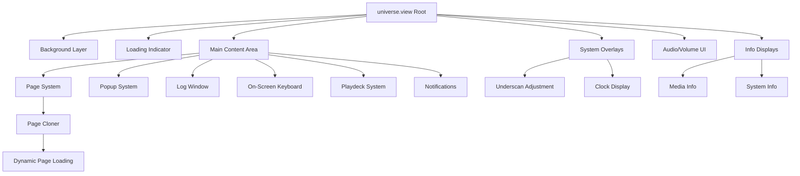
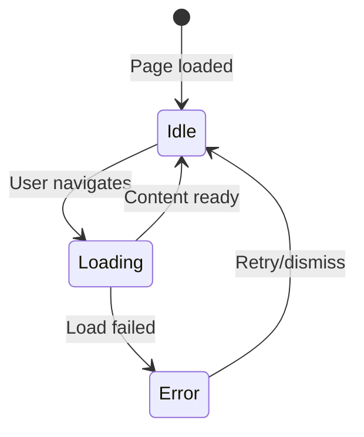

# Skin Architecture and Component System

## Overview

Movian's skin system is built on a sophisticated component architecture that enables complete UI customization through a modular, hierarchical structure. The skin architecture uses `universe.view` as the root entry point, which orchestrates the loading and management of all UI components including pages, popups, media players, and system overlays.

This document provides a comprehensive guide to understanding and working with Movian's skin architecture, component loading system, and the relationships between different UI elements.

## Root Entry Point: universe.view

### Purpose and Responsibility

The `universe.view` file serves as the **root container** and **orchestration layer** for the entire skin system. It is responsible for:

- **Global UI State Management**: Defining and managing UI-wide variables and settings
- **Component Lifecycle**: Loading and unloading UI components based on application state
- **System Integration**: Connecting to core Movian systems (navigation, audio, media, notifications)
- **Event Handling**: Managing global event handlers and user interactions
- **Layout Structure**: Establishing the fundamental z-order and spatial organization

**Source Reference**: `movian/glwskins/flat/universe.view`

### Architectural Structure



### Root Container Structure

The root container uses a `container_z` widget to establish z-order layering:

```view
widget(container_z, {
  // Layer 1: Background (lowest z-order)
  widget(loader, { source: "background.view"; });
  
  // Layer 2: Loading indicator
  widget(loader, {
    hidden: iir($nav.currentpage.model.loading, 8) < 0.001;
    zoffset: -999;
    alpha: iir($nav.currentpage.model.loading, 8);
    source: selectedElement(vectorize($core.glw.views.standard.loading))
      ?? "loading.view";
  });
  
  // Layer 3: Main content area (pages, popups, etc.)
  widget(underscan, {
    widget(container_z, {
      // Main UI components...
    });
  });
  
  // Layer 4+: System overlays (audio, info displays, clock)
  // ...
});
```

**Key Architectural Patterns**:

1. **Z-Order Layering**: Components are stacked using `container_z` with explicit `zoffset` values
2. **Underscan Management**: Critical UI elements wrapped in `underscan` widgets for TV safety
3. **Conditional Visibility**: Components shown/hidden based on state variables
4. **Smooth Transitions**: `iir()` function used for smooth alpha and state transitions

## Component Loading System

### Loading Mechanisms

Movian provides three primary mechanisms for loading UI components:

#### 1. Static Loading

**Purpose**: Load components that are always present

**Pattern**:
```view
widget(loader, {
  source: "background.view";
});
```

**Characteristics**:
- Component loaded immediately when parent is created
- No conditional logic
- Used for essential, always-visible components
- Examples: background, theme definitions

**Use Cases**:
- Background layers
- Global theme imports
- Essential UI scaffolding

#### 2. Conditional Loading

**Purpose**: Load components based on runtime conditions

**Pattern**:
```view
widget(loader, {
  autohide: true;
  source: select($ui.logwindow, "log.view", "");
});
```

**Characteristics**:
- `autohide: true` enables automatic show/hide based on source
- `select()` function provides ternary conditional logic
- Empty string `""` means "load nothing"
- Component lifecycle managed automatically

**Use Cases**:
- Optional UI elements (log window, on-screen keyboard)
- State-dependent displays
- User preference-based components

**Advanced Conditional Pattern**:
```view
widget(loader, {
  autohide: true;
  source: translate($core.media.current.type, "",
    "tracks", "playdecks/" + $ui.orientation + "/tracks.view",
    "radio",  "playdecks/" + $ui.orientation + "/radio.view"
  );
});
```

The `translate()` function provides multi-way conditional loading:
- First parameter: value to match
- Second parameter: default value if no match
- Remaining parameters: pairs of (match_value, result_value)

#### 3. Animated Loading

**Purpose**: Load components with visual transitions

**Pattern**:
```view
widget(loader, {
  time: 0.1;
  effect: blend;
  autohide: true;
  source: select($ui.sysinfo, "sysinfo.view", "");
});
```

**Characteristics**:
- `time`: Transition duration in seconds
- `effect`: Transition type (`blend`, `slide`, etc.)
- Smooth appearance/disappearance
- Combines with conditional loading

**Use Cases**:
- Overlay panels
- Information displays
- Modal dialogs
- Smooth UI state changes

### Dynamic Component Loading with Cloner

The `cloner` widget enables **data-driven component replication**:

```view
cloner($nav.pages, container_z, {
  widget(loader, {
    noInitialTransform: true;
    source: "skin://pages/" + $self.model.type + ".view";
  });
});
```

**How Cloner Works**:

1. **Data Source**: `$nav.pages` - array of page objects
2. **Container Type**: `container_z` - how cloned items are arranged
3. **Template**: Widget structure to replicate for each item
4. **Context**: Each clone has access to `$self` (current item) and `$parent` (container)

**Dynamic Path Construction**:
```view
source: "skin://pages/" + $self.model.type + ".view";
```

This pattern enables:
- Runtime determination of which view file to load
- Type-based component selection
- Flexible, extensible page system

**Common Cloner Patterns**:

```view
// Popup system
cloner($core.popups, loader, {
  source: "popups/" + $self.type + ".view";
});

// Notification system
cloner($core.notifications.nodes, container_z, {
  widget(quad, { color: 0; alpha: 0.6; });
  widget(label, {
    padding: [2em, 0.5em];
    caption: $self.text;
  });
});

// Progress indicators
cloner($core.clipboard.copyprogress, container_z, {
  // Progress bar UI...
});
```

## Page Management System

### Overview

The page management system is the core of Movian's navigation and content display architecture. It manages a stack of pages, handles navigation transitions, provides visual feedback during loading, and ensures smooth user experience through sophisticated layering and animation techniques.

**Source Reference**: `movian/glwskins/flat/universe.view` (lines 68-82)

### Complete Page System Architecture

The page system consists of three primary components working together:

```view
widget(layer, {
  filterConstraintY: true;
  alpha: iir(1 - $ui.screensaverActive, 8);
  
  widget(playfield, {
    effect: blend;
    noInitialTransform: true;
    alpha: 1 - iir(clamp(getLayer(), 0, 1), 7) * 0.66;
    
    cloner($nav.pages, container_z, {
      widget(loader, {
        noInitialTransform: true;
        source: "skin://pages/" + $self.model.type + ".view";
      });
    });
  });
});
```

### Navigation Pages: `cloner($nav.pages, container_z, { ... })`

#### Purpose and Functionality

The `cloner($nav.pages, container_z, { ... })` pattern is the heart of Movian's page system. It creates a **data-driven navigation stack** where each page in the navigation history is represented as a widget in a z-ordered container.

#### How It Works

**Data Source**: `$nav.pages`
- **Type**: Array of page objects maintained by Movian's core navigation system
- **Content**: Each element represents a page in the navigation stack
- **Order**: Index 0 is the oldest page (bottom of stack), last index is current page (top of stack)
- **Dynamic**: Automatically updated when user navigates forward or backward

**Container Type**: `container_z`
- **Purpose**: Stacks pages in z-order (depth)
- **Behavior**: Children are layered on top of each other
- **Visibility**: All pages remain in memory and rendered (with varying alpha)
- **Performance**: Enables instant back navigation without reloading

**Template Structure**:
```view
cloner($nav.pages, container_z, {
  widget(loader, {
    noInitialTransform: true;
    source: "skin://pages/" + $self.model.type + ".view";
  });
});
```

#### Context Variables in Cloner

Within the cloner template, special variables provide access to page data:

**`$self` - Current Page Object**:
```view
$self.model.type          // Page type: "directory", "video", "settings", etc.
$self.model.metadata      // Page metadata (background, custom view)
$self.model.contents      // Content type: "tracks", "album", "images"
$self.model.loading       // Loading state (boolean)
$self.url                 // Page URL
```

**`$parent` - Container Reference**:
```view
$parent.model             // Parent container model
$parent.url               // Parent URL
```

**`$clone` - Clone-Specific State**:
```view
$clone.index              // Index in the cloner array
$clone.total              // Total number of clones
```

#### Dynamic Page Loading

The page loader uses **runtime path construction** to load the appropriate view file:

```view
source: "skin://pages/" + $self.model.type + ".view";
```

**Example Resolution**:
- User opens a directory → `$self.model.type = "directory"` → loads `"skin://pages/directory.view"`
- User plays video → `$self.model.type = "video"` → loads `"skin://pages/video.view"`
- User opens settings → `$self.model.type = "settings"` → loads `"skin://pages/settings.view"`

**Fallback Mechanism**:
If a specific page type view doesn't exist, Movian may:
1. Use a default/generic page view
2. Display an error page
3. Fall back to a simpler representation

#### Navigation Stack Behavior

**Forward Navigation**:
1. User navigates to new page
2. New page object added to `$nav.pages` array
3. Cloner creates new widget for the page
4. Playfield animates transition (blend effect)
5. Previous page remains in stack (dimmed)

**Backward Navigation**:
1. User presses back button
2. Current page removed from `$nav.pages` array
3. Cloner destroys current page widget
4. Playfield animates to previous page
5. Previous page becomes active (alpha restored)

**Stack Visualization**:
```
$nav.pages = [
  { type: "home", ... },        // Index 0 - Bottom layer (most dimmed)
  { type: "directory", ... },   // Index 1 - Middle layer (dimmed)
  { type: "video", ... }        // Index 2 - Top layer (current, full alpha)
]
```

### Loading States: `$nav.currentpage.model.loading`

#### Purpose

The `$nav.currentpage.model.loading` variable provides **real-time loading state** for the currently active page, enabling visual feedback during content loading operations.

#### Variable Details

**Full Path**: `$nav.currentpage.model.loading`
- **`$nav`**: Global navigation system object
- **`currentpage`**: Reference to the topmost page in `$nav.pages`
- **`model`**: Page's data model
- **`loading`**: Boolean or numeric loading state

**Type**: Boolean (0 or 1) or numeric (0.0 to 1.0)
- `0` or `false` - Page fully loaded
- `1` or `true` - Page currently loading
- May represent loading progress (0.0 to 1.0)

#### Loading Indicator Implementation

The loading indicator in `universe.view` demonstrates sophisticated use of this variable:

```view
widget(loader, {
  hidden: iir($nav.currentpage.model.loading, 8) < 0.001;
  zoffset: -999;
  alpha: iir($nav.currentpage.model.loading, 8);
  source: selectedElement(vectorize($core.glw.views.standard.loading))
    ?? "loading.view";
});
```

**Breakdown**:

1. **Visibility Control**:
   ```view
   hidden: iir($nav.currentpage.model.loading, 8) < 0.001;
   ```
   - `iir(..., 8)` - Smooth interpolation with speed 8
   - `< 0.001` - Hidden when value nearly zero
   - **Effect**: Loading indicator fades out smoothly after loading completes

2. **Z-Order Positioning**:
   ```view
   zoffset: -999;
   ```
   - Places loading indicator behind main content
   - Prevents blocking interaction with loaded content
   - Visible through transparent areas

3. **Opacity Animation**:
   ```view
   alpha: iir($nav.currentpage.model.loading, 8);
   ```
   - Alpha directly tied to loading state
   - Smooth fade in when loading starts
   - Smooth fade out when loading completes
   - Speed 8 provides quick but smooth transition

4. **Custom Loading View**:
   ```view
   source: selectedElement(vectorize($core.glw.views.standard.loading))
     ?? "loading.view";
   ```
   - `$core.glw.views.standard.loading` - System-defined loading view
   - `??` - Null coalescing operator
   - Falls back to `"loading.view"` if no custom view defined
   - Allows plugins to provide custom loading animations

#### Loading State Lifecycle

**State Transitions**:



**Timeline Example**:
```
t=0.0s: User clicks link
        $nav.currentpage.model.loading = 1
        Loading indicator alpha: 0 → 1 (smooth)

t=0.5s: Network request in progress
        $nav.currentpage.model.loading = 1
        Loading indicator visible

t=2.0s: Content received, parsing
        $nav.currentpage.model.loading = 1
        Loading indicator still visible

t=2.5s: Page ready
        $nav.currentpage.model.loading = 0
        Loading indicator alpha: 1 → 0 (smooth)

t=3.0s: Fade complete
        Loading indicator hidden
```

#### Usage Patterns

**In Page Views**:
```view
// Show loading spinner in page
widget(container_z, {
  widget(loader, {
    alpha: $self.model.loading;
    source: "spinner.view";
  });
  
  widget(container_y, {
    alpha: 1 - $self.model.loading;
    // Page content...
  });
});
```

**Conditional Content Display**:
```view
// Hide content while loading
widget(container_y, {
  hidden: $nav.currentpage.model.loading;
  // Content that should only show when loaded
});
```

**Progress Indication**:
```view
// Show progress bar
widget(bar, {
  fill: $nav.currentpage.model.loading;
  color1: $ui.color1;
  color2: $ui.color2;
});
```

### Page Layer Management: `getLayer()`

#### Purpose and Functionality

The `getLayer()` function returns the **depth of the current page** in the navigation stack, enabling visual effects that differentiate between active and background pages.

#### Function Details

**Signature**: `getLayer()`
- **Parameters**: None
- **Returns**: Integer representing page depth
  - `0` - Current/active page (top of stack)
  - `1` - Previous page (one level back)
  - `2` - Two pages back
  - `n` - n pages back in history

**Context**: Must be called within a page widget context (inside cloner template)

#### Layer-Based Alpha Dimming

The primary use of `getLayer()` is to **dim background pages** for visual hierarchy:

```view
widget(playfield, {
  effect: blend;
  noInitialTransform: true;
  alpha: 1 - iir(clamp(getLayer(), 0, 1), 7) * 0.66;
  
  cloner($nav.pages, container_z, {
    // Page widgets...
  });
});
```

**Formula Breakdown**:

```view
alpha: 1 - iir(clamp(getLayer(), 0, 1), 7) * 0.66;
```

1. **`getLayer()`** - Get page depth (0, 1, 2, ...)
2. **`clamp(getLayer(), 0, 1)`** - Limit to range [0, 1]
   - Current page (0) → 0
   - Background pages (1+) → 1
3. **`iir(..., 7)`** - Smooth interpolation with speed 7
   - Prevents abrupt alpha changes
   - Creates smooth fade during navigation
4. **`* 0.66`** - Multiply by 66%
   - Background pages dimmed by 66%
5. **`1 - ...`** - Invert for alpha calculation
   - Current page: `1 - 0 = 1.0` (fully opaque)
   - Background pages: `1 - 0.66 = 0.34` (34% opacity)

**Visual Effect**:
- **Current page**: 100% opacity (fully visible)
- **Background pages**: 34% opacity (dimmed)
- **Transition**: Smooth fade when navigating

#### Global Style Application

The `getLayer()` function is also used in **global style definitions**:

```view
style(PageContainer, {
  alpha: 1 - iir(clamp(getLayer(), 0, 1), 4) * 0.9;
});
```

**Purpose**:
- Applies to all widgets with `PageContainer` style
- Provides consistent dimming across all page types
- Speed 4 (faster than playfield) for responsive feel
- 90% dimming (more aggressive than playfield)

**Usage in Pages**:
```view
// In any page view file
widget(container_y, {
  style: "PageContainer";
  // This container will automatically dim when page is in background
});
```

#### Advanced Layer-Based Effects

**Blur Background Pages**:
```view
widget(backdrop, {
  blur: getLayer() > 0 ? 5 : 0;
  source: $self.model.metadata.background;
});
```

**Scale Background Pages**:
```view
widget(container_z, {
  scale: 1 - getLayer() * 0.1;  // Shrink background pages by 10%
});
```

**Disable Interaction on Background Pages**:
```view
widget(container_y, {
  focusable: getLayer() == 0;  // Only current page is focusable
  clickable: getLayer() == 0;
});
```

**Conditional Rendering**:
```view
widget(loader, {
  // Only load expensive components for current page
  source: getLayer() == 0 ? "detailed-view.view" : "simple-view.view";
});
```

### Key Components

#### Layer Widget

**Purpose**: Manages z-order and page stacking at the container level

**Attributes**:
- `filterConstraintY: true` - Constrains layout calculations for performance
  - Prevents layout recalculation propagation
  - Improves rendering performance for page stack
- `alpha: iir(1 - $ui.screensaverActive, 8)` - Fades out during screensaver
  - Smooth transition when screensaver activates
  - Speed 8 for quick but smooth fade

**Responsibilities**:
- Contains the entire page system
- Manages screensaver integration
- Provides performance optimization boundary

#### Playfield Widget

**Purpose**: Provides smooth page transitions and navigation effects

**Attributes**:
- `effect: blend` - Smooth blending between pages
  - Cross-fade animation during navigation
  - Hardware-accelerated transitions
- `noInitialTransform: true` - Prevents initial animation
  - Pages appear instantly on first load
  - Improves perceived performance
- `alpha: 1 - iir(clamp(getLayer(), 0, 1), 7) * 0.66` - Dims background pages
  - Creates visual hierarchy
  - Focuses attention on current page

**Responsibilities**:
- Manages page transition animations
- Applies visual effects to page stack
- Handles navigation gestures (swipe, etc.)

### Page Types and Organization

Pages are organized in the `pages/` directory, with each page type having its own view file:

**Content Pages**:
- `directory.view` - Generic directory/list browsing
- `list.view` - List-based content display
- `grid.view` - Grid-based content display
- `home.view` - Home screen/dashboard

**Media Pages**:
- `video.view` - Video playback page
- `album.view` - Music album display
- `image.view` - Image viewer
- `slideshow.view` - Image slideshow mode

**Specialized Pages**:
- `settings.view` - Settings and configuration
- `searchresults.view` - Search results display
- `playqueue.view` - Media playback queue
- `openerror.view` - Error display page

**System Pages**:
- `about.view` - About/info page
- `upgrade.view` - Software update page
- `stpp.view` - STPP (Showtime Protocol) pages

### Page Loading Mechanism

**Dynamic Type Resolution**:

```view
source: "skin://pages/" + $self.model.type + ".view";
```

When a page is opened:
1. Movian core creates a page model with a `type` property
2. The cloner template constructs the path: `"skin://pages/" + type + ".view"`
3. The loader widget loads the corresponding view file
4. If file doesn't exist, fallback mechanisms may apply

**Example Flow**:
- User navigates to a directory
- Core creates page model with `type = "directory"`
- Path becomes `"skin://pages/directory.view"`
- `directory.view` is loaded and rendered

### Page State Management

Pages have access to navigation state through `$nav` and `$self`:

```view
// Current page loading state
$nav.currentpage.model.loading

// Page metadata
$self.model.metadata.background
$self.model.metadata.glwview

// Page content type
$self.model.contents  // "tracks", "album", "images", etc.

// Page type
$self.model.type  // "directory", "video", "settings", etc.
```

## Popup and Overlay System

### Popup Architecture

Popups provide modal dialogs and overlays for user interaction:

```view
cloner($core.popups, loader, {
  source: "popups/" + $self.type + ".view";
});
```

### Popup Types

**Message Dialogs** (`message.view`):
- Simple message display
- OK/Cancel buttons
- Custom button arrays
- Event-driven responses

**Authentication** (`auth.view`):
- Username/password input
- Login dialogs
- Credential management

**File Picker** (`filepicker.view`):
- File/directory selection
- Browse filesystem
- Path selection

**Text Input** (`textDialog.view`):
- Text entry dialogs
- Search input
- Configuration input

**Resume Dialog** (`resume.view`):
- Media playback resume
- Position selection
- Continue/restart options

### Popup Component Pattern

Popups follow a consistent structure defined in `popups/common.view`:

```view
#define PopupBackdrop() {
  widget(container_x, {
    filterConstraintX: true;
    filterConstraintY: true;
    
    widget(quad, { width: 0.2em; color: 0; });
    
    widget(container_y, {
      widget(quad, { height: 0.2em; color: 0; });
      widget(backdrop, {
        source: "pixmap:gradient:40,40,40:60,60,60";
        alpha: 0.5;
      });
      widget(quad, { height: 0.2em; color: 0; });
    });
    
    widget(quad, { width: 0.2em; color: 0; });
  });
}
```

**Popup Button Macro**:
```view
#define popupButton(EVENT, ENABLED, HIDDEN, CAPTION) {
  widget(container_z, {
    height: 2em;
    GridItemBevel();
    GridItemHighlight();
    
    hidden: HIDDEN;
    focusable: ENABLED;
    onEvent(activate, EVENT);
    
    widget(label, {
      padding: [0.5em, 0];
      align: center;
      caption: CAPTION;
      color: !isNavFocused();
    });
  });
}
```

### Popup Event Handling

Popups use event sinks for communication:

```view
onEvent(cancel, deliverEvent($self.eventSink));
onEvent(back,   deliverEvent($self.eventSink, "cancel"));

// Button click
popupButtonOK(deliverEvent($self.eventSink, "OK"), 0.5, !$self.ok);
popupButtonCancel(deliverEvent($self.eventSink, "Cancel"), 1.0, !$self.cancel);
```

**Event Flow**:
1. User interacts with popup (button click, back button)
2. Event handler calls `deliverEvent($self.eventSink, "action")`
3. Event delivered to popup creator
4. Popup automatically closes
5. Creator handles response

## Log Window and On-Screen Keyboard

### Log Window System

**Purpose**: Display system logs and debug information

```view
widget(loader, {
  autohide: true;
  source: select($ui.logwindow, "log.view", "");
});
```

**Activation**:
```view
onEvent(logwindow, {
  toggle($ui.logwindow);
});

onEvent(back, {
  $ui.logwindow = false;
}, $ui.logwindow);
```

**Characteristics**:
- Toggle on/off with `logwindow` event
- Back button closes when open
- Conditional loading based on `$ui.logwindow` state
- Autohide when state is false

### On-Screen Keyboard (OSK)

**Purpose**: Text input for devices without physical keyboards

```view
widget(loader, {
  autohide: true;
  source: select($ui.osk.show, "osk.view", "");
});
```

**System Integration**:
- Automatically shown when text input is focused
- `$ui.osk.show` managed by core system
- Adapts to screen orientation
- Touch and remote control support

## Playdeck System

### Media Player UI Architecture

The playdeck system provides media player controls and information display:

```view
widget(loader, {
  autohide: true;
  source: translate($core.media.current.type, "",
    "tracks", "playdecks/" + $ui.orientation + "/tracks.view",
    "radio",  "playdecks/" + $ui.orientation + "/radio.view"
  );
});
```

### Adaptive Layout System

**Orientation-Based Loading**:

```
playdecks/
├── landscape/
│   ├── tracks.view
│   └── radio.view
└── portrait/
    ├── tracks.view
    └── radio.view
```

**Orientation Detection**:
```view
$ui.orientation = select($ui.aspect > 1, "landscape", "portrait");
```

- `$ui.aspect` - Screen aspect ratio (width/height)
- `> 1` - Landscape (wider than tall)
- `≤ 1` - Portrait (taller than wide)

### Media Type Detection

The playdeck system adapts to media type:

```view
translate($core.media.current.type, "",
  "tracks", "playdecks/" + $ui.orientation + "/tracks.view",
  "radio",  "playdecks/" + $ui.orientation + "/radio.view"
);
```

**Media Types**:
- `"tracks"` - Audio tracks with full controls
- `"radio"` - Radio streams with simplified controls
- `""` (empty) - No media playing, no playdeck

### Playdeck Components

Playdecks typically include:

**Control Elements**:
- Play/pause button
- Previous/next track
- Seek bar
- Volume control
- Shuffle/repeat toggles

**Information Display**:
- Track title and artist
- Album artwork
- Duration and position
- Metadata (bitrate, format)

**Shared Components** (`playdeck_include.view`):
- Common UI elements
- Shared macros
- Consistent styling

## Notification System

### Notification Architecture

Notifications provide non-intrusive user feedback:

```view
cloner($core.notifications.nodes, container_z, {
  widget(quad, {
    color: 0;
    alpha: 0.6;
  });
  
  widget(label, {
    padding: [2em, 0.5em];
    caption: $self.text;
  });
});
```

### Notification Characteristics

**Visual Design**:
- Semi-transparent black background (`alpha: 0.6`)
- White text with padding
- Bottom of screen placement
- Auto-dismiss after timeout

**Data-Driven**:
- `$core.notifications.nodes` - Array of active notifications
- Each notification has `$self.text` property
- Automatically added/removed by core system

**Use Cases**:
- Status messages ("Saved successfully")
- Error notifications
- System alerts
- Progress updates

## Progress Indicator System

### Clipboard Progress

Example of specialized progress indicators:

```view
cloner($core.clipboard.copyprogress, container_z, {
  quad({
    color: 0;
    alpha: 0.6;
  });
  
  hbox({
    margin: [2em, 0.5em];
    spacing: 2em;
    
    label({
      caption: fmt(_("Copying %d files"), $self.files);
    });
    
    vbox({
      space(1);
      zbox({
        quad({ color: 0; });
        bar({
          fill: $self.completed / $self.total;
          color1: 1;
          color2: 1;
        });
      });
      space(1);
    });
  });
});
```

### Progress Bar Pattern

**Components**:
1. **Background Container**: Semi-transparent backdrop
2. **Label**: Descriptive text with dynamic values
3. **Progress Bar**: Visual fill indicator
4. **Data Binding**: `$self.completed / $self.total`

**Calculation**:
```view
fill: $self.completed / $self.total;
```

- `fill` - Bar fill percentage (0.0 to 1.0)
- `$self.completed` - Items completed
- `$self.total` - Total items

## System Overlays

### Audio Volume Display

**Purpose**: Visual feedback for volume changes

```view
widget(container_x, {
  alpha: iir(changed($core.audio.mastervolume, 2, true), 7);
  align: center;
  
  widget(container_z, {
    width: $ui.width / 2;
    
    widget(quad, { color: 0; alpha: 0.8; });
    
    widget(border, {
      color: $ui.color3;
      border: 1;
      margin: -1;
    });
    
    widget(container_x, {
      padding: 1;
      widget(bar, {
        color1: $ui.color1;
        color2: $ui.color2;
        fill: ($core.audio.mastervolume + 75) / 87;
      });
    });
    
    widget(label, {
      caption: fmt(_("Master volume: %d dB"), $core.audio.mastervolume);
      align: center;
    });
  });
});
```

**Auto-Hide Mechanism**:
```view
alpha: iir(changed($core.audio.mastervolume, 2, true), 7);
```

- `changed(variable, timeout, initial)` - Detects changes
- Returns 1.0 when changed, fades to 0.0 after timeout
- `timeout: 2` - 2 seconds before fade
- `iir(..., 7)` - Smooth fade with speed 7

### Mute Indicator

```view
widget(container_x, {
  alpha: iir($core.audio.mastermute, 7);
  padding: [2em, 0];
  
  widget(container_z, {
    widget(quad, { color: 0; alpha: 0.8; });
    widget(label, {
      padding: [1em, 0];
      caption: _("Audio muted");
      align: center;
    });
  });
});
```

**State-Based Visibility**:
- `$core.audio.mastermute` - Boolean mute state
- `iir()` - Smooth fade in/out
- Shown when muted, hidden when unmuted

### Clock Display

```view
widget(underscan, {
  widget(container_y, {
    widget(label, {
      alpha: iir(!$ui.showTopIcons && !$ui.hideClock, 4);
      padding: [1em, 0];
      height: 3em;
      align: right;
      caption: $core.clock.localtimeofday;
      shadow: true;
    });
  });
});
```

**Conditional Display**:
```view
alpha: iir(!$ui.showTopIcons && !$ui.hideClock, 4);
```

- Hidden when top icons are shown
- Hidden if user preference `$ui.hideClock` is true
- Smooth fade with `iir()`

## Information Displays

### Media Info Overlay

```view
widget(loader, {
  time: 0.1;
  effect: blend;
  autohide: true;
  source: select($ui.mediainfo, "mediainfo.view", "");
});
```

**Activation**:
```view
onEvent(mediastats, {
  toggle($ui.mediainfo);
});
```

**Purpose**:
- Display detailed media information
- Codec details
- Bitrate and format
- Stream information

### System Info Overlay

```view
widget(loader, {
  time: 0.1;
  effect: blend;
  autohide: true;
  source: select($ui.sysinfo, "sysinfo.view", "");
});
```

**Activation**:
```view
onEvent(sysinfo, {
  toggle($ui.sysinfo);
});
```

**Purpose**:
- System statistics
- Performance metrics
- Debug information
- Version details

## Underscan and Screen Safety

### Underscan System

**Purpose**: Ensure UI elements are visible on all displays, especially TVs

```view
widget(underscan, {
  widget(container_z, {
    // Main UI content...
  });
});
```

**Underscan Adjustment UI**:

```view
widget(container_z, {
  hidden: !changed($ui.underscan_changes, 5, true);
  
  widget(linebox, {});
  
  widget(container_z, {
    // Directional arrows showing screen edges
    widget(container_x, {
      widget(icon, {
        source: "skin://icons/ic_chevron_left_48px.svg";
        size: 5em;
        align: left;
      });
      space(1);
      widget(icon, {
        source: "skin://icons/ic_chevron_right_48px.svg";
        size: 5em;
        align: right;
      });
    });
    
    // Vertical arrows...
    
    widget(container_y, {
      space(4);
      widget(container_x, {
        space(0.3);
        widget(container_z, {
          widget(quad, { color: 0; alpha: 0.8; });
          widget(label, {
            padding: 0.5em;
            align: center;
            maxlines: 2;
            caption: _("Overscan adjustment\nPosition border at screen edges");
          });
        });
        space(0.3);
      });
      space(1);
    });
  });
});
```

**Auto-Hide**:
```view
hidden: !changed($ui.underscan_changes, 5, true);
```

- Shows for 5 seconds when underscan is adjusted
- Provides visual feedback for adjustment
- Automatically hides after timeout

## Component Communication Patterns

### Event-Based Communication

**Global Events**:
```view
onEvent(sysinfo, { toggle($ui.sysinfo); });
onEvent(mediastats, { toggle($ui.mediainfo); });
onEvent(logwindow, { toggle($ui.logwindow); });
```

**Conditional Event Handlers**:
```view
onEvent(back, {
  $ui.logwindow = false;
}, $ui.logwindow);
```

- Third parameter: condition for handler activation
- Handler only active when condition is true
- Enables context-sensitive event handling

### State Variables

**UI State** (`$ui.*`):
- `$ui.logwindow` - Log window visibility
- `$ui.mediainfo` - Media info overlay state
- `$ui.sysinfo` - System info overlay state
- `$ui.showTopIcons` - Top icon bar visibility
- `$ui.orientation` - Screen orientation

**Core State** (`$core.*`):
- `$core.audio.mastervolume` - System volume
- `$core.audio.mastermute` - Mute state
- `$core.media.current.type` - Current media type
- `$core.popups` - Active popup array
- `$core.notifications.nodes` - Notification array

**Navigation State** (`$nav.*`):
- `$nav.pages` - Page stack
- `$nav.currentpage` - Current page object
- `$nav.canGoBack` - Back navigation availability

### Data Flow Patterns

**Top-Down Data Flow**:
```view
cloner($nav.pages, container_z, {
  // $self refers to current page
  widget(loader, {
    source: "skin://pages/" + $self.model.type + ".view";
  });
});
```

**Bottom-Up Event Flow**:
```view
onEvent(activate, deliverEvent($self.eventSink, "OK"));
```

**Bidirectional Binding**:
```view
bind($view.searchQuery);
```

## Performance Optimization Patterns

### Layout Constraints

```view
widget(layer, {
  filterConstraintX: true;
  filterConstraintY: true;
  // ...
});
```

**Purpose**:
- Limit layout recalculation propagation
- Improve rendering performance
- Reduce unnecessary updates

### Smooth Interpolation

```view
alpha: iir($nav.currentpage.model.loading, 8);
```

**`iir()` Function**:
- Infinite Impulse Response filter
- Smooth value transitions
- Parameters: `iir(target_value, speed, absolute)`
- Higher speed = faster transition

### Conditional Rendering

```view
widget(loader, {
  autohide: true;
  source: select($condition, "component.view", "");
});
```

**Benefits**:
- Components not loaded when hidden
- Memory savings
- Faster rendering
- Automatic lifecycle management

### No Initial Transform

```view
widget(loader, {
  noInitialTransform: true;
  source: "page.view";
});
```

**Purpose**:
- Skip initial animation
- Instant appearance
- Used for page transitions
- Improves perceived performance

## Best Practices

### Component Organization

1. **Separate Concerns**: Keep pages, popups, and overlays in separate directories
2. **Shared Components**: Use `common.view` files for shared UI elements
3. **Macro Libraries**: Define reusable macros in `theme.view`
4. **Consistent Naming**: Use descriptive, consistent file names

### Loading Strategy

1. **Static for Essential**: Use static loading for always-needed components
2. **Conditional for Optional**: Use conditional loading for optional features
3. **Animated for Overlays**: Use animated loading for user-facing transitions
4. **Cloner for Collections**: Use cloner for data-driven UI

### State Management

1. **Centralize State**: Use `$ui.*` for UI state, `$core.*` for system state
2. **Minimize Global State**: Keep state as local as possible
3. **Clear Naming**: Use descriptive variable names
4. **Document State**: Comment state variable purposes

### Performance

1. **Use Constraints**: Apply `filterConstraintX/Y` where appropriate
2. **Smooth Transitions**: Use `iir()` for all animated values
3. **Lazy Loading**: Load components only when needed
4. **Optimize Cloners**: Minimize complexity in cloner templates

### Event Handling

1. **Specific Handlers**: Use conditional event handlers for context
2. **Event Sinks**: Use event sinks for popup communication
3. **Clear Actions**: Make event handler actions obvious
4. **Error Handling**: Handle edge cases in event handlers

## Troubleshooting

### Component Not Loading

**Check**:
1. File path correctness (case-sensitive on some platforms)
2. `skin://` protocol usage
3. Conditional logic in `select()` or `translate()`
4. Console logs for errors

**Debug Pattern**:
```view
widget(label, {
  caption: "Loading: " + $self.model.type;
});
```

### State Not Updating

**Check**:
1. Variable scope (`$ui.*`, `$self.*`, `$clone.*`)
2. Binding vs assignment (`:=` vs `=`)
3. Event handler conditions
4. `iir()` speed (may be too slow)

**Debug Pattern**:
```view
widget(label, {
  caption: fmt("State: %s", $ui.someState);
});
```

### Performance Issues

**Check**:
1. Missing `filterConstraintX/Y`
2. Complex expressions in frequently-updated properties
3. Too many active cloners
4. Large images without size constraints

**Optimization**:
```view
widget(container_y, {
  filterConstraintY: true;  // Add constraints
  expediteSubscriptions: true;  // Optimize bindings
  // ...
});
```

## Summary

Movian's skin architecture provides a powerful, flexible system for complete UI customization:

- **universe.view** serves as the root orchestrator
- **Component loading** supports static, conditional, and animated patterns
- **Page system** enables dynamic, type-based content display
- **Popup system** provides modal dialogs and user interaction
- **Playdeck system** adapts media controls to orientation and media type
- **Notification system** offers non-intrusive user feedback
- **System overlays** provide audio, info, and status displays
- **Performance patterns** ensure smooth, responsive UI

Understanding these architectural patterns enables creation of sophisticated, professional-quality Movian skins that integrate seamlessly with the core system.

## See Also

- [Global Configuration](global-configuration.md) - UI variables and system integration
- [Macro Reference](macro-reference.md) - Reusable UI component macros
- [Skin Structure](skin-structure.md) - Directory organization and file structure
- [Theme Variables](theme-variables.md) - Color and styling system
- [View File Syntax](../view-files/syntax-reference.md) - View file language reference
- [Widget Reference](../widgets/container.md) - Available widget types
