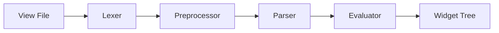

# GLW View File Syntax Reference

**Status**: 🟢 Verified from source code analysis  
**Last Updated**: 2024-11-06  
**Movian Version**: 4.8+

## Overview

This document provides a complete syntax reference for GLW view files. All information is derived from direct source code analysis of the GLW view system, ensuring accuracy and completeness.

## File Structure

### Basic Structure

View files consist of widget definitions, preprocessor directives, and expressions:

```xml
#import "common/macros.view"

widget_type {
  attribute = value;
  attribute = expression;
  
  child_widget {
    ...
  }
}
```

### Processing Pipeline



1. **Lexer**: Converts text to tokens
2. **Preprocessor**: Expands macros, includes files
3. **Parser**: Builds widget hierarchy, converts expressions to RPN
4. **Evaluator**: Executes expressions, creates property bindings
5. **Widget Tree**: Live widget instances

## Lexical Elements

### Comments

**C++ Style**:
```c
// Single line comment
```

**C Style**:
```c
/* Multi-line
   comment */
```

**Note**: Nested block comments are not supported.

### Identifiers

**Rules**:
- Must start with letter or underscore: `[a-zA-Z_]`
- Can contain letters, digits, underscores: `[a-zA-Z0-9_]*`
- Case sensitive

**Examples**:
```
width
myProperty
_private
item2
container_x
```

### Keywords and Constants

**Built-in Constants**:
```c
void    // Represents no value
true    // Boolean true (integer 1)
false   // Boolean false (integer 0)
```

### String Literals

**Double-Quoted Strings** (UTF-8):
```c
"Hello World"
"Path: /home/user"
```

**Single-Quoted Strings** (Rich Text):
```c
'<b>Bold Text</b>'
'<i>Italic</i>'
```

**Escape Sequences**:
- `\"` - Double quote
- `\'` - Single quote
- `\\` - Backslash
- `\n` - Newline
- `\t` - Tab
- Standard C-style escaping

### Numeric Literals

**Integers**:
```c
0
123
-456
```

**Floats**:
```c
3.14
-2.5
0.5
3.14f  // Optional 'f' suffix
```

**EM Units**:
```c
2 em      // 2 times current font size
1.5 em    // 1.5 times current font size
```

**Note**: EM units require dynamic evaluation and are converted to pixels based on current font size.

## Operators

### Assignment Operators

| Operator | Token | Description | Example |
|----------|-------|-------------|---------|
| `=` | `TOKEN_ASSIGNMENT` | Standard assignment | `width = 100;` |
| `?=` | `TOKEN_COND_ASSIGNMENT` | Conditional assignment (only if void) | `width ?= 100;` |
| `<-` | `TOKEN_LINK_ASSIGNMENT` | Property linking | `width <- $model.width;` |
| `:=` | `TOKEN_REF_ASSIGNMENT` | Reference assignment | `prop := $model.data;` |
| `_=_` | `TOKEN_DEBUG_ASSIGNMENT` | Debug assignment (logs changes) | `width _=_ 100;` |

**Assignment Behavior**:
- Standard `=`: Always assigns value
- Conditional `?=`: Only assigns if current value is `void`
- Link `<-`: Creates bidirectional property link
- Reference `:=`: Creates reference to property
- Debug `_=_`: Logs value changes for debugging

### Arithmetic Operators

| Operator | Token | Precedence | Description |
|----------|-------|------------|-------------|
| `+` | `TOKEN_ADD` | 9 | Addition / String concatenation |
| `-` | `TOKEN_SUB` | 9 | Subtraction |
| `*` | `TOKEN_MULTIPLY` | 10 | Multiplication |
| `/` | `TOKEN_DIVIDE` | 10 | Division |
| `%` | `TOKEN_MODULO` | 11 | Modulo |

**Type Behavior**:
- Numeric + Numeric = Numeric result
- String + String = Concatenated string
- String + Numeric = Concatenated string (numeric converted)

### Comparison Operators

| Operator | Token | Precedence | Description |
|----------|-------|------------|-------------|
| `==` | `TOKEN_EQ` | 8 | Equality |
| `!=` | `TOKEN_NEQ` | 8 | Inequality |
| `<` | `TOKEN_LT` | 8 | Less than |
| `>` | `TOKEN_GT` | 8 | Greater than |

**Comparison Rules**:
- Type coercion: `int` ↔ `float` automatic
- String comparison: Lexicographic
- Different types: Generally false (except int/float)

### Logical Operators

| Operator | Token | Precedence | Description |
|----------|-------|------------|-------------|
| `&&` | `TOKEN_BOOLEAN_AND` | 6 | Logical AND |
| `\|\|` | `TOKEN_BOOLEAN_OR` | 5 | Logical OR |
| `^^` | `TOKEN_BOOLEAN_XOR` | 7 | Logical XOR |
| `!` | `TOKEN_BOOLEAN_NOT` | 13 | Logical NOT |

**Boolean Conversion**:
- `void` → `false`
- Empty string → `false`
- `0` (int/float) → `false`
- Non-empty string → `true`
- Non-zero number → `true`
- `"true"` identifier → `true`
- `"false"` identifier → `false`

### Ternary Operator

**Syntax**:
```c
condition ? value_if_true : value_if_false
```

**Precedence**: 3

**Example**:
```c
alpha = $enabled ? 1.0 : 0.3;
color = $selected ? [1, 0, 0] : [0.5, 0.5, 0.5];
```

### Null Coalescing Operator

**Syntax**:
```c
value1 ?? value2
```

**Precedence**: 4

**Behavior**: Returns `value1` if not `void`, otherwise returns `value2`

**Example**:
```c
caption = $item.title ?? "Untitled";
width = $custom.width ?? 100;
```

### Operator Precedence Table

| Precedence | Operators | Associativity |
|------------|-----------|---------------|
| 13 | `!` | Right |
| 12 | Block `{}` | N/A |
| 11 | `%` | Left |
| 10 | `*` `/` | Left |
| 9 | `+` `-` | Left |
| 8 | `==` `!=` `<` `>` | Left |
| 7 | `^^` | Left |
| 6 | `&&` | Left |
| 5 | `\|\|` | Left |
| 4 | `??` | Left |
| 3 | `?` `:` | Right |
| 2 | `:` (attribute) | N/A |
| 1 | `=` `?=` `<-` `:=` `_=_` | Right |

**Higher precedence = evaluated first**

## Property References

### Property Syntax

**Basic Reference**:
```c
$propertyName
```

**Property Chain**:
```c
$page.model.title
$item.metadata.description
$global.settings.theme
```

**Canonical Reference** (deprecated):
```c
&propertyName
```

### Property Roots

View files have access to several property root contexts:

| Root | Description | Example |
|------|-------------|---------|
| `$self` | Current item in cloner | `$self.title` |
| `$parent` | Parent scope | `$parent.value` |
| `$args` | Arguments passed to view | `$args.data` |
| `$clone` | Cloner context | `$clone.index` |
| `$view` | View context | `$view.width` |
| `$page` | Page properties | `$page.model.items` |
| `$global` | Global properties | `$global.settings` |
| `$ui` | UI theme properties | `$ui.color.text` |
| `$nav` | Navigation properties | `$nav.currentPage` |

### Property Resolution

**Resolution Order**:
1. Check scope roots (`$self`, `$parent`, `$args`, etc.)
2. Check UI properties (`$ui`)
3. Check navigation properties (`$nav`)
4. Return `void` if not found

**Example**:
```c
// In a cloner context
<cloner source="$items">
  <label caption="$self.title"/>  // $self refers to current item
</cloner>
```

## Expressions

### Expression Types

**Static Expressions** (`TOKEN_PURE_RPN`):
- No property references
- Evaluated once at parse time
- Cached result

```c
width = 100 + 50;  // Evaluated to 150 at parse time
```

**Dynamic Expressions** (`TOKEN_RPN`):
- Contains property references or dynamic values
- Re-evaluated when dependencies change
- Subscription-based updates

```c
width = $model.width * 2;  // Re-evaluated when $model.width changes
```

### Expression Evaluation

**RPN (Reverse Polish Notation)**:

Expressions are converted to RPN for efficient stack-based evaluation:

**Infix**: `a + b * c`  
**RPN**: `a b c * +`

**Evaluation**:
1. Push operands onto stack
2. Pop operands for operators
3. Push result back onto stack
4. Final stack value is result

### Type Coercion

**Automatic Conversions**:

```c
// Integer to Float
int_value + float_value  // int promoted to float

// Number to String
"Value: " + 123  // 123 converted to "123"

// EM to Pixels
2 em + 10  // EM converted to pixels based on font size
```

**Vector Operations**:

```c
// Scalar to Vector (broadcast)
color = 0.5;  // Becomes [0.5, 0.5, 0.5]

// Vector arithmetic
color1 + color2  // Component-wise addition
```

### Color Expressions

**Hex Colors**:
```c
color = "#FF0000";      // Red
color = "#00FF00";      // Green
color = "#0000FF";      // Blue
color = "#F00";         // Short form (RGB)
```

**RGB Vectors**:
```c
color = [1.0, 0.0, 0.0];     // Red (float components)
color = [0.5, 0.5, 0.5];     // Gray
```

**Color Arithmetic**:
```c
color = $baseColor * 0.5;           // Darken
color = $color1 + $color2;          // Add colors
color = $selected ? [1,0,0] : [0.5,0.5,0.5];  // Conditional
```

## Widget Definitions

### Basic Widget Syntax

```xml
widget_type {
  attribute = value;
  attribute = expression;
  
  child_widget {
    ...
  }
}
```

### Widget Hierarchy

**Parent-Child Relationship**:
```xml
container_y {
  label { caption = "Title"; }
  label { caption = "Subtitle"; }
  image { source = "icon.png"; }
}
```

**Nesting Rules**:
- Widgets can be nested arbitrarily deep
- Parent widgets control layout of children
- Children inherit scope from parent

### Attribute Assignment

**Simple Assignment**:
```c
width = 100;
alpha = 0.5;
caption = "Hello";
```

**Expression Assignment**:
```c
width = $model.width * 2;
alpha = $enabled ? 1.0 : 0.3;
caption = $item.title ?? "Untitled";
```

**Property Binding**:
```c
caption = $page.model.title;  // Updates when property changes
```

## Preprocessor Directives

### #include Directive

**Syntax**:
```c
#include "filename.view"
```

**Behavior**:
- Loads and inserts file content at current position
- File is preprocessed recursively
- Can be used multiple times (file loaded each time)

**Example**:
```c
#include "common/header.view"
#include "common/footer.view"
```

### #import Directive

**Syntax**:
```c
#import "filename.view"
```

**Behavior**:
- Loads and inserts file content at current position
- File is preprocessed recursively
- File is loaded only once per preprocessing session
- Subsequent imports of same file are ignored

**Example**:
```c
#import "macros/ui-components.view"
#import "macros/ui-components.view"  <!-- Ignored -->
```

**Use Case**: Import macro definitions once

### #define Directive

**Syntax**:
```c
#define macroname(arg1, arg2, ...) {
  body
}
```

**Components**:
- **Macro Name**: Identifier
- **Arguments**: Comma-separated identifiers (optional)
- **Body**: Token sequence in braces

**Simple Macro**:
```c
#define button(label) {
  container_x {
    label { caption = $label; }
  }
}
```

**Macro with Defaults**:
```c
#define widget(name, width=100, height=50) {
  container_x {
    id = $name;
    width = $width;
    height = $height;
  }
}
```

**Invocation**:

**Positional Arguments**:
```c
button("Click Me")
widget("myWidget", 200, 100)
```

**Named Arguments**:
```c
widget(name="myWidget", height=100)
widget(height=100, name="myWidget", width=200)
```

**Rules**:
- Default arguments must come after non-default arguments
- Cannot mix positional and named arguments in same invocation
- Missing arguments use default values
- Extra arguments cause error

## Blocks and Scope

### Block Syntax

**Block Delimiters**:
```c
{
  // Block content
}
```

**Usage**:
- Widget bodies
- Macro definitions
- Expression grouping

### Scope Propagation

**Scope Hierarchy**:
```
Global Scope
  └─ Page Scope ($page)
      └─ Widget Scope ($self, $parent)
          └─ Cloner Scope ($clone, $self)
              └─ Loaded View Scope ($args)
```

**Scope Access**:
```xml
<loader source="item.view" args="$item">
  <!-- item.view has access to: -->
  <!-- $args (the $item passed in) -->
  <!-- $parent (loader's scope) -->
  <!-- $page (page scope) -->
  <!-- $global (global scope) -->
</loader>
```

## Special Constructs

### Cloner Pattern

**Syntax**:
```xml
<cloner source="$items">
  <widget>
    <!-- $self refers to current item -->
    <label caption="$self.title"/>
  </widget>
</cloner>
```

**Behavior**:
- Creates widget instance for each item in source
- `$self` bound to current item
- Dynamic updates when source changes
- Supports pagination

### Event Handlers

**Syntax**:
```c
onEvent(eventType, action)
```

**Example**:
```xml
<container_x focusable="true"
             onEvent(activate, navOpen($self.url))>
  <label caption="$self.title"/>
</container_x>
```

**Common Events**:
- `activate` - User activation (Enter/Click)
- `cancel` - Cancel action (Back/Escape)
- `focus` - Widget gained focus
- `blur` - Widget lost focus

### Loader Widget

**Syntax**:
```xml
<loader source="$viewUrl"
        args="$data"
        time="0.3"
        effect="blend"/>
```

**Attributes**:
- `source`: View file URL to load
- `alt`: Alternative/fallback URL
- `args`: Data passed as `$args` to loaded view
- `time`: Transition duration in seconds
- `effect`: Transition effect type

**Dynamic Loading**:
```xml
<loader source="$page.model.contentView"
        args="$page.model.contentData"/>
```

## Path Resolution

### Resource Paths

**Skin-Relative**:
```c
source = "skin://images/icon.png";
```

**Data Root**:
```c
source = "dataroot://resources/image.png";
```

**Relative Paths**:
```c
source = "../images/icon.png";  // Relative to current file
```

**Absolute Paths**:
```c
source = "/full/path/to/file.png";
```

## Dynamic Evaluation

### Evaluation Triggers

Expressions are re-evaluated when:

| Trigger | Flag | Description |
|---------|------|-------------|
| Property Change | `GLW_VIEW_EVAL_PROP` | Subscribed property changed |
| Font Size Change | `GLW_VIEW_EVAL_EM` | EM unit recalculation needed |
| Widget Activity | `GLW_VIEW_EVAL_ACTIVE` | Widget became active/inactive |
| Focus Change | `GLW_VIEW_EVAL_FHP_CHANGE` | Focus path changed |
| Other Signals | `GLW_VIEW_EVAL_OTHER` | Various widget signals |

### Subscription Management

**Automatic Subscriptions**:
- Created for property references in expressions
- Merged when same property used multiple times
- Suspended when widget inactive
- Released when widget destroyed

**Subscription Lifecycle**:
```
Parse → Create Subscription → Monitor Property → Update Widget → Destroy
```

## Best Practices

### Performance

**Prefer Static Expressions**:
```c
// Good: Static, evaluated once
width = 100 + 50;

// Avoid if possible: Dynamic, evaluated on every property change
width = $constant + 50;  // If $constant never changes
```

**Minimize Property References**:
```c
// Good: Single reference
alpha = $enabled ? 1.0 : 0.3;

// Avoid: Multiple references to same property
alpha = $enabled && $enabled ? 1.0 : 0.3;  // Redundant
```

**Use Conditional Assignment**:
```c
// Good: Only assigns if not already set
width ?= 100;

// Less efficient: Always assigns
width = 100;
```

### Readability

**Use Macros for Reusable Components**:
```c
#define listItem(title, subtitle) {
  container_x {
    label { caption = $title; }
    label { caption = $subtitle; }
  }
}
```

**Organize with Includes**:
```c
#import "macros/components.view"
#include "common/header.view"
#include "pages/content.view"
#include "common/footer.view"
```

**Comment Complex Logic**:
```c
// Calculate dynamic width based on container and padding
width = $parent.width - ($padding * 2);
```

### Maintainability

**Use Named Arguments for Clarity**:
```c
// Good: Clear what each value represents
widget(name="myWidget", width=200, height=100)

// Less clear: Must remember argument order
widget("myWidget", 200, 100)
```

**Provide Sensible Defaults**:
```c
#define button(label, width=100, height=40) {
  // Most buttons use default size
}
```

## Error Handling

### Common Syntax Errors

**Unterminated String**:
```c
caption = "Hello World;  // Error: Missing closing quote
```

**Unbalanced Braces**:
```c
container_x {
  label { caption = "Test"; }
// Error: Missing closing brace
```

**Invalid Operator**:
```c
width = 100 @ 50;  // Error: @ is not a valid operator
```

**Type Mismatch**:
```c
width = "not a number";  // Error: Width expects numeric value
```

### Error Reporting

Errors include:
- **File name**: Source file where error occurred
- **Line number**: Line in source file
- **Error description**: What went wrong
- **Context**: Surrounding code or token information

**Example Error**:
```
Error views/main.view:42: Unexpected token '}' after expression
```

## Accuracy Status

🟢 **Verified**: All syntax rules derived from source code analysis  
**Source Files Analyzed**:
- `glw_view_lexer.c` - Tokenization rules
- `glw_view_parser.c` - Expression parsing and precedence
- `glw_view_preproc.c` - Preprocessor directives
- `glw_view_eval.c` - Expression evaluation
- `glw_view_attrib.c` - Attribute handling

**Version**: Based on Movian source as of 2024-11-06

## See Also

- [Elements Reference](elements-reference.md) - Complete widget catalog
- [Attributes Reference](attributes-reference.md) - All widget attributes
- [Expressions Guide](expressions.md) - Expression system details
- [Source Analysis Summary](../source-analysis/summary.md) - Technical details
